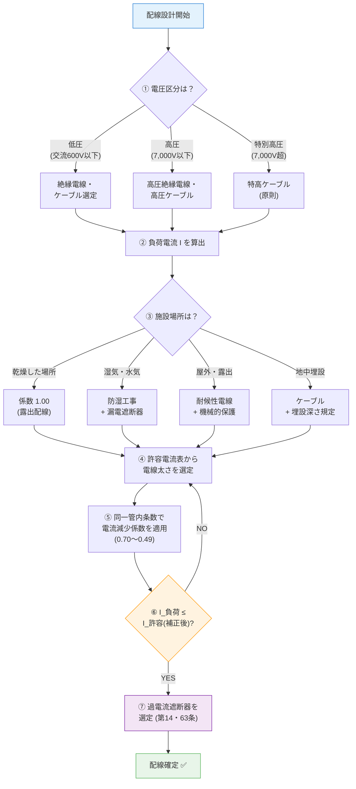

# 電技省令 第56条 — 配線の感電又は火災の防止

!!! note "試験対策メタ"
    - **出題頻度**: ★★☆☆☆（過去14年で 2 回出題）
    - **重要度**: C（基本）
    - **直近出題**: R02 問6・R01 問5

> 配線は、施設場所の状況及び電圧に応じ、**感電又は火災のおそれがないように施設**しなければならない。

| 項目 | 内容 |
|------|------|
| 条文 | 電気設備技術基準 第56条 |
| 規定内容 | 配線の感電・火災防止（施設場所・電圧に応じた施設義務）+ 移動電線の規制（第2項）+ 特別高圧の移動電線禁止（第3項） |
| 性格 | **実装規定（実装型B）**（具体仕様は解釈第146・156条等に委任） |
| 委任先 | 解釈第142条（用語）・第146条(電線種類・許容電流)・第156条(工事方法) |
| 試験重要度 | 穴埋め（**施設場所**・**電圧**・**工事種類**）の組合せ問題 |

---

## 1. 全体像と要点

### ① 全体像 — 第56条の位置づけ（初学者向け：先に森を見る）

<div class="article-overview-cross"><div class="ov-row ov-row-top"><div class="ov-node ov-up"><div class="ov-icon">📜</div><div class="ov-title">省令第5条</div><div class="ov-desc">電路の絶縁原則</div><div class="ov-tag">上位の総則</div></div></div><div class="ov-arrow ov-arrow-down ov-arrow-strong"><span class="ov-arrow-line"></span><span class="ov-arrow-label">上位</span></div><div class="ov-row ov-row-middle"><div class="ov-node ov-left"><div class="ov-icon">⚡</div><div class="ov-title">省令第14条</div><div class="ov-desc">過電流からの保護</div><div class="ov-tag">並立：電流側</div></div><div class="ov-arrow ov-arrow-right"><span class="ov-arrow-label">並立</span><span class="ov-arrow-line"></span></div><div class="ov-node ov-center"><div class="ov-icon">🔌</div><div class="ov-title">第56条</div><div class="ov-desc">配線の感電・火災防止</div></div><div class="ov-arrow ov-arrow-right"><span class="ov-arrow-label">具体化</span><span class="ov-arrow-line"></span></div><div class="ov-node ov-right"><div class="ov-icon">📏</div><div class="ov-title">省令第58条</div><div class="ov-desc">低圧電路の絶縁性能</div><div class="ov-tag">具体化：絶縁要件</div></div></div><div class="ov-arrow ov-arrow-down ov-arrow-strong"><span class="ov-arrow-line"></span><span class="ov-arrow-label">委任</span></div><div class="ov-row ov-row-bottom"><div class="ov-node ov-down"><div class="ov-icon">🔧</div><div class="ov-title">解釈第142条 ／ 第146条 ／ 第156条</div><div class="ov-desc">用語定義 ／ 電線種類・許容電流 ／ 工事方法</div><div class="ov-tag">実装規定：数値・工事種類の具体仕様</div></div></div></div><!-- スタイルは custom.css の Article Overview Cross セクションに統合（2026-05-03） -->

| 条文 | 役割 | 第56条との関係 |
|------|------|---------------|
| 省令第5条 | 電路の絶縁原則 | 第56条の**上位**（絶縁の総則） |
| 省令第14条 | 過電流からの保護 | 第56条と**並立**（電流側の保護） |
| 省令第58条 | 低圧電路の絶縁性能（数値） | 第56条の絶縁要件を**具体化** |
| 解釈第142条 | 用語定義（電線・配線・移動電線等） | 第56条の主語の**定義** |
| 解釈第146条 | 低圧配線の電線種類・許容電流 | 第56条第1項の**実装規定（数値）** |
| 解釈第156条 | 低圧屋内配線の工事方法 | 第56条第1項の**実装規定（工事種類）** |

→ 第56条は「**配線の感電・火災防止**」の総括規定。**思想と判定軸**を示し、具体仕様（数値・工事種類）は解釈第146・156条に委任。

### ② 要点（既習者向け：試験前30秒復習用）

- 配線3要素：**電圧**・**電流容量**・**施設場所**
- 電流容量の決定：ジュール熱 Q = I²Rt で温度上昇制限
- 許容電流は電線太さ・絶縁種・敷設環境で決まる（解釈第146条）
- 施設場所による工事種類の選定：乾燥/湿潤/屋外/埋込 で異なる（解釈第156条）
- 機械的保護：損傷・切断を防止（合成樹脂管・金属管・メタルダクト等）
- 移動電線（第2項）：接続不良→火災リスク→厳格な規定
- **特別高圧の移動電線は原則禁止**（第3項）。ただし人体に危害なく接続必須な機器は例外

??? question "セルフチェック: なぜ電線太さが必要な条件か？"
    電流を流すと、電線の抵抗でジュール熱が発生する。

    **Q = I²Rt → 太さが小さいと、温度が上昇 → 絶縁劣化 → 地絡→火災**

    許容電流値は、絶縁被覆の耐熱温度（通常60〜90℃）を超えないように設定される。

??? question "セルフチェック: 「電圧が高いと電線は細くてよい」は正しいか？"
    **半分正しいが根拠が逆**。電線太さを決めるのは**電流値**であって電圧ではない。同一電力なら高電圧→小電流→細くてOK（P=VI）だが、高電圧でも大電流なら太い電線が必要。条文の「電圧に応じ」は**絶縁耐力**の判断軸であり、太さの判断軸ではない。

---

## 2. 条文原文

**電気技術基準省令 第56条（配線の感電又は火災の防止）**

**第1項（施設の原則）**

> 配線は、施設場所の状況及び電圧に応じ、感電又は火災のおそれがないように
> 施設しなければならない。

**第2項（移動電線と機器接続）**

> 移動電線を電気機械器具と接続する場合は、接続不良による感電又は火災のおそれが
> ないように施設しなければならない。

**第3項（特別高圧の移動電線禁止）**

> 特別高圧の移動電線は、第一項及び前項の規定にかかわらず、施設してはならない。
> ただし、充電部分に人が触れた場合に人体に危害を及ぼすおそれがなく、移動電線と
> 接続することが必要不可欠な電気機械器具に接続するものは、この限りでない。

!!! note "原文確認済"
    第1〜3項とも e-Gov公式（電気設備技術基準省令第56条）から確認済み。条文転記は2026-05-02時点。

---

## 3. 原文解析

### 第1項の分解（施設の原則）

| ブロック | 原文 | 意味 | 試験のポイント |
|---------|------|------|-------------|
| 主語 | 配線は | 固定配線・移動電線を含む充電部の通路全般（解釈第142条参照）| 「電線」「電線路」「電路」との混同に注意 |
| 判定軸1 | 施設場所の状況に応じ | 乾燥/湿潤/屋外/埋込 等の環境分類 | 穴埋め頻出 |
| 判定軸2 | 電圧に応じ | 低圧/高圧/特別高圧 の電路区分（絶縁耐力の判断軸）| 「電圧で太さが決まる」と誤読しやすい |
| 義務 | 感電又は火災のおそれがないように | リスクベースの設計 | 抽象的だが穴埋め選択肢で問われる |
| 結論 | 施設しなければならない | 「設置」ではなく「**施設**」 | 法規動詞 |

### 第2項の分解（移動電線と機器接続）

| ブロック | 原文 | 意味 |
|---------|------|------|
| 対象 | 移動電線を電気機械器具と接続する場合 | コードのプラグ・接続部分 |
| 危険源 | 接続不良による感電又は火災のおそれ | 接触抵抗加熱・絶縁劣化 |
| 義務 | 施設しなければならない | 第1項と同じ義務水準 |

### 第3項の分解（特別高圧の移動電線禁止）

| ブロック | 原文 | 意味 |
|---------|------|------|
| 対象 | 特別高圧の移動電線 | 7,000V超を流す移動電線 |
| 原則 | 施設してはならない | **絶対禁止**（第1項・第2項を超える上書き規定） |
| 例外条件1 | 充電部分に人が触れた場合に人体に危害を及ぼすおそれがなく | 安全構造により感電が起こり得ない |
| 例外条件2 | 移動電線と接続することが必要不可欠な電気機械器具に接続するもの | 固定配線で代替不可な機器に限定 |
| 結論 | この限りでない | 両条件を満たす場合のみ例外 |

---

## 4. 法規特有表現

> 条文を読む前に、日常語と法規表現の対応を頭に入れておく。

!!! note "例文の取り扱い"
    例文列は条文の言い回しに倣った要約。条文原文そのものは section 2 を参照。

| 日常語 | 法規表現 | 試験での意味 | 混同注意 | 例文（条文調） |
|---|---|---|---|---|
| 設備を設ける | 施設する | 法規上の設置動詞 | 「設置する」「取り付ける」では不可 | 配線は…施設しなければならない |
| 環境に合わせる | 施設場所の状況に応じ | 乾燥/湿潤/屋外等の環境区分に応じた設計 | 単なる「場所」ではなく「状況」（湿潤性・通風等を含む） | 施設場所の状況及び電圧に応じ |
| 動かして使うコード | 移動電線 | 機器と電源を着脱可能に接続する電線 | 固定配線とは別物 | 移動電線は…（第2項） |
| 7,000V超の電圧 | 特別高圧 | 移動電線は原則禁止される高電圧帯 | 「高圧」（600〜7,000V）とは別物 | 特別高圧の移動電線は…（第3項） |

### この条文で覚えるべき言い回し

- 「**施設する**」（設備を設けることを表す法規動詞。section 2の主語にもなる）
- 「**施設場所の状況及び電圧に応じ**」（リスクベース設計の典型表現）
- 「**感電又は火災のおそれがないように**」（多くの条文に登場する目的記述）
- 「**移動電線**」（コードの法規表現）
- 「**特別高圧**」（7,000Vを超える電圧。原則として移動電線禁止）
- 「**この限りでない**」（=「無条件に不要」ではなく「条件付き例外」）

### ひっかけ表現

| 誤った理解 | 正しい理解 |
|---|---|
| 電線太さは電圧で決まる | 電流（I²Rt）で決まる |
| 高電圧なら無条件に細くてよい | 高電圧でも大電流なら太い電線が必要 |
| 「許容電流」は流れる電流のこと | **電線側**の許容スペック（電線の容量） |
| 「設置する」と「施設する」を同じに扱う | 法規では「**施設する**」が正式 |
| 「電線」「配線」「電線路」「電路」を全部同じ意味で使う | 別物（電線路=支持物含む / 電路=通電部分 / 配線=施設の総称 / 電線=単体の電線） |
| 第3項の例外＝「充電式工具なら自由に使える」 | 例外は「人体に危害なし**かつ**接続必須」の両条件。具体的機器は限定的 |

### まぎらわしい用語の比較（電線族）

| 用語 | 意味 | 含まれる範囲 | 試験での出方 |
|---|---|---|---|
| 電線 | 単体の電気導体 | 心線+被覆 | 物理的な電線そのもの |
| 配線 | 施設された電線の総称 | 電線+器具+工事方法 | 第56条の主語 |
| 電線路 | 電線+支持物（柱・がいし・電柱等） | 一式の屋外設備 | 第20条の対象 |
| 電路 | 通電している導体の通路全般 | 電源〜負荷の閉回路 | 第5条「電路の絶縁」の主語 |

### 一目でわかる電流系用語

| 比較軸 | 電流 | 許容電流 | 定格電流 |
|---|---|---|---|
| 意味 | 実際に流れる電気の量 | 電線が安全に流せる上限 | 機器・遮断器の動作基準値 |
| 単位 | A（アンペア） | A | A |
| 決定要因 | 負荷・電圧・抵抗 | 電線太さ・絶縁種・敷設環境 | 機器の設計仕様 |
| 試験での出方 | 「20Aの負荷」等 | 「3.5mm²の許容電流は？」 | 「20A配線用遮断器の…」 |
| 第56条との関係 | 設計入力（負荷から計算） | 太さ選定の判定基準（解釈第146条） | 過電流保護（第14条）と関連 |

混同パターン：「許容電流が小さい電線」≠「流れる電流が小さい」

- 前者は電線スペック、後者は実際の電流値。本質的に別概念。

---

## 5. かみ砕き解説

> 第56条は「**配線は環境と電圧で決まる**」というリスクベース原則を定める。具体仕様は解釈に委任され、本条は「思想と判定軸」を示す。

### 配線設計の核心思想

| 観点 | 内容 |
|------|------|
| **リスクベース設計** | 危険なし → 簡素仕様、危険あり → 強化仕様 |
| **2軸判定** | ①施設場所（環境）×②電圧（電路区分）= 仕様決定 |
| **多段保護** | 絶縁・機械的保護・接地・遮断器の組合せ |
| **委任構造** | 第56条は原則のみ、解釈第146・156条等で具体工法を規定 |

!!! tip "暗記の核心"
    **「環境 × 電圧 → 仕様」**

    どんな配線でも「どこに」「何ボルトを」流すかで仕様が決まる。
    数値そのものは解釈条文にあり、本条は「判定軸を持て」という設計思想。

### なぜ電線太さが必要か（先に物理原理を押さえる）

第56条の「感電又は火災のおそれがないように」を実装するには、電線太さの選定が中核となる。
理由は **ジュール熱 Q = I²Rt** にある：

- 電線抵抗 R は太さ（断面積）に**反比例**
- 太さ小 → R大 → 同じ電流 I で発熱 Q が大
- 連続通電 → 温度上昇 → 絶縁被覆劣化（耐熱60〜90℃）→ 地絡 → 火災

→ 「許容電流」は被覆の耐熱温度を超えないために設定された **電線側の安全上限値**。
これを守るために、解釈第146条が太さ別の許容電流値を、解釈第156条が施設場所別の工事種類を規定する。
詳細な物理は section 9 で展開する。

??? question "セルフチェック: 第56条と省令第14条の違いは？"
    第56条 = **配線（電線・施設場所）の安全設計**。第14条 = **過電流（短絡・過負荷）からの保護**。前者は「正常時の発熱抑制」、後者は「異常時の遮断」。両方を組み合わせて電線火災を防ぐ。

---

## 6. ドメイン固有フレーム — 配線3要素

> 第56条の判定軸を3要素に分解。試験ではこの3要素のいずれかを問われる。

<div><svg viewBox="0 0 700 300" xmlns="http://www.w3.org/2000/svg" font-family="sans-serif" font-size="12" style="width:100%;max-width:700px"><text x="350" y="22" text-anchor="middle" font-size="14" font-weight="bold" fill="#333">配線の3要素 — 第56条の判定軸</text><circle cx="350" cy="155" r="48" fill="#e3f2fd" stroke="#1976d2" stroke-width="2"/><text x="350" y="150" text-anchor="middle" font-size="14" font-weight="bold" fill="#0d47a1">配線</text><text x="350" y="168" text-anchor="middle" font-size="10" fill="#0d47a1">（第56条）</text><line x1="312" y1="125" x2="180" y2="80" stroke="#1976d2" stroke-width="1.5"/><line x1="350" y1="107" x2="350" y2="55" stroke="#1976d2" stroke-width="1.5"/><line x1="388" y1="125" x2="520" y2="80" stroke="#1976d2" stroke-width="1.5"/><line x1="350" y1="203" x2="350" y2="245" stroke="#1976d2" stroke-width="1.5" stroke-dasharray="3,3"/><rect x="50" y="55" width="180" height="65" rx="8" fill="#fff3e0" stroke="#ef6c00" stroke-width="1.5"/><text x="140" y="76" text-anchor="middle" font-size="13" font-weight="bold" fill="#e65100">① 電圧</text><text x="140" y="94" text-anchor="middle" font-size="10" fill="#bf360c">低圧 / 高圧 / 特高</text><text x="140" y="110" text-anchor="middle" font-size="10" fill="#bf360c">→ 絶縁耐力で決まる</text><rect x="260" y="20" width="180" height="65" rx="8" fill="#f3e5f5" stroke="#7b1fa2" stroke-width="1.5"/><text x="350" y="41" text-anchor="middle" font-size="13" font-weight="bold" fill="#4a148c">② 電流容量</text><text x="350" y="59" text-anchor="middle" font-size="10" fill="#4a148c">負荷電流 ≤ 許容電流</text><text x="350" y="75" text-anchor="middle" font-size="10" fill="#4a148c">→ 電線太さで決まる</text><rect x="470" y="55" width="180" height="65" rx="8" fill="#e8f5e9" stroke="#2e7d32" stroke-width="1.5"/><text x="560" y="76" text-anchor="middle" font-size="13" font-weight="bold" fill="#1b5e20">③ 施設場所</text><text x="560" y="94" text-anchor="middle" font-size="10" fill="#1b5e20">乾燥/湿潤/屋外/埋込</text><text x="560" y="110" text-anchor="middle" font-size="10" fill="#1b5e20">→ 工事方法で決まる</text><rect x="200" y="245" width="300" height="42" rx="6" fill="#fffde7" stroke="#f9a825" stroke-width="1.5"/><text x="350" y="263" text-anchor="middle" font-size="11" font-weight="bold" fill="#e65100">3要素すべてを満たす配線設計</text><text x="350" y="279" text-anchor="middle" font-size="10" fill="#e65100">＝ 感電・火災のおそれがない状態</text></svg></div>

### 要素1：使用電圧（電路分類）

| 電圧区分 | 範囲（交流） | 電線の絶縁耐力 | 試験頻度 |
|---------|---|---------------|---------|
| **低圧** | 600V以下 | 低い（300V程度） | 🔥🔥🔥 |
| **高圧** | 600V〜7,000V | 高い（10kV以上） | 🔥🔥 |
| 特別高圧 | 7,000V超 | 非常に高い | 🔥（移動電線は禁止・第3項） |

注：「中圧（300V〜600V）」は法的区分ではなく**低圧の細分**（実務上の便宜区分）。試験では低圧/高圧/特別高圧の3区分のみが正式。

### 要素2：許容電流（電線太さと敷設環境）

電線太さ → 許容電流が決定される（解釈第146条）。

| 電線太さ | 許容電流（600V PVC絶縁・周囲温度30℃以下） | 想定用途 |
|---------|-------------------------|---------|
| **1.6mm** | 27A | 小型分岐回路 |
| **2.0mm** | 35A | 一般分岐回路 |
| **2.6mm** | 48A | 大型分岐回路 |
| **3.5mm²** | 37A | 撚線・低圧分岐 |
| **5.5mm²** | 49A | 撚線・低圧幹線 |
| **8mm²** | 61A | 撚線・幹線 |

出典：電技解釈第146条 146-1表（単線）/ 146-2表（撚線）— 電技解釈 令和7年11月版（600Vビニル絶縁電線・周囲温度30℃以下の場合）。

### 要素3：施設場所による電線選定

| 施設場所 | 対象環境 | 選定要件 |
|---------|---------|---------|
| **乾燥した屋内** | 作業所、居住空間 | 基本仕様で良い |
| **湿気の多い場所** | 浴室、台所、地下室 | 撥水・絶縁強化必須 |
| **水気のある場所** | 屋外水栓、洗車場 | 防水＋接地＋漏電遮断器 |
| **屋外・露出** | 敷地外、降雨直接 | 耐候性・紫外線対策 |
| **埋込・地中** | 壁中、土中埋設 | 機械的保護強化（ケーブル） |
| **腐食性環境** | 化学工場、塩害地域 | 耐腐食被覆 |

---

## 7. 数値実装表 — 環境補正

**敷設環境による許容電流の補正**（解釈第146条 電流減少係数）：

| 同一管内に収める電線条数 | 電流減少係数 | 根拠（放熱性） |
|---------|---------|---------------|
| 露出配線（がいし引き等・通風良好） | 1.00 | 自然対流で放熱良好 |
| **3条以下**（管内・暗渠等） | **0.70** | 通風遮断で放熱低下 |
| **4条** | **0.63** | 相互発熱が増す |
| **5〜6条** | **0.56** | 同上 |
| **7〜15条** | **0.49** | 同上 |

出典：電技解釈第146条 146-4表（電流減少係数）— 電技解釈 令和7年11月版。周囲温度30℃以下の場合。

<div><svg viewBox="0 0 680 240" xmlns="http://www.w3.org/2000/svg" font-family="sans-serif" font-size="12" style="width:100%;max-width:680px"><defs><radialGradient id="cool" cx="50%" cy="50%" r="50%"><stop offset="0%" stop-color="#fdd835"/><stop offset="60%" stop-color="#7cb342"/><stop offset="100%" stop-color="#1976d2"/></radialGradient><radialGradient id="hot" cx="50%" cy="50%" r="50%"><stop offset="0%" stop-color="#ef5350"/><stop offset="50%" stop-color="#ff8a65"/><stop offset="100%" stop-color="#fdd835"/></radialGradient><marker id="arrUp" markerWidth="6" markerHeight="6" refX="3" refY="6" orient="auto"><polygon points="0 6,3 0,6 6" fill="#0288d1"/></marker><marker id="arrR" markerWidth="6" markerHeight="6" refX="6" refY="3" orient="auto"><polygon points="0 0,6 3,0 6" fill="#0288d1"/></marker><marker id="arrD" markerWidth="6" markerHeight="6" refX="3" refY="0" orient="auto"><polygon points="0 0,3 6,6 0" fill="#0288d1"/></marker><marker id="arrL" markerWidth="6" markerHeight="6" refX="0" refY="3" orient="auto"><polygon points="6 0,0 3,6 6" fill="#0288d1"/></marker></defs><text x="340" y="20" text-anchor="middle" font-size="13" font-weight="bold" fill="#333">露出配線（通風良好）vs 管内配線（通風遮断） — 同一電流での温度差</text><rect x="15" y="32" width="305" height="195" rx="8" fill="#f1f8e9" stroke="#66bb6a" stroke-width="1.5"/><text x="167" y="52" text-anchor="middle" font-weight="bold" fill="#388e3c">露出配線（がいし引き等）</text><circle cx="167" cy="125" r="42" fill="url(#cool)" stroke="#1565c0" stroke-width="1.5"/><text x="167" y="129" text-anchor="middle" font-size="11" font-weight="bold" fill="#fff">電線</text><line x1="167" y1="78" x2="167" y2="62" stroke="#0288d1" stroke-width="1.5" marker-end="url(#arrUp)"/><line x1="214" y1="125" x2="232" y2="125" stroke="#0288d1" stroke-width="1.5" marker-end="url(#arrR)"/><line x1="167" y1="172" x2="167" y2="188" stroke="#0288d1" stroke-width="1.5" marker-end="url(#arrD)"/><line x1="120" y1="125" x2="102" y2="125" stroke="#0288d1" stroke-width="1.5" marker-end="url(#arrL)"/><text x="167" y="55" text-anchor="middle" font-size="9" fill="#0277bd">放熱</text><rect x="40" y="195" width="255" height="22" rx="4" fill="#c8e6c9" stroke="#2e7d32"/><text x="167" y="210" text-anchor="middle" font-size="11" font-weight="bold" fill="#1b5e20">係数 1.00（露出）</text><rect x="360" y="32" width="305" height="195" rx="8" fill="#fff3e0" stroke="#ef5350" stroke-width="1.5"/><text x="512" y="52" text-anchor="middle" font-weight="bold" fill="#c62828">管内配線（金属管・合成樹脂管）</text><rect x="455" y="78" width="115" height="95" rx="6" fill="none" stroke="#6d4c41" stroke-width="2.5"/><text x="512" y="73" text-anchor="middle" font-size="9" fill="#6d4c41">電線管（通風遮断）</text><circle cx="512" cy="125" r="38" fill="url(#hot)" stroke="#c62828" stroke-width="1.5"/><text x="512" y="129" text-anchor="middle" font-size="11" font-weight="bold" fill="#fff">電線</text><line x1="512" y1="85" x2="512" y2="80" stroke="#c62828" stroke-width="1.5"/><line x1="555" y1="125" x2="565" y2="125" stroke="#c62828" stroke-width="1.5"/><line x1="512" y1="165" x2="512" y2="170" stroke="#c62828" stroke-width="1.5"/><line x1="469" y1="125" x2="459" y2="125" stroke="#c62828" stroke-width="1.5"/><text x="512" y="69" text-anchor="middle" font-size="9" fill="#c62828">熱がこもる</text><rect x="385" y="195" width="255" height="22" rx="4" fill="#ffcdd2" stroke="#c62828"/><text x="512" y="210" text-anchor="middle" font-size="11" font-weight="bold" fill="#b71c1c">係数 0.70（3条以下）〜0.49（7-15条）</text></svg></div>

!!! tip "計算例：直径2.0mm × 3条敷設"
    基本許容電流：35A × 電流減少係数 0.70 = **24.5A → 24A**（小数点以下切捨て）

!!! warning "「管内＝放熱良い」は誤り"
    管内は通風遮断 → 熱がこもる → 許容電流低下（係数 ≤ 0.70）。
    逆に考えると間違える定番ひっかけ。

---

## 8. 物理原理の応用 — ジュール熱と温度上昇

### 基本式

$$Q = I^2 R t$$

| 記号 | 意味 | 太さとの関係 |
|------|------|------------|
| **Q** | 発熱量（J）| — |
| **I** | 電流（A）| **大きいほど発熱大（2乗）** |
| **R** | 電線抵抗（Ω）| 太さ小 → R大（断面積に反比例）|
| **t** | 通電時間（s）| 連続通電なら大 |

**温度上昇 ΔT ∝ Q**（電線の熱容量と放熱条件で決まる）

### なぜ「電流の2乗」が効くか

電流が2倍になると、発熱は **4倍**。許容電流を超えると急激に温度が上昇する。
これが「許容電流」を厳格に守る理由（被覆の耐熱温度60〜90℃を超えると絶縁劣化→地絡→火災）。

!!! note "出題傾向"
    式そのものを計算させる問題は出ない。「**大電流 → 太い電線**」「電流2乗則」の**因果**が理解できているかが問われる。

??? question "セルフチェック: 抵抗Rは太さとどう関係するか？"
    R = ρ L / A（ρ：抵抗率、L：長さ、A：断面積）。**太さ（断面積）に反比例**。直径2倍 → 断面積4倍 → R 1/4。

---

## 9. 設計フロー — 電線選定の6ステップ

```
配線設計開始
    ↓
1. 電圧は？（使用電圧区分の確認：低圧/高圧/特別高圧）
    ↓
2. 電流は？（負荷電力 / 電圧 で計算）
    ↓
3. 施設場所は？（乾燥/湿潤/屋外/埋込 の判定）
    ↓
4. 許容電流表から電線太さ決定（解釈第146条 146-1表/146-2表）
    ↓
5. 敷設環境による補正（管内3条以下なら × 0.70 等、解釈第146条 146-4表）
    ↓
6. 工事方法の選定（解釈第156条 表156-1：施設場所×工事種類のマトリクス）
```



!!! tip "暗記のコツ"
    試験では「◎◎な場所に電流●Aの配線を施設する場合、電線太さは？」という選択問題。

    許容電流表と電流減少係数表がセットで出される。**表から読むスキル**が重要で、暗記より読み取り訓練が効く。

---

## 10. サブトピック特殊規定 — 移動電線（第2項・第3項）

### 第2項：移動電線と機器接続のリスク

移動電線（コード）は固定配線と異なり、**頻繁に着脱** → 接触不良リスク高い。
第2項は接続部分（プラグ・端子）の安全施設を義務化。

| リスク | 原因 | 対策 |
|------|------|------|
| 接触不良加熱 | プラグの端子緩み、酸化皮膜 | 定期清掃・交換 |
| 断線 | 繰り返しの曲げ、引張 | 適切な配置、保護 |
| 感電 | 被覆破損による漏電 | 二重絶縁プラグ推奨 |

### 第3項：特別高圧の移動電線禁止

!!! warning "原則：特別高圧の移動電線は施設禁止"
    第3項本文：「特別高圧の移動電線は、第一項及び前項の規定にかかわらず、**施設してはならない**。」

    → 第1項・第2項の安全施設義務を超える**絶対禁止規定**（特別高圧でコード接続は事故時の被害が甚大なため）。

!!! note "例外条件（両方を満たす場合のみ）"
    ただし書き：「**充電部分に人が触れた場合に人体に危害を及ぼすおそれがなく、移動電線と接続することが必要不可欠な電気機械器具**に接続するものは、この限りでない。」

    - **条件1**: 安全構造により感電が起こり得ない
    - **条件2**: 固定配線で代替不可な機器に限定

    具体的にどの機器が該当するかは条文に明示なし。実務では原則禁止と覚え、例外は「両条件の論理積」と理解する。

---

## 11. 試験で問われること

> 出題パターンは「施設場所×電圧×工事種類」の3軸組合せに集中。数値計算より「場所と工事の対応」「電線太さと許容電流の対応」が鍵。

!!! note "出題予測（過去14年の統計）"
    第56条は2〜3年に1回出題。出題時は次のいずれか：

    1. **施設場所×工事種類の対応**: 「乾燥した点検できる隠ぺい場所で施設できる工事は？」
       - 解釈第156条 表156-1 の読み取り問題（R02問6 はこのパターン）
       - ひっかけ：工事種類の使用範囲の広さ（金属線ぴ < 金属ダクト < バスダクト）の順序を逆にする

    2. **電線太さと許容電流の対応**: 「3.5mm²撚線の許容電流は何A？」
       - 正解: **37A**（解釈第146条 146-2表・周囲温度30℃以下）
       - 環境補正：管内3条以下敷設なら 37 × 0.70 = **26A**

    3. **移動電線の規制（第2項・第3項）**: 「特別高圧の移動電線は施設できるか？」
       - 正解: 原則禁止（第3項本文）
       - ひっかけ：「人体に危害がなければ可」だけでは不十分。「**接続必須な機器に限る**」も両方満たす必要

    4. **配線設計の3要素**: 「第56条が判定軸とする3要素は？」
       - 正解: 施設場所・電圧・電流容量
       - ひっかけ: 「電線太さ」（電流容量の従属要素であって判定軸ではない）

---

## 12. 頻出ひっかけ


### 🔴 致命的ひっかけ（必ず即答できる必修事項）

| 誤った主張 | 正しくは |
|---|---|
| 「高電圧なら電線太さは小さくて良い」 | 半分正しいが根拠が逆。電線太さは**電流値**で決まる。電圧は**絶縁耐力**の判断軸 |
| 「管内配線は通風が良いから許容電流は増加」 | 誤り。**通風不良→熱こもる→低下**（電流減少係数 0.70 以下） |

### 🟡 注意ひっかけ（細部の表現に注意）

| 誤った主張 | 正しくは |
|---|---|
| 「移動電線は固定配線より太くする必要ない」 | 誤り。接続不良リスクを考慮し、同等以上の管理が必要（第2項） |
| 「湿気のある場所と水気のある場所は同じ」 | 別物。水気のある場所は**防水＋接地＋漏電遮断器**まで要求される（解釈第156条 表156-1） |
| 「電線」「配線」「電線路」「電路」を全部同じ意味で扱う | 別物。試験での穴埋めで誤答誘発 |
| 「特別高圧の移動電線でも充電式工具なら可」 | 誤り。例外は「人体に危害なし**かつ**接続必須」の両条件。具体的機器は条文に明示なし |

### 🟢 軽度ひっかけ（用語の確認）

| 誤った主張 | 正しくは |
|---|---|
| 「電線抵抗」の単位 | Ω/km（キロメートル当たり）、試験では直線長で計算 |

### 数値そのものを問う罠（事故学由来）
| 誤った数値 | 正しい数値 | 根拠・備考 |
|---|---|---|
| 「1.6mm軟銅線の許容電流は11A」 | **27A**（電技解釈第146条 146-1表・周囲温度30℃以下） | 2026-05-02 本Wiki側で誤記事故あり。一次ソース（電技解釈PDF・令和7年11月版）必須。27Aは基本値で、管内3本以下なら係数0.70適用後 18.9A |
| 「電流減少係数は約90%」 | **0.70**（3本以下、電技解釈第146条 146-4表） | 同事故で「約90%」と推測誤記。係数は別表値そのものを引用すること |
> **2026-05-02 事故学の教訓**: 並列エージェントが推測で数値生成し、`「要確認」` フラグでレビューを通過させた事故。本Wikiでは公式PDF照合を経ない数値テーブルは作らないルール（denken-hoki-style.md 第7条.3 R1〜R5）。
??? question "セルフチェック: 「100V-20A」と「6,600V-1A」、太い電線が必要なのはどちら？"
    **100V-20A**。電線太さを決めるのは電流値であり、20A の方が必要断面積が大きい。電圧は絶縁耐力（被覆種別）には関わるが、太さには直接影響しない。
---
## 13. 穴埋め過去問チャレンジ

!!! note "過去問 R02 問6 / 低圧屋内配線の施設場所による工事の種類 ★★☆☆☆"
    次の文章は、電気設備の技術基準の解釈に基づく低圧屋内配線の施設に関する記述である。

    > 低圧屋内配線は、次の表に規定する工事のいずれかにより施設すること。ただし、ショウウィンドー又はショウケース内、粉じんの多い場所、可燃性ガス等の存在する場所、危険物等の存在する場所及び火薬庫内に低圧屋内配線を施設する場合を除く。
    >
    > 施設場所による工事の種類表の空欄（ア）（イ）（ウ）に当てはまる工事の種類の組合せとして正しいものを選べ。

    （※ 実際の出題は施設場所×工事種類のマトリクス表で、特定3工事の使用範囲が空欄になっている）

??? success "解答"
    | 空欄 | 正答 |
    |---|---|
    | （ア） | ==金属線ぴ工事== |
    | （イ） | ==金属ダクト工事== |
    | （ウ） | ==バスダクト工事== |

    **読み解きポイント**：

    - 三つの工事方法は「**使用範囲の広さ**」で順序付けられる
    - **金属線ぴ**（幅5cm以下）：最も限定的・小規模配線向け
    - **金属ダクト**（幅5cm超）：中規模幹線向け
    - **バスダクト**（JIS C 8364準拠）：最も広範囲・大規模幹線向け
    - 「使用できる場所が狭い → 広い」の順で（ア）→（イ）→（ウ）と並ぶ
    - 試験では「がいし引き工事」や「合成樹脂管工事」は**別の選択肢**として与えられ、惑わされやすい

    出典：電技解釈第156条 表156-1。実際の出題と解説は[電験王3 R02問6](https://denken-ou.com/houkir2-6/)で確認できる。

---

## 14. 関連条文

**上位・並立条文**

- [電技省令 第5条：電路の絶縁](5.md) — 絶縁の総則（第56条の上位原則）
- [電技省令 第14条：過電流からの保護](14.md) — 短絡・過負荷保護（並立）
- [電技省令 第58条：低圧電路の絶縁性能](58.md) — 配線の絶縁抵抗基準値（第56条の絶縁要件を具体化）

**実装規定（解釈）**

- 電技解釈第142条 — 用語定義（電線・配線・移動電線等）
- 電技解釈第146条 — 低圧配線の電線の種類・許容電流・電流減少係数
- 電技解釈第156条 — 低圧屋内配線の工事方法（表156-1：施設場所×工事種類）

> 委任フローの全体像は section 1「全体像と要点」を参照。本セクションは条文リンクと関連解釈条文の特定のみに絞る。

---

## 15. 過去問実績

| 年度 | 問 | 形式 | 論点 |
|------|-----|------|------|
| R02 | 問6 | 穴埋 | 低圧屋内配線の施設場所による工事の種類（金属線ぴ/金属ダクト/バスダクト） |
| R01 | 問5 | 穴埋 | 低圧配線及び高圧配線の施設 |

→ **過去14年で2回出題**。出題頻度は中程度（2〜3年に1回）。

!!! note "R08 出題予測"
    **中確率**（2〜3年に1回）。出題時は次のいずれか：

    - 「電線太さ選定」（解釈第146条 許容電流表＋電流減少係数）
    - 「施設場所による工事種類」（解釈第156条 表156-1）
    - 「移動電線の規制」（第2項・第3項）

    特に「**特別高圧の移動電線禁止＋例外条件**」は条文構造の理解が問われる新出題リスクあり。

---

## 16. 最終チェック

**条文の核心**

- [ ] 第1項を1行で言える（「配線は施設場所の状況及び電圧に応じ、感電・火災のおそれがないように施設」）
- [ ] 第2項の対象（移動電線×機器接続）を言える
- [ ] 第3項の原則（特別高圧の移動電線は施設禁止）と例外条件2つを言える
- [ ] 「施設する」「施設場所の状況」が法規動詞・法規表現と分かる

**配線3要素＋許容電流**

- [ ] 配線設計の3要素（電圧・電流容量・施設場所）を列挙できる
- [ ] 電線太さは電圧でなく**電流**で決まると言える（高電圧でも大電流なら太い電線が必要）
- [ ] 1.6mm単線の許容電流（27A）と 3.5mm²撚線の許容電流（37A）を覚えている
- [ ] 同一管内3条以下なら電流減少係数 **0.70** を覚えている

**物理原理・サブトピック**

- [ ] Q=I²Rt の意味（電流2乗則）を説明できる
- [ ] 移動電線が接続不良リスクで厳格管理されると説明できる（第2項）
- [ ] 特別高圧の移動電線禁止（第3項本文）と例外条件（人体危害なし＋接続必須）を説明できる

**試験対策**

- [ ] 解釈第156条 表156-1 の「施設場所×工事種類」の対応を理解している
- [ ] 工事種類の使用範囲の広さ（金属線ぴ < 金属ダクト < バスダクト）を覚えている
- [ ] 「電線/配線/電線路/電路」「電流/許容電流/定格電流」の用語区別ができる

---

## 監修ログ

- 2026-05-02: DENKEN-WIKI監修部による事故学反映リビジョン。早川が`「要確認」`プレースホルダ残存を検出 → 削除。江間が事故ひっかけ枠を第12条に恒久追加。本Wikiの再発防止教材として位置付け。
- **2026-05-02（数値PASS再照合）**: 江間が令和7年11月版電技解釈PDFと数値10項目を照合 → 全件完全一致（許容電流: 1.6mm=27A / 2.0mm=35A / 2.6mm=48A / 3.5mm²=37A / 5.5mm²=49A / 8mm²=61A、電流減少係数: 0.70 / 0.63 / 0.56 / 0.49）。表番号引用を正規化（「別表第1/3/7/8」→「146-1表/146-2表/146-4表」全9箇所、L433「3本以下」削除）。**数値検証判定: PASS**（数値・表番号ともに公式準拠完了）

---

*最終確認: 2026-05-02 | 数値検証完了: 2026-05-02 | ステータス: v4.4（数値10項目を令和7年11月版電技解釈と完全照合・表番号正規化済） | [バージョニング基準](../../reference/versioning.md)*
