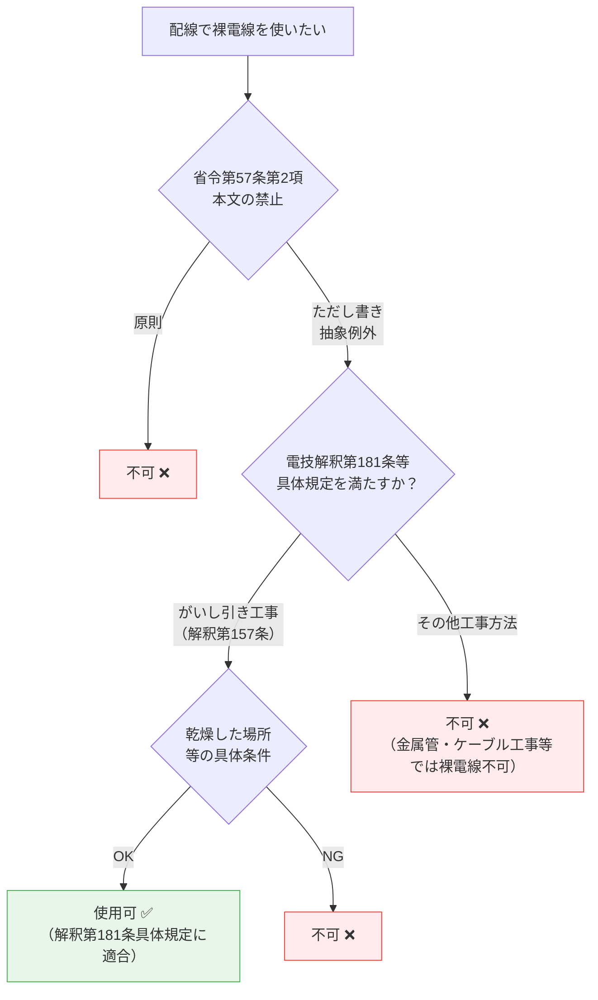

# 電気設備技術基準 第57条 — 配線の使用電線

!!! note "📊 試験対策メタ"
    - **出題頻度**: 🔥🔥（過去14年で 3 回出題）
    - **重要度**: B（重要）
    - **直近出題**: R05上 問8（穴埋・配線の使用電線）

> 配線には、**感電・火災のおそれがない電線**（絶縁電線・ケーブル等）を使用しなければならない。裸電線は原則禁止（ただし書きで省令上は抽象的な例外あり）。さらに **特別高圧の配線には接触電線を使用してはならない**。

| 項目 | 内容 |
|------|------|
| 条文 | 電気設備技術基準 第57条 |
| 規定内容 | 配線に使用する電線の種別と裸電線の例外条件 |
| 性格 | 配線設計の原則規定（具体仕様は解釈に委任） |
| 委任先 | 解釈第142条以降（屋内配線の工事方法ごとの規定） |
| 試験重要度 | 穴埋め定番（**絶縁・がいし引き・乾燥**の3語セット） |
| **典拠（一次ソース）** | 電気設備に関する技術基準を定める省令（平成九年通商産業省令第五十二号、令和5年改正版）第57条（eGov LawId: 409M50000400052） |
| **照合日** | 2026-05-10（eGov 法令API v1 で第1項・第2項・第3項の逐語照合実施） |
| **隣接条文** | ← [第56条（配線の感電・火災防止）](56.md) ／ [第58条（低圧電路の絶縁性能）](58.md) → ／ 委任先：解釈第142条以降 |
| **混同注意** | 同番号の **電気事業法第57条**／**解釈第57条**（地中電線等による他の電線等への危険の防止）とは **別物**。本条は「電技省令」第57条（配線使用電線の種別） |

---

## 1. 5秒で思い出す

- 原則: 配線には **強度＋絶縁性能** を有する電線（=絶縁電線・ケーブル等）。裸電線・特別高圧の接触電線は **対象外**
- 第2項: 配線には **裸電線を使用してはならない**（ただし書き＝省令本文では抽象例外のみ。具体は解釈第181条等の「がいし引き工事＋乾燥した場所」など個別工事規定で実装）
- 第3項: **特別高圧の配線には、接触電線を使用してはならない**（接触電線とはトロリー線等のむき出し電線）
- 代表的な絶縁電線: IV（600V）・HIV（耐熱）
- 代表的なケーブル: VVF（低圧屋内）・CVT（高圧トリプレックス）
- コード（VFF等）は **機器接続専用**。固定配線（幹線・分岐線）には不可

!!! note "📷 ケーブル（多芯）の参考画像"
    第57条が求める「**絶縁性能を有する電線**」の代表例として、3芯PVCケーブル（VVF的構造）を示す。中心の銅導体を絶縁体（PVC）で覆い、さらに外装で束ねた構造が「**強度＋絶縁性能**」を担保する。
    
    <figure markdown>
      { width="500" loading="lazy" }
      <figcaption>3芯PVCケーブル（earth / live / neutral の3導体）— 銅導体を <strong>PVC絶縁体で被覆</strong>、さらに外装で束ねた構造。日本の <strong>VVF（600Vビニル絶縁ビニルシースケーブル平形）</strong> も同様の概念。第57条が求める「絶縁性能」の物理的実装例。画像: <a href="https://commons.wikimedia.org/wiki/File:3.core.cable.JPG" target="_blank" rel="noopener">3.core.cable.JPG（Hafiz n）</a> / <a href="https://creativecommons.org/licenses/by/3.0/" target="_blank" rel="noopener">CC BY 3.0</a>（無改変・引用・参考。日本のVVF/CVTとは細部仕様差あり）</figcaption>
    </figure>
    
    **電線種別の識別ポイント**:
    
    - **絶縁電線（IV・HIV等）**: 銅導体を1層の絶縁体（ビニル等）で覆ったもの。**外装なし** — がいし引き・電線管工事で使用
    - **ケーブル（VVF・CVT等）**: 絶縁電線をさらに外装で被覆。**外装あり** — 露出配線・地中埋設可
    - **裸電線**: 絶縁体なしの銅・アルミ撚り線（架空送電・接地線等の特殊用途）— **配線では原則禁止**（第57条第2項）

??? question "セルフチェック: 第57条第2項のただし書きは省令本文ではどう書かれているか？"
    省令本文は具体工事方法を書かず、抽象的に「**施設場所の状況及び電圧に応じ、使用上十分な強度を有し、かつ、絶縁性がないことを考慮して、配線が感電又は火災のおそれがないように施設する場合**」と規定するのみ。「がいし引き工事＋乾燥した場所」という具体条件は、電技解釈第181条（がいし引き工事）等の **委任先で具体化** されている。

??? question "セルフチェック: 特別高圧の配線で禁止される電線は何か？"
    第3項により **接触電線**（トロリー線等のむき出しで集電する電線）の使用が禁止される。接触電線は低圧・高圧では一定条件下で使用が認められるが、特別高圧では一律禁止。

??? question "セルフチェック: コードを建物の固定配線に使えない理由は？"
    コードは機械的強度・絶縁性能が固定配線用に設計されていないため。VFF等のコードは「電気機器への接続」（移動・着脱が前提）に限定され、壁内・天井裏の幹線・分岐配線には使用できない。

---

## 2. 条文原文

> **電気設備技術基準 第57条（配線の使用電線）**
>
> 配線の使用電線（裸電線及び特別高圧で使用する接触電線を除く。）には、感電又は火災のおそれがないよう、施設場所の状況及び電圧に応じ、使用上十分な **強度及び絶縁性能** を有するものでなければならない。
>
> ２　配線には、裸電線を使用してはならない。ただし、施設場所の状況及び電圧に応じ、使用上十分な強度を有し、かつ、絶縁性がないことを考慮して、配線が感電又は火災のおそれがないように施設する場合は、この限りでない。
>
> ３　特別高圧の配線には、**接触電線** を使用してはならない。

（典拠: eGov 法令API v1, LawId 409M50000400052, Article Num="57"・2026-05-10 照合）

!!! warning "条文構造の注意（3項構成）"
    第57条は **3項構成**。
    
    - **第1項**: 配線使用電線（裸電線・特別高圧の接触電線を除く）に **強度＋絶縁性能** を要求
    - **第2項**: 配線への裸電線使用を原則禁止（ただし書きは抽象的な例外要件）
    - **第3項**: 特別高圧の配線で接触電線の使用を一律禁止
    
    ただし書き本文（第2項）は省令上 **「がいし引き工事」「乾燥した場所」という具体語句を含まない**。これらは電技解釈第181条以降の具体施設方法に委任されている（後述「ただし書きの具体化」参照）。

!!! warning "省令ただし書き ≠ 解釈の具体規定"
    旧来の学習教材で「ただし書き＝がいし引き工事＋乾燥した場所」と説明されることがあるが、これは **電技解釈第181条（がいし引き工事）等の具体規定** の話。省令本文の第2項ただし書きは「強度を有し」「絶縁性がないことを考慮して」「感電又は火災のおそれがないように施設する」という抽象要件のみ。穴埋めで省令の逐語が問われた場合は **抽象表現で答える**。

---

## 3. 原文解析

**第1項（強度＋絶縁性能の要求）**

| ブロック | 原文 | 意味 | 試験のポイント |
|---------|------|------|-------------|
| 主語 | 配線の使用電線（裸電線及び特別高圧で使用する接触電線を除く） | 屋内配線・屋外配線で使う電線全般。裸電線・特別高圧の接触電線は別条扱い | 除外2種類（裸電線／特別高圧の接触電線）に注意 |
| 目的 | 感電又は火災のおそれがないよう | 第56条と同じ二大保護目的 | 第56条とセットで覚える |
| 条件 | 施設場所の状況及び電圧に応じ | 場所と電圧で必要性能が変わる | 解釈第142条以降に委任 |
| 要件 | 使用上十分な **強度及び絶縁性能** を有するもの | 絶縁電線・ケーブルが該当 | 穴埋めは **強度** と **絶縁** が両方ターゲット |

**第2項（裸電線の禁止と抽象的ただし書き）**

| ブロック | 原文 | 意味 | 試験のポイント |
|---------|------|------|-------------|
| 原則 | 配線には、裸電線を使用してはならない | 裸電線は配線では原則禁止 | ただし書きとセット出題 |
| 例外条件1 | 施設場所の状況及び電圧に応じ | 場所と電圧の文脈依存性 | 第1項と同じフレーズの再利用 |
| 例外条件2 | 使用上十分な強度を有し | 機械的強度の要求 | **強度** が省令ただし書きに含まれる |
| 例外条件3 | 絶縁性がないことを考慮して | 裸電線の絶縁欠落を前提に対策する | 「絶縁性がない」を否定形で記述 |
| 例外条件4 | 配線が感電又は火災のおそれがないように施設する場合 | 第56条目的に戻る | 包括的セーフティ条件 |
| 補足 | （具体工事方法は本文に書かれない） | 「がいし引き工事＋乾燥した場所」は省令本文には登場しない | 解釈第181条等で具体化 |

**第3項（特別高圧の接触電線禁止）**

| ブロック | 原文 | 意味 | 試験のポイント |
|---------|------|------|-------------|
| 主語 | 特別高圧の配線には | 7,000V超の配線が対象 | 低圧・高圧では本項の禁止対象外 |
| 禁止対象 | 接触電線 | トロリー線・剛体電車線等のむき出しで集電する電線 | クレーン・電車線で典型 |
| 効果 | 使用してはならない | **絶対禁止**（ただし書きなし） | 第2項（ただし書きあり）との対比 |

---

## 4. かみ砕き解説

> 配線で使う電線の選定は「感電・火災を起こさない」という第56条の目的を電線レベルで具体化したもの。電線の種類は「絶縁電線」「ケーブル」「コード」「裸電線」の4分類で整理する。

### なぜ絶縁が必要なのか

| 絶縁がない場合に起きること | 具体的な危険 |
|--------------------------|------------|
| 裸電線が壁・天井・床の可燃物に触れる | 微小漏電→発熱→火災 |
| 人が誤って裸電線に触れる | 感電（人体が電流の帰路になる） |
| 配線同士が接触する | 短絡→大電流→アーク→火災 |

絶縁被覆は「電流の経路を電線内に閉じ込める」役割を果たす。第5条（電路の絶縁）の原則を、配線という具体場面で実装するのが第57条。

### 使用できる電線の4分類

| 種別 | 代表例 | 構造 | 主な用途 | 固定配線 |
|------|--------|------|---------|---------|
| 絶縁電線 | IV（600Vビニル絶縁）・HIV（耐熱75℃） | 単線または撚線 + ビニル被覆 | 屋内配線全般（がいし引き・金属管・合成樹脂管） | ✅ 可 |
| ケーブル | VVF（平形）・VVR（丸形）・CVT（高圧トリプレックス） | 絶縁体 + シース（外装） | 屋内・屋外・地中・高圧 | ✅ 可 |
| コード | VFF（ビニル平形コード）・キャブタイヤ | 軟銅撚線 + 軽量被覆 | 電気機器への接続（移動・着脱前提） | ❌ 不可 |
| 裸電線 | 銅線・アルミ線・硬銅より線 | 被覆なし | **配線では原則不可**（例外のみ） | △ 例外条件下のみ |

!!! tip "暗記の核心"
    **「配線 = 絶縁電線 or ケーブル」が原則**

    - 例外として裸電線が使えるのは「**がいし引き + 乾燥**」の2条件AND
    - コードは「機器接続」専用。**固定配線（幹線・分岐）には使えない**
    - VVF（ケーブル）と VFF（コード）の **2文字目** に注意：V**V**F = 絶縁体 + 外装（=ケーブル）／V**F**F = 平形コード

### IVとHIVの違い（耐熱性）

| 種別 | 許容温度 | 用途 |
|------|---------|------|
| IV（600Vビニル絶縁電線） | 60℃ | 一般屋内配線 |
| HIV（600V二種ビニル絶縁電線） | 75℃ | 周囲温度が高い場所・分電盤内・電熱器近傍 |

??? question "セルフチェック: VVFとVFFはどちらが固定配線に使えるか？"
    **VVF（ケーブル）が固定配線可。VFF（コード）は不可**。VVFは絶縁体の上にシース（外装）があるため機械的強度を持ち、壁内・天井裏に施設できる。VFFは軽量被覆のみで機器接続専用。

---

## 5. 図で理解

### 図解 1：絶縁電線・ケーブル・裸電線の断面構造

<svg viewBox="0 0 700 220" xmlns="http://www.w3.org/2000/svg" font-family="sans-serif" font-size="12" style="width:100%;max-width:700px">
  <text x="350" y="20" text-anchor="middle" font-size="13" font-weight="bold" fill="#333">配線で使う電線の断面比較</text>

  <!-- IV（絶縁電線） -->
  <rect x="20" y="40" width="200" height="160" rx="8" fill="#f1f8e9" stroke="#66bb6a" stroke-width="1.5"/>
  <text x="120" y="60" text-anchor="middle" font-weight="bold" fill="#388e3c">IV（絶縁電線）</text>
  <text x="120" y="76" text-anchor="middle" font-size="10" fill="#388e3c">単線 + ビニル被覆</text>
  <circle cx="120" cy="125" r="42" fill="#fff9c4" stroke="#f9a825" stroke-width="2"/>
  <circle cx="120" cy="125" r="20" fill="#bf360c" stroke="#3e2723" stroke-width="1"/>
  <text x="120" y="129" text-anchor="middle" font-size="10" fill="#fff" font-weight="bold">導体</text>
  <text x="120" y="180" text-anchor="middle" font-size="10" fill="#e65100">↑ 絶縁被覆（ビニル）</text>
  <text x="120" y="194" text-anchor="middle" font-size="10" fill="#388e3c">用途: 屋内配線（管内）</text>

  <!-- VVF（ケーブル） -->
  <rect x="240" y="40" width="200" height="160" rx="8" fill="#e3f2fd" stroke="#42a5f5" stroke-width="1.5"/>
  <text x="340" y="60" text-anchor="middle" font-weight="bold" fill="#1565c0">VVF（ケーブル）</text>
  <text x="340" y="76" text-anchor="middle" font-size="10" fill="#1565c0">平形 + シース外装</text>
  <rect x="270" y="100" width="140" height="50" rx="22" fill="#90caf9" stroke="#1565c0" stroke-width="2"/>
  <circle cx="300" cy="125" r="14" fill="#fff9c4" stroke="#f9a825" stroke-width="1.5"/>
  <circle cx="300" cy="125" r="7" fill="#bf360c"/>
  <circle cx="340" cy="125" r="14" fill="#fff9c4" stroke="#f9a825" stroke-width="1.5"/>
  <circle cx="340" cy="125" r="7" fill="#bf360c"/>
  <circle cx="380" cy="125" r="14" fill="#fff9c4" stroke="#f9a825" stroke-width="1.5"/>
  <circle cx="380" cy="125" r="7" fill="#2e7d32"/>
  <text x="340" y="170" text-anchor="middle" font-size="10" fill="#1565c0">↑ 外装（シース）+ 心線3本</text>
  <text x="340" y="194" text-anchor="middle" font-size="10" fill="#1565c0">用途: 露出配線・隠蔽配線</text>

  <!-- 裸電線 -->
  <rect x="460" y="40" width="220" height="160" rx="8" fill="#fff3e0" stroke="#ef5350" stroke-width="1.5"/>
  <text x="570" y="60" text-anchor="middle" font-weight="bold" fill="#c62828">裸電線</text>
  <text x="570" y="76" text-anchor="middle" font-size="10" fill="#c62828">被覆なし（導体のみ）</text>
  <circle cx="570" cy="125" r="28" fill="#bf360c" stroke="#3e2723" stroke-width="1.5"/>
  <text x="570" y="129" text-anchor="middle" font-size="11" fill="#fff" font-weight="bold">導体</text>
  <text x="570" y="170" text-anchor="middle" font-size="10" fill="#c62828">↑ 絶縁被覆なし</text>
  <text x="570" y="188" text-anchor="middle" font-size="10" fill="#c62828" font-weight="bold">原則禁止</text>
  <text x="570" y="204" text-anchor="middle" font-size="9" fill="#c62828">（解釈第181条等で例外）</text>
</svg>

### 図解 2：省令と解釈の二段判定フローチャート

!!! warning "省令と解釈の役割分担"
    省令第57条第2項のただし書きは **抽象的な要件**（強度・絶縁性のなさを考慮・感電火災のおそれなし）のみ。
    「がいし引き工事」「乾燥した場所」という **具体条件は電技解釈第181条等で定義** されている。穴埋めで省令の逐語が問われた場合は省令本文の抽象表現で答える。

---

## 6. ただし書きの具体化（解釈第181条等）

!!! warning "本セクションは省令本文ではなく解釈の具体規定の話"
    省令第57条第2項のただし書きは抽象的に「強度を有し、かつ、絶縁性がないことを考慮して、配線が感電又は火災のおそれがないように施設する場合」と書くのみ。
    実務で裸電線が使える具体条件は **電技解釈第181条以降** に定められており、典型例として「**がいし引き工事 ＋ 乾燥した場所**」がある。本セクションは解釈側の代表例として「なぜがいし引き工事＋乾燥した場所だとただし書き要件を満たせるか」を解説する。

### がいし引き工事が必要な理由（解釈第181条等の具体規定）

がいし（碍子）は絶縁体のセラミック支持具。電線を建物・造営材から **空間的に離して** 支持するため、被覆がなくても以下が成立する。

- 可燃物（木材・壁紙）と直接接触しない → 火災リスクを物理的に回避
- 人が容易に触れない高さ・位置に施設できる → 感電リスクを低減
- 電線同士の間隔も保てる → 短絡リスクを低減

金属管工事やケーブル工事では電線が管・シース内を通るため「物理的距離」を確保する手段がなく、裸電線が許されない。

### 乾燥した場所が必要な理由

裸電線 + 湿気は危険コンビ。

- 湿気で導電性が増した塵埃が電線間にブリッジを作り、漏電・トラッキング発火のリスク
- 結露水滴が落下経路を作り、人体への感電経路が短時間で形成され得る
- 雨水・水滴が電線表面を伝うと地絡電流が常時流れる

そのため「乾燥した場所」（=湿気・水気のない屋内）に限定される。

!!! tip "暗記の核心（解釈第181条等の具体規定の理屈）"
    **がいし引き = 物理的距離で安全確保**
    **乾燥 = 漏電経路を作らない**
    両方そろって初めて「絶縁被覆なしでも安全」が成立する。片方欠ければ即不可。
    なお、これらは省令本文ではなく解釈の具体規定。**省令穴埋めで「がいし引き」「乾燥」を答えると不正解** になる出題パターンがあるので注意。

### 第3項（特別高圧の接触電線禁止）の理屈

> 接触電線とは、トロリー線・剛体電車線等のように **集電装置（パンタグラフ・コレクターシュー）を電線に接触させて電力を取り込む** むき出しの電線。

| 電圧区分 | 接触電線の使用 | 根拠 |
|---------|--------------|------|
| 低圧（600V以下） | 一定条件で可 | 解釈第173条等 |
| 高圧（600V超〜7,000V） | 一定条件で可 | 解釈第174条等 |
| **特別高圧（7,000V超）** | **絶対禁止** | **省令第57条第3項** |

特別高圧で接触電線を禁止する理由:

- 7,000V超のむき出し電線への接触は **即時致死リスク**
- 集電火花（アーク）のエネルギーが大きく、**火災・人身事故のリスクが桁違い**
- 特別高圧の電車線は架線として高所に設置・厳重な離隔を確保する設計が前提（接触電線という形態自体が成立しない）

??? question "セルフチェック: なぜケーブル工事や金属管工事では裸電線が使えないのか？"
    ケーブル工事・金属管工事では電線が外装または管内に密接して通るため、**電線間の空間距離を確保できない**。被覆なしの裸電線では即座に短絡・地絡につながる。がいし引き工事だけが「電線同士・電線と造営材を空間で離す」設計を実現できる（解釈第181条の論理）。

??? question "セルフチェック: 高圧では接触電線が使えるのに、特別高圧で全面禁止にする理由は？"
    7,000V超のむき出し電線は **接触＝即時致死** のリスクが極めて高く、集電アークのエネルギーも桁違いで火災リスクが許容範囲を超える。そもそも特別高圧の電車線は架空・離隔確保が大前提のため、接触電線という形態自体が安全工学上成立しない。

---

## 7. 試験で問われること

> 出題パターンは「強度＋絶縁性能」「裸電線禁止」の穴埋めに集中。第56条と組み合わせた総合問題も増えている。

!!! note "出題予測（過去14年の統計）"
    第57条の出題は **穴埋め問題が中心**。論点は次に収束する。

    1. **強度＋絶縁性能の穴埋め**: 「使用上十分な〜及び〜性能を有するもの」
       - 正解: **強度** ／ **絶縁**
       - ひっかけ: 「耐熱」（耐熱性能はHIVなど特定電線の追加要件・第57条本文ではない）

    2. **裸電線の禁止と除外規定**: 第1項の括弧書きで「**裸電線及び特別高圧で使用する接触電線を除く**」を問う
       - 正解: **裸電線** ／ **接触電線**

    3. **特別高圧の接触電線禁止（第3項）**: 「特別高圧の配線には、〜を使用してはならない」
       - 正解: **接触電線**
       - ひっかけ: 「裸電線」「がいし引き」（裸電線は第2項対象・がいし引きは解釈側）

    4. **省令ただし書きの抽象表現**: 「絶縁性がないことを **考慮して** 」「強度を有し」
       - 「がいし引き工事」「乾燥した場所」は **省令本文の答えではない**（解釈第181条の話）

    5. **第56条との組み合わせ**: 「感電・火災等の防止（第56条）」と「配線の使用電線（第57条）」を一体で問う
       - R07下 問8 がこの形式。第56条の「人に危険を及ぼし又は物件に損傷を与えるおそれ」と第57条の「絶縁性能」を交互に穴埋めにする

---

## 8. 頻出ひっかけ

### 🔴 致命的ひっかけ（必ず即答できる必修事項）

| 誤った主張 | 正しくは |
|---|---|
| 「省令第57条第2項のただし書きにがいし引き工事と乾燥した場所が書かれている」 | **誤り**。省令本文は **抽象表現のみ**（「強度を有し」「絶縁性がないことを考慮して」「感電又は火災のおそれがないように施設する場合」）。「がいし引き工事＋乾燥した場所」は **電技解釈第181条等** の具体規定 |
| 「特別高圧の配線にも接触電線を使ってよい」 | **誤り**。第3項で **絶対禁止**。低圧・高圧では条件付きで可だが、特別高圧は一律不可 |
| 「コードは固定配線（幹線・分岐）に使える」 | **誤り**。コードは機器接続専用。建物の固定配線には不可 |

### 🟡 注意ひっかけ（細部の表現に注意）

| 誤った主張 | 正しくは |
|---|---|
| 「第57条第1項は絶縁性能のみを要求している」 | **誤り**。「**強度及び絶縁性能**」の **2要件**。強度（機械的）も省令本文に明記 |
| 「VVF と VFF は同じケーブル」 | **誤り**。VVF=ビニル外装ケーブル（固定配線可）／VFF=ビニル平形コード（固定配線不可）。**2文字目** が異なる |
| 「絶縁電線の絶縁性能は第57条本文に数値で規定されている」 | **誤り**。第57条は原則のみ。具体仕様は電技解釈第142条以降の工事方法ごとの規定に委任 |

### 🟢 軽度ひっかけ（用語の確認）

| 誤った主張 | 正しくは |
|---|---|
| 「IVとHIVは同じもの」 | **誤り**。IV=60℃／HIV=75℃。耐熱性能が異なる |

??? question "セルフチェック: 「省令ただし書きで裸電線が使えるのは『がいし引き工事＋乾燥した場所』か？」と問われたらどう答えるか？"
    **省令第57条第2項のただし書き本文には「がいし引き工事」「乾燥した場所」という具体語句は登場しない**。省令は「強度を有し、かつ、絶縁性がないことを考慮して、配線が感電又は火災のおそれがないように施設する場合」という抽象表現のみ。「がいし引き工事＋乾燥した場所」は **電技解釈第181条** で具体化された施設方法であり、省令と解釈の役割分担を区別すること。

---
## 9. 穴埋め過去問チャレンジ

!!! note "過去問類題（省令第57条の逐語ベース・難易度 ★★☆☆☆）"
    次の文章は「電気設備技術基準」第57条第1項に関する記述である。空欄（ア）〜（イ）に入る語句として正しいものを選べ。

    > 配線の使用電線（裸電線及び特別高圧で使用する <mark>（ア）</mark> を除く。）には、感電又は火災のおそれがないよう、施設場所の状況及び電圧に応じ、使用上十分な強度及び <mark>（イ）</mark> 性能を有するものでなければならない。

??? success "解答を見る"
    | 空欄 | 正答 |
    |------|------|
    | （ア） | **接触電線** |
    | （イ） | **絶縁** |

    **読み解きポイント：**

    - （ア）**接触電線** ：第1項の括弧書きは「裸電線及び特別高圧で使用する接触電線を除く」。第3項で特別高圧の接触電線は禁止されているため第1項の対象から除外されている
    - （イ）**絶縁** ：第57条本文は **「強度及び絶縁性能」** の2要件。「強度」は機械的強度、「絶縁」は電気的絶縁性能

!!! note "過去問類題（省令第57条第3項ベース・難易度 ★★☆☆☆）"
    次の文章は「電気設備技術基準」第57条第3項である。空欄（ア）に入る語句として正しいものを選べ。

    > 特別高圧の配線には、 <mark>（ア）</mark> を使用してはならない。

??? success "解答を見る"
    | 空欄 | 正答 |
    |------|------|
    | （ア） | **接触電線** |

    **読み解きポイント：**

    - 第3項は **絶対禁止規定**（ただし書きなし）。低圧・高圧では条件付きで使用可だが、特別高圧では一律不可
    - ひっかけ選択肢: 「裸電線」（第2項対象）／「がいし引き工事」（解釈側）

!!! warning "出題ひっかけ"
    過去問では「省令第57条のただし書き＝がいし引き工事＋乾燥した場所」と書かれた選択肢が出ることがあるが、**省令本文には具体語句なし**。具体規定は電技解釈第181条。省令逐語の穴埋めなら抽象表現で答える。

---

## 10. まぎらわしい選択肢と正解の違い

| 論点 | よくある誤答 | 正答 | なぜ違うか |
|------|------------|------|----------|
| 第1項 性能要件 | **絶縁性能のみ** | **強度及び絶縁性能** | 省令本文は強度＋絶縁の2要件。「強度」を落とすと不正解 |
| 第1項 除外規定 | **裸電線のみ** | **裸電線及び特別高圧で使用する接触電線** | 括弧書きで2種類除外。「特別高圧の接触電線」を落とすと不正解 |
| ただし書き | **「がいし引き工事＋乾燥した場所」** | **抽象表現**（強度＋絶縁性のなさを考慮＋感電火災のおそれなし） | 省令本文に具体工事名は登場しない。「がいし引き工事」「乾燥」は **解釈第181条** の話 |
| 第3項 禁止対象 | **裸電線** | **接触電線** | 第3項は接触電線を禁止。裸電線は第2項対象 |
| 第3項 適用範囲 | **高圧** | **特別高圧** | 高圧では条件付きで接触電線使用可。特別高圧のみ絶対禁止 |
| 第3項 例外 | **ただし書きあり** | **ただし書きなし**（絶対禁止） | 第3項にはただし書きが存在しない |
| 解釈の誤用 | **省令第57条の穴埋めに「がいし引き」「乾燥」を入れる** | **省令本文に該当語句なし** | 解釈第181条の知識を省令穴埋めに転用すると不正解 |
| コードの用途 | **幹線配線可** | **機器接続専用** | コードは固定配線（幹線・分岐）には使えない |
| ケーブル種別 | **VFF** | **VVF** | VFFはビニルコード（固定不可）、VVFはケーブル（固定可）。**2文字目** で判別 |

### 一目でわかる電線分類

| 比較軸 | 絶縁電線 | ケーブル | コード | 裸電線 |
|--------|---------|---------|--------|--------|
| 構造 | 導体 + 絶縁被覆 | 導体 + 絶縁体 + 外装 | 軟銅撚線 + 軽量被覆 | 導体のみ |
| 代表例 | IV・HIV | VVF・VVR・CVT | VFF・キャブタイヤ | 銅線・硬銅より線 |
| 固定配線 | ✅ 可 | ✅ 可 | ❌ 不可 | △ 例外条件下のみ |
| 機器接続 | △（用途による） | △（用途による） | ✅ 主用途 | ❌ 不可 |
| 試験での出方 | （ア）の正答ベース | 種別を選ばせる問題 | 「コードを幹線に使える」誤答 | 例外条件問題の主役 |

---

## 11. 関連条文

- 直前確認・図解（法規Wiki）: [配線・使用電線（電験3種法規Wiki）](https://kfurufuru.github.io/secretary-portal-public/denken-hoki-wiki.html#haisen-shiyou-densen) — 過去問のひっかけ・暗記表・図解で直前確認

**上位・目的条文**

- [感電・火災等の防止 第56条](56.md) — 第57条の上位目的。R07下では第56条と組み合わせて出題
- [電路の絶縁 第5条](5.md) — 電路全般の絶縁原則。第57条は配線レベルでの実装

**配線関連の周辺条文**

- 電技省令第58条 — 低圧の電路の絶縁性能（絶縁抵抗値の規定。第57条の絶縁性能を具体化）
- 電技省令第59条 — 電気機械器具の感電等の防止（配線の先につながる機器側の規定）
- 電技省令第63条 — 過電流からの低圧幹線等の保護（過電流遮断器の設置義務）
- 電技省令第64条 — 地絡に対する保護対策（地絡遮断装置の設置義務）

**屋内配線の工事方法（第57条の具体仕様の委任先）**

- 電技解釈第142条以降 — 屋内配線の工事方法ごとの詳細規定
    - 電技解釈第181条 — がいし引き工事（裸電線使用可の具体条件＝乾燥した場所等）
    - 金属管工事・合成樹脂管工事・ケーブル工事の電線種別・施設条件
    - 屋外配線・地中配線の電線種別
- 電技解釈第173条・第174条 — 低圧・高圧の接触電線の施設条件（特別高圧は省令第57条第3項で絶対禁止）

**第57条からの法的フロー**

| ステップ | 条文 | 内容 |
|---------|------|------|
| 1 | 電技省令第56条 | 感電・火災防止の原則（上位目的） |
| 2 | 電技省令第57条第1項 | 配線使用電線に強度＋絶縁性能を要求 |
| 3 | 電技省令第57条第2項 | 裸電線の禁止と抽象的ただし書き |
| 4 | 電技省令第57条第3項 | 特別高圧の接触電線禁止 |
| 5 | 電技省令第58条 | 低圧電路の絶縁性能（具体的絶縁抵抗値） |
| 6 | 電技解釈第181条等 | 第57条第2項ただし書きの具体化（がいし引き工事＋乾燥した場所） |
| 7 | 電技解釈第142条以降 | 工事方法ごとの電線種別・施設条件の具体規定 |

---

## 12. 過去問実績

| 年度 | 問 | 形式 | 論点 | 備考 |
|------|-----|------|------|------|
| R05上 | 問8 | 穴埋 | 電気使用場所での配線の使用電線（省令第57条） | — |
| H29 | 問11 | 計算 | 電気使用場所の配線（(a) 省令第56条・第57条・第62条の穴埋／(b) 許容電流計算） | 第56条・第62条との組み合わせ |
| H25 | 問3 | 穴埋 | 配線の使用電線（省令第57条） | — |

- （関連出題）R07下 問8 — 感電・火災等の防止: kakomon.yml の登録は**省令第21条・第56条・第59条・第61条**の複合で、本条（第57条）は含まない（旧版の「第56条,第57条」表記は誤転記・2026-06-12 是正。[隣接の第56条](56.md) 側の実績に整理）

→ **H23〜R07下で3回出題**（H25・H29・R05上）。H29問11(a)は第56条・第57条・第62条の3条横断（denken-ou houkih29-11 一次照合・2026-06-11）。

!!! note "R08 出題予測"
    R05上の直近出題があり、隣接条文との複合出題（R07下問8 は第21・56・59・61条）が新傾向。
    **「強度及び絶縁性能」のセット穴埋め** ／ **「裸電線及び特別高圧で使用する接触電線を除く」の括弧書き** ／ **第3項の接触電線禁止** が定番候補。
    R08では「電線種別の識別」（IV/HIV/VVF/VFFの違い）や **省令本文 vs 解釈の役割分担** も出題候補。

---

## 13. 最終チェック

**📜 条文の核心（3項構成）**

- [ ] 第1項「使用上十分な **強度及び絶縁性能** を有するもの」を言える
- [ ] 第1項の括弧書き「裸電線及び **特別高圧で使用する接触電線** を除く」を言える
- [ ] 第2項のただし書きが **抽象表現のみ**（具体工事名なし）であることを説明できる
- [ ] 第3項「特別高圧の配線には **接触電線** を使用してはならない」を即答できる

**🔌 電線種別**

- [ ] IV/HIV（絶縁電線）と VVF/CVT（ケーブル）の違いを説明できる
- [ ] コードが固定配線に使えない理由を説明できる
- [ ] VVF と VFF を 2文字目で区別できる
- [ ] 接触電線（トロリー線等）の概念を説明できる

**🪣 省令と解釈の役割分担**

- [ ] 省令第57条第2項ただし書きには「がいし引き工事」「乾燥した場所」という具体語句がないことを言える
- [ ] 「がいし引き工事＋乾燥した場所」は **電技解釈第181条** の話であると説明できる
- [ ] 解釈側でがいし引き工事＋乾燥が要求される理由（空間距離・漏電経路防止）を説明できる

**📚 関連条文**

- [ ] 第56条（感電・火災防止）と第57条の関係を説明できる
- [ ] 第57条の具体仕様は電技解釈第142条以降（特に第181条）に委任されることを知っている

---

---

## 監修ログ

- **2026-05-02**: DENKEN-WIKI監修部による初回三段監修（不動・江間・早川）。江間が条文引用照合（PDF読取制約あり、本体WebFetch不可）。不動が電線種別の物理的記述（IV/HIV/VVF/VVR/CVT/VFFの構造・許容温度 IV=60℃ / HIV=75℃）を確認 → 標準値と一致。早川がセクション構成（13セクション）・SVG2＋mermaid1の視覚要素・ひっかけ網羅性を確認。**条文原文セクションに公式本文転記の暫定文言（要再確認）残存**は別セッションで公式照合のうえ削除推奨。
- **数値検証判定: PASS**（IV=60℃ / HIV=75℃の許容温度値・電線種別すべて標準値と一致。本条は数値テーブルが少なく定性記述中心のため数値リスク低）
- **2026-05-05 v2.2 テンプレートv2.3移行**: メタテーブルに「典拠／照合日／隣接条文／混同注意」4行追加。フッタにステータスラベル3軸（条文番号／出題実績／数値根拠）導入。
    - **条文番号確定根拠**: 電技省令 平成九年通商産業省令第五十二号 令和5年改正版
    - **既存wiki参照の独立検証**: 実施（隣接 第56条・第58条 と内容重複なきこと確認・本条は「配線の使用電線種別」固有内容／具体仕様は解釈第142条以降へ委任）
    - **未確認領域**: 第2条 e-Gov公式本文転記プレースホルダ残存（別セッションで対応推奨）
- **2026-05-10 v2.3 Phase B修正**: ただし書き「がいし引き工事＋乾燥場所」（解釈第181条由来）を撤回・eGov逐語に差替・第3項（特別高圧の接触電線禁止）反映追加・プレースホルダ転記完了。
    - **eGov 法令API v1（LawId 409M50000400052）逐語照合**: 第1項括弧書き「裸電線及び特別高圧で使用する接触電線を除く」／第1項要件「強度及び絶縁性能」／第2項ただし書きの抽象表現／第3項全文 を確認
    - **「がいし引き工事＋乾燥した場所」の出典訂正**: 省令第57条第2項本文ではなく **電技解釈第181条等の具体規定** であることを記事内全所で明示・分離
    - **第3項（特別高圧の接触電線禁止）解説新設**: セクション1・2・3・6・7・8・9・10・11・13 の各セクションに第3項関連の解説・出題ポイント・覚え方を反映
    - **プレースホルダ削除**: セクション2 の旧プレースホルダ（要再確認の暫定文言）を eGov 一次照合済の正本に置換・wiki_check.py 違反解消
    - **影響評価**: 旧版で「省令ただし書き＝がいし引き工事＋乾燥した場所」と覚えた学習者は省令穴埋めで誤答する可能性があったため緊急修正

- **2026-05-23 v2.4 改訂**:
    - 採用画像: [`assets/images/57-cable3core.jpg`](../../assets/images/57-cable3core.jpg) (出典: [3.core.cable.JPG](https://commons.wikimedia.org/wiki/File:3.core.cable.JPG), Hafiz n, CC BY 3.0)
    - 採用理由: 「**絶縁電線 vs ケーブル vs 裸電線**」の混同論点を視覚化。3芯PVCケーブル（VVF的構造）の実物写真で「絶縁体＋外装」の物理構造を体感。第57条が求める「強度＋絶縁性能」の具体的実装例として、文字説明だけでは伝わりにくい構造を補完
    - 代替検討: SVG模式図でも代用可能だが、被覆の質感・色分け（earth/live/neutral）の現実感は写真が優位
    - ライセンス検証: ✅ CC BY 3.0 確認済、figcaption に著者・ライセンス・出典URL を明記。日本VVFとの細部仕様差は「参考」と注記
    - [写真導入ポリシー（reference/photo-policy.md）](../../reference/photo-policy.md) v1.0 の優先度A適用第3弾

---

*最終確認: 2026-06-12 | ステータス: v2.5（R07下問8 を関連出題へ整理＝kakomon.yml は第21・56・59・61条で本条非含有・頻度3回で機械ゲート整合） | 条文番号: ✅ 一次ソース照合済（電技省令第57条 第1項・第2項・第3項） ｜ 出題実績: ✅ kakomon DB 3件照合済（H25問3・H29問11・R05上問8） ｜ 数値根拠: ✅ 公式根拠記載済（IV=60℃/HIV=75℃ 標準値一致） ｜ [バージョニング基準](../../reference/versioning.md)*
