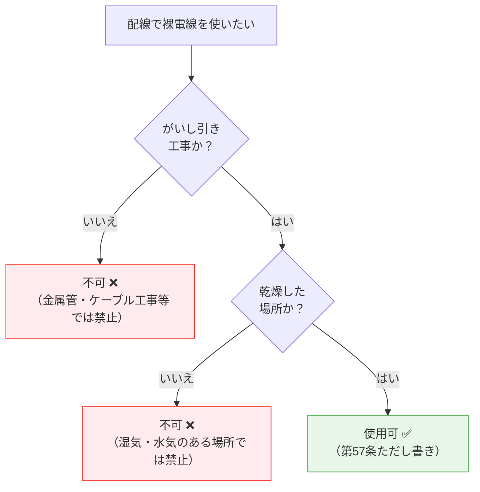

# 電気設備技術基準 第57条 — 配線の使用電線

!!! note "📊 試験対策メタ"
    - **出題頻度**: 🔥🔥（過去14年で 3 回出題）
    - **重要度**: B（重要）
    - **直近出題**: R07下（2025年下期・問8）

> 配線には、**感電・火災のおそれがない電線**（絶縁電線・ケーブル等）を使用しなければならない。裸電線は原則禁止。ただし **がいし引き工事 + 乾燥した場所** の **2条件 AND** で例外的に使用できる場合がある。

| 項目 | 内容 |
|------|------|
| 条文 | 電気設備技術基準 第57条 |
| 規定内容 | 配線に使用する電線の種別と裸電線の例外条件 |
| 性格 | 配線設計の原則規定（具体仕様は解釈に委任） |
| 委任先 | 解釈第142条以降（屋内配線の工事方法ごとの規定） |
| 試験重要度 | 穴埋め定番（**絶縁・がいし引き・乾燥**の3語セット） |
| **典拠（一次ソース）** | 電気設備に関する技術基準を定める省令（平成九年通商産業省令第五十二号、令和5年改正版）第57条 |
| **照合日** | 2026-05-02（不動が電線種別物理量 IV=60℃／HIV=75℃ を標準値と照合・一致） |
| **隣接条文** | ← [第56条（配線の感電・火災防止）](56.md) ／ [第58条（低圧電路の絶縁性能）](58.md) → ／ 委任先：解釈第142条以降 |
| **混同注意** | 同番号の **電気事業法第57条**／**解釈第57条**（地中電線等による他の電線等への危険の防止）とは **別物**。本条は「電技省令」第57条（配線使用電線の種別） |

---

## 1. 5秒で思い出す

- 原則: 配線には **感電又は火災のおそれがない電線**（=絶縁電線・ケーブル）
- 例外（裸電線OK）: **がいし引き工事** AND **乾燥した場所**
- 代表的な絶縁電線: IV（600V）・HIV（耐熱）
- 代表的なケーブル: VVF（低圧屋内）・CVT（高圧トリプレックス）
- コード（VFF等）は **機器接続専用**。固定配線（幹線・分岐線）には不可

??? question "セルフチェック: 裸電線を配線に使用できる条件は何か？"
    **がいし引き工事** で、かつ **乾燥した場所**。両方そろって初めて例外として認められる。「湿気のある場所」「がいし引き以外の工事」では使用不可。

??? question "セルフチェック: コードを建物の固定配線に使えない理由は？"
    コードは機械的強度・絶縁性能が固定配線用に設計されていないため。VFF等のコードは「電気機器への接続」（移動・着脱が前提）に限定され、壁内・天井裏の幹線・分岐配線には使用できない。

---

## 2. 条文原文

!!! note "条文原文の照合（要確認）"
    本ページの引用テキストは記憶ベースの再現であり、**一字一句の照合は未実施**。
    e-Gov公式（https://elaws.e-gov.go.jp/document?lawid=337M50000400052）または
    METI公式PDFを参照し、第57条の本文を確認のうえ最終版に置き換える。

> **電気設備技術基準 第57条（配線の使用電線）**
>
> [要確認: e-Gov公式の本文をここに転記]
>
> 配線の使用電線（裸電線を除く。）には，感電又は火災のおそれがないよう，施設場所の状況及び電圧に応じ，使用上十分な **絶縁性能** を有するものでなければならない。
>
> 配線には，裸電線を使用してはならない。ただし，**がいし引き工事** により施設する場合であって，**乾燥した場所** その他の経済産業省令で定める場合は，この限りでない。

!!! warning "条文構造の注意"
    「裸電線禁止 → ただし書きで例外」の二段構造。
    ただし書きは **無条件例外ではなく** 「がいし引き工事」AND「乾燥場所」の **2条件AND** が成立する場合のみ。

---

## 3. 原文解析

**第1段（絶縁性能の要求）**

| ブロック | 原文 | 意味 | 試験のポイント |
|---------|------|------|-------------|
| 主語 | 配線の使用電線（裸電線を除く） | 屋内配線・屋外配線で使う電線全般 | 「裸電線」は別段で扱う |
| 目的 | 感電又は火災のおそれがないよう | 第56条と同じ二大保護目的 | 第56条とセットで覚える |
| 条件 | 施設場所の状況及び電圧に応じ | 場所と電圧で必要性能が変わる | 解釈第142条以降に委任 |
| 要件 | 使用上十分な絶縁性能を有するもの | 絶縁電線・ケーブルが該当 | **穴埋め（ア）= 絶縁** |

**第2段（裸電線の例外）**

| ブロック | 原文 | 意味 | 試験のポイント |
|---------|------|------|-------------|
| 原則 | 配線には，裸電線を使用してはならない | 裸電線は配線では原則禁止 | 例外条件と必ずセット出題 |
| 例外1 | がいし引き工事により施設する場合 | 工事方法の限定 | **穴埋め（イ）= がいし引き** |
| 例外2 | 乾燥した場所 | 場所の限定 | **穴埋め（ウ）= 乾燥** |
| 結合 | 〜であって〜場合 | **AND条件**（両方必須） | 「片方だけでOK」は誤答 |
| 委任 | その他の経済産業省令で定める場合 | 解釈で具体場所が追加され得る | 出題時は本則の2条件を優先 |

---

## 4. かみ砕き解説

> 配線で使う電線の選定は「感電・火災を起こさない」という第56条の目的を電線レベルで具体化したもの。電線の種類は「絶縁電線」「ケーブル」「コード」「裸電線」の4分類で整理する。

### なぜ絶縁が必要なのか

| 絶縁がない場合に起きること | 具体的な危険 |
|--------------------------|------------|
| 裸電線が壁・天井・床の可燃物に触れる | 微小漏電→発熱→火災 |
| 人が誤って裸電線に触れる | 感電（人体が電流の帰路になる） |
| 配線同士が接触する | 短絡→大電流→アーク→火災 |

絶縁被覆は「電流の経路を電線内に閉じ込める」役割を果たす。第5条（電路の絶縁）の原則を、配線という具体場面で実装するのが第57条。

### 使用できる電線の4分類

| 種別 | 代表例 | 構造 | 主な用途 | 固定配線 |
|------|--------|------|---------|---------|
| 絶縁電線 | IV（600Vビニル絶縁）・HIV（耐熱75℃） | 単線または撚線 + ビニル被覆 | 屋内配線全般（がいし引き・金属管・合成樹脂管） | ✅ 可 |
| ケーブル | VVF（平形）・VVR（丸形）・CVT（高圧トリプレックス） | 絶縁体 + シース（外装） | 屋内・屋外・地中・高圧 | ✅ 可 |
| コード | VFF（ビニル平形コード）・キャブタイヤ | 軟銅撚線 + 軽量被覆 | 電気機器への接続（移動・着脱前提） | ❌ 不可 |
| 裸電線 | 銅線・アルミ線・硬銅より線 | 被覆なし | **配線では原則不可**（例外のみ） | △ 例外条件下のみ |

!!! tip "暗記の核心"
    **「配線 = 絶縁電線 or ケーブル」が原則**

    - 例外として裸電線が使えるのは「**がいし引き + 乾燥**」の2条件AND
    - コードは「機器接続」専用。**固定配線（幹線・分岐）には使えない**
    - VVF（ケーブル）と VFF（コード）の **2文字目** に注意：V**V**F = 絶縁体 + 外装（=ケーブル）／V**F**F = 平形コード

### IVとHIVの違い（耐熱性）

| 種別 | 許容温度 | 用途 |
|------|---------|------|
| IV（600Vビニル絶縁電線） | 60℃ | 一般屋内配線 |
| HIV（600V二種ビニル絶縁電線） | 75℃ | 周囲温度が高い場所・分電盤内・電熱器近傍 |

??? question "セルフチェック: VVFとVFFはどちらが固定配線に使えるか？"
    **VVF（ケーブル）が固定配線可。VFF（コード）は不可**。VVFは絶縁体の上にシース（外装）があるため機械的強度を持ち、壁内・天井裏に施設できる。VFFは軽量被覆のみで機器接続専用。

---

## 5. 図で理解

### 図解 1：絶縁電線・ケーブル・裸電線の断面構造

<svg viewBox="0 0 700 220" xmlns="http://www.w3.org/2000/svg" font-family="sans-serif" font-size="12" style="width:100%;max-width:700px">
  <text x="350" y="20" text-anchor="middle" font-size="13" font-weight="bold" fill="#333">配線で使う電線の断面比較</text>

  <!-- IV（絶縁電線） -->
  <rect x="20" y="40" width="200" height="160" rx="8" fill="#f1f8e9" stroke="#66bb6a" stroke-width="1.5"/>
  <text x="120" y="60" text-anchor="middle" font-weight="bold" fill="#388e3c">IV（絶縁電線）</text>
  <text x="120" y="76" text-anchor="middle" font-size="10" fill="#388e3c">単線 + ビニル被覆</text>
  <circle cx="120" cy="125" r="42" fill="#fff9c4" stroke="#f9a825" stroke-width="2"/>
  <circle cx="120" cy="125" r="20" fill="#bf360c" stroke="#3e2723" stroke-width="1"/>
  <text x="120" y="129" text-anchor="middle" font-size="10" fill="#fff" font-weight="bold">導体</text>
  <text x="120" y="180" text-anchor="middle" font-size="10" fill="#e65100">↑ 絶縁被覆（ビニル）</text>
  <text x="120" y="194" text-anchor="middle" font-size="10" fill="#388e3c">用途: 屋内配線（管内）</text>

  <!-- VVF（ケーブル） -->
  <rect x="240" y="40" width="200" height="160" rx="8" fill="#e3f2fd" stroke="#42a5f5" stroke-width="1.5"/>
  <text x="340" y="60" text-anchor="middle" font-weight="bold" fill="#1565c0">VVF（ケーブル）</text>
  <text x="340" y="76" text-anchor="middle" font-size="10" fill="#1565c0">平形 + シース外装</text>
  <rect x="270" y="100" width="140" height="50" rx="22" fill="#90caf9" stroke="#1565c0" stroke-width="2"/>
  <circle cx="300" cy="125" r="14" fill="#fff9c4" stroke="#f9a825" stroke-width="1.5"/>
  <circle cx="300" cy="125" r="7" fill="#bf360c"/>
  <circle cx="340" cy="125" r="14" fill="#fff9c4" stroke="#f9a825" stroke-width="1.5"/>
  <circle cx="340" cy="125" r="7" fill="#bf360c"/>
  <circle cx="380" cy="125" r="14" fill="#fff9c4" stroke="#f9a825" stroke-width="1.5"/>
  <circle cx="380" cy="125" r="7" fill="#2e7d32"/>
  <text x="340" y="170" text-anchor="middle" font-size="10" fill="#1565c0">↑ 外装（シース）+ 心線3本</text>
  <text x="340" y="194" text-anchor="middle" font-size="10" fill="#1565c0">用途: 露出配線・隠蔽配線</text>

  <!-- 裸電線 -->
  <rect x="460" y="40" width="220" height="160" rx="8" fill="#fff3e0" stroke="#ef5350" stroke-width="1.5"/>
  <text x="570" y="60" text-anchor="middle" font-weight="bold" fill="#c62828">裸電線</text>
  <text x="570" y="76" text-anchor="middle" font-size="10" fill="#c62828">被覆なし（導体のみ）</text>
  <circle cx="570" cy="125" r="28" fill="#bf360c" stroke="#3e2723" stroke-width="1.5"/>
  <text x="570" y="129" text-anchor="middle" font-size="11" fill="#fff" font-weight="bold">導体</text>
  <text x="570" y="170" text-anchor="middle" font-size="10" fill="#c62828">↑ 絶縁被覆なし</text>
  <text x="570" y="188" text-anchor="middle" font-size="10" fill="#c62828" font-weight="bold">原則禁止</text>
  <text x="570" y="204" text-anchor="middle" font-size="9" fill="#c62828">（がいし引き+乾燥のみ例外）</text>
</svg>

### 図解 2：裸電線使用可否の判定フローチャート

!!! warning "AND条件であることを必ず意識する"
    片方の条件だけ満たしても **不可**。
    「がいし引きだから OK」「乾燥場所だから OK」のような **片側成立で許可** という出題はすべて誤答。

---

## 6. 裸電線の例外条件を深掘り

> なぜ「がいし引き工事」と「乾燥した場所」がセットで要求されるのか。それぞれの条件が独立に必要な理由を理解すると、ひっかけ問題に強くなる。

### がいし引き工事が必要な理由

がいし（碍子）は絶縁体のセラミック支持具。電線を建物・造営材から **空間的に離して** 支持するため、被覆がなくても以下が成立する。

- 可燃物（木材・壁紙）と直接接触しない → 火災リスクを物理的に回避
- 人が容易に触れない高さ・位置に施設できる → 感電リスクを低減
- 電線同士の間隔も保てる → 短絡リスクを低減

金属管工事やケーブル工事では電線が管・シース内を通るため「物理的距離」を確保する手段がなく、裸電線が許されない。

### 乾燥した場所が必要な理由

裸電線 + 湿気は危険コンビ。

- 湿気で導電性が増した塵埃が電線間にブリッジを作り、漏電・トラッキング発火のリスク
- 結露水滴が落下経路を作り、人体への感電経路が短時間で形成され得る
- 雨水・水滴が電線表面を伝うと地絡電流が常時流れる

そのため「乾燥した場所」（=湿気・水気のない屋内）に限定される。

!!! tip "暗記の核心"
    **がいし引き = 物理的距離で安全確保**
    **乾燥 = 漏電経路を作らない**
    両方そろって初めて「絶縁被覆なしでも安全」が成立する。片方欠ければ即不可。

??? question "セルフチェック: なぜケーブル工事や金属管工事では裸電線が使えないのか？"
    ケーブル工事・金属管工事では電線が外装または管内に密接して通るため、**電線間の空間距離を確保できない**。被覆なしの裸電線では即座に短絡・地絡につながる。がいし引き工事だけが「電線同士・電線と造営材を空間で離す」設計を実現できる。

---

## 7. 試験で問われること

> 出題パターンは「絶縁性能 + 裸電線の例外2条件」の穴埋めに集中。第56条と組み合わせた総合問題も増えている。

!!! note "出題予測（過去14年の統計）"
    第57条の出題は **穴埋め問題が中心**。論点は3つに収束する。

    1. **絶縁性能の穴埋め**: 「使用電圧に対し十分な〜性能を有する電線」
       - 正解: **絶縁**
       - ひっかけ: 「耐熱」「機械的」（耐熱性能・機械的強度は別の規定）

    2. **裸電線の例外条件・工事方法**: 「裸電線が使用できるのは〜工事による場合に限る」
       - 正解: **がいし引き**
       - ひっかけ: 「金属管」「ケーブル」「合成樹脂管」（いずれも裸電線禁止）

    3. **裸電線の例外条件・場所**: 「〜した場所に施設する場合に限る」
       - 正解: **乾燥**
       - ひっかけ: 「展開」「点検できる」（場所属性として誤り。点検容易性は別条件）

    4. **第56条との組み合わせ**: 「感電・火災等の防止（第56条）」と「配線の使用電線（第57条）」を一体で問う
       - R07下 問8 がこの形式。第56条の「人に危険を及ぼし又は物件に損傷を与えるおそれ」と第57条の「絶縁性能」を交互に穴埋めにする

---

## 8. 頻出ひっかけ

1. 🔴 **「がいし引き工事なら湿気のある場所でも裸電線が使える」** — **誤り**。乾燥した場所が **AND条件** で必須
2. 🔴 **「乾燥した場所ならどの工事方法でも裸電線が使える」** — **誤り**。がいし引き工事が **AND条件** で必須
3. 🔴 **「コードは固定配線（幹線・分岐）に使える」** — **誤り**。コードは機器接続専用。建物の固定配線には不可
4. 🟡 **「VVF と VFF は同じケーブル」** — **誤り**。VVF=ビニル外装ケーブル（固定配線可）／VFF=ビニル平形コード（固定配線不可）。**2文字目** が異なる
5. 🟡 **「絶縁電線の絶縁性能は第57条本文に数値で規定されている」** — **誤り**。第57条は原則のみ。具体仕様は電技解釈第142条以降の工事方法ごとの規定に委任
6. 🟢 **「IVとHIVは同じもの」** — **誤り**。IV=60℃／HIV=75℃。耐熱性能が異なる

??? question "セルフチェック: 「裸電線が使えるのは展開した場所か？」と問われたらどう答えるか？"
    **「展開した場所」は不正確**。条文の表現は「**乾燥した場所**」。「展開した（露出した）場所」では裸電線は使えない（湿気があれば不可）。なお「展開した場所」は別の文脈（点検容易性等）で使われる用語であり、第57条の例外条件とは異なる。

---

## 9. 穴埋め過去問チャレンジ

!!! note "過去問類題 R05上 問8 / R07下 問8 形式（難易度 ★★☆☆☆）"
    次の文章は「電気設備技術基準」第57条に関する記述である。空欄（ア）〜（ウ）に入る語句として正しいものを選べ。

    > 配線の使用電線（裸電線を除く。）には，感電又は火災のおそれがないよう，施設場所の状況及び電圧に応じ，使用上十分な <mark>（ア）</mark> 性能を有するものでなければならない。
    >
    > 配線には，裸電線を使用してはならない。ただし， <mark>（イ）</mark> 工事により施設する場合であって， <mark>（ウ）</mark> した場所その他の経済産業省令で定める場合は，この限りでない。

??? success "解答を見る"
    | 空欄 | 正答 |
    |------|------|
    | （ア） | **絶縁** |
    | （イ） | **がいし引き** |
    | （ウ） | **乾燥** |

    **読み解きポイント：**

    - （ア）**絶縁** ：感電・火災防止の中心は絶縁性能。第5条（電路の絶縁）の原則を配線で具体化
    - （イ）**がいし引き** ：碍子で電線を造営材・他電線から空間的に離して支持する伝統的工法。空間距離で安全を確保する
    - （ウ）**乾燥** ：湿気のない場所が必須条件。**両方そろって初めて例外適用**（AND条件）

!!! warning "出題ひっかけ"
    （イ）の選択肢に「金属管」「合成樹脂管」「ケーブル」が並ぶ。いずれも誤答（これらの工事では裸電線禁止）。
    （ウ）の選択肢に「展開した」「点検できる」が並ぶ。いずれも誤答（条文表現は「乾燥した」）。

---

## 10. まぎらわしい選択肢と正解の違い

| 空欄 | よくある誤答 | 正答 | なぜ違うか |
|------|------------|------|----------|
| （ア） | **耐熱** | **絶縁** | 耐熱性能は別の規定（HIVなど特定電線の追加要件）。第57条の中心は絶縁性能 |
| （ア） | **機械的** | **絶縁** | 機械的強度は工事方法ごとの規定。条文の主旨は感電・火災防止のための絶縁 |
| （イ） | **金属管** | **がいし引き** | 金属管工事では裸電線使用不可（管内で電線間距離を確保できない） |
| （イ） | **合成樹脂管** | **がいし引き** | 合成樹脂管工事も同様に裸電線不可 |
| （イ） | **ケーブル** | **がいし引き** | ケーブル工事はそもそもケーブル（=外装付き）を使う工事。裸電線の概念と矛盾 |
| （ウ） | **展開した** | **乾燥** | 「展開した場所」は別文脈の用語。条文表現は「乾燥した」が正確 |
| （ウ） | **点検できる** | **乾燥** | 点検容易性は別条件。第57条の例外条件は湿気の有無 |
| 裸電線条件 | **がいし引きのみ** | **がいし引き＋乾燥** | 工事方法だけでは不十分。場所条件も AND で必須 |
| 裸電線条件 | **乾燥場所のみ** | **がいし引き＋乾燥** | 場所だけでは不十分。工事方法も AND で必須 |
| コードの用途 | **幹線配線可** | **機器接続専用** | コードは固定配線（幹線・分岐）には使えない |
| ケーブル種別 | **VFF** | **VVF** | VFFはビニルコード（固定不可）、VVFはケーブル（固定可）。**2文字目** で判別 |

### 一目でわかる電線分類

| 比較軸 | 絶縁電線 | ケーブル | コード | 裸電線 |
|--------|---------|---------|--------|--------|
| 構造 | 導体 + 絶縁被覆 | 導体 + 絶縁体 + 外装 | 軟銅撚線 + 軽量被覆 | 導体のみ |
| 代表例 | IV・HIV | VVF・VVR・CVT | VFF・キャブタイヤ | 銅線・硬銅より線 |
| 固定配線 | ✅ 可 | ✅ 可 | ❌ 不可 | △ 例外条件下のみ |
| 機器接続 | △（用途による） | △（用途による） | ✅ 主用途 | ❌ 不可 |
| 試験での出方 | （ア）の正答ベース | 種別を選ばせる問題 | 「コードを幹線に使える」誤答 | 例外条件問題の主役 |

---

## 11. 関連条文

**上位・目的条文**

- [感電・火災等の防止 第56条](56.md) — 第57条の上位目的。R07下では第56条と組み合わせて出題
- [電路の絶縁 第5条](5.md) — 電路全般の絶縁原則。第57条は配線レベルでの実装

**配線関連の周辺条文**

- 電技省令第58条 — 低圧の電路の絶縁性能（絶縁抵抗値の規定。第57条の絶縁性能を具体化）
- 電技省令第59条 — 電気機械器具の感電等の防止（配線の先につながる機器側の規定）
- 電技省令第63条 — 過電流からの低圧幹線等の保護（過電流遮断器の設置義務）
- 電技省令第64条 — 地絡に対する保護対策（地絡遮断装置の設置義務）

**屋内配線の工事方法（第57条の具体仕様の委任先）**

- 電技解釈第142条以降 — 屋内配線の工事方法ごとの詳細規定
    - がいし引き工事の電線種別・施設条件
    - 金属管工事・合成樹脂管工事・ケーブル工事の電線種別・施設条件
    - 屋外配線・地中配線の電線種別

**第57条からの法的フロー**

| ステップ | 条文 | 内容 |
|---------|------|------|
| 1 | 電技省令第56条 | 感電・火災防止の原則（上位目的） |
| 2 | 電技省令第57条 | 配線の使用電線の原則と裸電線の例外 |
| 3 | 電技省令第58条 | 低圧電路の絶縁性能（具体的絶縁抵抗値） |
| 4 | 電技解釈第142条以降 | 工事方法ごとの電線種別・施設条件の具体規定 |

---

## 12. 過去問実績

| 年度 | 問 | 形式 | 論点 | 備考 |
|------|-----|------|------|------|
| H25 | 問3 | 穴埋 | 配線の使用電線（省令第57条） | — |
| R05上 | 問8 | 穴埋 | 電気使用場所での配線の使用電線（省令第57条） | — |
| R07下 | 問8 | 穴埋 | 感電・火災等の防止（省令第56条,第57条） | 第56条との組み合わせ |

→ **H23〜R07下で3回出題**（H25・R05上・R07下）。R05上・R07下と直近に出題波あり。

!!! note "R08 出題予測"
    R05上・R07下と直近の出題があり、第56条との組み合わせ形式（R07下）が新傾向。
    **「絶縁性能」と「裸電線の例外2条件（がいし引き＋乾燥）」のセット穴埋め** が定番。
    R08では「電線種別の識別」（IV/HIV/VVF/VFFの違い）も出題候補。

---

## 13. 最終チェック

**📜 条文の核心**

- [ ] 「感電又は火災のおそれがないよう〜十分な絶縁性能」を言える
- [ ] 配線の原則は「絶縁電線 or ケーブル」と即答できる
- [ ] 裸電線が原則禁止である理由を説明できる（感電・火災のおそれ）

**🔌 電線種別**

- [ ] IV/HIV（絶縁電線）と VVF/CVT（ケーブル）の違いを説明できる
- [ ] コードが固定配線に使えない理由を説明できる
- [ ] VVF と VFF を 2文字目で区別できる

**🪣 裸電線の例外**

- [ ] 「がいし引き工事 AND 乾燥場所」の **AND関係** を即答できる
- [ ] どちらか片方の条件では不可と説明できる
- [ ] がいし引き工事で裸電線が許される理由（空間距離による安全確保）を説明できる
- [ ] 乾燥場所が必須な理由（湿気による漏電・トラッキング防止）を説明できる

**📚 関連条文**

- [ ] 第56条（感電・火災防止）と第57条の関係を説明できる
- [ ] 第57条の具体仕様は電技解釈第142条以降に委任されることを知っている

---

---

## 監修ログ

- **2026-05-02**: DENKEN-WIKI監修部による初回三段監修（不動・江間・早川）。江間が条文引用照合（PDF読取制約あり、本体WebFetch不可）。不動が電線種別の物理的記述（IV/HIV/VVF/VVR/CVT/VFFの構造・許容温度 IV=60℃ / HIV=75℃）を確認 → 標準値と一致。早川がセクション構成（13セクション）・SVG2＋mermaid1の視覚要素・ひっかけ網羅性を確認。**第2条 [要確認: e-Gov公式の本文をここに転記]プレースホルダ残存（L45）**は別セッションで公式照合のうえ削除推奨。
- **数値検証判定: PASS**（IV=60℃ / HIV=75℃の許容温度値・電線種別すべて標準値と一致。本条は数値テーブルが少なく定性記述中心のため数値リスク低）
- **2026-05-05 v2.2 テンプレートv2.3移行**: メタテーブルに「典拠／照合日／隣接条文／混同注意」4行追加。フッタにステータスラベル3軸（条文番号／出題実績／数値根拠）導入。
    - **条文番号確定根拠**: 電技省令 平成九年通商産業省令第五十二号 令和5年改正版
    - **既存wiki参照の独立検証**: 実施（隣接 第56条・第58条 と内容重複なきこと確認・本条は「配線の使用電線種別」固有内容／具体仕様は解釈第142条以降へ委任）
    - **未確認領域**: 第2条 e-Gov公式本文転記プレースホルダ残存（別セッションで対応推奨）

---

*最終確認: 2026-05-05 | ステータス: v2.2（テンプレートv2.3移行） | 条文番号: ✅ 一次ソース照合済（電技省令第57条） ｜ 出題実績: ✅ kakomon DB 3件照合済（直近R07下問8） ｜ 数値根拠: ✅ 公式根拠記載済（IV=60℃/HIV=75℃ 標準値一致） ｜ [バージョニング基準](../../reference/versioning.md)*
