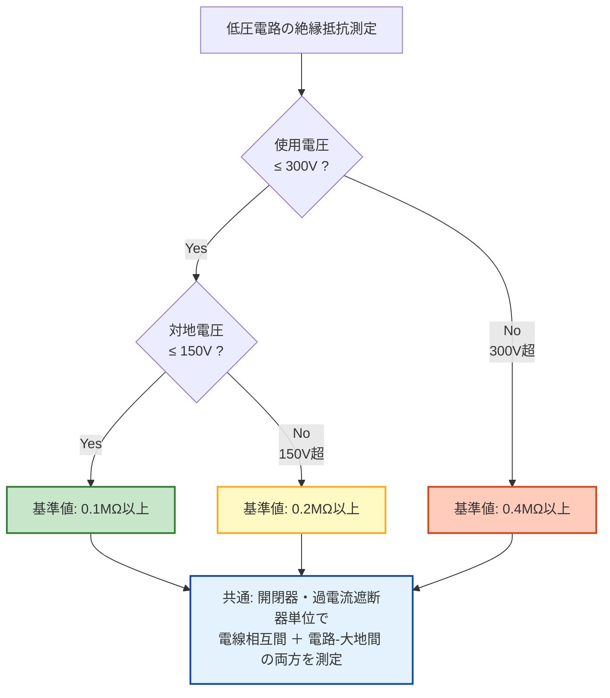

# 電技省令 第58条 — 低圧の電路の絶縁性能

!!! note "📊 試験対策メタ"
    **出題頻度**: 🔥 ★☆☆☆☆（過去14年で 6 回出題）

    **重要度**: A（重要必須・数値暗記の核心）

    **直近出題**: H26 問6（正誤）／関連: R02 問3・R06上 問8・R07上 問3・R07下 問5（絶縁性能テーマ）

> 電気使用場所における使用電圧が低圧の電路の電線相互間及び電路と大地との間の絶縁抵抗は、**開閉器又は過電流遮断器で区切ることのできる電路ごと**に、次の表に掲げる値以上でなければならない。**0.1MΩ／0.2MΩ／0.4MΩ** の3段階基準値の暗記と、その**因果（漏洩電流1mA以下に保つ設計）**が試験の核心。

| 項目 | 内容 |
|------|------|
| 条文 | 電気設備に関する技術基準を定める省令 第58条 |
| 規定内容 | 低圧電路の絶縁抵抗値の基準（3段階：0.1／0.2／0.4MΩ） |
| 性格 | 数値規定（省令本文に直接数値が記載されている例外条文） |
| 委任先 | 解釈第14条（測定方法・代替手段＝漏えい電流1mA以下の同等性） |
| 上位 | 省令第5条（電路の絶縁原則） |

---

## 1. 5秒で思い出す（全体像と要点）

### ⚡ 5秒で思い出す（核心ポイント）

- **対地電圧≦150V → 0.1MΩ**、その他 0.2MΩ、**300V超 → 0.4MΩ**（数値の核心）
- **「区切ることのできる電路ごと」** = 開閉器/遮断器単位で測定（電路全体ではない）
- 測定方向は **電線相互間 ＋ 電路と大地との間** の **両方**
- 測定方法：電路を無電圧に → メガー（**直流500V** 印加・1分以上）で測定
- なぜ段階的か：**漏洩電流を 1mA以下** に保つ設計（電圧2倍 → 抵抗も2倍）
- 省令第58条 = 数値規定／解釈第14条 = 測定方法 + 代替手段（漏えい電流1mA以下）

### ① 全体像 — 第58条の位置づけ

<svg viewBox="0 0 800 360" xmlns="http://www.w3.org/2000/svg" style="width:100%;max-width:800px"><defs><filter id="sh58" x="-20%" y="-20%" width="140%" height="140%"><feDropShadow dx="0" dy="2" stdDeviation="2" flood-opacity="0.15"/></filter><linearGradient id="gA58" x1="0" y1="0" x2="0" y2="1"><stop offset="0%" stop-color="#c8e6c9"/><stop offset="100%" stop-color="#a5d6a7"/></linearGradient><linearGradient id="gB58" x1="0" y1="0" x2="0" y2="1"><stop offset="0%" stop-color="#fff9c4"/><stop offset="100%" stop-color="#fff176"/></linearGradient><linearGradient id="gC58" x1="0" y1="0" x2="0" y2="1"><stop offset="0%" stop-color="#ffccbc"/><stop offset="100%" stop-color="#ff8a65"/></linearGradient><linearGradient id="gMain58" x1="0" y1="0" x2="0" y2="1"><stop offset="0%" stop-color="#bbdefb"/><stop offset="100%" stop-color="#90caf9"/></linearGradient></defs><text x="400" y="26" text-anchor="middle" font-size="15" font-weight="700" fill="#212121">⚡ 第58条 — 3段階の絶縁抵抗基準値</text><text x="400" y="44" text-anchor="middle" font-size="11" fill="#666">電圧が高いほど厳しい基準（漏洩電流1mA以下を保つ設計）</text><rect x="280" y="60" width="240" height="60" rx="12" fill="url(#gMain58)" stroke="#0d47a1" stroke-width="2.5" filter="url(#sh58)"/><text x="400" y="85" text-anchor="middle" font-size="14" font-weight="800" fill="#0d47a1">省令第58条</text><text x="400" y="105" text-anchor="middle" font-size="11" fill="#1565c0">低圧電路の絶縁性能</text><rect x="40" y="160" width="220" height="160" rx="14" fill="url(#gA58)" stroke="#2e7d32" stroke-width="2.5" filter="url(#sh58)"/><text x="150" y="186" text-anchor="middle" font-size="13" font-weight="700" fill="#1b5e20">🟢 ゾーン1（最低）</text><line x1="60" y1="196" x2="240" y2="196" stroke="#2e7d32" stroke-width="1"/><text x="150" y="218" text-anchor="middle" font-size="11" fill="#1b5e20">使用電圧 300V以下</text><text x="150" y="236" text-anchor="middle" font-size="11" fill="#1b5e20">かつ 対地電圧 150V以下</text><text x="150" y="270" text-anchor="middle" font-size="22" font-weight="800" fill="#1b5e20" class="omega">0.1M&#x3A9;</text><text x="150" y="296" text-anchor="middle" font-size="10" fill="#2e7d32">単相100V／三線式100V側</text><rect x="290" y="160" width="220" height="160" rx="14" fill="url(#gB58)" stroke="#f9a825" stroke-width="2.5" filter="url(#sh58)"/><text x="400" y="186" text-anchor="middle" font-size="13" font-weight="700" fill="#f57f17">🟡 ゾーン2（中間）</text><line x1="310" y1="196" x2="490" y2="196" stroke="#f9a825" stroke-width="1"/><text x="400" y="218" text-anchor="middle" font-size="11" fill="#f57f17">使用電圧 300V以下</text><text x="400" y="236" text-anchor="middle" font-size="11" fill="#f57f17">かつ 対地電圧 150V超</text><text x="400" y="270" text-anchor="middle" font-size="22" font-weight="800" fill="#f57f17" class="omega">0.2M&#x3A9;</text><text x="400" y="296" text-anchor="middle" font-size="10" fill="#f9a825">単相200V／三相200V</text><rect x="540" y="160" width="220" height="160" rx="14" fill="url(#gC58)" stroke="#d84315" stroke-width="2.5" filter="url(#sh58)"/><text x="650" y="186" text-anchor="middle" font-size="13" font-weight="700" fill="#bf360c">🔴 ゾーン3（最高）</text><line x1="560" y1="196" x2="740" y2="196" stroke="#d84315" stroke-width="1"/><text x="650" y="218" text-anchor="middle" font-size="11" fill="#bf360c">使用電圧 300V超</text><text x="650" y="236" text-anchor="middle" font-size="11" fill="#bf360c">（低圧上限まで）</text><text x="650" y="270" text-anchor="middle" font-size="22" font-weight="800" fill="#bf360c" class="omega">0.4M&#x3A9;</text><text x="650" y="296" text-anchor="middle" font-size="10" fill="#d84315">三相400V級</text><line x1="400" y1="125" x2="150" y2="155" stroke="#0d47a1" stroke-width="1.5" stroke-dasharray="3,2"/><line x1="400" y1="125" x2="400" y2="155" stroke="#0d47a1" stroke-width="1.5" stroke-dasharray="3,2"/><line x1="400" y1="125" x2="650" y2="155" stroke="#0d47a1" stroke-width="1.5" stroke-dasharray="3,2"/><text x="400" y="345" text-anchor="middle" font-size="11" font-weight="700" fill="#0d47a1">⚖️ 共通: 開閉器・過電流遮断器で区切れる電路ごとに測定</text></svg>

**読み解き**: 電圧区分は **2軸**（使用電圧 300V境界 ＋ 対地電圧 150V境界）で 3 ゾーンに分かれる。電圧が高いほど絶縁抵抗の基準値も厳しくなる（=2倍／4倍）。これは **漏洩電流を 1mA以下に保つための設計**（後述§4参照）。

### ② 要点（試験前30秒復習用）

| 観点 | 内容 |
|------|------|
| **数値の核心** | **0.1 ／ 0.2 ／ 0.4 MΩ** の3段階 |
| **境界値** | **使用電圧 300V** ／ **対地電圧 150V** |
| **測定単位** | **開閉器又は過電流遮断器で区切れる電路ごと**（電路全体ではない） |
| **測定箇所** | **電線相互間**（相間） ＋ **電路と大地との間**（対地）の **両方** |
| **省令と解釈** | 省令 = 数値規定（0.1/0.2/0.4MΩ）／解釈第14条 = 測定方法＋代替手段（漏えい電流1mA以下） |

??? question "セルフチェック: なぜ「対地電圧150V以下」で0.1MΩなのか？"
    オームの法則 **I_leak = V / R_insulation** に基づく。

    対地電圧 100V、絶縁抵抗 0.1MΩ の場合：
    **I_leak = 100V / (0.1 × 10⁶ Ω) = 1.0mA**

    解釈第14条第1項第二号で「**漏えい電流が 1mA以下**であれば省令第58条の絶縁抵抗値と同等以上の絶縁性能を有しているとみなす」と規定。3段階の基準値は **どの電圧帯でも漏洩電流が概ね1mA以下に収まる** ように設計されている。

??? question "セルフチェック: 単相三線式100/200Vの分電盤で測定するとき、基準値はどう変わる？"
    同じ盤でも回路によって基準値が異なる：

    - **100V回路**（端子R-N間）: 対地電圧 ≤ 100V → **0.1MΩ** 以上
    - **200V回路**（端子R-T間）: 対地電圧 = 200V → **0.2MΩ** 以上

    1つの分電盤を一括測定するのではなく、ブレーカー単位で個別測定する。

---

## 2. 条文原文

**電気設備に関する技術基準を定める省令 第58条（低圧の電路の絶縁性能）**

> 電気使用場所における<mark>使用電圧</mark>が低圧の電路の<mark>電線相互間</mark>及び<mark>電路と大地との間</mark>の<mark>絶縁抵抗</mark>は、<mark>開閉器</mark>又は<mark>過電流遮断器</mark>で区切ることのできる電路ごとに、次の表の上欄に掲げる電路の使用電圧の区分に応じ、それぞれ同表の下欄に掲げる値以上でなければならない。

> <small>🟡 黄色マーカー = 過去問で穴埋め出題された語句（H26 問6・R02 問3・R06上 問8・R07上 問3・R07下 問5）</small>

| 電路の使用電圧の区分 | 絶縁抵抗値 |
|---|---|
| **300V以下** ・ 対地電圧（接地式電路においては電線と大地との間の電圧、非接地式電路においては電線間の電圧をいう。以下同じ。）が **150V以下** の場合 | **0.1MΩ** |
| **300V以下** ・ その他の場合 | **0.2MΩ** |
| **300Vを超えるもの** | **0.4MΩ** |

→ 「区切ることのできる電路ごと」= **開閉器・過電流遮断器単位**で測定する。電路全体を一括測定するのではない。条文は本表の値を**最低基準**として規定し、これ以上の絶縁抵抗を保つことを義務付ける。

### 過去問で問われた箇所

| 順 | 原文の語句 | 過去問での扱い | 出題年 |
|---|---|---|---|
| ア | **使用電圧** | 穴埋め選択肢 | H26 問6・R02 問3・R06上 問8・R07上 問3・R07下 問5 |
| イ | **電線相互間** | 穴埋め選択肢 | 同上 |
| ウ | **電路と大地との間** | 穴埋め選択肢 | 同上 |
| エ | **絶縁抵抗** | 穴埋め選択肢 | 同上 |
| オ | **開閉器** ／ **過電流遮断器** | 区切り単位の穴埋め | 同上 |
| カ | **0.1MΩ** ／ **0.2MΩ** ／ **0.4MΩ** | **核心数値の穴埋め** | 同上 |
| キ | **150V** ／ **300V** | **境界値の穴埋め** | 同上 |
| ク | **対地電圧** | 用語の穴埋め | 同上 |

※ 過去14年で計6件出題（H24 問5論説／H26 問6・R02 問3・R06上 問8・R07上 問3・R07下 問5 穴埋）。**最頻出条文の一つ**。
※ 実空欄は電験王3等で要再確認。

!!! tip "🎯 暗記の核心キーワード"
    - **0.1MΩ ／ 0.2MΩ ／ 0.4MΩ**（絶縁抵抗値の3段階）
    - **150V／300V**（電圧の境界値）
    - **対地電圧** = 接地式は電線-大地間、非接地式は電線間
    - **開閉器又は過電流遮断器で区切ることのできる電路ごと** に測定（核心の手続規定）
    - **電線相互間** ＋ **電路と大地との間** の2方向を測定

!!! note "出典"
    電気設備に関する技術基準を定める省令（平成九年通商産業省令第五十二号、令和5年改正版）第58条 — 数値は本省令本文に直接規定（電技解釈第14条はこれに対する解釈・代替手段を定める）

---

## 3. 原文解析（ブロック分解）

条文を意味ブロック単位に分解し、それぞれの試験ポイントを整理する。

| 原文ブロック | 意味 | 試験のポイント |
|---|---|---|
| 「電気使用場所における使用電圧が低圧の電路の」 | 適用範囲＝**低圧電路**（交流600V以下／直流750V以下） | 高圧電路は対象外（→ 解釈第15条） |
| 「電線相互間及び電路と大地との間の絶縁抵抗は」 | 測定対象は **2方向**（相間＋対地） | 「相互間だけ」「大地との間だけ」は誤り。**両方必須** |
| 「開閉器又は過電流遮断器で区切ることのできる電路ごとに」 | 測定単位＝**ブレーカー単位**の分割電路 | 「電路全体で1回」は誤り。**個別測定** |
| 「次の表に掲げる値以上でなければならない」 | **最低基準**としての義務 | 「以上」が必須。「以下」「未満」は誤り |
| 「300V以下・対地電圧150V以下 → 0.1MΩ」 | ゾーン1（最緩） | 単相100V／三線式100V側 |
| 「300V以下・その他 → 0.2MΩ」 | ゾーン2（中間） | 単相200V／三相200V |
| 「300Vを超えるもの → 0.4MΩ」 | ゾーン3（最厳） | 三相400V級 |

??? question "セルフチェック: 「電線相互間だけ測定して、電路と大地との間は省略」は条文上アリか？"
    **誤り**。条文は「電線相互間 **及び** 電路と大地との間」と並列で規定しており、両方を測定する義務がある。

    実務でも、相間絶縁が良好でも対地絶縁が劣化していれば地絡事故の原因になるため、両方の確認が不可欠。

---

## 4. かみ砕き解説（因果理解）

### なぜ段階的な基準値か — 漏洩電流の危険性が電圧に比例

オームの法則より：

$$I_{leak} = \frac{V_{phase}}{R_{insulation}}$$

**例**:

- 対地100V、R = 0.1MΩ → I = 100V / (0.1 × 10⁶) = **1mA**（許容範囲）
- 対地200V、R = 0.1MΩ → I = 200V / (0.1 × 10⁶) = **2mA**（高くなる→危険）

同じ絶縁抵抗でも電圧が2倍 → 漏洩電流が2倍 → より厳格な基準が必要。

### 設定値の根拠（解釈第14条第1項第二号）

| 基準値 | 公式根拠 | 物理計算（参考） |
|------|-----------|----------|
| **0.1MΩ@対地100V** | 漏えい電流 **1mA**（公式の基準ケース） | I = 100V / 0.1MΩ = **1.0mA** |
| **0.2MΩ@対地200V** | 1mA以下（公式基準） | I = 200V / 0.2MΩ = **1.0mA** |
| **0.4MΩ@対地300V超** | 1mA以下（公式基準） | I = 300V / 0.4MΩ = **0.75mA** |

**公式基準の核心**：解釈第14条第1項第二号により「**漏えい電流が 1mA以下**であれば省令第58条の絶縁抵抗値と同等以上の絶縁性能を有しているとみなす」と規定。**法令上の許容漏えい電流は 1mA**（1.5mA ではない）。

出典：電気設備の技術基準の解釈（令和7年11月版）第14条第1項第二号 / 電気設備に関する技術基準を定める省令の解説（令和7年11月版）。

!!! tip "暗記のコツ"
    「なぜ0.1MΩ、0.2MΩ、0.4MΩなのか」→ **漏洩電流を概ね1mA以下に保つため**。

    電圧が2倍 → 絶縁抵抗も2倍にする（0.1 → 0.2MΩ）。これが3段階基準値の物理的な根拠。

### 対地電圧の判定方法

| 電路種別 | 対地電圧 | 適用基準 |
|--------|---------|--------|
| **単相100/200V（三線式）** | 低圧側：100V | **0.1MΩ** |
| 同上 | 高圧側：200V | **0.2MΩ** |
| **三相200V（中性点非接地）** | 線間電圧＝対地電圧扱い | **0.2MΩ** |
| **三相400V級** | 該当なし（低圧範囲内・対地300V超） | **0.4MΩ** |

!!! warning "ひっかけ：「電路全体で一度測定すればOK」"
    **誤り**。「開閉器又は過電流遮断器で区切ることのできる電路ごと」と明記。

    複数の分岐回路がある場合：

    - 各分岐ごとに測定
    - 遮断器でまとめて測定する場合と、個別に測定する場合がある

    どの単位で切るかが重要。

---

## 5. 図で理解

### 判定フロー（基準値の選び方）

### 漏洩電流と絶縁抵抗の関係（オームの法則）

<svg viewBox="0 0 800 320" xmlns="http://www.w3.org/2000/svg" style="width:100%;max-width:800px"><defs><filter id="shL58" x="-20%" y="-20%" width="140%" height="140%"><feDropShadow dx="0" dy="2" stdDeviation="2" flood-opacity="0.15"/></filter><linearGradient id="gridL58" x1="0" y1="0" x2="0" y2="1"><stop offset="0%" stop-color="#e3f2fd"/><stop offset="100%" stop-color="#bbdefb"/></linearGradient></defs><text x="400" y="26" text-anchor="middle" font-size="15" font-weight="700" fill="#212121">⚡ 漏洩電流 I = V / R — 1mA基準ライン</text><text x="400" y="44" text-anchor="middle" font-size="11" fill="#666">電圧が高いほど絶縁抵抗を厳しく → 漏洩電流を概ね1mA以下に維持</text><line x1="80" y1="260" x2="740" y2="260" stroke="#424242" stroke-width="2"/><line x1="80" y1="60" x2="80" y2="260" stroke="#424242" stroke-width="2"/><text x="410" y="290" text-anchor="middle" font-size="11" font-weight="600" fill="#424242">電圧 V (V)</text><text x="50" y="160" text-anchor="middle" font-size="11" font-weight="600" fill="#424242" transform="rotate(-90 50 160)">漏洩電流 I (mA)</text><line x1="80" y1="150" x2="740" y2="150" stroke="#d32f2f" stroke-width="1.5" stroke-dasharray="6,3"/><text x="730" y="143" text-anchor="end" font-size="11" font-weight="700" fill="#d32f2f">⚠ 1mA 基準ライン</text><line x1="270" y1="260" x2="270" y2="60" stroke="#9e9e9e" stroke-width="1" stroke-dasharray="3,3"/><text x="270" y="275" text-anchor="middle" font-size="10" fill="#616161">150V</text><line x1="500" y1="260" x2="500" y2="60" stroke="#9e9e9e" stroke-width="1" stroke-dasharray="3,3"/><text x="500" y="275" text-anchor="middle" font-size="10" fill="#616161">300V</text><circle cx="190" cy="150" r="9" fill="#2e7d32" stroke="#1b5e20" stroke-width="2"/><text x="195" y="125" text-anchor="middle" font-size="11" font-weight="700" fill="#1b5e20">対地100V</text><text x="195" y="113" text-anchor="middle" font-size="10" fill="#1b5e20" class="omega">R=0.1M&#x3A9; → I=1.0mA</text><circle cx="395" cy="150" r="9" fill="#f57f17" stroke="#e65100" stroke-width="2"/><text x="395" y="125" text-anchor="middle" font-size="11" font-weight="700" fill="#e65100">対地200V</text><text x="395" y="113" text-anchor="middle" font-size="10" fill="#e65100" class="omega">R=0.2M&#x3A9; → I=1.0mA</text><circle cx="585" cy="180" r="9" fill="#bf360c" stroke="#bf360c" stroke-width="2"/><text x="585" y="205" text-anchor="middle" font-size="11" font-weight="700" fill="#bf360c">対地300V</text><text x="585" y="220" text-anchor="middle" font-size="10" fill="#bf360c" class="omega">R=0.4M&#x3A9; → I=0.75mA</text><path d="M 190 150 Q 290 150 395 150 Q 490 165 585 180" stroke="#0d47a1" stroke-width="2.5" fill="none"/><rect x="120" y="60" width="100" height="50" rx="6" fill="#c8e6c9" stroke="#2e7d32" stroke-width="1.5"/><text x="170" y="80" text-anchor="middle" font-size="10" font-weight="700" fill="#1b5e20">ゾーン1</text><text x="170" y="95" text-anchor="middle" font-size="10" fill="#1b5e20" class="omega">0.1M&#x3A9;</text><rect x="305" y="60" width="100" height="50" rx="6" fill="#fff9c4" stroke="#f9a825" stroke-width="1.5"/><text x="355" y="80" text-anchor="middle" font-size="10" font-weight="700" fill="#f57f17">ゾーン2</text><text x="355" y="95" text-anchor="middle" font-size="10" fill="#f57f17" class="omega">0.2M&#x3A9;</text><rect x="540" y="60" width="100" height="50" rx="6" fill="#ffccbc" stroke="#d84315" stroke-width="1.5"/><text x="590" y="80" text-anchor="middle" font-size="10" font-weight="700" fill="#bf360c">ゾーン3</text><text x="590" y="95" text-anchor="middle" font-size="10" fill="#bf360c" class="omega">0.4M&#x3A9;</text></svg>

**読み解き**: 各ゾーンで「**電圧／絶縁抵抗 = 漏洩電流**」を計算すると、いずれも **1mA以下**（基準ケースでは概ね1mA）になる。これが3段階基準値の物理的根拠。

---

## 6. 測定方法と手順

### Step 1: 測定対象の確認

**「開閉器又は過電流遮断器で区切ることのできる電路ごと」**

例：

- 配電盤の各分岐ブレーカーを OFF に
- 各分岐単位で測定（同時測定でなく順次）

### Step 2: 無電圧確認

- テスター等で両端無電圧を確認
- 誘導による虚偽検出を避ける（低圧でも厳格に）

### Step 3: メガー測定

- **メガーオーム計（絶縁抵抗計）** 使用（**直流500V印加が標準**・JIS C 1302、低圧電路150V以下なら250Vも可）。1000V/2500V は高圧機器専用
- 「相互間」（相間）と「相〜大地間」（対地）を分けて測定
- 測定時間：**1分以上**（安定値確認）

!!! warning "測定時の注意"
    - **充電部（コンデンサ）がある場合**: 放電後、安定を待つ
    - **接地抵抗の影響**: 対地電圧の判定に関わるため、接地点の確認
    - **温度の影響**: 絶縁抵抗は温度に依存（暖かいと低下）

### Step 4: 記録・判定

| 測定値 | 判定 | 処置 |
|------|------|------|
| ≥ 基準値 | ◎ 合格 | 運用開始OK |
| 基準値の80〜99% | △ 注視 | 経過観察、定期測定 |
| < 80% | × 不合格 | 原因調査、改修 |

---

## 7. 省令（第58条）と解釈（第14条）の関係

### 省令第58条（原則・数値）

「電路の絶縁抵抗は基準値以上であれ」 → **0.1／0.2／0.4MΩ** を本文で直接規定

### 解釈第14条（実装・代替手段）

- 測定対象の明確化（開閉器単位）
- 測定方法（メガー、1分以上）
- 判定基準の補足
- **代替手段**: 漏えい電流 **1mA以下** であれば絶縁抵抗値と同等以上の絶縁性能とみなす
- 不合格時の対応（30日以内改修等）

!!! note "上位法と下位法の関係"
    試験では：

    - 「絶縁抵抗 **0.1MΩ**」→ **省令第58条**の数値
    - 「メガーで測定」「漏えい電流 **1mA以下**」→ **解釈第14条**の方法・代替手段

    両方が出題される場合、「省令で数値、解釈で測定方法・代替」と分離される。

---

## 8. 頻出ひっかけ・落とし穴

1. 🔴 **「低圧は一律0.1MΩ」** → 誤り。対地電圧150V以下**だけ**が0.1MΩ
2. 🔴 **「電路全体で一度測定すればいい」** → 誤り。開閉器/遮断器単位で個別測定
3. 🔴 **「電線相互間 **だけ** 測定すればOK」** → 誤り。**相互間 ＋ 対地間** の両方が必須
4. 🟡 **「0.2MΩと0.4MΩの区分は使用電圧で決まる」** → 半正解。正確には「使用電圧 **300V** 境界＋対地電圧 **150V** 境界」の2軸
5. 🟡 **「漏えい電流 1.5mA以下なら同等」** → 誤り。解釈第14条の公式基準は **1mA以下**
6. 🟡 **「絶縁抵抗が基準値なら絶対安全」** → 誤り。劣化の傾向観察も重要
7. 🟢 **「メガー測定は数秒でいい」** → 誤り。**1分以上**の安定値を確認
8. 🟢 **「メガーは1000V/2500Vが標準」** → 誤り。低圧電路は **直流500V** が標準（JIS C 1302）

---

## 9. 穴埋め過去問チャレンジ

!!! abstract "問題1: 第58条 本文の穴埋め（H26問6・R02問3系列）"
    電気使用場所における（　ア　）が低圧の電路の（　イ　）及び電路と（　ウ　）との間の（　エ　）は、（　オ　）又は（　カ　）で区切ることのできる電路ごとに、次の表の上欄に掲げる電路の使用電圧の区分に応じ、それぞれ同表の下欄に掲げる値以上でなければならない。

??? success "解答"
    - ア = **使用電圧**
    - イ = **電線相互間**
    - ウ = **大地**
    - エ = **絶縁抵抗**
    - オ = **開閉器**
    - カ = **過電流遮断器**

    **ポイント**: 「電線相互間 **及び** 電路と大地との間」の **両方** が並列で書かれていることに注意。片方だけ覚えていると失点する。

!!! abstract "問題2: 基準値の穴埋め"
    使用電圧が300V以下で対地電圧が150V以下の場合は（　ア　）MΩ、300V以下でその他の場合は（　イ　）MΩ、300Vを超えるものは（　ウ　）MΩ以上の絶縁抵抗を保たなければならない。

??? success "解答"
    - ア = **0.1**
    - イ = **0.2**
    - ウ = **0.4**

    **暗記法**: 「**1, 2, 4**」と倍々で覚える。電圧が2倍になれば絶縁抵抗も2倍 → 漏洩電流を1mA以下に維持する設計。

!!! abstract "問題3: 解釈第14条との関連（応用）"
    省令第58条で定める絶縁抵抗値の代わりに、漏えい電流が（　ア　）mA以下であることを確認すれば、第58条の絶縁抵抗値と同等以上の絶縁性能を有しているものとみなされる。これは電技解釈第（　イ　）条に規定されている。

??? success "解答"
    - ア = **1**
    - イ = **14**

    **ひっかけ注意**: 1.5mA や 2mA ではない。公式基準は **1mA以下**（解釈第14条第1項第二号）。

---

## 10. まぎらわしい選択肢と正解の違い

| 誤った記述 | 正しい記述 | なぜ違うか |
|---|---|---|
| 「低圧電路の絶縁抵抗は一律 0.1MΩ 以上」 | 使用電圧と対地電圧で **3段階**（0.1／0.2／0.4MΩ） | 一律規定ではなく **電圧区分による段階規定** |
| 「電線相互間の絶縁抵抗のみ測定する」 | **電線相互間 ＋ 電路と大地との間** の両方を測定 | 条文は両方を **並列で要求**（「及び」） |
| 「電路全体を一括測定する」 | **開閉器又は過電流遮断器で区切られた電路ごと** に測定 | 区分単位の測定が必須 |
| 「使用電圧 150V 以下なら 0.1MΩ」 | **使用電圧 300V以下 かつ 対地電圧 150V以下** で 0.1MΩ | 「使用電圧」と「対地電圧」の **2軸** で判定 |
| 「漏えい電流 1.5mA 以下で同等とみなす」 | **1mA以下** で同等とみなす（解釈第14条） | 公式基準は **1mA**。1.5mA は誤記 |
| 「省令第58条で測定方法（メガー使用等）が規定されている」 | 省令第58条は **数値規定**、測定方法は **解釈第14条** | 上位法（省令）= 数値、下位法（解釈）= 方法 |
| 「メガーは1000V印加が標準」 | 低圧電路は **直流500V** が標準（JIS C 1302） | 1000V/2500V は高圧機器専用 |

---

## 11. 関連条文・関連ページ

- [電技省令 第5条：電路の絶縁原則](5.md) — **上位条文**（絶縁原則と例外）
- [電技省令 第56条：配線の感電・火災防止](56.md) — 配線設計（上流側）と絶縁性能の関係
- [電技解釈 第14条：低圧電路の絶縁性能](../kaishaku/14.md) — **委任先**（具体的な測定方法・代替手段＝漏えい電流1mA以下）
- 電技解釈 第15条：高圧・特別高圧電路の絶縁性能 — 高圧版（耐圧試験） <!-- [要確認]: kaishaku/15.md は未作成 -->
- 電技解釈 第158条：絶縁耐力試験 — 竣工時の耐圧試験 <!-- [要確認]: kaishaku/158.md は未作成 -->
- [絶縁性能テーマ](../../themes/zetsuen.md) — 省令全体の絶縁基準横展開

---

## 12. 過去問実績

| 年度 | 問 | 形式 | 論点 |
|------|-----|------|------|
| H24 | 問5 | 論説 | 低圧電路の絶縁性能 |
| H26 | 問6 | 正誤 | 低圧電路の絶縁性能（0.1MΩ vs 0.2MΩ） |
| R02 | 問3 | 穴埋 | 第58条本文（絶縁性能テーマ） |
| R06上 | 問8 | 穴埋 | 絶縁性能関連（要再確認） |
| R07上 | 問3 | 穴埋 | 絶縁性能関連（要再確認） |
| R07下 | 問5 | 穴埋 | 絶縁性能関連（要再確認） |

!!! warning "出題パターンの注意"
    by-field.mdの「絶縁性能」カテゴリにはR06上問8・R07上問3・R07下問5もあるが、第5条（電路の絶縁）との区分を要確認。

!!! note "R08 出題予測"
    「対地電圧150V以下なら0.1MΩ」というひっかけが定番。絶縁性能テーマ全体では出題頻度は高い。**3段階基準値（0.1/0.2/0.4MΩ）の数値暗記＋電線相互間/対地間の両方測定** の2点は必ず押さえる。

---

## 13. 最終チェック

### 数値暗記

- [ ] **0.1MΩ** = 使用電圧 300V以下 かつ 対地電圧 150V以下
- [ ] **0.2MΩ** = 使用電圧 300V以下 かつ 対地電圧 150V超
- [ ] **0.4MΩ** = 使用電圧 300V超
- [ ] 境界値 = **使用電圧 300V** ／ **対地電圧 150V**
- [ ] 漏えい電流の同等基準（解釈第14条） = **1mA以下**

### 条文キーワード

- [ ] **使用電圧** ／ **電線相互間** ／ **電路と大地との間** ／ **絶縁抵抗**
- [ ] **開閉器又は過電流遮断器で区切ることのできる電路ごと** に測定
- [ ] **対地電圧** = 接地式は電線-大地間／非接地式は電線間

### 因果理解

- [ ] なぜ段階的か = **漏洩電流を概ね1mA以下に保つため**（I = V/R）
- [ ] 電圧2倍 → 絶縁抵抗も2倍 → 漏洩電流が一定

### 法令体系

- [ ] **省令第58条** = 数値規定（0.1／0.2／0.4MΩ）
- [ ] **解釈第14条** = 測定方法 ＋ 代替手段（漏えい電流1mA以下）
- [ ] 上位 = **省令第5条**（電路の絶縁原則）

### 測定実務

- [ ] メガー印加電圧 = 低圧電路は **直流500V**（JIS C 1302、150V以下は250Vも可）
- [ ] 測定時間 = **1分以上**（安定値確認）
- [ ] 測定箇所 = **相互間 ＋ 対地間** の両方

### ひっかけ対策

- [ ] 「電路全体で一括測定」は誤り → ブレーカー単位
- [ ] 「電線相互間だけ」は誤り → 対地間も必須
- [ ] 「漏えい電流 1.5mA」は誤り → **1mA**

---

## 監修ログ

- **2026-05-02**: DENKEN-WIKI監修部による初回三段監修（不動・江間・早川）。**江間が令和7年11月版電技解釈第14条PDFと照合 → 致命的誤記2件発見**：(1) 印加電圧「**通常1500Vdc印加**」→ JIS C 1302・低圧電路用標準の**直流500V**に修正（1500Vは低圧電路に印加すると絶縁破壊リスクあり）、(2) 設定値根拠表の漏えい電流許容値「**1.5mA**」→ 公式基準の**1mA以下**に修正（解釈第14条第1項第二号「漏えい電流が1mA以下の場合は省令第58条で定める絶縁抵抗値の基準と同等以上の絶縁性能を有しているものとみなす」が公式根拠）。絶縁抵抗値表に出典セル（令和7年11月版）を付与。早川が実装型B標準16セクションに対し11セクションのみ・視覚要素ゼロ・法規特有表現ブロックA/B/C/D完全欠落を検出。**数値検証判定: CONDITIONAL PASS**（致命数値2件は当セッションで修正済、構造改善は別セッション）
- **2026-05-04**: テンプレート構造適合化（v1.2）。kijun/5.md ゴールドスタンダードに準拠して **5つの欠落セクションを追加**：(1) §3 原文解析（ブロック分解テーブル）、(2) §5 図で理解（SVG×1 + Mermaid判定フロー×1）、(3) §9 穴埋め過去問チャレンジ（!!!abstract + ???success ×3問）、(4) §10 まぎらわしい選択肢と正解の違い（誤答/正答/理由テーブル）、(5) §13 最終チェック（分類別チェックボックス）。形式調整：セクション番号 §1〜§13 を付与、条文原文に `<mark>` マーカー追加、セルフチェックを §1・§3 に分散配置、概要テーブルを冒頭に移動。**既存の高品質コンテンツ（江間監修済の数値・出典セル・因果理解・監修ログ）はすべて保持**
- **本記事は56.md事故と同質の数値誤記事故（1500Vdc / 1.5mA）の発見事例**として §7.5 過去事故への追記候補

---

*最終確認: 2026-05-04 | 数値検証完了: 2026-05-02（CONDITIONAL PASS・致命数値2件修正済） | ステータス: v1.2（テンプレート13セクション完備・SVG/Mermaid追加・穴埋めチャレンジ追加） | [バージョニング基準](../../reference/versioning.md)*
