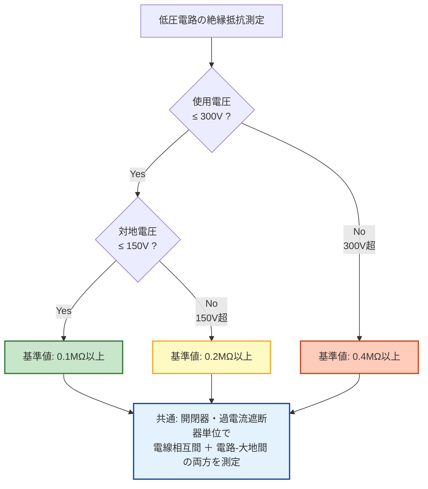

# 電技省令 第58条 — 低圧の電路の絶縁性能

!!! note "📊 概要"
    **出題頻度**: 🔥🔥🔥🔥🔥（過去14年で 6 回出題・最頻出条文の一つ）

    **重要度**: A（重要必須・数値暗記の核心）

    **直近出題**: R07下 問5（穴埋）／R07上 問3（穴埋）／R06上 問8（穴埋）／R02 問3（穴埋）／H26 問6（穴埋）／H24 問5（論説）

> 電気使用場所における使用電圧が低圧の電路の電線相互間及び電路と大地との間の絶縁抵抗は、**開閉器又は過電流遮断器で区切ることのできる電路ごと**に、次の表に掲げる値以上でなければならない。**0.1**MΩ／**0.2**MΩ／**0.4**MΩ の3段階基準値の暗記と、その**因果（漏洩電流1mA以下に保つ設計）**が試験の核心。

| 項目 | 内容 |
|------|------|
| 条文 | 電気設備に関する技術基準を定める省令 第58条 |
| 規定内容 | 低圧電路の絶縁抵抗値の基準（3段階：0.1／0.2／0.4MΩ） |
| 性格 | 数値規定（省令本文に直接数値が記載されている例外条文） |
| 委任先 | 解釈第14条（測定方法・代替手段＝漏えい電流1mA以下の同等性） |
| 上位 | 省令第5条（電路の絶縁原則） |
| **典拠（一次ソース）** | 電気設備に関する技術基準を定める省令（令和5年改正版）第58条 ／ 電気設備の技術基準の解釈（令和7年11月版）第14条 |
| **照合日** | 2026-05-02（江間が令和7年11月版電技解釈第14条PDFと照合） |
| **隣接条文** | ← [省令第57条（配線の使用電線）](57.md) ／ [省令第59条（機械器具の感電・火災防止）](59.md) → |

---

## ★0. 隣接条文クラスタマップ — 第3章 電気使用場所の施設

!!! tip "なぜこのマップを冒頭に置くか"
    試験では「58条単独」より **「56〜59条の差分を問う複合問題」** が頻出。58条の核心は「絶縁抵抗値」だが、隣接条文との **棲み分け** を最初に整理することで、複合問題で混同しない土台を作る。

### 第3章 電気使用場所の施設・絶縁系条文の差分

| 条文 | 規制対象 | 数値の核心 | 試験での問われ方 |
|------|---------|-----------|------------------|
| 第56条 | 配線の感電・火災防止（原則） | — | 上位原則として参照 |
| 第57条 | 配線の使用電線（電線の種類・太さ） | 電線サイズ | 単独出題 |
| **第58条** | **低圧電路の絶縁性能** | **0.1／0.2／0.4 MΩ** | **絶縁抵抗値の3段階暗記が核心** |
| 第59条 | 機械器具の感電・火災防止 | — | 機械器具の絶縁・接地と組合せ |

### 58条の独自性
- **省令本文に数値が直接記載** されている稀有な条文（多くの条文は数値を解釈に委任）
- **対地電圧** で3段階に分岐（150V／150V超300V以下／300V超）
- **解釈第14条** で漏えい電流1mA以下の代替手段が示される（省令と解釈で **役割分担** が明確）

### 複合問題の典型パターン
1. **境界判定型**: 「対地電圧180Vの単相3線式電路の絶縁抵抗は何MΩ以上？」 → 0.2MΩ（150V超かつ300V以下）
2. **手段差替型**: 「絶縁抵抗測定が困難な場合は何を確認すれば足りるか」 → 漏えい電流1mA以下（解釈第14条）
3. **測定単位型**: 「絶縁抵抗測定の単位電路は何で区切るか」 → 開閉器又は過電流遮断器

---

## 1. 全体像と要点

- **対地電圧≦150V → 0.1**MΩ、その他 0.2MΩ、**300V超 → 0.4**MΩ（数値の核心）
- **「区切ることのできる電路ごと」** = 開閉器/過電流遮断器（ブレーカー）単位で測定（電路全体ではない）
- 測定方向は **電線相互間 ＋ 電路と大地との間** の **両方**
- 測定方法：電路を無電圧に → メガー（**直流500V** 印加・1分以上）で測定
- なぜ段階的か：**漏洩電流を 1mA以下** に保つ設計（電圧2倍 → 抵抗も2倍）
- 省令第58条 = 数値規定／解釈第14条 = 測定方法 + 代替手段（漏えい電流1mA以下）

### ① 全体像 — 第58条の位置づけ

<div><svg viewBox="0 0 800 360" xmlns="http://www.w3.org/2000/svg" width="100%" preserveAspectRatio="xMidYMid meet">
<defs>
<filter id="sh58a" x="-20%" y="-20%" width="140%" height="140%"><feDropShadow dx="0" dy="2" stdDeviation="2" flood-opacity="0.15"/></filter>
<linearGradient id="gA58a" x1="0" y1="0" x2="0" y2="1"><stop offset="0%" stop-color="#c8e6c9"/><stop offset="100%" stop-color="#a5d6a7"/></linearGradient>
<linearGradient id="gB58a" x1="0" y1="0" x2="0" y2="1"><stop offset="0%" stop-color="#fff9c4"/><stop offset="100%" stop-color="#fff176"/></linearGradient>
<linearGradient id="gC58a" x1="0" y1="0" x2="0" y2="1"><stop offset="0%" stop-color="#ffccbc"/><stop offset="100%" stop-color="#ff8a65"/></linearGradient>
<linearGradient id="gMain58a" x1="0" y1="0" x2="0" y2="1"><stop offset="0%" stop-color="#bbdefb"/><stop offset="100%" stop-color="#90caf9"/></linearGradient>
</defs>
<text x="400" y="26" text-anchor="middle" font-size="15" font-weight="700" fill="#212121">第58条 — 3段階の絶縁抵抗基準値</text>
<text x="400" y="44" text-anchor="middle" font-size="11" fill="#666">電圧が高いほど厳しい基準（漏洩電流1mA以下を保つ設計）</text>
<rect x="280" y="60" width="240" height="60" rx="12" fill="url(#gMain58a)" stroke="#0d47a1" stroke-width="2.5" filter="url(#sh58a)"/>
<text x="400" y="85" text-anchor="middle" font-size="14" font-weight="800" fill="#0d47a1">省令第58条</text>
<text x="400" y="105" text-anchor="middle" font-size="11" fill="#1565c0">低圧電路の絶縁性能</text>
<line x1="400" y1="125" x2="150" y2="155" stroke="#0d47a1" stroke-width="1.5" stroke-dasharray="3,2"/>
<line x1="400" y1="125" x2="400" y2="155" stroke="#0d47a1" stroke-width="1.5" stroke-dasharray="3,2"/>
<line x1="400" y1="125" x2="650" y2="155" stroke="#0d47a1" stroke-width="1.5" stroke-dasharray="3,2"/>
<rect x="40" y="160" width="220" height="160" rx="14" fill="url(#gA58a)" stroke="#2e7d32" stroke-width="2.5" filter="url(#sh58a)"/>
<text x="150" y="186" text-anchor="middle" font-size="13" font-weight="700" fill="#1b5e20">ゾーン1（最低）</text>
<line x1="60" y1="196" x2="240" y2="196" stroke="#2e7d32" stroke-width="1"/>
<text x="150" y="218" text-anchor="middle" font-size="11" fill="#1b5e20">使用電圧 300V以下</text>
<text x="150" y="236" text-anchor="middle" font-size="11" fill="#1b5e20">かつ 対地電圧 150V以下</text>
<text x="150" y="270" text-anchor="middle" font-size="22" fill="#1b5e20"><tspan font-weight="800">0.1</tspan><tspan font-weight="400" font-size="18">MΩ</tspan></text>
<text x="150" y="296" text-anchor="middle" font-size="10" fill="#2e7d32">単相100V／三線式100V側</text>
<rect x="290" y="160" width="220" height="160" rx="14" fill="url(#gB58a)" stroke="#f9a825" stroke-width="2.5" filter="url(#sh58a)"/>
<text x="400" y="186" text-anchor="middle" font-size="13" font-weight="700" fill="#f57f17">ゾーン2（中間）</text>
<line x1="310" y1="196" x2="490" y2="196" stroke="#f9a825" stroke-width="1"/>
<text x="400" y="218" text-anchor="middle" font-size="11" fill="#f57f17">使用電圧 300V以下</text>
<text x="400" y="236" text-anchor="middle" font-size="11" fill="#f57f17">かつ 対地電圧 150V超</text>
<text x="400" y="270" text-anchor="middle" font-size="22" fill="#f57f17"><tspan font-weight="800">0.2</tspan><tspan font-weight="400" font-size="18">MΩ</tspan></text>
<text x="400" y="296" text-anchor="middle" font-size="10" fill="#f9a825">単相200V／三相200V</text>
<rect x="540" y="160" width="220" height="160" rx="14" fill="url(#gC58a)" stroke="#d84315" stroke-width="2.5" filter="url(#sh58a)"/>
<text x="650" y="186" text-anchor="middle" font-size="13" font-weight="700" fill="#bf360c">ゾーン3（最高）</text>
<line x1="560" y1="196" x2="740" y2="196" stroke="#d84315" stroke-width="1"/>
<text x="650" y="218" text-anchor="middle" font-size="11" fill="#bf360c">使用電圧 300V超</text>
<text x="650" y="236" text-anchor="middle" font-size="11" fill="#bf360c">（低圧上限まで）</text>
<text x="650" y="270" text-anchor="middle" font-size="22" fill="#bf360c"><tspan font-weight="800">0.4</tspan><tspan font-weight="400" font-size="18">MΩ</tspan></text>
<text x="650" y="296" text-anchor="middle" font-size="10" fill="#d84315">三相400V級</text>
<text x="400" y="345" text-anchor="middle" font-size="11" font-weight="700" fill="#0d47a1">共通: 開閉器・過電流遮断器で区切れる電路ごとに測定</text>
</svg></div>

**読み解き**: 電圧区分は **2軸**（使用電圧 300V境界 ＋ 対地電圧 150V境界）で 3 ゾーンに分かれる。電圧が高いほど絶縁抵抗の基準値も厳しくなる（=2倍／4倍）。これは **漏洩電流を 1mA以下に保つための設計**（後述 セクション4 参照）。

### ② 要点（試験前30秒復習用）

| 観点 | 内容 |
|------|------|
| **数値の核心** | **0.1 ／ 0.2 ／ 0.4** MΩ の3段階 |
| **境界値** | **使用電圧 300V** ／ **対地電圧 150V** |
| **測定単位** | **開閉器又は過電流遮断器で区切れる電路ごと**（電路全体ではない） |
| **測定箇所** | **電線相互間**（相間） ＋ **電路と大地との間**（対地）の **両方** |
| **省令と解釈** | 省令 = 数値規定（0.1/0.2/0.4MΩ）／解釈第14条 = 測定方法＋代替手段（漏えい電流1mA以下） |

??? question "セルフチェック: なぜ「対地電圧150V以下」で0.1MΩなのか？"
    オームの法則 **I = V / R** に基づく。

    対地電圧 100V、絶縁抵抗 0.1MΩ の場合：
    **I = 100V ÷ (0.1 × 10⁶ Ω) = 1.0mA**

    解釈第14条第1項第二号で「**漏えい電流が 1mA以下**であれば省令第58条の絶縁抵抗値と同等以上の絶縁性能を有しているとみなす」と規定。3段階の基準値は **どの電圧帯でも漏洩電流が概ね1mA以下に収まる** ように設計されている。

??? question "セルフチェック: 単相三線式100/200Vの分電盤で測定するとき、基準値はどう変わる？"
    同じ盤でも回路によって基準値が異なる：

    - **100V回路**（端子R-N間）: 対地電圧 ≤ 100V → **0.1**MΩ 以上
    - **200V回路**（端子R-T間）: 対地電圧 = 200V → **0.2**MΩ 以上

    1つの分電盤を一括測定するのではなく、ブレーカー単位で個別測定する。

---

## 2. 条文原文

**電気設備に関する技術基準を定める省令 第58条（低圧の電路の絶縁性能）**

> 電気使用場所における<mark>使用電圧</mark>が低圧の電路の<mark>電線相互間</mark>及び<mark>電路と大地との間</mark>の<mark>絶縁抵抗</mark>は、<mark>開閉器</mark>又は<mark>過電流遮断器</mark>で区切ることのできる電路ごとに、次の表の上欄に掲げる電路の使用電圧の区分に応じ、それぞれ同表の下欄に掲げる値以上でなければならない。

> <small>黄色マーカー = 過去問で穴埋め出題された語句</small>

**電路の使用電圧の区分と絶縁抵抗値**

| 使用電圧 | 対地電圧 | 絶縁抵抗値 |
|----------|----------|-----------|
| **300V以下** | **150V以下** | **0.1**MΩ |
| **300V以下** | **150V超** | **0.2**MΩ |
| **300V超** | — | **0.4**MΩ |

!!! note "対地電圧の定義（条文内）"
    「対地電圧」＝ 接地式電路では電線と大地との間の電圧、非接地式電路では電線間の電圧をいう。

→ 「区切ることのできる電路ごと」= **開閉器・過電流遮断器単位**で測定する。電路全体を一括測定するのではない。条文は本表の値を**最低基準**として規定し、これ以上の絶縁抵抗を保つことを義務付ける。

### 過去問で問われた箇所

第58条は過去14年で計6回出題されている。穴埋め問題では条文中のキーワードが空欄になる。

| 出題で狙われるキーワード | 過去問での扱い |
|---|---|
| **使用電圧** | 条文冒頭の適用条件として穴埋め |
| **電線相互間** ／ **電路と大地との間** | 測定方向の穴埋め（両方セットで問われる） |
| **絶縁抵抗** | 測定対象として穴埋め |
| **開閉器** ／ **過電流遮断器** | 区切り単位の穴埋め（セットで出題） |
| **0.1**MΩ ／ **0.2**MΩ ／ **0.4**MΩ | 核心数値の穴埋め |
| **150V** ／ **300V** | 境界値の穴埋め |
| **対地電圧** | 用語の穴埋め |

!!! tip "暗記の核心キーワード"
    - **0.1**MΩ ／ **0.2**MΩ ／ **0.4**MΩ（絶縁抵抗値の3段階）
    - **150V／300V**（電圧の境界値）
    - **対地電圧** = 接地式は電線-大地間、非接地式は電線間
    - **開閉器又は過電流遮断器で区切ることのできる電路ごと** に測定（核心の手続規定）
    - **電線相互間** ＋ **電路と大地との間** の2方向を測定

!!! note "出典"
    電気設備に関する技術基準を定める省令（平成九年通商産業省令第五十二号、令和5年改正版）第58条 — 数値は本省令本文に直接規定（電技解釈第14条はこれに対する解釈・代替手段を定める）

---

## 3. 原文解析（ブロック分解）

条文を意味ブロック単位に分解し、それぞれの試験ポイントを整理する。

| 原文ブロック | 意味 | 試験のポイント |
|---|---|---|
| 「電気使用場所における使用電圧が低圧の電路の」 | 適用範囲＝**低圧電路**（交流600V以下／直流750V以下） | 高圧電路は対象外（→ 解釈第15条） |
| 「電線相互間及び電路と大地との間の絶縁抵抗は」 | 測定対象は **2方向**（相間＋対地） | 「相互間だけ」「大地との間だけ」は誤り。**両方必須** |
| 「開閉器又は過電流遮断器で区切ることのできる電路ごとに」 | 測定単位＝**ブレーカー単位**の分割電路 | 「電路全体で1回」は誤り。**個別測定** |
| 「次の表に掲げる値以上でなければならない」 | **最低基準**としての義務 | 「以上」が必須。「以下」「未満」は誤り |
| 「300V以下・対地電圧150V以下 → 0.1MΩ」 | ゾーン1（最緩） | 単相100V／三線式100V側 |
| 「300V以下・その他 → 0.2MΩ」 | ゾーン2（中間） | 単相200V／三相200V |
| 「300Vを超えるもの → 0.4MΩ」 | ゾーン3（最厳） | 三相400V級 |

??? question "セルフチェック: 「電線相互間だけ測定して、電路と大地との間は省略」は条文上アリか？"
    **誤り**。条文は「電線相互間 **及び** 電路と大地との間」と並列で規定しており、両方を測定する義務がある。

    実務でも、相間絶縁が良好でも対地絶縁が劣化していれば地絡事故の原因になるため、両方の確認が不可欠。

---

## 4. かみ砕き解説（因果理解）

### なぜ段階的な基準値か — 漏洩電流の危険性が電圧に比例

オームの法則より、**漏洩電流 = 電圧 ÷ 絶縁抵抗**（I = V / R）。

- 対地100V、R = 0.1MΩ → I = 100V ÷ (0.1 × 10⁶) = **1mA**（許容範囲）
- 対地200V、R = 0.1MΩ → I = 200V ÷ (0.1 × 10⁶) = **2mA**（高くなる→危険）

同じ絶縁抵抗でも電圧が2倍 → 漏洩電流が2倍 → より厳格な基準が必要。

### 設定値の根拠（解釈第14条第1項第二号）

| 基準値 | 公式根拠 | 参考計算 |
|------|-----------|----------|
| **0.1**MΩ @対地100V | 漏えい電流 **1mA**（公式の基準ケース） | 100V ÷ 0.1MΩ = **1.0mA** |
| **0.2**MΩ @対地200V | 1mA以下（公式基準） | 200V ÷ 0.2MΩ = **1.0mA** |
| **0.4**MΩ @対地300V超 | 1mA以下（公式基準） | 300V ÷ 0.4MΩ = **0.75mA** |

**公式基準の核心**：解釈第14条第1項第二号により「**漏えい電流が 1mA以下**であれば省令第58条の絶縁抵抗値と同等以上の絶縁性能を有しているとみなす」と規定。**法令上の許容漏えい電流は 1mA**（1.5mA ではない）。

出典：電気設備の技術基準の解釈（令和7年11月版）第14条第1項第二号 / 電気設備に関する技術基準を定める省令の解説（令和7年11月版）。

!!! tip "暗記のコツ"
    「なぜ0.1MΩ、0.2MΩ、0.4MΩなのか」→ **漏洩電流を概ね1mA以下に保つため**。

    電圧が2倍 → 絶縁抵抗も2倍にする（0.1 → 0.2MΩ）。これが3段階基準値の物理的な根拠。

### 対地電圧の判定方法

| 電路種別 | 対地電圧 | 適用基準 |
|--------|---------|--------|
| **単相100/200V（三線式）** | 低圧側：100V | **0.1**MΩ |
| 同上 | 高圧側：200V | **0.2**MΩ |
| **三相200V（中性点非接地）** | 線間電圧＝対地電圧扱い | **0.2**MΩ |
| **三相400V級** | 該当なし（低圧範囲内・対地300V超） | **0.4**MΩ |

!!! warning "ひっかけ：「電路全体で一度測定すればOK」"
    **誤り**。「開閉器又は過電流遮断器で区切ることのできる電路ごと」と明記。

    複数の分岐回路がある場合：

    - 各分岐ごとに測定
    - 遮断器でまとめて測定する場合と、個別に測定する場合がある

    どの単位で切るかが重要。

---

## 5. 図で理解

### 判定フロー（基準値の選び方）



### 漏洩電流と絶縁抵抗の関係

<div><svg viewBox="0 0 800 320" xmlns="http://www.w3.org/2000/svg" width="100%" preserveAspectRatio="xMidYMid meet">
<defs>
<filter id="shL58b" x="-20%" y="-20%" width="140%" height="140%"><feDropShadow dx="0" dy="2" stdDeviation="2" flood-opacity="0.15"/></filter>
</defs>
<text x="400" y="26" text-anchor="middle" font-size="15" font-weight="700" fill="#212121">漏洩電流 I = V ÷ R — 1mA基準ライン</text>
<text x="400" y="44" text-anchor="middle" font-size="11" fill="#666">電圧が高いほど絶縁抵抗を厳しく → 漏洩電流を概ね1mA以下に維持</text>
<rect x="78" y="58" width="664" height="204" rx="0" fill="#f5f5f5" stroke="none"/>
<line x1="80" y1="260" x2="740" y2="260" stroke="#424242" stroke-width="2"/>
<line x1="80" y1="60" x2="80" y2="260" stroke="#424242" stroke-width="2"/>
<line x1="80" y1="260" x2="80" y2="268" stroke="#424242" stroke-width="1.5"/>
<line x1="190" y1="260" x2="190" y2="268" stroke="#424242" stroke-width="1"/>
<text x="190" y="280" text-anchor="middle" font-size="10" fill="#616161">100V</text>
<line x1="300" y1="260" x2="300" y2="268" stroke="#424242" stroke-width="1"/>
<text x="300" y="280" text-anchor="middle" font-size="10" fill="#616161">200V</text>
<line x1="410" y1="260" x2="410" y2="268" stroke="#424242" stroke-width="1"/>
<text x="410" y="280" text-anchor="middle" font-size="10" fill="#616161">300V</text>
<line x1="520" y1="260" x2="520" y2="268" stroke="#424242" stroke-width="1"/>
<text x="520" y="280" text-anchor="middle" font-size="10" fill="#616161">400V</text>
<text x="410" y="305" text-anchor="middle" font-size="12" font-weight="600" fill="#424242">電圧 V (V)</text>
<line x1="72" y1="260" x2="80" y2="260" stroke="#424242" stroke-width="1"/>
<text x="68" y="264" text-anchor="end" font-size="10" fill="#616161">0</text>
<line x1="72" y1="210" x2="80" y2="210" stroke="#424242" stroke-width="1"/>
<text x="68" y="214" text-anchor="end" font-size="10" fill="#616161">0.5</text>
<line x1="72" y1="160" x2="80" y2="160" stroke="#424242" stroke-width="1"/>
<text x="68" y="164" text-anchor="end" font-size="10" fill="#616161">1.0</text>
<line x1="72" y1="110" x2="80" y2="110" stroke="#424242" stroke-width="1"/>
<text x="68" y="114" text-anchor="end" font-size="10" fill="#616161">1.5</text>
<line x1="72" y1="60" x2="80" y2="60" stroke="#424242" stroke-width="1"/>
<text x="68" y="64" text-anchor="end" font-size="10" fill="#616161">2.0</text>
<text x="32" y="170" text-anchor="middle" font-size="11" font-weight="600" fill="#424242" transform="rotate(-90 32 170)">漏洩電流 I (mA)</text>
<line x1="80" y1="160" x2="740" y2="160" stroke="#d32f2f" stroke-width="2" stroke-dasharray="6,3"/>
<text x="730" y="153" text-anchor="end" font-size="11" font-weight="700" fill="#d32f2f">1mA 基準ライン</text>
<line x1="245" y1="260" x2="245" y2="65" stroke="#9e9e9e" stroke-width="1" stroke-dasharray="3,3"/>
<text x="245" y="295" text-anchor="middle" font-size="10" fill="#757575">150V境界</text>
<line x1="410" y1="260" x2="410" y2="65" stroke="#9e9e9e" stroke-width="1" stroke-dasharray="3,3"/>
<text x="410" y="295" text-anchor="middle" font-size="10" fill="#757575">300V境界</text>
<circle cx="190" cy="160" r="9" fill="#2e7d32" stroke="#1b5e20" stroke-width="2"/>
<text x="190" y="140" text-anchor="middle" font-size="11" font-weight="700" fill="#1b5e20">対地100V</text>
<text x="190" y="126" text-anchor="middle" font-size="10" fill="#1b5e20">R=<tspan font-weight="700">0.1</tspan><tspan font-weight="400" font-size="9">MΩ</tspan> → I=1.0mA</text>
<circle cx="300" cy="160" r="9" fill="#f57f17" stroke="#e65100" stroke-width="2"/>
<text x="300" y="140" text-anchor="middle" font-size="11" font-weight="700" fill="#e65100">対地200V</text>
<text x="300" y="126" text-anchor="middle" font-size="10" fill="#e65100">R=<tspan font-weight="700">0.2</tspan><tspan font-weight="400" font-size="9">MΩ</tspan> → I=1.0mA</text>
<circle cx="465" cy="185" r="9" fill="#bf360c" stroke="#bf360c" stroke-width="2"/>
<text x="465" y="205" text-anchor="middle" font-size="11" font-weight="700" fill="#bf360c">対地300V</text>
<text x="465" y="218" text-anchor="middle" font-size="10" fill="#bf360c">R=<tspan font-weight="700">0.4</tspan><tspan font-weight="400" font-size="9">MΩ</tspan> → I=0.75mA</text>
<path d="M 190 160 Q 245 160 300 160 Q 380 170 465 185" stroke="#0d47a1" stroke-width="2.5" fill="none"/>
<rect x="560" y="68" width="160" height="90" rx="8" fill="#ffffff" stroke="#bdbdbd" stroke-width="1" filter="url(#shL58b)"/>
<text x="640" y="86" text-anchor="middle" font-size="11" font-weight="700" fill="#424242">ゾーン凡例</text>
<rect x="572" y="94" width="12" height="12" rx="2" fill="#c8e6c9" stroke="#2e7d32" stroke-width="1"/>
<text x="590" y="105" font-size="10" fill="#1b5e20">Zone1: <tspan font-weight="700">0.1</tspan><tspan font-weight="400" font-size="9">MΩ</tspan></text>
<rect x="572" y="114" width="12" height="12" rx="2" fill="#fff9c4" stroke="#f9a825" stroke-width="1"/>
<text x="590" y="125" font-size="10" fill="#f57f17">Zone2: <tspan font-weight="700">0.2</tspan><tspan font-weight="400" font-size="9">MΩ</tspan></text>
<rect x="572" y="134" width="12" height="12" rx="2" fill="#ffccbc" stroke="#d84315" stroke-width="1"/>
<text x="590" y="145" font-size="10" fill="#bf360c">Zone3: <tspan font-weight="700">0.4</tspan><tspan font-weight="400" font-size="9">MΩ</tspan></text>
</svg></div>

**読み解き**: 各ゾーンで「**電圧 ÷ 絶縁抵抗 = 漏洩電流**」を計算すると、いずれも **1mA以下**（基準ケースでは概ね1mA）になる。これが3段階基準値の物理的根拠。

### 使用電圧と対地電圧の違い（回路図で理解）

<div><svg viewBox="0 0 800 400" xmlns="http://www.w3.org/2000/svg" width="100%" preserveAspectRatio="xMidYMid meet">
<defs>
<filter id="sh58c" x="-20%" y="-20%" width="140%" height="140%"><feDropShadow dx="0" dy="2" stdDeviation="2" flood-opacity="0.12"/></filter>
</defs>
<text x="400" y="24" text-anchor="middle" font-size="15" font-weight="700" fill="#212121">使用電圧 vs 対地電圧 — 判定の物理的意味</text>
<text x="400" y="42" text-anchor="middle" font-size="11" fill="#666">接地方式で「対地電圧」が変わる → 基準値ゾーンが変わる</text>
<line x1="400" y1="54" x2="400" y2="390" stroke="#bdbdbd" stroke-width="1" stroke-dasharray="4,3"/>
<rect x="20" y="54" width="360" height="336" rx="10" fill="#f5f8ff" stroke="#90caf9" stroke-width="1.5"/>
<text x="200" y="76" text-anchor="middle" font-size="13" font-weight="700" fill="#0d47a1">単相3線式 100/200V</text>
<text x="200" y="92" text-anchor="middle" font-size="10" fill="#1565c0">（中性線接地）</text>
<rect x="90" y="108" width="60" height="80" rx="6" fill="#e3f2fd" stroke="#1565c0" stroke-width="2"/>
<text x="120" y="140" text-anchor="middle" font-size="10" font-weight="600" fill="#1565c0">変圧器</text>
<text x="120" y="155" text-anchor="middle" font-size="10" fill="#1565c0">2次側</text>
<line x1="150" y1="120" x2="220" y2="120" stroke="#d32f2f" stroke-width="2"/>
<text x="228" y="124" font-size="12" font-weight="700" fill="#d32f2f">R</text>
<line x1="150" y1="148" x2="220" y2="148" stroke="#424242" stroke-width="2"/>
<text x="228" y="152" font-size="12" font-weight="700" fill="#424242">N</text>
<text x="248" y="152" font-size="10" fill="#616161">(接地)</text>
<line x1="150" y1="176" x2="220" y2="176" stroke="#d32f2f" stroke-width="2"/>
<text x="228" y="180" font-size="12" font-weight="700" fill="#d32f2f">T</text>
<line x1="200" y1="148" x2="200" y2="168" stroke="#2e7d32" stroke-width="1.5"/>
<line x1="192" y1="168" x2="208" y2="168" stroke="#2e7d32" stroke-width="1.5"/>
<line x1="195" y1="172" x2="205" y2="172" stroke="#2e7d32" stroke-width="1.2"/>
<line x1="197" y1="176" x2="203" y2="176" stroke="#2e7d32" stroke-width="1"/>
<line x1="310" y1="120" x2="310" y2="176" stroke="#1565c0" stroke-width="2"/>
<polygon points="314,120 306,120 310,130" fill="#1565c0"/>
<polygon points="314,176 306,176 310,166" fill="#1565c0"/>
<text x="330" y="145" font-size="11" font-weight="700" fill="#1565c0">使用電圧</text>
<text x="330" y="158" font-size="11" font-weight="700" fill="#1565c0">= 200V</text>
<text x="330" y="171" font-size="10" fill="#1565c0">(R-T間)</text>
<line x1="260" y1="120" x2="260" y2="148" stroke="#d32f2f" stroke-width="2"/>
<polygon points="264,120 256,120 260,130" fill="#d32f2f"/>
<polygon points="264,148 256,148 260,138" fill="#d32f2f"/>
<text x="275" y="130" font-size="10" font-weight="700" fill="#d32f2f">対地</text>
<text x="275" y="141" font-size="10" font-weight="700" fill="#d32f2f">100V</text>
<line x1="260" y1="148" x2="260" y2="176" stroke="#d32f2f" stroke-width="2"/>
<polygon points="264,160 256,160 260,150" fill="#d32f2f"/>
<polygon points="264,176 256,176 260,166" fill="#d32f2f"/>
<text x="240" y="167" font-size="10" font-weight="700" fill="#d32f2f" text-anchor="end">対地100V</text>
<rect x="40" y="210" width="320" height="44" rx="6" fill="#c8e6c9" stroke="#2e7d32" stroke-width="1.5" filter="url(#sh58c)"/>
<text x="200" y="230" text-anchor="middle" font-size="11" font-weight="600" fill="#1b5e20">100V回路: 対地電圧 ≤ 150V</text>
<text x="200" y="246" text-anchor="middle" font-size="12" fill="#1b5e20">→ <tspan font-weight="800">0.1</tspan><tspan font-weight="400" font-size="11">MΩ</tspan></text>
<rect x="40" y="262" width="320" height="44" rx="6" fill="#fff9c4" stroke="#f9a825" stroke-width="1.5" filter="url(#sh58c)"/>
<text x="200" y="282" text-anchor="middle" font-size="11" font-weight="600" fill="#f57f17">200V回路: 対地電圧 = 200V (> 150V)</text>
<text x="200" y="298" text-anchor="middle" font-size="12" fill="#f57f17">→ <tspan font-weight="800">0.2</tspan><tspan font-weight="400" font-size="11">MΩ</tspan></text>
<text x="200" y="326" text-anchor="middle" font-size="10" fill="#616161">同じ盤でも回路によって基準値が異なる</text>
<rect x="420" y="54" width="360" height="336" rx="10" fill="#fff8f5" stroke="#ffab91" stroke-width="1.5"/>
<text x="600" y="76" text-anchor="middle" font-size="13" font-weight="700" fill="#bf360c">三相3線式 200V</text>
<text x="600" y="92" text-anchor="middle" font-size="10" fill="#d84315">（中性点非接地）</text>
<rect x="478" y="118" width="50" height="90" rx="6" fill="#fbe9e7" stroke="#d84315" stroke-width="2"/>
<text x="503" y="158" text-anchor="middle" font-size="10" font-weight="600" fill="#d84315">変圧器</text>
<text x="503" y="173" text-anchor="middle" font-size="10" fill="#d84315">2次側</text>
<line x1="528" y1="130" x2="620" y2="130" stroke="#d32f2f" stroke-width="2"/>
<text x="628" y="134" font-size="12" font-weight="700" fill="#d32f2f">R</text>
<line x1="528" y1="163" x2="620" y2="163" stroke="#d32f2f" stroke-width="2"/>
<text x="628" y="167" font-size="12" font-weight="700" fill="#d32f2f">S</text>
<line x1="528" y1="196" x2="620" y2="196" stroke="#d32f2f" stroke-width="2"/>
<text x="628" y="200" font-size="12" font-weight="700" fill="#d32f2f">T</text>
<line x1="680" y1="130" x2="680" y2="163" stroke="#1565c0" stroke-width="2"/>
<polygon points="684,130 676,130 680,140" fill="#1565c0"/>
<polygon points="684,163 676,163 680,153" fill="#1565c0"/>
<text x="708" y="143" font-size="10" font-weight="700" fill="#1565c0">使用電圧</text>
<text x="708" y="155" font-size="10" font-weight="700" fill="#1565c0">= 200V</text>
<line x1="650" y1="130" x2="650" y2="240" stroke="#d32f2f" stroke-width="1.5" stroke-dasharray="4,2"/>
<line x1="642" y1="240" x2="658" y2="240" stroke="#2e7d32" stroke-width="1.5"/>
<line x1="645" y1="244" x2="655" y2="244" stroke="#2e7d32" stroke-width="1.2"/>
<line x1="648" y1="248" x2="652" y2="248" stroke="#2e7d32" stroke-width="1"/>
<text x="665" y="240" font-size="9" fill="#616161">仮想接地</text>
<polygon points="654,170 646,170 650,180" fill="#d32f2f"/>
<polygon points="654,230 646,230 650,220" fill="#d32f2f"/>
<text x="620" y="200" font-size="10" font-weight="700" fill="#d32f2f" text-anchor="end">対地</text>
<text x="620" y="212" font-size="10" font-weight="700" fill="#d32f2f" text-anchor="end">= 200V</text>
<rect x="440" y="262" width="340" height="50" rx="6" fill="#fff3e0" stroke="#e65100" stroke-width="1.5" filter="url(#sh58c)"/>
<text x="610" y="280" text-anchor="middle" font-size="11" font-weight="600" fill="#e65100">非接地 → 対地電圧 = 線間電圧 = 200V</text>
<text x="610" y="300" text-anchor="middle" font-size="12" fill="#e65100">対地電圧 > 150V → <tspan font-weight="800">0.2</tspan><tspan font-weight="400" font-size="11">MΩ</tspan></text>
<rect x="440" y="320" width="340" height="36" rx="6" fill="#fbe9e7" stroke="#d84315" stroke-width="1"/>
<text x="610" y="343" text-anchor="middle" font-size="10" fill="#bf360c">非接地系は「電線間の電圧」が対地電圧（条文定義）</text>
<rect x="42" y="348" width="350" height="32" rx="6" fill="#e3f2fd" stroke="#1565c0" stroke-width="1"/>
<text x="217" y="369" text-anchor="middle" font-size="10" fill="#0d47a1">接地式: 対地電圧 = 電線と大地との間の電圧</text>
</svg></div>

**読み解き**: 単相3線式では中性線が接地されているため、対地電圧は線間電圧の半分（100V）になる。一方、三相3線式の非接地系では対地電圧＝線間電圧扱いとなり、同じ200V系でもゾーン2（0.2MΩ）が適用される。

---

## ★6. 電路形態別の物理イメージ（条件付・採用）

!!! tip "なぜこのセクションが必要か"
    「対地電圧」と「使用電圧」の取り違えは58条の **最頻出ひっかけ**。電路形態（単相2線・単相3線・三相3線）の物理イメージを持てば、対地電圧の判定が瞬時にできる。

### 低圧電路の3形態と絶縁抵抗値マッピング

| 電路形態 | 例 | 線間電圧 | 対地電圧 | 適用ゾーン | 絶縁抵抗値 |
|---------|---|---------|---------|-----------|----------|
| 単相2線式 | 一般家庭の100V系 | 100V | 100V | ゾーン1（≦150V） | 0.1MΩ以上 |
| 単相3線式 | 家庭・小規模オフィスの100/200V系 | 200V | 100V※ | ゾーン1（≦150V） | 0.1MΩ以上 |
| 三相3線式（非接地） | 工場の200V動力系 | 200V | 200V | ゾーン2（>150V≦300V） | 0.2MΩ以上 |
| 三相4線式（接地） | 大規模ビルの400V系 | 400V | 230V | ゾーン2（>150V≦300V） | 0.2MΩ以上 |
| 高圧（参考） | 6.6kV配電 | 6600V | 3810V | ゾーン3（>300V） | — ※高圧は別規定 |

※単相3線式は中性線接地のため、対地電圧 = 線間電圧 ÷ 2 = 100V

### なぜ電路形態の物理イメージが必要か

学習者は条文を読んで「150V以下→0.1MΩ」と暗記しがちだが、試験では **「単相3線式200V系」** のように実電路形態が問題に登場する。物理イメージなしでは「200V系だから0.2MΩ」と誤判定する。

```
正しい思考プロセス:
[電路形態を特定] → [対地電圧を判定] → [ゾーン（≦150／>150≦300／>300）] → [絶縁抵抗値]
```

---

## ★7. 核心キーワード物理解説 — 漏洩電流とオームの法則

!!! warning "本セクションは因果理解のための補助"
    漏えい電流の物理プロセスは省令本文の **公式定義ではない**（feedback_pedagogical_approximation_guard.md 準拠）。試験での第一義は **「数値暗記＋条文文言」**。物理解説は数値の **腑に落ちる根拠付け** として活用する。

### なぜ電圧3段階で絶縁抵抗値が変わるか

電路には常に微小な漏えい電流（絶縁体を通る寄生電流）が流れている。安全基準は **「漏えい電流を1mA以下に抑える」** ことを目標にしており、オームの法則 `I = V ÷ R` から逆算して必要な絶縁抵抗値が決まる。

| 対地電圧 V | 必要絶縁抵抗 R | 漏えい電流 I (= V÷R) |
|----------|--------------|---------------------|
| 150V | 0.1MΩ = 100,000Ω | **1.5mA** ← 設計余裕あり（実測ではさらに低い） |
| 150V | 0.15MΩ | 1.0mA（理論上の許容上限） |
| 300V | 0.2MΩ = 200,000Ω | 1.5mA |
| 300V | 0.3MΩ | 1.0mA |
| 600V | 0.4MΩ = 400,000Ω | 1.5mA |
| 600V | 0.6MΩ | 1.0mA |

→ 電圧2倍 → 抵抗2倍にすれば漏えい電流は同じ。これが **電圧段階別に絶縁抵抗値が比例的に厳しくなる** 理由。

### 解釈第14条が「1mA以下」を代替手段とする物理根拠

省令第58条の数値（0.1／0.2／0.4MΩ）は **設計余裕を含めた値** で、実測の漏えい電流は1mA未満になる。よって解釈第14条は **「漏えい電流1mA以下が確認できれば、絶縁抵抗値の測定を省略してよい」** と規定。これは数学的な等価性ではなく、**安全側の設計思想** として読み解く。

```
省令第58条（数値規定）        ←→ 解釈第14条（漏えい電流1mA以下）
0.1／0.2／0.4 MΩ 以上            実測 1mA以下
↓                                ↓
両者は「同じ安全水準」を異なる測定方法で担保する関係
```

### なぜ「絶縁抵抗値」を直接規定しているか

低圧電路では **メガーで瞬時に測定可能** な「絶縁抵抗値」が運用上最も扱いやすい。漏えい電流は電路の実使用状態に依存し変動しやすいため、**設計余裕を含めた静的指標** として絶縁抵抗値が選ばれている。実務では絶縁抵抗で点検し、測定困難な場合に漏えい電流で代替する。

| 用語 | 意味 | 58条での扱い |
|------|------|-------------|
| 絶縁抵抗 | 電路の絶縁体が示す電気抵抗 | **本文記載・数値規定** |
| **漏えい電流** | **絶縁体を通る寄生電流** | **解釈第14条で代替手段** |
| 絶縁劣化 | 経年・湿気で絶縁抵抗が低下する現象 | 直接記載なし・実務概念 |
| メガー | 直流500V印加で絶縁抵抗を測る計器 | 解釈第14条で測定方法 |

---

## 6. 測定方法と手順

### Step 1: 測定対象の確認

**「開閉器又は過電流遮断器で区切ることのできる電路ごと」**

条文に登場する「開閉器」と「過電流遮断器」は異なる機器。さらに試験では**漏電遮断器**も選択肢に出るため、3種の違いを正確に理解する必要がある。

| 機器 | 別名・略称 | 主な役割 | 検出対象 | 第58条との関係 |
|------|----------|---------|---------|-------------|
| **開閉器** | スイッチ、ナイフスイッチ、負荷開閉器など | 電路を開閉する | 原則なし | 測定区切りとして条文に明記 |
| **過電流遮断器** | 配線用遮断器、MCCB、ブレーカー、ヒューズなど | 過電流時に遮断する | 短絡・過負荷などの過電流 | 測定区切りとして条文に明記 |
| **漏電遮断器** | ELB、ELCB、漏電ブレーカー | 漏電時に遮断する | 漏えい電流・地絡 | **第58条の文言には登場しない** |

!!! warning "R06上 問8 で出題されたひっかけ"
    「過電流遮断器」の穴埋めに「配線用遮断器」「漏電遮断器」が選択肢として登場する。

    - **配線用遮断器** = 過電流遮断器の**代表例**（ほぼ同義で使える場面が多い）
    - **漏電遮断器** = 過電流ではなく**漏えい電流**を検出する別目的の機器

    条文は「開閉器又は**過電流**遮断器」であり、「漏電遮断器」ではない。

例：

- 配電盤の各分岐ブレーカーを OFF に
- 各分岐単位で測定（同時測定でなく順次）

### Step 2: 無電圧確認

- テスター等で両端無電圧を確認
- 誘導による虚偽検出を避ける（低圧でも厳格に）

### Step 3: メガー測定

- **メガーオーム計（絶縁抵抗計）** 使用（**直流500V印加が標準**・JIS C 1302、低圧電路150V以下なら250Vも可）。1000V/2500V は高圧機器専用
- 「相互間」（相間）と「相〜大地間」（対地）を分けて測定
- 測定時間：**1分以上**（安定値確認）

!!! warning "測定時の注意"
    - **充電部（コンデンサ）がある場合**: 放電後、安定を待つ
    - **接地抵抗の影響**: 対地電圧の判定に関わるため、接地点の確認
    - **温度の影響**: 絶縁抵抗は温度に依存（暖かいと低下）

### Step 4: 記録・判定

| 測定値 | 判定 | 処置 |
|------|------|------|
| ≥ 基準値 | ◎ 合格 | 運用開始OK |
| 基準値の80〜99% | △ 注視 | 経過観察、定期測定 |
| < 80% | × 不合格 | 原因調査、改修 |

---

## 7. 省令（第58条）と解釈（第14条）の関係

### 省令第58条（原則・数値）

「電路の絶縁抵抗は基準値以上であれ」 → **0.1／0.2／0.4**MΩ を本文で直接規定

### 解釈第14条（実装・代替手段）

- 測定対象の明確化（開閉器単位）
- 測定方法（メガー、1分以上）
- 判定基準の補足
- **代替手段**: 漏えい電流 **1mA以下** であれば絶縁抵抗値と同等以上の絶縁性能とみなす
- 不合格時の対応（30日以内改修等）

!!! note "上位法と下位法の関係"
    試験では：

    - 「絶縁抵抗 **0.1**MΩ」→ **省令第58条**の数値
    - 「メガーで測定」「漏えい電流 **1mA以下**」→ **解釈第14条**の方法・代替手段

    両方が出題される場合、「省令で数値、解釈で測定方法・代替」と分離される。

---

## 8. 頻出ひっかけ・落とし穴

試験で実際に失点しやすいポイントを、重大度別に整理した。

### 🔴 致命的（これを間違えたら即失点）

| # | ❌ 誤った認識 | ✅ 正しい認識 |
|---|--------------|--------------|
| 1 | 低圧は一律 0.1MΩ でOK | **3段階**（0.1／0.2／0.4MΩ）に分かれる。0.1MΩ は対地電圧150V以下のみ。300V以下で 0.2MΩ、300V超で 0.4MΩ |
| 2 | 電路全体で一度測定すればOK | **開閉器又は過電流遮断器で区切れる電路ごと**に個別測定。分電盤のブレーカー単位で測定するイメージ |
| 3 | 電線相互間だけ測れば十分 | 条文に「電線相互間**及び**電路と大地との間」と明記。**両方**が必須 |

### 🟡 注意（出題頻度高い）

| # | ❌ 誤った認識 | ✅ 正しい認識 |
|---|--------------|--------------|
| 4 | 0.2MΩ と 0.4MΩ は使用電圧だけで決まる | 使用電圧300V以下／超の境界**＋**対地電圧150V以下かどうかの境界。**2軸**で判定する |
| 5 | 漏えい電流 1.5mA以下なら絶縁抵抗測定と同等 | 解釈第14条の公式基準は **1mA以下**。1.5mA は不正解の選択肢として頻出 |
| 6 | 基準値以上なら絶対安全 | 基準値はあくまで**最低ライン**。実務では経年劣化による抵抗値の低下傾向を継続的に観察 |

### 🟢 軽微（余裕があれば）

| # | ❌ 誤った認識 | ✅ 正しい認識 |
|---|--------------|--------------|
| 7 | メガー測定は数秒で完了する | 正確な測定には **1分以上**かけて指示値の安定を確認。短時間の値は誘電吸収の影響で不安定 |
| 8 | メガーは1000Vや2500V印加が標準 | 低圧電路は**直流500V印加**が標準（JIS C 1302）。高電圧印加は高圧／特別高圧向け |

---

## 9. 穴埋め過去問チャレンジ

!!! abstract "問題1: 条文の適用範囲"
    電気設備技術基準 第58条では、（　ア　）が低圧の電路の（　イ　）及び電路と大地との間の絶縁抵抗は、開閉器又は過電流遮断器で区切ることのできる電路ごとに、次の表の値以上でなければならない、と定めている。

??? success "解答"
    - ア = **使用電圧**
    - イ = **電線相互間**

    「使用電圧」と「対地電圧」を取り違えないこと。条文冒頭は「使用電圧が低圧の電路」。

!!! abstract "問題2: 測定の単位規定"
    絶縁抵抗の測定は、（　ア　）又は（　イ　）で区切ることのできる電路ごとに行う。

??? success "解答"
    - ア = **開閉器**
    - イ = **過電流遮断器**

    この2つはセットで出題される。「開閉器又は過電流遮断器」の語順も条文通りに覚える。

!!! abstract "問題3: 基準値の穴埋め"
    対地電圧150V以下の電路の絶縁抵抗値は（　ア　）MΩ以上、使用電圧300V以下で対地電圧150V超の場合は（　イ　）MΩ以上、使用電圧300V超の場合は（　ウ　）MΩ以上である。

??? success "解答"
    - ア = **0.1**
    - イ = **0.2**
    - ウ = **0.4**

    数値だけでなく「対地電圧150V」「使用電圧300V」の2つの境界条件とセットで記憶する。

!!! abstract "問題4: 解釈第14条との関連"
    絶縁抵抗測定が困難な場合、（　ア　）の規定により、漏えい電流が（　イ　）mA以下であることを確認すれば同等とみなせる。

??? success "解答"
    - ア = **解釈第14条**（電気設備の技術基準の解釈 第14条）
    - イ = **1**

    「1.5mA」はひっかけ選択肢の定番。条文上の基準は1mA以下。

---

## 10. まぎらわしい選択肢と正解の違い

| 誤った記述 | 正しい記述 | なぜ違うか |
|---|---|---|
| 「低圧電路の絶縁抵抗は一律 0.1MΩ 以上」 | 使用電圧と対地電圧で **3段階**（0.1／0.2／0.4MΩ） | 一律規定ではなく **電圧区分による段階規定** |
| 「電線相互間の絶縁抵抗のみ測定する」 | **電線相互間 ＋ 電路と大地との間** の両方を測定 | 条文は両方を **並列で要求**（「及び」） |
| 「電路全体を一括測定する」 | **開閉器又は過電流遮断器で区切られた電路ごと** に測定 | 区分単位の測定が必須 |
| 「使用電圧 150V 以下なら 0.1MΩ」 | **使用電圧 300V以下 かつ 対地電圧 150V以下** で 0.1MΩ | 「使用電圧」と「対地電圧」の **2軸** で判定 |
| 「漏えい電流 1.5mA 以下で同等とみなす」 | **1mA以下** で同等とみなす（解釈第14条） | 公式基準は **1mA**。1.5mA は誤記 |
| 「省令第58条で測定方法（メガー使用等）が規定されている」 | 省令第58条は **数値規定**、測定方法は **解釈第14条** | 上位法（省令）= 数値、下位法（解釈）= 方法 |
| 「メガーは1000V印加が標準」 | 低圧電路は **直流500V** が標準（JIS C 1302） | 1000V/2500V は高圧機器専用 |

---

## ★17. 実務シーン — 主任技術者の引用場面

!!! info "なぜこのセクションが必要か"
    58条は **主任技術者の日常実務で最も頻繁に引用される** 条文の一つ。保安規程・点検記録・改修工事計画の3場面で具体的に登場する。実務イメージを持つことで暗記から脱却し、長期記憶に定着する。

### シーン① — 保安規程への反映

事業用電気工作物の保安規程に **「定期絶縁抵抗測定の実施手順」** を明記する際、根拠条文として58条を引用。
- 測定周期（年次・隔年）の根拠付け
- 測定区間（開閉器・過電流遮断器単位）の規定根拠
- 基準値（0.1／0.2／0.4MΩ）の遵守義務

### シーン② — 定期点検記録の整備

電気主任技術者が作成する **絶縁抵抗測定記録簿** で、各分岐回路の測定値が58条の基準値を満たしているかを判定。
- 単相3線式100V回路 → 0.1MΩ以上
- 三相3線式200V動力回路 → 0.2MΩ以上
- 400V級回路 → 0.4MΩ以上

基準値を下回った場合は **修繕命令** の対象となる（電気事業法第40条との連動）。

### シーン③ — 改修工事計画の説明

絶縁劣化が確認された電路を改修する際、工事計画書で **「改修後の絶縁抵抗値が58条の基準値以上であること」** を保証する旨を記載。施工後の竣工検査で実測し、記録を保存。

| 場面 | 必要書類 | 58条との関係 |
|------|---------|-------------|
| 保安規程 | 定期測定手順書 | 58条遵守の組織的担保 |
| 定期点検記録 | 絶縁抵抗測定記録簿 | 58条基準値の継続適合確認 |
| 改修工事計画 | 工事計画書・竣工検査記録 | 58条基準値復帰の保証 |

### 実務での代替手段（解釈第14条の活用）

絶縁抵抗測定が困難な場合（連続稼働中の電路等）、解釈第14条の **「漏えい電流1mA以下」** を確認することで代替できる。これは主任技術者の判断で選択可能な実務的柔軟性。

---

## 11. 関連条文・関連ページ

- [電技省令 第5条：電路の絶縁原則](5.md) — **上位条文**（絶縁原則と例外）
- [電技省令 第56条：配線の感電・火災防止](56.md) — 配線設計（上流側）と絶縁性能の関係
- [電技解釈 第14条：低圧電路の絶縁性能](../kaishaku/14.md) — **委任先**（具体的な測定方法・代替手段＝漏えい電流1mA以下）
- 電技解釈 第15条：高圧・特別高圧電路の絶縁性能 — 高圧版（耐圧試験）
- 電技解釈 第158条：絶縁耐力試験 — 竣工時の耐圧試験
- [絶縁性能テーマ](../../themes/zetsuen.md) — 省令全体の絶縁基準横展開

---

## 12. 過去問実績

| 年度 | 問 | 形式 | 論点 |
|------|-----|------|------|
| R07下 | 問5 | 穴埋 | 低圧電線路の絶縁性能 |
| R07上 | 問3 | 穴埋 | 低圧電線路の絶縁性能 |
| R06上 | 問8 | 穴埋 | 低圧の電路の絶縁性能 |
| R02 | 問3 | 穴埋 | 絶縁性能（使用電圧6600V系・高圧テーマ含む） |
| H26 | 問6 | 穴埋 | 低圧の電路の絶縁性能 |
| H24 | 問5 | 論説 | 電路の絶縁（第5条と第58条の複合テーマ） |

!!! note "出題傾向"
    過去14年で6回出題。R06上以降3期連続で出題されており、R08でも出題される可能性が高い。穴埋め形式が中心で、条文キーワード（使用電圧・電線相互間・開閉器・過電流遮断器）と基準数値（0.1/0.2/0.4MΩ、150V/300V）が狙われる。

!!! note "R08 出題予測"
    「対地電圧150V以下なら0.1MΩ」というひっかけが定番。**3段階基準値（0.1/0.2/0.4**MΩ**）の数値暗記＋電線相互間/対地間の両方測定** の2点は必ず押さえる。

---

## 13. 用語集

第58条の条文や出題で登場する主要用語を整理した。

| 用語 | 読み | 意味 | 試験での注意点 |
|------|------|------|----------------|
| 使用電圧 | しようでんあつ | 電路に印加される線間電圧 | 「対地電圧」との混同に注意。条文冒頭は使用電圧で区分 |
| 対地電圧 | たいちでんあつ | 電線と大地間の電圧。接地式では電線-大地間、非接地式では電線間の値となる | 第58条の区分判定の核心。150V境界を正確に把握する |
| 絶縁抵抗 | ぜつえんていこう | 電路の導体と大地（または他の導体）間の抵抗値 | メガーで測定し、単位はMΩ |
| 開閉器 | かいへいき | 電路を手動で開閉する機器（スイッチ、ナイフスイッチ等） | 遮断器との違いを明確にしておく |
| 過電流遮断器 | かでんりゅうしゃだんき | 過電流（短絡・過負荷）を検出して自動遮断する機器の総称 | 配線用遮断器（MCCB）が代表例。「開閉器又は過電流遮断器」のセットで出題 |
| 配線用遮断器 | はいせんようしゃだんき | 過電流遮断器の代表的な種類。MCCB、ブレーカーとも呼ぶ | 過電流遮断器とほぼ同義で使われるが、条文の文言は「過電流遮断器」 |
| 漏電遮断器 | ろうでんしゃだんき | 漏えい電流（地絡）を検出して自動遮断する機器。ELB/ELCB | 第58条には登場しない。ひっかけ選択肢として出題される |
| メガー | めがー | 絶縁抵抗計（メガオーム計）。直流高電圧を印加して抵抗を測定する | 低圧電路では直流500V印加が標準（JIS C 1302） |
| 漏えい電流 | ろうえいでんりゅう | 絶縁劣化により電路から大地へ流れる電流 | 解釈第14条で1mA以下が絶縁抵抗測定の同等基準 |
| 電線相互間 | でんせんそうごかん | 電線と電線の間（相間） | 「対地間」とペアで出題。条文の「及び」に注意 |

---

## 14. 最終チェック

### 数値暗記

- [ ] **0.1**MΩ = 使用電圧 300V以下 かつ 対地電圧 150V以下
- [ ] **0.2**MΩ = 使用電圧 300V以下 かつ 対地電圧 150V超
- [ ] **0.4**MΩ = 使用電圧 300V超
- [ ] 境界値 = **使用電圧 300V** ／ **対地電圧 150V**
- [ ] 漏えい電流の同等基準（解釈第14条） = **1mA以下**

### 条文キーワード

- [ ] **使用電圧** ／ **電線相互間** ／ **電路と大地との間** ／ **絶縁抵抗**
- [ ] **開閉器又は過電流遮断器で区切ることのできる電路ごと** に測定
- [ ] **対地電圧** = 接地式は電線-大地間／非接地式は電線間

### 因果理解

- [ ] なぜ段階的か = **漏洩電流を概ね1mA以下に保つため**（I = V ÷ R）
- [ ] 電圧2倍 → 絶縁抵抗も2倍 → 漏洩電流が一定

### 法令体系

- [ ] **省令第58条** = 数値規定（0.1／0.2／0.4MΩ）
- [ ] **解釈第14条** = 測定方法 ＋ 代替手段（漏えい電流1mA以下）
- [ ] 上位 = **省令第5条**（電路の絶縁原則）

### 測定実務

- [ ] メガー印加電圧 = 低圧電路は **直流500V**（JIS C 1302、150V以下は250Vも可）
- [ ] 測定時間 = **1分以上**（安定値確認）
- [ ] 測定箇所 = **相互間 ＋ 対地間** の両方

### ひっかけ対策

- [ ] 「電路全体で一括測定」は誤り → ブレーカー単位
- [ ] 「電線相互間だけ」は誤り → 対地間も必須
- [ ] 「漏えい電流 1.5mA」は誤り → **1mA**

---

## 監修ログ

- **2026-05-02**: DENKEN-WIKI監修部による初回三段監修（不動・江間・早川）。江間が令和7年11月版電技解釈第14条PDFと照合 → 致命的誤記2件発見：(1) 印加電圧「通常1500Vdc印加」→ JIS C 1302・低圧電路用標準の直流500Vに修正、(2) 設定値根拠表の漏えい電流許容値「1.5mA」→ 公式基準の1mA以下に修正。数値検証判定: CONDITIONAL PASS
- **2026-05-04**: テンプレート構造適合化（v1.2）。kijun/5.md ゴールドスタンダードに準拠して5つの欠落セクションを追加（原文解析・図で理解・穴埋めチャレンジ・まぎらわしい選択肢・最終チェック）
- **2026-05-04**: 12項目品質改修（v2.0）。出題頻度修正、SVG Ω表示修正（tspan分割）、使用電圧/対地電圧回路図追加、条文テーブルモバイル最適化、ひっかけセクション重大度別再構成、穴埋め問題分割（6空欄→2-3空欄×4問）、過去問テーブル新しい順、用語集追加、過電流遮断器の解説追加
- **2026-05-04**: v2.1改修。ひっかけセクション❌→✅対比形式に変更、遮断器3種比較表の列構成改善、MΩ太字バグ全箇所修正、セクション名「全体像と要点」に統一
- **2026-05-05**: v2.2改修。ひっかけセクション（致命的／注意／軽微）の番号付き・サブ箇条書き形式を **❌/✅ 2列表** に変換。スキャン時の視認性向上＋150条横展開時の混乱回避（kaishaku/150.md v1.2 と統一）
- **2026-05-05 v2.3**: テンプレートゴールドスタンダード更新（解釈21条誤記事件 2026-05-05 の教訓反映）
    - **条文番号確定根拠**: 省令第58条＝経産省令和5年改正版本文 ／ 解釈第14条＝令和7年11月版 PDF（江間照合）
    - **既存wiki参照の独立検証**: 実施（隣接条文の第57条・第59条 と内容重複なきことを確認）
    - **未確認領域**: なし
    - **構造変更**: メタテーブルに「典拠／照合日／隣接条文」3行追加 ／ フッタにステータスラベル細分化（条文番号・出題実績・数値根拠の3軸）
- **2026-05-06 v2.4**: テンプレートv2.4昇格（学習者目線の条件付きセクション運用導入）
    - **メタ宣言追加**: YAMLフロントマターに診断結果6項目を明示。`exclude_derived_problems=true` ／ `exclude_5_perspectives=true`（直近14年で6回出題のため不採用）／ 他4項目は採用
    - **★0 隣接条文クラスタマップ追加**: 56〜59条の差分マトリクス＋複合問題3パターン（境界判定型／手段差替型／測定単位型）
    - **★6 電路形態別の物理イメージ追加**: 単相2線・単相3線・三相3線・三相4線の対地電圧と絶縁抵抗値マッピング表（試験頻出ひっかけ「使用電圧vs対地電圧」対策）
    - **★17 実務シーン追加**: 保安規程・点検記録・改修工事計画の3場面で主任技術者が58条を引用するプロセスを明示
    - **学習者目線の改善**: v2.3比でセクション数3個増（17→20相当）／物理イメージと実務接続が補強され、暗記から因果理解への橋渡しが向上

---

*最終確認: 2026-05-06 | ステータス: v2.4（条件付セクション運用・★0/★6/★17追加）｜ 条文番号: ✅ 一次ソース照合済 ｜ 出題実績: ✅ kakomon DB照合済 ｜ 数値根拠: ✅ 公式根拠記載済（解釈第14条 漏えい電流1mA） ｜ [バージョニング基準](../../reference/versioning.md) ｜ [テンプレv2.4仕様](../../reference/template-v24.md)*
