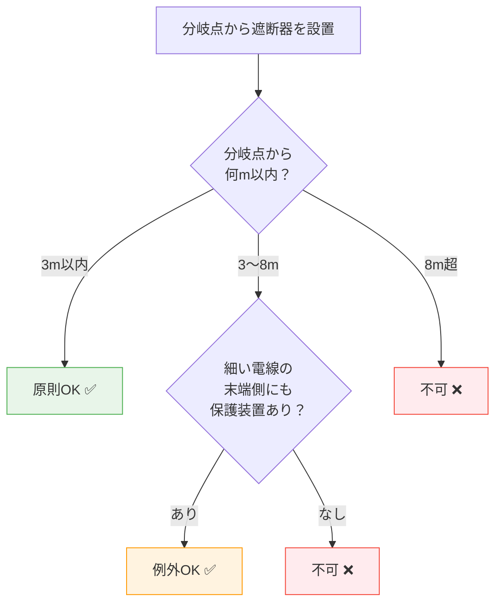

# 電気設備技術基準 第63条 — 過電流からの低圧幹線等の保護対策

!!! note "📊 試験対策メタ"
    - **出題頻度**: 🔥🔥🔥 ★★★☆☆（過去14年で 3 回出題）
    - **重要度**: C（基本）
    - **直近出題**: 

> 低圧幹線の安全設計の中心条文。**過電流遮断器**の施設義務と、**幹線の許容電流以下**の遮断電流が原則。分岐回路は **分岐点から3m以内**（細い電線側に保護がある場合は **8m以内**）に過電流遮断器を設置する。「3m / 8m / 不可」の判定が試験の核心。

| 項目 | 内容 |
|------|------|
| 条文 | 電気設備技術基準 第63条 |
| 対象 | 低圧幹線（屋内配線の主回路） |
| 義務内容 | 過電流遮断器の施設 |
| 遮断器の定格 | 幹線の許容電流以下の遮断電流 |
| 分岐点からの距離（原則） | 3m以内 |
| 分岐点からの距離（例外） | 8m以内（細い電線側に別の過電流保護がある場合） |
| 委任先 | 解釈第148条（低圧幹線）・第149条（分岐回路） |
| 試験重要度 | 穴埋め定番（**過電流遮断器・3m・8m**の3点セット） |

---

## 1. 5秒で思い出す

- 低圧幹線: **過電流遮断器** が必要（許容電流以下の遮断電流）
- 分岐点からの距離: 原則 **3m以内**
- 例外（細い電線側に保護あり）: **8m以内** まで延長可
- 電技解釈第148条・第149条で具体的な数値・条件が展開される
- 「幹線の許容電流 ≥ 遮断器の定格電流」が基本ルール

??? question "セルフチェック: 分岐回路の過電流遮断器を分岐点から何m以内に設置するか（原則）？"
    原則 **3m以内**。ただし、分岐した細い電線の先に別の過電流保護（遮断器・ヒューズ）が施設されている場合は **8m以内** まで延長できる。「3mか8mか」を判断する条件（細い電線側の保護の有無）が試験の核心。

??? question "セルフチェック: 過電流遮断器の遮断電流は幹線の許容電流に対してどうあるべきか？"
    **許容電流以下**。遮断器の定格が許容電流より大きいと、電線が焼ける前に遮断器が動作せず、火災に至る危険がある。「電線が先に焼けない設計」のために、許容電流 ≥ 遮断電流の関係が必須。

---

## 2. 条文原文

!!! note "条文原文の照合（要確認）"
    e-Gov公式（https://elaws.e-gov.go.jp/document?lawid=337M50000400052）または
    METI公式PDFを参照し、第63条の本文を一字一句で貼り付ける。

> **電気設備技術基準 第63条（過電流からの低圧幹線等の保護対策）**
>
> [要確認: e-Gov公式の本文をここに転記]

---

## 3. 原文解析

| ブロック | 原文 | 意味 | 試験ポイント |
|---------|------|------|-------------|
| 主語 | 低圧の幹線 | 屋内配線の主回路 | — |
| 義務 | 過電流遮断器の施設 | 幹線保護の中心要件 | （ア）の穴埋め |
| 定格条件 | 幹線の許容電流以下の遮断電流 | 電線焼損前に遮断する設計 | **頻出ひっかけ** |
| 分岐距離（原則） | 分岐点から3m以内 | 標準条件 | （イ）の穴埋め |
| 分岐距離（例外） | 細い電線側に保護があれば8m以内 | 条件付き延長 | （ウ）の穴埋め |

!!! tip "「許容電流以下」の意味"
    遮断器が「許容電流以下の遮断電流」を持つということは、電線の許容電流に達する前に遮断器が動作することを意味する。これにより電線の過熱・焼損を防ぐ。逆になると、電線が先に焼けて火災になる。

---

## 4. かみ砕き解説

> なぜ「許容電流以下の遮断電流」か：電線には流せる電流の上限（許容電流）がある。これを超えると電線が加熱・発火する。過電流遮断器は「許容電流を超えたら自動で切る」役割を担う。遮断器の定格電流が許容電流より大きいと、電線が焼けても遮断器が動作しない危険な状態になる。

### 距離規定の考え方

| 分岐点からの距離 | 条件 | 理由 |
|--------------|------|------|
| **3m以内** | 原則（条件なし） | 細い電線の短区間なら過熱リスクが小さい |
| **8m以内** | 細い電線の末端側にも保護装置あり | 末端の保護が先に動作するので延長を許容 |

!!! tip "暗記の核心"
    「**3m（原則）・8m（細い電線側に別保護あり）**」の2段階。
    判断の流れ：① 幹線から分岐 → ② 分岐した電線（細い）の末端に保護あり？ → Yes=8m以内、No=3m以内。

### なぜ距離規定があるのか

分岐点直後の細い電線は、幹線側の過電流遮断器では保護しきれない。なぜなら：

- 幹線側の遮断器は **太い幹線の許容電流** に合わせて設定される
- 分岐した **細い電線の許容電流** は幹線より小さい
- 細い電線に過負荷が流れても、幹線側の遮断器は動作しない（その値に達していないため）

→ 分岐点近傍に細い電線専用の過電流遮断器を置く必要がある。「3m以内」はその近傍を定義する数値。

---

## 5. 図で理解

### 図解 1：分岐回路の3m / 8m ルール

<svg viewBox="0 0 700 240" xmlns="http://www.w3.org/2000/svg" font-family="sans-serif" font-size="12" style="width:100%;max-width:700px">
  <text x="350" y="20" text-anchor="middle" font-size="13" font-weight="bold" fill="#333">分岐回路の過電流遮断器：3m原則と8m例外</text>
  <!-- 上：3m原則 -->
  <text x="40" y="55" font-weight="bold" fill="#1565c0">原則 3m以内</text>
  <line x1="40" y1="80" x2="240" y2="80" stroke="#333" stroke-width="3"/>
  <text x="140" y="73" text-anchor="middle" font-size="10" fill="#333">幹線（太い）</text>
  <circle cx="240" cy="80" r="4" fill="#333"/>
  <text x="240" y="98" text-anchor="middle" font-size="9" fill="#666">分岐点</text>
  <line x1="240" y1="80" x2="320" y2="80" stroke="#666" stroke-width="2"/>
  <rect x="320" y="70" width="30" height="20" rx="3" fill="#1565c0"/>
  <text x="335" y="84" text-anchor="middle" font-size="9" fill="#fff">CB</text>
  <line x1="350" y1="80" x2="450" y2="80" stroke="#666" stroke-width="2"/>
  <text x="285" y="98" text-anchor="middle" font-size="9" fill="#1565c0">≦3m</text>
  <text x="400" y="73" text-anchor="middle" font-size="10" fill="#666">分岐電線（細い）</text>
  <!-- 下：8m例外 -->
  <text x="40" y="155" font-weight="bold" fill="#e65100">例外 8m以内（細い側に保護あり）</text>
  <line x1="40" y1="180" x2="240" y2="180" stroke="#333" stroke-width="3"/>
  <text x="140" y="173" text-anchor="middle" font-size="10" fill="#333">幹線（太い）</text>
  <circle cx="240" cy="180" r="4" fill="#333"/>
  <line x1="240" y1="180" x2="450" y2="180" stroke="#666" stroke-width="2"/>
  <rect x="450" y="170" width="30" height="20" rx="3" fill="#e65100"/>
  <text x="465" y="184" text-anchor="middle" font-size="9" fill="#fff">CB</text>
  <line x1="480" y1="180" x2="540" y2="180" stroke="#666" stroke-width="2"/>
  <rect x="540" y="170" width="30" height="20" rx="3" fill="#388e3c"/>
  <text x="555" y="184" text-anchor="middle" font-size="9" fill="#fff">CB</text>
  <text x="345" y="198" text-anchor="middle" font-size="9" fill="#e65100">≦8m</text>
  <text x="555" y="205" text-anchor="middle" font-size="9" fill="#388e3c">末端保護</text>
  <text x="350" y="225" text-anchor="middle" font-size="11" fill="#388e3c">条件: 末端側に過電流保護があるため8mまで延長可</text>
</svg>

### 判定フローチャート: 3m / 8m / 不可 の判定

---

## 6. 第63条と第64条の役割分担

> 過電流保護（第63条）と地絡保護（第64条）は別の現象を扱う。装置も目的も異なるため、両方を備えることが安全設計の基本。

| 条文 | 対象 | 装置 | 検出する電流 |
|------|------|------|------------|
| **第63条** | 過電流（短絡・過負荷） | 過電流遮断器（MCCB等） | 回路を流れる電流が許容値を超えた時 |
| **第64条** | 地絡（漏電） | 地絡遮断器（ELCB・漏電遮断器） | 大地に漏れる電流（通常は微小） |

!!! warning "ひっかけ：過電流遮断器と漏電遮断器を同一視する誤り"
    過電流遮断器は「電線を流れる電流の絶対値」を見て遮断する。漏電遮断器は「往きと帰りの電流差（=漏電電流）」を見て遮断する。検出原理が違うため、片方だけでは保護として不十分。

??? question "セルフチェック: 過電流遮断器と地絡遮断器のどちらが先に動作するか？"
    **故障の種類による**。短絡・過負荷の場合は過電流遮断器が動作する。漏電の場合は地絡遮断器が動作する。両者は独立した保護装置で、互いに代替できない。

---

## 7. 試験で問われること

> 出題パターンは「3m / 8m の判定」と「許容電流と遮断電流の関係」に集中。距離規定の条件文の読み解きが鍵。

!!! note "出題予測（過去14年の統計）"
    第63条の出題は「距離（3m・8m）の穴埋め」と「保護条件の正誤」が中心。

    1. **距離の穴埋め**: 「分岐点から原則何m以内」「例外条件を満たす場合は何m以内」
       - 正解: 3m / 8m
       - ひっかけ: 5m / 10m（実在しない数値）

    2. **例外条件の判定**: 「8m例外が適用されるのはどんな場合か」
       - 正解: 細い電線の末端側に別の過電流保護装置がある場合
       - ひっかけ: 「無条件で8m可」

    3. **遮断電流の大小関係**: 「過電流遮断器の遮断電流は幹線の許容電流に対してどうあるべきか」
       - 正解: 許容電流 **以下**
       - ひっかけ: 許容電流 **以上**（電線が焼けても動作しない危険）

    4. **第64条との区別**: 「過電流遮断器と地絡遮断器の違い」を問う組み合わせ問題

---

## 8. 頻出ひっかけ

1. 🔴 **3mと8mを逆に覚える・条件を無視する** — 原則3m、保護ありで8m。条件なしで「8mでよい」は誤り
2. 🔴 **遮断器の定格電流が許容電流より大きくてもよいと思う** — 許容電流**以下**の遮断電流が必須。逆だと電線が焼けても動作しない
3. 🔴 **5m・10m などの存在しない数値に引っかかる** — 第63条の距離規定は **3m と 8m のみ**。それ以外の数値は誤答選択肢
4. 🟡 **「分岐点からの距離」の起点を電源側と勘違い** — 分岐点（幹線から枝分かれした地点）からの距離。電源側からではない
5. 🟡 **過電流遮断器と漏電遮断器を同一視** — 過電流（第63条）と地絡（第64条）は別の現象。装置も検出原理も異なる
6. 🟢 **「過電流遮断器」の代わりに「ヒューズ」と書く** — 第63条は「過電流遮断器」を要求。ヒューズは具体的施設要件（解釈第148条等）の話

??? question "セルフチェック: 「分岐点から3m以内」の3mはどこからどこまでの距離か？"
    **分岐点（幹線から枝分かれした地点）から、分岐した電線に設置する過電流遮断器までの距離**。電源側からの距離ではない。「分岐点」が起点であることを明確に押さえる。

---

## 9. 穴埋め過去問チャレンジ

!!! note "過去問類題 R03（難易度 ★★☆☆☆）"
    次の文章は「電気設備技術基準」第63条に関する記述である。空欄（ア）〜（ウ）に入る語句または数値の組合せとして正しいものを選べ。

    > 低圧幹線には **（ア）** を施設しなければならない。
    > 分岐回路の **（ア）** は，原則として分岐点から **（イ）** m以内に設置する。
    > ただし，分岐した細い電線の末端側にも別の過電流保護装置がある場合は **（ウ）** m以内まで延長できる。

??? success "解答を見る"
    | 空欄 | 正答 |
    |------|------|
    | （ア） | **過電流遮断器** |
    | （イ） | **3** |
    | （ウ） | **8** |

    **読み解きポイント：**

    - （ア）**過電流遮断器** ：地絡遮断器（第64条）と区別。第63条は過電流が対象
    - （イ）**3** ：原則条件。短区間なら過熱リスク小
    - （ウ）**8** ：末端保護がある場合の例外延長。「条件なしで8m」は誤り

---

## 10. まぎらわしい選択肢と正解の違い

| 空欄 | よくある誤答 | 正答 | なぜ違うか |
|------|------------|------|----------|
| 距離原則 | **5m** | **3m** | 5mは存在しない数値（出題者の罠） |
| 距離例外 | **10m** | **8m** | 10mも罠。8mが正解 |
| 例外条件 | **無条件で8m可** | **末端保護がある場合のみ** | 条件付き例外 |
| 遮断器定格 | **許容電流より大きい遮断電流** | **許容電流以下** | 大きいと電線が焼けても動作しない |
| 起点 | **電源側から** | **分岐点から** | 距離の起点は分岐した点 |

### 第63条と第64条の混同に注意

| 条文 | 対象 | 装置 |
|------|------|------|
| 第63条 | 過電流（短絡・過負荷） | 過電流遮断器（MCCB等） |
| 第64条 | 地絡（漏電） | 地絡遮断器（ELCB・漏電遮断器） |

---

## 11. 関連条文

**過電流保護の周辺条文**
- [地絡に対する保護対策 第64条](64.md) — 低圧電路の地絡（漏電）保護。第63条と対になる概念
- [配線の使用電線 第57条](57.md) — 幹線・分岐回路に使う電線の種類
- [電気機械器具の感電等の防止 第59条](59.md) — 機器側の保護（接地工事）

**具体的施設要件の委任先（解釈）**
- 電技解釈第148条 — 低圧幹線の施設（許容電流・過電流遮断器の具体要件）
- 電技解釈第149条 — 低圧分岐回路等の施設（分岐回路の過電流遮断器位置等）

---

## 12. 過去問実績

| 年度 | 問 | 形式 | 論点 |
|------|-----|------|------|
| R03 | — | 穴埋め | 分岐点からの距離（3m・8m）と条件 |
| H29 | — | 正誤 | 過電流遮断器の定格電流と許容電流の大小関係 |
| H26 | — | 選択 | 分岐回路の過電流保護位置 |

!!! note "R08 出題予測"
    出題頻度2〜3回/14年と比較的高い。3m・8mの距離と条件は確実に押さえること。
    電技解釈第148条・第149条と組み合わせた大問（穴埋め3〜5か所）の形式が最も出やすい。
    「許容電流と定格電流の大小関係」も選択肢として頻出。

---

## 13. 最終チェック

**📜 条文の核心**

- [ ] 「低圧幹線には過電流遮断器を施設」を即答できる
- [ ] 遮断電流 ≦ 幹線の許容電流の関係を説明できる

**📐 距離規定**

- [ ] 原則3m / 例外8m の数値を即答できる
- [ ] 8m例外の条件「末端側に保護装置あり」を即答できる
- [ ] 距離の起点が「分岐点から」と即答できる

**🔗 関連条文**

- [ ] 第64条（地絡保護）との違いを説明できる
- [ ] 解釈第148条・第149条が具体的施設要件を規定していることを知っている

---

---

## 監修ログ

- **2026-05-02**: DENKEN-WIKI監修部による初回三段監修（不動・江間・早川）。**江間が分岐回路の距離規定（原則3m以内・例外8m以内）を電技解釈第149条と照合 → 公式値と一致**。早川が「5m / 10m」誤答の網羅性を確認。
- **数値検証判定: PASS**（3m / 8m 距離規定・公式値と一致）

---

*最終確認: 2026-05-02 | 数値検証完了: 2026-05-02（PASS・分岐回路距離規定公式値一致） | ステータス: v2.1（監修ログ追加） | [バージョニング基準](../../reference/versioning.md)*
