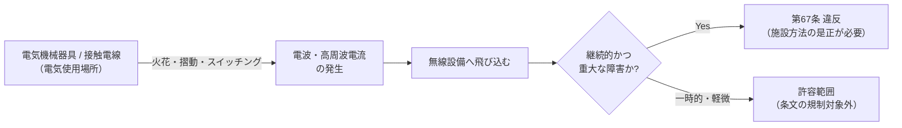

# 電技省令 第67条 — 電気機械器具又は接触電線による無線設備への障害の防止

!!! note "📊 概要"
    **出題頻度**: 🔥🔥（穴埋めで出題実績あり・R4上 問6）

    **重要度**: B（穴埋めの語句一致が得点源・ひっかけ語に注意）

    **直近出題**: R04上 問6（穴埋・3空所の組合せ）

> 電気使用場所に施設する**電気機械器具**又は**接触電線**は、**電波**、高周波電流等が発生することにより、無線設備の機能に**継続的**かつ重大な障害を及ぼすおそれがないように施設しなければならない。空所に入る語の取り違え（屋内配線／高調波／一時的）が唯一にして最大のひっかけ。

| 項目 | 内容 |
|------|------|
| 条文 | 電気設備に関する技術基準を定める省令 第67条 |
| 規定内容 | 電気使用場所の機器・接触電線が無線設備に与える電磁障害の防止（質的規定・数値なし） |
| 性格 | 原則条文（数値規定なし。施設者の努力義務的な「おそれがないように施設」） |
| 解釈（下位） | 解釈第155条（電気設備による電磁障害の防止） |
| 対の規定 | 第42条（通信障害の防止）＝電線路・電車線側（送電側） |
| **典拠（一次ソース）** | 電気設備に関する技術基準を定める省令 第67条 ／ eGov 法令検索 lawid=409M50000400052 |
| **照合日** | 2026-05-31（eGov 第67条本文と逐語照合） |
| **隣接条文** | ← 第42条（通信障害の防止）（送電側の対の規定） ／ 第68条〜（特殊場所の施設）→ |

---

!!! tip "🔄 PDCAサイクル動線（このページの読み方）"
    本ページは **A・B 層**（全体像・条文逐語）の SOT。**C 層**（直前確認・4ボタン理解度・今日の一問）は hoki-wiki が担当。

    | 層 | フェーズ | 場所 |
    |---|---------|------|
    | A. 全体像 | **Plan** | 本ページ ★0／1節 |
    | B. 詳細 | **Do**（条文逐語・解析・かみ砕き） | 本ページ 2〜13節 |
    | C. 試験対策 | **Check**（今日の一問 q53・電磁障害） | [hoki-wiki gijutsu-kijun-gaiyou](https://kfurufuru.github.io/secretary-portal-public/denken-hoki-wiki.html#gijutsu-kijun-gaiyou) |

## ★0. 隣接条文クラスタマップ — 無線設備障害の防止（送電側 vs 使用場所側）

!!! tip "なぜこのマップを冒頭に置くか"
    無線設備への障害防止は **「どこの設備か」で2本立て**になっている。送電側（電線路・電車線）は第42条、使用場所側（機器・接触電線）は本条（第67条）。穴埋めでは「主語が何か」を取り違えさせるひっかけが核心なので、最初に棲み分けを固める。

### 無線設備障害防止 — 第42条 vs 第67条の差分

| 比較軸 | 第42条（通信障害の防止） | **第67条（本条）** |
|------|------------------------|------------------|
| 主語（対象設備） | **電線路又は電車線路**（送電・き電側） | **電気機械器具又は接触電線**（電気使用場所側） |
| 章・節 | 第2章（供給のための施設） | 第3章 第4節（電気的、磁気的障害の防止） |
| 障害の原因 | 電波を**発生する**こと | **電波・高周波電流等**が発生すること |
| 守る対象 | 無線設備の機能 | 無線設備の機能 |
| 程度の要件 | **継続的かつ重大**な障害のおそれなし | **継続的かつ重大**な障害のおそれなし（共通） |

→ 両条とも保護対象は「無線設備の機能」、許容しない障害は「**継続的かつ重大**」で共通。違いは **主語（送電側か使用場所側か）** と、67条のみ「**高周波電流等**」を明記する点。

!!! note "条文の位置（第3章 電気使用場所の施設）"
    - 第4節「電気的、磁気的障害の防止」＝**第67条のみ**で構成
    - 直後の第5節「特殊場所における施設制限」＝第68条〜第73条
    - 第67条は「電気使用場所」の章に置かれた**質的（努力義務的）規定**で、数値基準は持たない

## 1. 全体像と要点

!!! tip "💡 5秒で思い出す（試験直前の最終確認）"
    - 主語は **接触電線**（×屋内配線）
    - 原因は **電波**・高周波電流等（×高調波）
    - 許さない障害は **継続的**かつ重大（×一時的）
    - 守る対象は **無線設備の機能**
    - 数値規定は **なし**（質的規定）

### ① 全体像 — 第67条の位置づけ

電気使用場所（工場・ビル・住宅など）に置く**電気機械器具**や、クレーン等に給電する**接触電線（トロリ線など）**は、運転時に電波や高周波電流を出すことがある。これがラジオ・無線通信などの**無線設備**を妨害しないように施設せよ、という質的な義務を定めるのが第67条。送電側（電線路・電車線）を対象とする第42条と対をなす。

### ② 要点（試験前30秒復習用）

- 第67条は **穴埋めで語句一致**を問う出題が中心（R4上 問6）
- 空所の正解は **(ア)接触電線／(イ)電波／(ウ)継続的** の3点セット
- 数値は出てこない（絶縁抵抗値や離隔距離のような暗記数値はない）
- 「高調波」「屋内配線」「一時的」は**音や字面が似た誤答**として用意される

## 2. 条文原文

??? note "📜 条文原文 — eGov 完全版（折り畳み・クリックで開く）"
    eGov 法令検索（lawid=409M50000400052 / 電気設備に関する技術基準を定める省令）から取得した **第67条 全文**。本記事の解説は試験対策のために整理したもので、正確な条文文言を確認したい場合は本ブロックを参照すること。**2026-05-31 一次照合済**。

    **凡例**: <mark>黄色マーカー</mark> = **実際に穴埋め出題された**キーワード（R04上 問6 で照合）。**bold** は条文の主要語句（穴埋め実績は限定的なものも含む）。

    **第67条（電気機械器具又は接触電線による無線設備への障害の防止）**

    > 電気使用場所に施設する電気機械器具又は<mark>接触電線</mark>は、<mark>電波</mark>、高周波電流等が発生することにより、**無線設備**の機能に<mark>継続的</mark>かつ重大な障害を及ぼすおそれがないように施設しなければならない。

    **黄色マーカー対象の出題実績根拠**:

    | マーカー語 | 出題形式 | 該当年度 |
    |---|---|---|
    | 接触電線 | 穴埋（(ア)・主語の取り違え） | R04上 問6 |
    | 電波 | 穴埋（(イ)・「高調波」との取り違え） | R04上 問6 |
    | 継続的 | 穴埋（(ウ)・「一時的」との取り違え） | R04上 問6 |

    その他の **bold**（「無線設備」「電気機械器具」「高周波電流等」）は条文の主要語句。次回以降の穴埋め予想範囲として学習する。

    **典拠**: 電気設備に関する技術基準を定める省令 第67条（平成九年通商産業省令第五十二号）／eGov 法令検索 lawid=409M50000400052 ／ 2026-05-31 一次照合

---

**以下は試験対策のための要約・解説（条文丸暗記の前段として）**

> 電気使用場所に施設する電気機械器具又は<mark>接触電線</mark>は、<mark>電波</mark>、高周波電流等が発生することにより、無線設備の機能に<mark>継続的</mark>かつ重大な障害を及ぼすおそれがないように施設しなければならない。

> <small>黄色マーカー = 過去問で穴埋め出題された語句</small>

### 過去問で問われた箇所

第67条は穴埋め（3空所の組合せ）で出題される。条文中のキーワードが空欄になり、似た語との取り違えを誘う。

| 出題で狙われるキーワード | 過去問での扱い |
|---|---|
| **接触電線** | (ア)。誤答は「屋内配線」 |
| **電波** | (イ)。誤答は「高調波」 |
| **継続的** | (ウ)。誤答は「一時的」 |

## 3. 原文解析（ブロック分解）

条文を意味ブロック単位に分解し、それぞれの試験ポイントを整理する。

| 原文ブロック | 意味 | 試験のポイント |
|---|---|---|
| 「電気使用場所に施設する」 | 適用範囲＝**電気使用場所**（工場・ビル・住宅等） | 送電側（電線路・電車線）は第42条の担当。混同注意 |
| 「電気機械器具又は**接触電線**は」 | 主語＝**機器**と**接触電線**（トロリ線等） | (ア)の穴埋め。「**屋内配線**」は誤り（配線一般ではなく接触電線） |
| 「**電波**、高周波電流等が発生することにより」 | 障害の原因＝**電波・高周波電流** | (イ)の穴埋め。「**高調波**」は誤り（電力品質の語で別概念） |
| 「無線設備の機能に」 | 守る対象＝**無線設備の機能** | ラジオ・無線通信等。電力設備自体ではない |
| 「**継続的**かつ重大な障害を及ぼすおそれがないように」 | 許さないのは**継続的かつ重大**な障害 | (ウ)の穴埋め。「**一時的**」は誤り。継続性＋重大性の2要件 |
| 「施設しなければならない」 | 施設者の義務 | 数値基準ではなく「おそれがないように施設」する質的義務 |

## 4. かみ砕き解説（因果理解）

### なぜ電波・高周波電流が無線設備を妨害するのか

電動機の整流子・接点の火花、インバータ等のスイッチング、接触電線の摺動接触などは、広い周波数の**電磁ノイズ（電波・高周波電流）**を放射する。これがアンテナや通信線に飛び込むと、ラジオ雑音や無線通信のエラーとして現れる。第67条はこの「電気使用場所の機器・接触電線が出すノイズ」が**継続的かつ重大**な妨害にならないように施設することを求める。

### 「接触電線」とは（誤答「屋内配線」との違い）

**接触電線**は、走行するクレーン・電車・搬送機などに**摺動接点を介して給電する露出導体**（トロリ線・剛体電車線等）。摺動部でアーク・火花が出やすく電磁ノイズ源になりやすいため、条文が名指ししている。**屋内配線**（壁内などの固定配線）とは別物で、ここを入れ替えるのが頻出ひっかけ。

### 「電波」と「高調波」の違い（誤答対策）

- **電波**：空間を伝わる電磁波。無線設備（受信機）を直接妨害する。第67条の語。
- **高調波**：基本波（50/60Hz）の整数倍の電流・電圧成分で、**電力品質・機器過熱**の文脈の語。第67条には登場しない。
- 字面が似るが**守る対象が違う**（無線設備 vs 電力系統）。穴埋めでは「電波」が正解。

## 5. 図で理解

### 障害発生の因果フロー

### 送電側（第42条）と使用場所側（第67条）の住み分け

<svg viewBox="0 0 640 200" xmlns="http://www.w3.org/2000/svg" role="img" aria-label="第42条と第67条の対象範囲">
  <rect x="0" y="0" width="640" height="200" fill="#fff"/>
  <!-- 送電側 -->
  <rect x="20" y="40" width="260" height="120" rx="8" fill="#eef5ff" stroke="#3b6fb0"/>
  <text x="150" y="62" text-anchor="middle" font-size="15" font-weight="bold" fill="#3b6fb0">送電側</text>
  <text x="150" y="86" text-anchor="middle" font-size="13">電線路・電車線路</text>
  <text x="150" y="120" text-anchor="middle" font-size="14" font-weight="bold">第42条</text>
  <text x="150" y="140" text-anchor="middle" font-size="11">（通信障害の防止）</text>
  <!-- 使用場所側 -->
  <rect x="360" y="40" width="260" height="120" rx="8" fill="#fff4e6" stroke="#c47f1a"/>
  <text x="490" y="62" text-anchor="middle" font-size="15" font-weight="bold" fill="#c47f1a">電気使用場所側</text>
  <text x="490" y="86" text-anchor="middle" font-size="13">電気機械器具・接触電線</text>
  <text x="490" y="120" text-anchor="middle" font-size="14" font-weight="bold">第67条</text>
  <text x="490" y="140" text-anchor="middle" font-size="11">（本条）</text>
  <!-- 共通の保護対象 -->
  <text x="320" y="185" text-anchor="middle" font-size="12" fill="#666">共通して守るのは「無線設備の機能」／許さないのは「継続的かつ重大」な障害</text>
</svg>

## 8. 頻出ひっかけ・落とし穴

### 🔴 致命的（これを間違えたら即失点）

1. 🔴 **[②主語]** 主語を ❌「**屋内配線**」と取り違える → ✅ 正しくは **接触電線**（配線一般ではなく、摺動給電の露出導体）

### 🟡 注意（出題頻度高い）

2. 🟡 **[①語の混同]** 原因を「**高調波**」とする → 正しくは **電波**（高調波は電力品質の語で別概念）

### 🟢 軽微（余裕があれば）

3. 🟢 **[⑥修飾の取り違え]** 障害の程度を「**一時的**」とする → 正しくは **継続的**（継続性＋重大性の2要件）
4. 🟢 **[⑥例外的理解]** 「いかなる障害も禁止」と読む → 条文が禁ずるのは **継続的かつ重大** な障害であって、一時的・軽微なものまで一律禁止ではない

## 9. 穴埋め過去問チャレンジ

!!! question "R04上 問6（穴埋・3空所の組合せ）"
    電気使用場所に施設する電気機械器具又は（ ア ）は、（ イ ）、高周波電流等が発生することにより、無線設備の機能に（ ウ ）かつ重大な障害を及ぼすおそれがないように施設しなければならない。

    **学習ラダー（Why → What → How）**
    - **Why（なぜ問われる）**：似た語（屋内配線／高調波／一時的）との取り違えを試す語句一致問題だから
    - **What（何が答え）**：(ア)**接触電線** ／ (イ)**電波** ／ (ウ)**継続的**
    - **How（どう選ぶ）**：主語＝摺動給電の「接触電線」、原因＝無線を妨害する「電波」、程度＝「継続的」かつ重大、と3点を核心語で固定する

!!! note "出題実績まとめ"
    - R04上 問6（[電験王 houkir4-1-6](https://denken-ou.com/houkir4-1-6/)・**改変なし**／5択の組合せ問題、正解は (ア)接触電線・(イ)電波・(ウ)継続的）

!!! abstract "📝 確認のまとめ（穴埋め3点）"
    第67条の穴埋めは **(ア)接触電線・(イ)電波・(ウ)継続的** の3点のみ。誤答は「屋内配線・高調波・一時的」。主語・原因・程度の3軸で固定する。

??? success "確認問題: 次の文の空所3つを埋めよ（答えはクリック）"
    「電気使用場所に施設する電気機械器具又は（ア）は、（イ）、高周波電流等が発生することにより、無線設備の機能に（ウ）かつ重大な障害を及ぼすおそれがないように施設しなければならない。」

    **答え**：(ア)**接触電線** ／ (イ)**電波** ／ (ウ)**継続的**（誤答：屋内配線／高調波／一時的）

## 10. まぎらわしい選択肢と正解の違い

R04上 問6 の5択は、3空所のうち1つだけを誤答語に差し替える構成だった（誤りの混入位置を見抜く問題）。

| 選択肢 | (ア) | (イ) | (ウ) | 判定 |
|---|---|---|---|---|
| 1 | 接触電線 | 高調波 | 継続的 | × （イ誤り） |
| 2 | 屋内配線 | 電波 | 一時的 | × （ア・ウ誤り） |
| 3 | 接触電線 | 高調波 | 一時的 | × （イ・ウ誤り） |
| 4 | 屋内配線 | 高調波 | 継続的 | × （ア・イ誤り） |
| **5** | **接触電線** | **電波** | **継続的** | **○ 正解** |

## 7. 省令（第67条）と解釈（第155条）の関係

!!! warning "解釈第155条の番号に関する重要注意（旧155条＝別概念）"
    - **現行の解釈第155条** ＝「**電気設備による電磁障害の防止**」。これが本条（省令第67条）の**解釈層**にあたる。
    - 一方、過去問（R02 問9・R06上 問9 等）で「**解釈第155条**」と書かれているものは **旧番号** で、論点は「**配線器具の施設**」＝**現行の解釈第150条**。両者は**まったくの別概念**なので、年度の古い問題文の条番号をそのまま現行体系に持ち込まないこと。

| 区分 | 規定 | 役割 |
|---|---|---|
| 省令（上位・原則） | **第67条** | 機器・接触電線の電磁障害を「おそれがないように施設」する質的義務 |
| 解釈（下位・現行155条） | **第155条（電気設備による電磁障害の防止）** | 上記を満たす具体的な施設方法の解釈 |

!!! note "解釈第155条 本文の取り扱い（逐語未照合）"
    解釈第155条の条文本文は経済産業省「電気設備の技術基準の解釈」（経済産業省が省令の解釈として示すもの）に収載され、**eGov 法令検索の対象外**である。本記事では一次照合（逐語）が未完了のため、**本文の引用・要約は行わず、省令第67条との関係性のみ**を示す。逐語が必要な場合は経済産業省「電気設備の技術基準の解釈」PDF を参照のこと。

## ★17. 実務での着眼（主任技術者の視点）

第67条は数値基準を持たない質的規定だが、**実務**では「無線障害を出さない施設方法」を具体化する場面で効く。

- **設計**段階：インバータ駆動機器やクレーンの**接触電線**を選定・配置する際、ノイズ対策（シールド・フィルタ・接地）を**設計**仕様に織り込む。
- **施工**段階：**現場**で接触電線の摺動部やアーク発生源の近傍に通信線を並走させない取り回しを行う。
- **保守**段階：苦情（ラジオ雑音等）が継続的に発生した場合、**現場**調査で発生源を特定し、解釈第155条の具体策に沿って是正する。

→ 試験では穴埋め語句一致だが、**実務**では「継続的かつ重大」の判断と発生源対策が要点。

---

## 📒 解いたら記録 → 間違えたら間違えノートへ（PDCAを回す）

!!! abstract "各過去問の「理解した／曖昧／間違えた」ボタンで解答結果を残せます"
    上の過去問の各ブロック下に出る **理解度ボタン（〇理解した／△曖昧／×間違えた）** とメモ欄で、解いた結果がブラウザの localStorage に保存されます（**Do→Check**）。

    👉 [**間違えノートを開く（法規Wiki／直前まちがいノート）**](https://kfurufuru.github.io/secretary-portal-public/denken-hoki-wiki.html#chokuzen-machigai)

    - **×間違えた** を押した問題は間違えノートに **自動集約** され、間違えた問題だけ抽出して再演習できる（**Check→Act**）
    - メモ欄に「なぜ間違えたか」を残すと、次回復習時に文脈ごと復元される
    - 同一オリジン（kfurufuru.github.io）配下なので、本Wiki／法規Wiki／理論Wiki のチェック記録は **すべて同じ間違えノートに集約**（横断PDCA）

---

## 11. 関連条文・関連ページ

- 第42条（通信障害の防止） — 送電側（電線路・電車線路）の対の規定
- 第68条〜第73条 — 直後の第5節「特殊場所における施設制限」
- 解釈第155条（電気設備による電磁障害の防止）— 本条の解釈層（現行番号。旧155条＝配線器具＝現行150条と混同注意）
- [条文別インデックス](../../articles/kijun/index.md) — 省令 条文一覧
- [分野別 過去問マッピング](../../kakomon/by-field.md) — 出題実績から逆引き
- 攻略戦略：法規は「広く浅く」が罠。出題頻度の高い条文を優先し、本条のような質的規定は穴埋め語句一致で短時間に得点する。
- [hoki-wiki「今日の一問」q53（電磁障害）](https://kfurufuru.github.io/secretary-portal-public/denken-hoki-wiki.html#gijutsu-kijun-gaiyou) — C層（試験対策・4ボタン理解度）

## 13. 用語集

### 3列翻訳テーブル（日常語 ⇆ 法規表現 ⇆ 試験での意味）

| 日常語・言い換え | 法規表現（条文の語） | 試験での意味・混同注意 |
|---|---|---|
| 移動機械への露出給電線（トロリ線等） | **接触電線** | (ア)の正解。「屋内配線」と取り違えさせる |
| 空間を伝わる電磁波（ラジオ雑音の原因） | **電波** | (イ)の正解。「高調波」（電力品質の語）と混同させる |
| ずっと続く妨害 | **継続的（かつ重大）** | (ウ)の正解。「一時的」と取り違えさせる |
| ラジオ・無線通信機器 | **無線設備** | 守る対象。電力設備自体ではない |
| インバータ等が出す高い周波数の電流 | **高周波電流（等）** | 条文上の原因。電波と並ぶノイズ源 |

??? question "セルフチェック: 第67条と第42条はどう違うか（主語の観点で説明せよ）"
    **核心**：守る対象（無線設備の機能）と「継続的かつ重大」という程度要件は共通だが、**主語（対象設備）が違う**。第42条は**電線路・電車線路（送電側）**、第67条は**電気機械器具・接触電線（電気使用場所側）**。穴埋めはこの主語の取り違え（接触電線↔屋内配線）を狙う。

??? question "セルフチェック: なぜ正解は「電波」で「高調波」ではないのか"
    **核心**：第67条が守るのは**無線設備の機能**であり、これを直接妨害するのは空間を伝わる**電波**。**高調波**は基本波の整数倍成分で、**電力品質・機器過熱**の文脈の語であって無線妨害の主語ではない。守る対象が違うため「電波」が正解。

??? question "セルフチェック: 第67条は「いかなる無線障害も禁止」しているか"
    **核心**：していない。条文が禁ずるのは「**継続的かつ重大**な障害を及ぼすおそれ」であり、**継続性と重大性の2要件**を満たすもの。一時的・軽微な障害まで一律に禁止する規定ではない（「一時的」を正解にすると誤り）。

---

## 監修ログ

| 日付 | 版 | 監修者 | 内容 |
|---|---|---|---|
| 2026-05-31 | v1.0 | Claude（編者承認・67＋155スコープ） | 新規作成。eGov lawid=409M50000400052 で第67条・第42条を逐語照合。R04上 問6（電験王 houkir4-1-6）を穴埋めとして反映。解釈第155条は関係性のみ（逐語未照合・告示のため）。旧155条＝配線器具（現行150条）との混同注意を明記 |

!!! note "ChatGPT 必須レビュー（work-rules 6.A節）"
    本記事は法規条文記事の新規作成のため、PR マージ前に ChatGPT 等の外部 AI レビューを推奨（編者任意）。確認観点：①第67条の逐語一致 ②第42条との主語差 ③解釈第155条＝電磁障害防止（旧155＝配線器具との別概念）④穴埋め正解（接触電線／電波／継続的）の妥当性。
