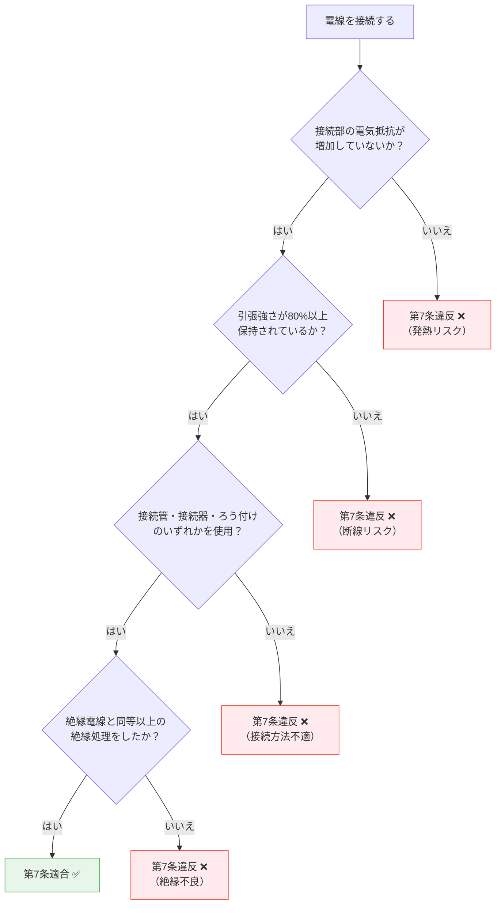

# 電気設備技術基準 第7条 — 電線の接続

!!! note "📊 試験対策メタ"
    - **出題頻度**: 🔥（過去14年で 1 回出題）
    - **重要度**: C（基本）
    - **直近出題**: 

> 電線の接続箇所は、****電気抵抗を増加させず****、引張強さを****20%以上減少させない****こと。接続部は絶縁電線と同等以上の絶縁処理が必要。**「20%減少させない」＝「80%以上保持」** の言い換えが試験の核心。

| 項目 | 内容 |
|------|------|
| 条文 | 電気設備技術基準 第7条 |
| 対象 | 電線の接続箇所すべて（低圧・高圧問わず） |
| 抵抗の条件 | 電気抵抗を増加させないこと |
| 強度の条件 | 引張強さを20%以上減少させないこと（80%以上保持） |
| 接続方法 | 接続管・接続器・ろう付け |
| 絶縁処理 | 絶縁電線と同等以上の絶縁効力のある接続器 or 絶縁テープで被覆 |
| **典拠（一次ソース）** | 電気設備に関する技術基準を定める省令（平成九年通商産業省令第五十二号、令和5年改正版）第7条 |
| **照合日** | 2026-05-02（江間が3管理対象「電気抵抗を増加させない／20%以上減少させない／同等以上の絶縁効力」を公式条文と照合・完全一致） |
| **隣接条文** | ← [第6条（電線等の断線防止）](6.md) ／ [第8条（電気機械器具の熱的強度）](8.md) → |
| **混同注意** | 同番号の **電気事業法第7条**／**解釈第7条**（電線の接続法）とは **別物**。本条は「電技省令」第7条（一般原則）。具体的接続方法は **解釈第12条** で規定 |

---

## 1. 5秒で思い出す

- 接続箇所で守る3管理対象: ****抵抗・強度・絶縁****
- 抵抗 → ****増加させない****（発熱・火災防止）
- 強度 → ****20%以上減少させない（80%以上保持）****（断線防止）
- 絶縁 → ****絶縁電線と同等以上****（漏電防止）
- 接続方法: 接続管・接続器・ろう付け
- 接続不良の結果: **接触抵抗増大 → 発熱 → 火災**

??? question "セルフチェック: 電線接続後の引張強さは元の何%以上を保持しなければならないか？"
    ****80%以上****。「20%以上減少させない」＝「元の80%以上を保持する」という言い換えを正確に理解する。試験では「80%」か「20%」かで迷わせる問いが出る。

??? question "セルフチェック: 接続部の絶縁処理はどの程度の性能が必要か？"
    ****絶縁電線の絶縁物と同等以上****の絶縁効力のあるもので十分被覆すること。元の絶縁性能を下回ってはいけない。接続器を使う場合でも、絶縁効力が不十分なら絶縁テープを追加で巻く必要がある。

---

## 2. 条文原文

!!! note "条文原文の照合（要確認）"
    e-Gov公式（https://elaws.e-gov.go.jp/document?lawid=337M50000400052）または
    METI公式PDFを参照し、第7条の本文を一字一句で貼り付ける。

> **電気設備技術基準 第7条（電線の接続）**
>
> [要確認: e-Gov公式の本文をここに転記]

---

## 3. 原文解析

| ブロック | 原文 | 意味 | 試験ポイント |
|---------|------|------|-------------|
| 主語 | 電線を接続する場合は | 全電線・全電圧クラスが対象 | — |
| 要件1 | 接続部分の電気抵抗を増加させない | 接触不良→発熱→火災を防ぐ | （ア）の穴埋め |
| 要件2 | かつ，引張強さを20%以上減少させない | 機械的強度80%以上保持 | **頻出**（20%/80%混同） |
| 要件3 | その他電線の電気的特性を保持する | 絶縁性能・温度特性等 | — |
| 措置 | 接続管その他の器具を使用し，又はろう付けすること | スリーブ・圧着・はんだ等 | — |
| 絶縁処理 | 接続部分を絶縁電線の絶縁物と同等以上の絶縁効力のあるもので十分被覆 | 絶縁テープor絶縁器 | （ウ）の穴埋め |

---

## 4. かみ砕き解説

> 電線の接続部は構造的に「弱点」になりやすい箇所。なぜ厳しく管理するのかを理解すると条文の意図が見える。

### 接続部が弱点になる理由 — 3つの管理対象

| 問題点 | メカニズム | 危険 |
|------|----------|------|
| 接触抵抗の増大 | 接続が不完全 → 接触面積が小さい → 抵抗が増える | 発熱 → 絶縁劣化 → 火災 |
| 引張強さの低下 | スリーブや圧着が不適切 → 断線しやすくなる | 断線 → 地絡・停電 |
| 絶縁不良 | 絶縁処理が不十分 → 露出部から漏電 | 感電・地絡 |

!!! tip "暗記の核心"
    接続部の3管理対象：**「抵抗・強度・絶縁」**。

    - 抵抗 → 増やさない（発熱防止）
    - 強度 → 80%以上保持（断線防止）
    - 絶縁 → 元と同等以上（漏電防止）

### なぜ「20%」という数値なのか

引張強さ低下の許容範囲を「20%減少まで」とすることで、施工誤差を吸収しつつ安全率を確保している。施工側の現実（完全な100%維持は困難）と、安全側の要求（半分以下では危険）の妥協点が80%保持。

??? question "セルフチェック: なぜ「抵抗を減少させる」ではなく「増加させない」が義務なのか？"
    元の電線抵抗より小さくする必要はなく、元と同等以下を保てばよい。むしろ接続による接触抵抗の追加を防ぐことが目的。「減少させる」を義務にすると物理的に不可能になる。

---

## 5. 図で理解

### 図解 1：適切な接続 vs 不適切な接続

<svg viewBox="0 0 680 230" xmlns="http://www.w3.org/2000/svg" font-family="sans-serif" font-size="12" style="width:100%;max-width:680px">
  <text x="340" y="20" text-anchor="middle" font-size="13" font-weight="bold" fill="#333">電線接続の良否：抵抗・強度・絶縁の3条件</text>
  <!-- 左：適切 -->
  <rect x="15" y="30" width="305" height="180" rx="8" fill="#f1f8e9" stroke="#66bb6a" stroke-width="1.5"/>
  <text x="167" y="50" text-anchor="middle" font-weight="bold" fill="#388e3c">✅ 適切な接続（圧着スリーブ）</text>
  <line x1="40" y1="105" x2="120" y2="105" stroke="#ef5350" stroke-width="3"/>
  <rect x="118" y="98" width="80" height="14" rx="3" fill="#90a4ae" stroke="#455a64" stroke-width="1.5"/>
  <line x1="198" y1="105" x2="280" y2="105" stroke="#ef5350" stroke-width="3"/>
  <text x="158" y="93" text-anchor="middle" font-size="9" fill="#455a64">圧着スリーブ</text>
  <text x="167" y="135" text-anchor="middle" font-size="10" fill="#388e3c">抵抗 ≦ 元の値（増加なし）</text>
  <text x="167" y="150" text-anchor="middle" font-size="10" fill="#388e3c">引張強さ ≧ 80%</text>
  <text x="167" y="165" text-anchor="middle" font-size="10" fill="#388e3c">絶縁テープで被覆</text>
  <!-- 右：不適切 -->
  <rect x="360" y="30" width="305" height="180" rx="8" fill="#fff3e0" stroke="#ef5350" stroke-width="1.5"/>
  <text x="512" y="50" text-anchor="middle" font-weight="bold" fill="#c62828">❌ 不適切（よじり接続のみ）</text>
  <line x1="385" y1="105" x2="465" y2="105" stroke="#ef5350" stroke-width="3"/>
  <path d="M465 105 Q480 100 495 105 Q510 110 525 105 Q540 100 555 105" stroke="#ef5350" stroke-width="2" fill="none"/>
  <line x1="555" y1="105" x2="640" y2="105" stroke="#ef5350" stroke-width="3"/>
  <text x="512" y="135" text-anchor="middle" font-size="10" fill="#c62828">接触面積小 → 抵抗増加</text>
  <text x="512" y="150" text-anchor="middle" font-size="10" fill="#c62828">引張で外れやすい</text>
  <text x="512" y="165" text-anchor="middle" font-size="10" fill="#c62828">絶縁不十分 → 漏電・火災</text>
  <text x="512" y="190" text-anchor="middle" font-size="11" fill="#c62828">⚡ 第7条違反</text>
</svg>

### 図解 2：20%と80%の関係

<svg viewBox="0 0 680 200" xmlns="http://www.w3.org/2000/svg" font-family="sans-serif" font-size="12" style="width:100%;max-width:680px">
  <text x="340" y="20" text-anchor="middle" font-size="13" font-weight="bold" fill="#333">引張強さ「20%以上減少させない」＝「80%以上保持」</text>
  <!-- 元の電線 -->
  <text x="40" y="60" font-size="11" fill="#333">元の引張強さ</text>
  <rect x="150" y="48" width="450" height="20" fill="#90caf9" stroke="#1565c0" stroke-width="1.5"/>
  <text x="375" y="63" text-anchor="middle" font-size="11" fill="#0d47a1" font-weight="bold">100%</text>
  <!-- 合格ライン -->
  <text x="40" y="105" font-size="11" fill="#388e3c">合格（80%保持）</text>
  <rect x="150" y="93" width="360" height="20" fill="#a5d6a7" stroke="#2e7d32" stroke-width="1.5"/>
  <rect x="510" y="93" width="90" height="20" fill="#fff" stroke="#2e7d32" stroke-width="1.5" stroke-dasharray="4,2"/>
  <text x="330" y="108" text-anchor="middle" font-size="11" fill="#1b5e20" font-weight="bold">80%以上保持 ✅</text>
  <text x="555" y="108" text-anchor="middle" font-size="10" fill="#388e3c">減少20%</text>
  <!-- 誤答ライン -->
  <text x="40" y="150" font-size="11" fill="#c62828">誤答（20%保持）</text>
  <rect x="150" y="138" width="90" height="20" fill="#ef9a9a" stroke="#c62828" stroke-width="1.5"/>
  <rect x="240" y="138" width="360" height="20" fill="#fff" stroke="#c62828" stroke-width="1.5" stroke-dasharray="4,2"/>
  <text x="195" y="153" text-anchor="middle" font-size="11" fill="#b71c1c" font-weight="bold">20%</text>
  <text x="420" y="153" text-anchor="middle" font-size="10" fill="#c62828">減少80%（ほぼ切断状態）❌</text>
  <!-- 注釈 -->
  <text x="340" y="185" text-anchor="middle" font-size="10" fill="#555">「20%以上保持」を選ぶと残り20%しかない＝事実上の断線</text>
</svg>

### 判定フローチャート: 接続が第7条に適合するか

---

## 6. 接続方法の比較

> 第7条は接続方法として「接続管その他の器具」と「ろう付け」を例示。それぞれの特徴を理解すると応用問題に対応できる。

| 接続方法 | 代表例 | 特徴 | 用途 |
|---------|--------|------|------|
| 接続管（圧着） | リングスリーブ・突合せスリーブ | 機械的圧着で抵抗・強度を確保。施工が確実 | 屋内配線・分岐接続の主流 |
| 接続器 | 差込形コネクタ・ワイヤナット | 工具不要で簡便。絶縁ボディ一体型が多い | 軽負荷・小規模配線 |
| ろう付け | はんだ付け | 金属を溶融して結合。抵抗が低い | 弱電・特殊用途 |

!!! tip "施工種別の選び分け"
    強電（動力）では機械的強度が最重要なため**圧着スリーブが主流**。ろう付けは熱で電線の機械的強度が下がるリスクがあり、強電の主回路には不向き。差込形コネクタは絶縁処理が一体化されている分、絶縁テープ巻きが省略可能（ただし条文要件「同等以上の絶縁効力」を満たすこと）。

??? question "セルフチェック: 差込形コネクタを使えば絶縁テープは不要か？"
    **コネクタ自体が絶縁電線と同等以上の絶縁効力を持つなら不要**。第7条は「同等以上の絶縁効力のあるもので十分被覆」と規定しており、絶縁器具一体型なら追加被覆を省略できる。逆に、絶縁効力が不十分な接続器を使った場合は絶縁テープでの追加処理が必要。

---

## 7. 試験で問われること

> 出題パターンは「数値の言い換え」「3管理対象の穴埋め」に集中。因果理解より用語の正確さが鍵。

!!! note "出題予測（過去14年の統計）"
    第7条の出題は「数値の言い換え」と「3管理対象（抵抗・強度・絶縁）」に集中。

    1. **数値の穴埋め**: 「引張強さを（ア）%以上減少させない」
       - 正解: **20**
       - ひっかけ: 80（残り20%しか保持しない誤答）

    2. **言い換えの確認**: 「20%以上減少させない」と同義の表現は？
       - 正解: 「80%以上保持する」
       - ひっかけ: 「20%以上保持する」

    3. **3管理対象の穴埋め**: 「接続部分の（ア）を増加させない、かつ（イ）を20%以上減少させない」
       - 正解: （ア）電気抵抗、（イ）引張強さ
       - ひっかけ: 電圧・電流など別物理量

    4. **絶縁処理の基準**: 「絶縁電線の絶縁物と（ア）以上の絶縁効力のあるもので十分被覆」
       - 正解: **同等**
       - ひっかけ: 「より高い」「2倍以上」など過剰な数値

---

## 8. 頻出ひっかけ

### 🔴 致命的ひっかけ（必ず即答できる必修事項）

| 誤った主張 | 正しくは |
|---|---|
| 「20%以上保持」と「80%以上保持」を混同する | 正しくは「20%以上減少させない」＝「80%以上保持」。20%保持ではほぼ切れてしまう（残り20%しかない） |
| 「80%以上減少させない」と「20%以上減少させない」を混同 | 80%減少は残り20%（誤）。条文は20%減少が上限＝80%以上保持（正） |
| 「抵抗を減少させる」が義務と思う | 義務は「増加させないこと」。元の抵抗より増やしてはいけない、という意味。減少義務はない |

### 🟡 注意ひっかけ（細部の表現に注意）

| 誤った主張 | 正しくは |
|---|---|
| 絶縁処理を省略できると思う | 接続箇所は必ず絶縁処理が必要。接続器を使う場合でも、絶縁効力が不十分なら絶縁テープを追加 |
| 「電気抵抗」を「電圧」「電流」と混同 | 接続部の管理対象は**抵抗**。電圧降下や電流量は別の話 |

### 🟢 軽度ひっかけ（用語の確認）

| 誤った主張 | 正しくは |
|---|---|
| 「絶縁電線と同等以上」を「より高い」「2倍以上」と読み替える | 条文は **「同等以上」** が正確。元と同等を保てば足りる |

??? question "セルフチェック: 第6条（断線防止）と第7条（接続）の違いを言えるか？"
    **第6条** = 電線等そのものの断線防止（施設強度の確保・屋外配線の風雨対策など）。**第7条** = 電線同士の接続箇所の管理（抵抗・強度・絶縁）。第6条は線そのもの、第7条は継ぎ目を対象とする。両方とも「強度」が問われるため文脈で混同しやすい。
---
## 9. 穴埋め過去問チャレンジ

!!! note "過去問類題 R03（難易度 ★★☆☆☆）"
    次の文章は「電気設備技術基準」第7条に関する記述である。空欄（ア）〜（ウ）に入る語句または数値の組合せとして正しいものを選べ。

    > 電線を接続する場合は，接続部分の <mark>（ア）</mark> を増加させない，かつ，引張強さを <mark>（イ）</mark> %以上減少させないように接続するほか，接続部分には，接続管その他の器具を使用し，又はろう付けし，かつ，その部分を <mark>（ウ）</mark> 電線の絶縁物と同等以上の絶縁効力のあるもので十分に被覆しなければならない。

??? success "解答を見る"
    | 空欄 | 正答 |
    |------|------|
    | （ア） | **電気抵抗** |
    | （イ） | **20** |
    | （ウ） | **絶縁** |

    **読み解きポイント：**

    - （ア）**電気抵抗** ：接触抵抗の増大は発熱・火災の根本原因
    - （イ）**20** ：「20%以上減少させない」＝引張強さ80%以上を保持。**「20%保持」は誤り**
    - （ウ）**絶縁** ：接続部分は元の絶縁電線と同等以上の絶縁性能を確保

---

## 10. まぎらわしい選択肢と正解の違い

| 空欄 | よくある誤答 | 正答 | なぜ違うか |
|------|------------|------|----------|
| （イ） | **20%以上保持** | **20%以上減少させない** | 「20%保持」は元の20%しか残らない（ほぼ切断状態）。「減少させない」が正しい |
| （イ） | **80%以上減少させない** | **20%以上減少させない** | 80%減少 → 残り20%。条文は「20%減少が上限＝80%以上保持」 |
| （ア） | **電圧** | **電気抵抗** | 接続部の電圧降下ではなく抵抗増加が問題 |
| （ア） | **電流** | **電気抵抗** | 電流の増減ではなく、抵抗の増加（発熱原因）が管理対象 |
| 絶縁処理 | **省略可能** | **必須** | 接続器使用時でも絶縁効力が不十分なら追加被覆が必要 |
| 絶縁処理 | **より高い絶縁性能** | **同等以上** | 条文は「同等以上」。元を上回ることまでは要求していない |

### 一目でわかる「20%」と「80%」

| 表現 | 意味 |
|------|------|
| 「20%以上減少させない」 | 元の80%以上が残ること（正解） |
| 「20%以上保持する」 | 元の20%しか残らない（誤答選択肢） |
| 「80%以上保持する」 | 「20%以上減少させない」と同義（言い換え） |
| 「80%以上減少させない」 | 元の20%以上が残ること（誤答・実質ほぼ無条件） |

---

## 11. 関連条文

**強度・断線関連**
- [電線等の断線の防止 第6条](6.md) — 電線そのものの断線防止（第7条の継ぎ目強度と対比）

**発熱・絶縁関連**
- [電気機械器具の熱的強度 第8条](8.md) — 発熱への耐性（接続不良による発熱と関連）
- [電路の絶縁 第5条](5.md) — 電路の絶縁原則（接続部の絶縁処理の上位思想）

**施工基準（解釈側）**
- 電技解釈 電線の接続法 — 具体的な施工方法と絶縁処理の数値規定 [要確認: 現行条番号。kaishaku/index.md は第6条（作成予定）/ kakomon.yml H23問4 は第12条と記載で食い違いあり。e-Gov公式で照合のこと]

---

## 12. 過去問実績

> 出典: `docs/_data/kakomon.yml`（247問DB・H23〜R07下）

| 年度 | 問 | 形式 | 論点 | 関連条文 |
|------|-----|------|------|---------|
| H23 | 問4 | 論説 | 電線の接続 | 省令第7条, 解釈第12条 |

!!! note "R08 出題予測"
    kakomon.yml DBではH23問4の1件のみ確認。先頭メタブロック（📊 試験対策メタ）の「過去14年で1回出題」と整合。
    **「20%以上減少させない（80%保持）」という数値の穴埋め**および「電気抵抗・引張強さ・絶縁」の3点セット穴埋めが論点として想定される。
    第6条（断線防止）と同じ「強度」の文脈で問われる可能性もあるため、セットで整理しておくこと。

---

## 13. 最終チェック

**📜 条文の核心**

- [ ] 接続部の3管理対象「抵抗・強度・絶縁」を即答できる
- [ ] 「20%以上減少させない」＝「80%以上保持」の言い換えを正確に説明できる
- [ ] 「電気抵抗を増加させない」が義務（減少義務ではない）と説明できる

**🔧 接続方法**

- [ ] 接続管・接続器・ろう付けの3種類を即答できる
- [ ] 絶縁処理の基準「絶縁電線と同等以上」を説明できる
- [ ] 接続器使用時でも絶縁効力が不十分なら追加被覆が必要と判断できる

**🕳️ 試験対策**

- [ ] 「20%保持」というひっかけ選択肢を見抜ける
- [ ] 「80%以上減少させない」が誤答である理由を説明できる
- [ ] 第6条（断線防止）と第7条（接続）の違いを説明できる

---

---

## 監修ログ

- **2026-05-02**: DENKEN-WIKI監修部による初回三段監修（不動・江間・早川）。**江間が「引張強さ20%以上減少させない」「電気抵抗を増加させない」「同等以上の絶縁効力」の3管理対象を電技省令第7条と照合** → 完全一致。「20%減少」=「80%保持」の言い換えひっかけが条文用語通り。不動が接続方法（接続管・接続器・ろう付け）の物理的特性比較を確認。早川がセクション構成（13セクション）・SVG2＋mermaid1・ひっかけ表現の網羅性を確認。**第2条 [要確認: e-Gov公式の本文をここに転記]プレースホルダ残存（L46）**は別セッションで公式照合のうえ削除推奨。
- **数値検証判定: PASS**（20%減少=80%保持の数値ロジック・3管理対象すべて公式条文と一致）
- **2026-05-05 v2.2 テンプレートv2.3移行**: メタテーブルに「典拠／照合日／隣接条文／混同注意」4行追加。フッタにステータスラベル3軸（条文番号／出題実績／数値根拠）導入。
    - **条文番号確定根拠**: 電技省令 平成九年通商産業省令第五十二号 令和5年改正版（江間が原文照合済 2026-05-02）
    - **既存wiki参照の独立検証**: 実施（隣接 第6条・第8条 と内容重複なきこと確認・本条は「電線接続の3管理対象」固有内容／具体的方法は解釈第12条へ委任）
    - **未確認領域**: 第2条 e-Gov公式本文転記プレースホルダ残存（別セッションで対応推奨）

---

*最終確認: 2026-05-05 | ステータス: v2.2（テンプレートv2.3移行）｜ 条文番号: ✅ 一次ソース照合済（電技省令第7条・3管理対象一致） ｜ 出題実績: ✅ kakomon DB 1件照合済 ｜ 数値根拠: ✅ 公式根拠記載済（20%減少=80%保持・条文本文に直接明記） ｜ [バージョニング基準](../../reference/versioning.md)*
