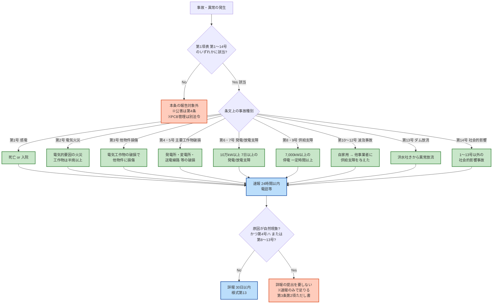

# 電気関係報告規則 第3条 — 事故報告

!!! note "📊 試験対策メタ"
    **出題頻度**: 🔥🔥🔥🔥🔥（過去14年で 6 回出題・**R05上以降4期連続**で法規分野の最頻出）

    **重要度**: S（最重要・R05以降毎回出題されており **次回以降も最優先で警戒すべき論点**）

    **直近出題**: R07下 問2（穴埋）／R07上 問2（論説）／R06上 問2（論説）／R05上 問2（穴埋）／R02 問2（穴埋）／H26 問2（穴埋）

> 電気関係報告規則第3条は、自家用電気工作物等で発生した事故について、設置者が報告を行う手続を定める。**第1項=報告対象事故（14号の表）／第2項=速報24時間・詳報30日（手続）** の二段構造と、**起算点が「知った時」**（発生した時ではない）である点が最頻出論点。R05上以降 4期連続で出題されており、次回以降も最優先で警戒すべき論点。

!!! tip "⚡ 3秒暗記カード（試験直前）"
    - **速報**: 知った **時** から **24時間以内**・**電話等**
    - **詳報**: 知った **日** から **30日以内**・**様式第13**
    - **報告先**: 原則 **所轄産業保安監督部長**

| 項目 | 内容 |
|------|------|
| 条文 | 電気関係報告規則 第3条（第1項=事故14号の表／第2項=24h・30日の手続） |
| 規定内容 | 自家用電気工作物等の事故が発生した場合の報告手続（対象・期限・方法） |
| 性格 | 手続規定（期限24h／30日は **第3条第2項本文** に明記） |
| 上位 | 電気事業法 第106条（報告の徴収） |
| 報告先 | **原則：所轄産業保安監督部長** ／ 例外：事故種別により **経済産業大臣** |
| **典拠（一次ソース）** | 電気関係報告規則（昭和40年通商産業省令第54号・**最新版／令和7年改正準拠**）第3条 ／ 上位法：電気事業法第106条 ／ eGov 法令検索 lawid=340M50000400054 |
| **照合日** | 2026-05-10（eGov 一次ソースで第3条 第1項表（14号）と第2項本文を全件再照合・kakomon.yml で出題実績6件照合済） |
| **隣接条文** | ← [第1条（定義）](jiko-1.md) ／ [第4条（公害報告）](jiko-4.md) ／ [第5条（自家用工作物届出）](jiko-5.md) → |
| **混同注意** | 同番号の **電気事業法第3条**（電気事業の許可）／**電技省令第3条**（適用除外）／**解釈第3条**（適用範囲）とは **別物**。本条は「報告規則」第3条。**PCB含有電気工作物の届出・管理は本条の対象外**（[第1条第2項十二号定義](jiko-1.md)・PCB特別措置法等の別系統） |

---

## 🎯 試験直前 最終暗記表

電験3種では、**A. まず暗記する内容** と **B. 条文上の正確な補足** を分けて押さえる。試験当日はA層を優先、A層が定着したらB層で取りこぼしを防ぐ。

### A. 試験でまず覚える内容（コア暗記）

| 論点 | 覚える内容 |
|------|------------|
| **速報** | 事故の発生を **知った時から24時間以内**（第3条第2項） |
| **詳報** | 事故の発生を **知った日から起算して30日以内**（第3条第2項） |
| **速報の方法** | **電話等** |
| **詳報の方法** | **様式第13** |
| **報告義務者** | **電気事業者、自家用電気工作物を設置する者**（第3条第1項） |
| **報告先** | **原則：所轄産業保安監督部長**（→ [報告先一覧](../../reference/reporting-destinations.md)） |
| **感電死傷事故**（第1号） | **死亡** 又は **病院・診療所に入院した** 事故 |
| **電気火災事故**（第2号） | 漏電・短絡・せん絡その他の電気的要因による火災（**工作物の場合は半焼以上に限る**） |
| **波及事故**（第12号） | **自家用電気工作物** が **一般送配電事業者等** に **供給支障** を発生させた事故 |

### B. 条文上の正確な補足（B問題・論説対策）

| 論点 | 補足内容 |
|------|----------|
| **報告先の例外** | 事故種別によっては **経済産業大臣** が報告先となる（第5・9・11号 等） |
| **事故分類** | 条文上は **第1号〜第14号** の14区分で列挙（感電死傷／電気火災／他物件損傷／主要電気工作物の破損／供給支障／波及／ダム放流／社会的影響事故 等） |
| **最新改正** | **蓄電所・電力貯蔵装置** 関連の事故が第7号（放電支障事故）等で対象として明確化 |
| **起算点の用語差** | 速報は「知った **時**」、詳報は「知った **日**」（用語が異なる） |
| **入院の判定** | 客観的医療判断（外来診療のみは対象外） |
| **詳報の免除規定**（第3条第2項ただし書） | 第4号ハ・第8〜13号 のうち **原因が自然現象** のものは詳報（様式第13）の提出を要しない。**ただし速報24h は必要**（自然現象でも速報義務は免除されない） |

---

## 1. 全体像と要点

- **二段階報告**：速報（==**24時間以内**==・電話等）→ 詳報（==**30日以内**==・様式第13）— **第3条第2項本文**
- **起算点**：事故の発生を==**知った時**==（発生時ではない）
- **報告先**：原則 ==**所轄産業保安監督部長**==／第5・9・11号 等 大規模事故は **経済産業大臣**
- **報告対象**：第1〜14号 の14区分（感電死傷／電気火災（半焼以上）／他物件損傷／主要電気工作物の破損／発電・放電支障／供給支障／波及事故／ダム放流／社会的影響事故）— **第3条第1項表**
- **「死亡 又は 病院・診療所に入院した」**＝感電事故（第1号）の報告閾値（外来診療のみは対象外）
- **判定は『結果（条文要件）』で行う**：原因が自然災害・人為でも、結果が14号 のいずれかに該当すれば対象（速報24h必須）。**詳報の免除** は第4号ハ・第8〜13号 の自然現象由来のみ（第3条第2項ただし書）

### ① 全体像 — 速報と詳報の役割分担

<svg viewBox="0 0 800 360" xmlns="http://www.w3.org/2000/svg" width="100%" preserveAspectRatio="xMidYMid meet">
<defs>
<filter id="shJ3a" x="-20%" y="-20%" width="140%" height="140%"><feDropShadow dx="0" dy="2" stdDeviation="2" flood-opacity="0.15"/></filter>
<linearGradient id="gJ3main" x1="0" y1="0" x2="0" y2="1"><stop offset="0%" stop-color="#bbdefb"/><stop offset="100%" stop-color="#90caf9"/></linearGradient>
<linearGradient id="gJ3a" x1="0" y1="0" x2="0" y2="1"><stop offset="0%" stop-color="#ffccbc"/><stop offset="100%" stop-color="#ff8a65"/></linearGradient>
<linearGradient id="gJ3b" x1="0" y1="0" x2="0" y2="1"><stop offset="0%" stop-color="#fff9c4"/><stop offset="100%" stop-color="#fff176"/></linearGradient>
</defs>
<text x="400" y="26" text-anchor="middle" font-size="15" font-weight="700" fill="#212121">第3条 — 二段階報告のタイムライン</text>
<text x="400" y="44" text-anchor="middle" font-size="11" fill="#666">起算点は「事故発生を知った時」（発生した時ではない）</text>
<line x1="60" y1="160" x2="740" y2="160" stroke="#424242" stroke-width="2.5"/>
<polygon points="740,160 730,154 730,166" fill="#424242"/>
<circle cx="120" cy="160" r="9" fill="#d32f2f" stroke="#b71c1c" stroke-width="2.5"/>
<text x="120" y="138" text-anchor="middle" font-size="12" font-weight="700" fill="#b71c1c">事故発生を</text>
<text x="120" y="124" text-anchor="middle" font-size="12" font-weight="700" fill="#b71c1c">知った時 (T0)</text>
<text x="120" y="186" text-anchor="middle" font-size="10" fill="#616161">起算点</text>
<circle cx="320" cy="160" r="9" fill="#f57f17" stroke="#e65100" stroke-width="2.5"/>
<text x="320" y="138" text-anchor="middle" font-size="12" font-weight="700" fill="#e65100">T0 + 24時間</text>
<text x="320" y="186" text-anchor="middle" font-size="10" fill="#e65100">速報期限</text>
<circle cx="640" cy="160" r="9" fill="#2e7d32" stroke="#1b5e20" stroke-width="2.5"/>
<text x="640" y="138" text-anchor="middle" font-size="12" font-weight="700" fill="#1b5e20">T0 + 30日</text>
<text x="640" y="186" text-anchor="middle" font-size="10" fill="#1b5e20">詳報期限</text>
<rect x="220" y="210" width="200" height="120" rx="10" fill="url(#gJ3a)" stroke="#d84315" stroke-width="2.5" filter="url(#shJ3a)"/>
<text x="320" y="234" text-anchor="middle" font-size="13" font-weight="700" fill="#bf360c">速報（1次報告）</text>
<line x1="240" y1="244" x2="400" y2="244" stroke="#d84315" stroke-width="1"/>
<text x="320" y="262" text-anchor="middle" font-size="11" fill="#bf360c">期限：24時間以内</text>
<text x="320" y="280" text-anchor="middle" font-size="11" fill="#bf360c">方法：電話・FAX等</text>
<text x="320" y="298" text-anchor="middle" font-size="11" fill="#bf360c">内容：概要のみ</text>
<text x="320" y="320" text-anchor="middle" font-size="10" fill="#bf360c">理由：緊急対応の必要</text>
<rect x="540" y="210" width="200" height="120" rx="10" fill="url(#gJ3b)" stroke="#f9a825" stroke-width="2.5" filter="url(#shJ3a)"/>
<text x="640" y="234" text-anchor="middle" font-size="13" font-weight="700" fill="#f57f17">詳報（2次報告）</text>
<line x1="560" y1="244" x2="720" y2="244" stroke="#f9a825" stroke-width="1"/>
<text x="640" y="262" text-anchor="middle" font-size="11" fill="#f57f17">期限：30日以内</text>
<text x="640" y="280" text-anchor="middle" font-size="11" fill="#f57f17">方法：文書（様式）</text>
<text x="640" y="298" text-anchor="middle" font-size="11" fill="#f57f17">内容：原因・対策</text>
<text x="640" y="320" text-anchor="middle" font-size="10" fill="#f57f17">理由：原因調査に時間</text>
<line x1="320" y1="170" x2="320" y2="208" stroke="#d84315" stroke-width="1.5" stroke-dasharray="3,2"/>
<line x1="640" y1="170" x2="640" y2="208" stroke="#f9a825" stroke-width="1.5" stroke-dasharray="3,2"/>
</svg>

**読み解き**: 起算点は **「事故発生を知った時」**。夜間・休日に発生した事故は、発見・通報された時点から24時間／30日のカウントが始まる。速報は**緊急対応**（被害拡大防止・現場立入）のため、詳報は**原因調査**（分解・試験・聞き取り）のためという役割分担を理解すれば期限の差を間違えない。

### ② 要点（試験前30秒復習用）

| 観点 | 内容 |
|------|------|
| **期限の核心** | 速報 **24時間以内** ／ 詳報 **30日以内**（**第3条第2項**） |
| **起算点** | 事故の発生を **知った時** （「発生した時」ではない） |
| **報告先** | **所轄の産業保安監督部長**（第5・9・11号 等は経済産業大臣） |
| **対象範囲** | **第1〜14号 の14区分**（感電死傷／電気火災（半焼以上）／他物件損傷／主要工作物の破損／発電・放電支障／供給支障／波及／ダム放流／社会的影響） |
| **「死亡 又は 入院」** | 第1号 感電死傷の閾値（外来診療のみは対象外） |
| **対象外** | 14号要件に該当しない軽微な事故／計画停止／PCB含有機器の管理（→第1条定義／PCB特別措置法）|

??? question "セルフチェック: 事故速報の期限は？その根拠は？"
    **24時間以内**。理由は緊急性 — 事故が発生したら、関係機関が現場立入・被害拡大防止のために直ちに対応する必要があるため、速報は概要だけでも電話で先に伝える設計。詳報は **30日以内** — 原因調査（分解検査・試験・聞き取り等）に時間を要するため。**起算点は「知った時」** であり、「発生した時」ではない点に注意。

??? question "セルフチェック: 夜間・無人事業場で事故が起きた場合、24時間／30日はいつから？"
    **設置者が事故の存在を「知った」瞬間から起算**。ただし **速報の起算点と詳報の起算点で用語が異なる**：

    - **速報（24時間）**: 事故の発生を **「知った時」** から（時刻起算）
    - **詳報（30日）**: 事故の発生を **「知った日」** から起算（日付起算）

    例：深夜2時に変圧器が爆発し、**翌朝7時**に巡回で発見した場合：

    - 速報の期限 = **発見した7時 ＋ 24時間**（翌日の7時まで）。「時」起算なので時刻ベース
    - 詳報の期限 = **発見した日（日付）＋ 30日**。条文は「**知った日から起算して30日以内**」なので、起算日（発見日）も含めてカウントする運用が一般的

    条文上「発生した時／発生した日」ではなく **「知った時／知った日」** と規定されている点と、**速報は「時」・詳報は「日」と用語が異なる** 点が試験で問われる。

---

## 2. 条文原文

??? note "📜 条文原文 — eGov 完全版（折り畳み・クリックで開く）"
    eGov 法令検索（lawid=340M50000400054 / 電気関係報告規則 昭和40年通商産業省令第54号・最新版／令和7年改正準拠）から取得した **第3条 全文** （第1項本文・第1項表 第1〜14号・第2項本文＋ただし書）。本記事の要約・解説は試験対策のために整理したものなので、正確な条文文言を確認したい場合は本ブロックを参照すること。**2026-05-10 一次照合済**。

    **凡例**: <mark>黄色マーカー</mark> = 過去14年で **実際に穴埋め出題された** キーワード（H26問2／R02問2／R05上問2／R06上問2／R07上問2／R07下問2 で照合）。**bold** は条文の主要語句（試験頻出だが穴埋め実績は限定的なものも含む）。

    **第1項本文**

    > 電気事業者（法第三十八条第四項各号に掲げる事業を営む者に限る。以下この項において同じ。）又は自家用電気工作物を設置する者は、電気事業者にあつては電気事業の用に供する電気工作物（原子力発電工作物及び小規模事業用電気工作物を除く。以下この項において同じ。）に関して、自家用電気工作物を設置する者にあつては自家用電気工作物（鉄道営業法（明治三十三年法律第六十五号）、軌道法（大正十年法律第七十六号）又は鉄道事業法（昭和六十一年法律第九十二号）が適用され又は準用される自家用電気工作物であつて、発電所、蓄電所、変電所又は送電線路（電気鉄道の専用敷地内に設置されるものを除く。）に属するもの（変電所の直流き電側設備又は交流き電側設備を除く。）以外のもの、原子力発電工作物及び小規模事業用電気工作物を除く。以下この項において同じ。）に関して、次の表の<mark>事故</mark>の欄に掲げる<mark>事故</mark>が発生したときは、それぞれ同表の<mark>報告先</mark>の欄に掲げる者に報告しなければならない。
    >
    > この場合において、二以上の号に該当する事故であつて報告先の欄に掲げる者が異なる事故は、経済産業大臣に報告しなければならない。

    **第1項表 — 事故 / 報告先（電気事業者・自家用電気工作物を設置する者）**

    | 号 | 事故 | 報告先（電気事業者） | 報告先（自家用設置者） |
    |---|------|--------|--------|
    | 一 | 感電又は電気工作物の破損若しくは電気工作物の誤操作若しくは電気工作物を操作しないことにより人が死傷した事故（**死亡又は病院若しくは診療所に<mark>入院</mark>した場合に限る。**） | <mark>産業保安監督部長</mark> | <mark>産業保安監督部長</mark> |
    | 二 | **電気火災事故**（**工作物にあつては、その半焼以上の場合に限る。**） | 産業保安監督部長 | 産業保安監督部長 |
    | 三 | 電気工作物の破損又は電気工作物の誤操作若しくは電気工作物を操作しないことにより、**他の物件に損傷を与え**、又はその機能の全部又は一部を損なわせた事故 | 産業保安監督部長 | 産業保安監督部長 |
    | 四 | **次に掲げるものに属する主要電気工作物の破損事故**：イ 出力九十万kW未満の水力発電所／ロ 火力発電所における発電設備（汽力・ガスタービン1,000kW以上・内燃力10,000kW以上 等／ハを除く）／ハ 火力発電所における汽力等を原動力とする出力1,000kW未満の発電設備（ボイラー除く）／ニ 出力500kW以上の燃料電池発電所／ホ 出力50kW以上の太陽電池発電所／ヘ 出力20kW以上の風力発電所／**ト 容量が二十キロワットアワー（20kWh）を超える蓄電所**／チ 電圧170,000V以上（一定要件下では100,000V以上）〜300,000V未満の変電所／リ 電圧170,000V以上300,000V未満の送電線路（直流除く）／ヌ 電圧10,000V以上の需要設備（自家用設置者に限る） | 産業保安監督部長 | 産業保安監督部長 |
    | 五 | 次に掲げるものに属する主要電気工作物の破損事故（第1号・第3号・第9号〜第11号 を除く）：イ 出力900,000kW以上の水力発電所／ロ 電圧300,000V以上の変電所 等／ハ 電圧300,000V（直流170,000V）以上の送電線路 | **経済産業大臣** | **経済産業大臣** |
    | 六 | 水力・火力・燃料電池・太陽電池・風力の発電所に属する **出力100,000kW以上** の発電設備に係る **7日間以上** の発電支障事故 | 産業保安監督部長 | 産業保安監督部長 |
    | 七 | **出力100,000kW以上** の蓄電所に係る **7日間以上** の放電支障事故 | 産業保安監督部長 | 産業保安監督部長 |
    | 八 | 供給支障電力 7,000kW以上70,000kW未満で支障時間 1時間以上、又は 70,000kW以上100,000kW未満で支障時間 10分以上（第10号・第12号 を除く） | 産業保安監督部長 | — |
    | 九 | 供給支障電力 100,000kW以上で支障時間 10分以上（第11号・第12号 を除く） | **経済産業大臣** | — |
    | 十 | 電気工作物の破損・誤操作等により他の電気事業者に供給支障電力 7,000kW以上70,000kW未満で1時間以上、又は 70,000kW以上100,000kW未満で10分以上を発生させた事故 | 産業保安監督部長 | — |
    | 十一 | 電気工作物の破損・誤操作等により他の電気事業者に供給支障電力 100,000kW以上で10分以上を発生させた事故 | **経済産業大臣** | — |
    | 十二 | 一般送配電・配電・特定送配電の各事業者の用に供する電気工作物と電気的に接続されている **電圧3,000V以上の自家用電気工作物** の破損・誤操作等により当該事業者に供給支障を発生させた事故（**波及事故**） | — | 産業保安監督部長 |
    | 十三 | ダムによって貯留された流水が当該ダムの **洪水吐きから異常に放流された** 事故 | 産業保安監督部長 | 産業保安監督部長 |
    | 十四 | 第1号〜前号 の事故以外の事故であつて、電気工作物に係る **社会的に影響を及ぼした** 事故 | 産業保安監督部長 | 産業保安監督部長 |

    **第2項本文（速報・詳報の手続）**

    > 前項の規定による報告は、事故の発生を <mark>知つた時</mark> から <mark>二十四時間以内</mark> 可能な限り速やかに事故の発生の日時及び場所、事故が発生した電気工作物並びに事故の概要について、<mark>電話等</mark> の方法により行うとともに、事故の発生を <mark>知つた日</mark> から起算して <mark>三十日以内</mark> に <mark>様式第十三</mark> の報告書を提出して行わなければならない。

    **第2項ただし書（詳報の免除規定）**

    > ただし、前項の表 **第四号ハに掲げるもの** 又は同表 **第八号から第十三号までに掲げるもののうち当該事故の原因が自然現象** であるものについては、同様式の報告書（**詳報**）の提出を要しない。
    >
    > （※速報24時間は依然として必要・詳報のみ免除）

    **黄色マーカー対象の出題実績根拠**:

    | マーカー語 | 出題形式 | 該当年度 |
    |---|---|---|
    | 事故 | 穴埋（報告事象として） | H26問2／R02問2／R05上問2／R06上問2／R07上問2／R07下問2 |
    | 報告先 | 穴埋（報告先語句） | R07下問2／R05上問2 等 |
    | 入院 | 穴埋 | **R05上問2 (エ)** — 「に入院」が空欄 |
    | 産業保安監督部長 | 穴埋（所轄〜長） | H26問2／R02問2／R05上問2 等 |
    | 知つた時 | 穴埋（速報の起算点） | R02問2／R05上問2／R07下問2 等 |
    | 二十四時間以内 | 穴埋（速報の期限） | R02問2／R05上問2／R07下問2 等（最頻出） |
    | 電話等 | 穴埋（速報の方法） | R02問2／R05上問2 等 |
    | 知つた日 | 穴埋（詳報の起算点） | R05上問2／R07下問2 等 |
    | 三十日以内 | 穴埋（詳報の期限） | R05上問2／R07下問2 等 |
    | 様式第十三 | 穴埋（詳報の方法） | R05上問2／R07下問2 等 |

    その他の **bold** 太字（半焼以上、他の物件に損傷、容量二十キロワットアワー、電圧三千ボルト以上、洪水吐きから異常に放流、社会的に影響を及ぼした、波及事故 等）は条文の主要語句として強調しているが、現時点で穴埋め直接出題実績は確認できていない。**論述問題や次回以降の穴埋め予想範囲** として位置付けて学習する。

    **典拠**: 電気関係報告規則 第3条（昭和40年通商産業省令第54号・最新版／令和7年改正準拠）／eGov 法令検索 lawid=340M50000400054 ／ 2026-05-10 一次照合

---

**以下は試験対策のための要約・解説（条文丸暗記の前段として）**

**電気関係報告規則 第3条（事故報告）**

**第1項**（報告対象事故の表）：

> 電気事業者（…）又は自家用電気工作物を設置する者は、…次の表の<mark>事故</mark>の欄に掲げる事故が発生したときは、それぞれ同表の<mark>報告先</mark>の欄に掲げる者に報告しなければならない。

**第2項**（速報・詳報の手続）：

> 前項の規定による報告は、事故の発生を<mark>知った時</mark>から<mark>24時間以内</mark>可能な限り速やかに事故の発生の日時及び場所、事故が発生した電気工作物並びに事故の概要について、<mark>電話等</mark>の方法により行うとともに、<mark>事故の発生を知った日</mark>から起算して<mark>30日以内</mark>に<mark>様式第13</mark>の報告書を提出して行わなければならない。

> ただし、前項の表第四号ハに掲げるもの又は同表第八号から第十三号までに掲げるもののうち当該事故の原因が **自然現象** であるものについては、同様式の報告書（**詳報**）の提出を要しない。

> <small>黄色マーカー = 過去問で実際に穴埋め出題されたキーワード</small>

**第1項の表（報告対象事故 第1〜14号）— 条文要約**

| 号 | 事故種別 | 要件の核心（条文文言） |
|----|---------|----------------------|
| **第1号** | 感電・破損・誤操作等による **人の死傷** | **死亡** 又は **病院若しくは診療所に入院した** 場合に限る |
| **第2号** | **電気火災事故** | 漏電・短絡・せん絡その他の電気的要因。**工作物の場合はその半焼以上に限る** |
| **第3号** | **他の物件への損傷** | 電気工作物の破損・誤操作等により、**他の物件に損傷を与え、又は機能の全部・一部を損なわせた事故** |
| **第4号** | **主要電気工作物の破損事故**（中規模） | 90万kW未満の水力／一定規模未満の火力等。ハの一部は自然現象なら詳報免除 |
| **第5号** | **主要電気工作物の破損事故**（大規模） | 90万kW以上の水力／30万V以上の変電所・送電線路等 → **報告先=経済産業大臣** |
| **第6号** | **発電支障事故** | 10万kW以上の発電設備で **7日間以上** の発電支障 |
| **第7号** | **放電支障事故** | 10万kW以上の蓄電所で **7日間以上** の放電支障（蓄電所関係） |
| **第8号** | **供給支障事故**（中規模・事業者） | 7,000kW〜7万kW で1時間以上、又は7万〜10万kW で10分以上 |
| **第9号** | **供給支障事故**（大規模・事業者） | 10万kW以上で10分以上 → **経済産業大臣** |
| **第10号** | **波及事故**（中規模） | 自家用工作物の破損・誤操作で他の電気事業者に7,000kW〜7万kW で1時間以上等の供給支障を生じさせた |
| **第11号** | **波及事故**（大規模） | 同上で10万kW以上で10分以上 → **経済産業大臣** |
| **第12号** | **自家用→送配電事業者への波及事故**（電圧3,000V以上） | 配電網と接続された3,000V以上の自家用工作物の破損・誤操作で送配電事業者に供給支障を生じさせた |
| **第13号** | **ダム放流事故** | ダムの洪水吐きから **異常に放流された** 事故 |
| **第14号** | **社会的影響を及ぼした事故**（受け皿） | 第1〜13号以外で電気工作物に係る社会的影響を及ぼした事故 |

!!! tip "電験3種で出やすい事故種別"
    **第1号（感電・入院）／第2号（電気火災・半焼以上）／第12号（波及事故・3,000V以上）** が穴埋めの本命。

    - **第2号 電気火災**: 「工作物の場合は **半焼以上** に限る」が暗記の核心。単なる焦げ跡・発煙では報告対象とは限らない
    - **第12号 波及事故**: 「**自家用** が **送配電事業者** に **供給支障** を生じさせた」3点セットで要件確定
    - 電気的異常が要件なので、外部から飛び火した火災（人為的失火等）は第2号の対象外

!!! warning "「PCB含有機器の漏油」は本条の対象ではない（旧版誤記訂正）"
    旧版で「PCB含有機器は全件報告（量に関係なし）」と本条の項目として記載していたが、**第3条第1項の14号にPCB漏油の記載は無い**。eGov 一次ソースで確認済（2026-05-10）。

    PCB含有電気工作物に関する義務は以下の **別系統**：

    - **第1条第2項十二号・十三号**: 用語「PCB含有電気工作物／高濃度PCB含有電気工作物（0.5%超）」の **定義のみ** ／ 具体的な事故報告対象ではない（→ [jiko-1.md](jiko-1.md)）
    - **PCB特別措置法**（ポリ塩化ビフェニル廃棄物の適正な処理の推進に関する特別措置法）: 保管届出・処分期限など本規則とは独立した別法令
    - **第4条 公害防止に関する報告**: ばい煙・水質汚濁・振動・騒音等の公害事象を扱う（PCB漏油が公害事象に該当する場合はこちら）

    試験で「PCB漏油は第3条で全件報告」のような選択肢が出たら **誤り**。

!!! note "起算点の重要性"
    「事故が発生した時」ではなく「事故が発生したことを **知った時**」。条文中で速報は「知った時」起算、詳報は「知った日」起算と用語が分かれる点も論述問題で問われる。

### 過去問で問われた箇所

| 出題で狙われるキーワード | 過去問での扱い |
|---|---|
| **事故** | 報告事象として穴埋め |
| **24時間以内** | 速報期限の数値穴埋め（最頻出） |
| **30日以内** | 詳報期限の数値穴埋め |
| **知った時** ／ **知った日** | 起算点の表現として穴埋め（時 vs 日の使い分け） |
| **電話等** | 速報の方法として穴埋め |
| **様式第13** ／ **報告書** | 詳報の方法として穴埋め |
| **所轄産業保安監督部長** | 報告先として穴埋め |
| **入院を要する** | 感電事故の対象閾値として論述 |

!!! note "出典"
    電気関係報告規則（昭和40年通商産業省令第54号・**最新版／令和7年改正準拠**）第3条 — 第1項=14号事故表／第2項=24h・30日の手続。eGov 法令検索（lawid=340M50000400054）で2026-05-10 一次照合済。本規則の上位法は電気事業法第106条（報告の徴収）。

---

## 3. 原文解析（ブロック分解）

条文を意味ブロック単位に分解し、それぞれの試験ポイントを整理する。**第1項（事故対象表）／第2項（手続）** の二段構造を踏まえる。

**第3条第1項（報告対象）**

| 原文ブロック | 意味 | 試験のポイント |
|---|---|---|
| 「電気事業者及び自家用電気工作物を設置する者は」 | 報告義務者＝**事業者＋自家用設置者** | 「電気使用者一般」ではない。設置者責任 |
| 「次の表の事故の欄に掲げる事故が発生したときは」 | 報告事象＝**第1項表 第1〜14号** に列挙された事故 | 「異常」「故障」全般ではなく **14号の要件に該当するもの** に限定 |
| 「同表の報告先の欄に掲げる者に報告しなければならない」 | 報告先は事故種別で確定（原則：所轄産業保安監督部長／第5・9・11号 等は経済産業大臣） | 「常に経済産業大臣」「常に所轄」は誤り |

**第3条第2項（手続：速報・詳報）**

| 原文ブロック | 意味 | 試験のポイント |
|---|---|---|
| 「事故の発生を知った時から24時間以内」 | 速報の期限と起算点 | 「発生した時」は誤り。**「知った時」** が正解 |
| 「電話等の方法により」 | 速報の手段＝**電話等の迅速な方法**（電話・FAX・電子メール等） | 「電話に限る」「文書のみ」は誤り。**詳報の様式第13** とは別物（速報は様式不要） |
| 「事故の発生を知った日から起算して30日以内」 | 詳報の期限と起算点 | 速報は「時」、詳報は「日」起算で **用語が異なる** |
| 「様式第13の報告書を提出して」 | 詳報の方法＝**所定様式の文書** | 形式自由ではなく定型書式 |
| 「ただし…自然現象であるものについては…報告書の提出を要しない」 | **詳報免除規定**（第4号ハ・第8〜13号 のうち原因が自然現象のもの） | **速報24h は依然必要**。詳報のみ免除。「自然災害なら全免除」は誤り |

??? question "セルフチェック: 速報を文書（FAX）で送れば、詳報は省略できるか？"
    **誤り**。速報と詳報は **別個の義務** であり、片方で他方を兼ねることはできない。速報は緊急情報の通知（24h以内）、詳報は原因究明の正式報告（30日以内・様式第13）と目的が異なるため、両方を提出する必要がある。

??? question "セルフチェック: 「発電用電気工作物の事故」は対象外か？"
    **対象（ただし義務者の限定あり）**。第3条の **報告義務者** は条文上「**電気事業者** 又は **自家用電気工作物を設置する者**」と限定されている。

    - **電気事業者**: 電気事業の用に供する電気工作物（発電・送電・配電・変電 等）に関して報告義務
    - **自家用電気工作物を設置する者**: 自家用電気工作物（受電電圧600V超等の高圧需要家設備など）に関して報告義務
    - **一般用電気工作物**（一般家庭・小規模店舗の低圧設備など）の所有者は **本条の義務者ではない**

    したがって、発電所のタービン破損・発電機損壊等は **電気事業者の報告義務として対象**。一般家庭の漏電火災は本条ではなく別系統で処理（消防への通報等）。

---

## 4. かみ砕き解説（因果理解）

### なぜ二段階報告か — 緊急対応 vs 原因究明の役割分担

事故報告は **同時に2つの目的** を達成する必要がある：

1. **緊急対応**：被害拡大の防止、現場保全、関係機関の動員
2. **原因究明**：再発防止策の立案、業界横展開、規制改善

この2つは**時間軸が真逆**のため、一本の報告では成立しない：

| 観点 | 速報（24時間） | 詳報（30日） |
|------|---------------|--------------|
| 目的 | 緊急対応 | 原因究明・再発防止 |
| 必要な情報 | 概要のみ（誰が／何が／どこで） | 詳細（なぜ／どう防ぐ） |
| 必要な調査時間 | ゼロ（即時） | 数週間（分解・試験） |
| 手段 | **電話等の迅速な方法**（電話・FAX・電子メール等／**様式不要**） | **様式第13** の所定書式（正確性優先） |

つまり、**「速さ」と「深さ」を分離する**ことで両立させているのが二段階構造。

### なぜ起算点は「発生した時」ではなく「知った時」か

無人変電所・夜間事業場・遠隔監視設備など、**事故発生と発見にタイムラグ**があるケースが多い。「発生した時」起算だと：

- 事故発生から発見まで12時間 → 報告期限まで残り12時間しかない
- 監視機器の故障で1週間気付かない場合 → 既に期限切れで報告不可能

「知った時」起算なら、設置者が認識した瞬間からカウントが始まり、**現実的に報告可能な期限**として機能する。

### なぜ「入院を要する」が報告対象の閾値か

感電事故は軽微なもの（一時的にビリッとした程度）まで含めると年間膨大な件数となり、規制当局がすべてを処理できない。**「入院を要する」** という客観的な医療判断を閾値にすることで：

- 重大性を二項判定で確定（入院した／しなかった）
- 報告件数を実質的な重大事故に絞り込む
- 集計・分析の精度を確保

!!! tip "暗記のコツ"
    「24時間／30日」「知った時／知った日」「電話／様式」は **すべて2点セット** で覚える。片方だけ思い出して他方を間違える失点を防げる。

---

## 5. 図で理解

### 報告対象判定フロー（条文第1項表 第1〜14号 ベース）

!!! warning "判定は『原因』ではなく『結果・条文要件』で行う"
    第3条は **報告対象を結果（事故の種別と要件）で列挙** している。原因が **自然災害（落雷・地震・台風）でも、結果が第1〜14号 のいずれかに該当すれば報告対象**（速報24h は必須）。詳報のみ第4号ハ・第8〜13号 の自然現象由来で免除（→ 第3条第2項ただし書）。

**読み解き**:

- 第一の判定は **「事故の結果が条文14号の要件に該当するか」**。原因（人為／自然）は問わない
- 該当すれば **速報24h は全件必要**。詳報30日も原則必要
- **詳報の免除** は第4号ハ・第8〜13号 の **自然現象由来** のみ（速報の免除規定はない）
- PCB含有機器の漏油は **本条の項目に存在しない**（第1条第2項十二号の用語定義のみ・PCB特別措置法など別系統）

### 上位法（電気事業法）と本規則の階層

<svg viewBox="0 0 800 320" xmlns="http://www.w3.org/2000/svg" width="100%" preserveAspectRatio="xMidYMid meet">
<defs>
<filter id="shJ3b" x="-20%" y="-20%" width="140%" height="140%"><feDropShadow dx="0" dy="2" stdDeviation="2" flood-opacity="0.15"/></filter>
</defs>
<text x="400" y="26" text-anchor="middle" font-size="15" font-weight="700" fill="#212121">事故報告の法令体系</text>
<text x="400" y="44" text-anchor="middle" font-size="11" fill="#666">電気事業法（法律）→ 電気関係報告規則（省令）→ 第3条（手続）</text>
<rect x="240" y="60" width="320" height="56" rx="10" fill="#bbdefb" stroke="#0d47a1" stroke-width="2.5" filter="url(#shJ3b)"/>
<text x="400" y="83" text-anchor="middle" font-size="13" font-weight="800" fill="#0d47a1">電気事業法 第106条</text>
<text x="400" y="103" text-anchor="middle" font-size="11" fill="#1565c0">報告の徴収（経済産業大臣の権限）</text>
<line x1="400" y1="116" x2="400" y2="146" stroke="#0d47a1" stroke-width="2"/>
<polygon points="400,148 394,140 406,140" fill="#0d47a1"/>
<rect x="240" y="148" width="320" height="56" rx="10" fill="#c8e6c9" stroke="#2e7d32" stroke-width="2.5" filter="url(#shJ3b)"/>
<text x="400" y="171" text-anchor="middle" font-size="13" font-weight="800" fill="#1b5e20">電気関係報告規則（省令）</text>
<text x="400" y="191" text-anchor="middle" font-size="11" fill="#2e7d32">報告手続を具体化（第1〜5条）</text>
<line x1="400" y1="204" x2="400" y2="234" stroke="#2e7d32" stroke-width="2"/>
<polygon points="400,236 394,228 406,228" fill="#2e7d32"/>
<rect x="80" y="236" width="200" height="60" rx="10" fill="#ffccbc" stroke="#d84315" stroke-width="2" filter="url(#shJ3b)"/>
<text x="180" y="260" text-anchor="middle" font-size="12" font-weight="700" fill="#bf360c">第3条 — 事故報告</text>
<text x="180" y="278" text-anchor="middle" font-size="10" fill="#bf360c">速報24h／詳報30日</text>
<rect x="300" y="236" width="200" height="60" rx="10" fill="#fff9c4" stroke="#f9a825" stroke-width="2" filter="url(#shJ3b)"/>
<text x="400" y="260" text-anchor="middle" font-size="12" font-weight="700" fill="#f57f17">第4条 — 公害報告</text>
<text x="400" y="278" text-anchor="middle" font-size="10" fill="#f57f17">ばい煙・水質汚濁等</text>
<rect x="520" y="236" width="200" height="60" rx="10" fill="#e1bee7" stroke="#6a1b9a" stroke-width="2" filter="url(#shJ3b)"/>
<text x="620" y="260" text-anchor="middle" font-size="12" font-weight="700" fill="#4a148c">第5条 — 工作物届出</text>
<text x="620" y="278" text-anchor="middle" font-size="10" fill="#4a148c">設置・変更・廃止</text>
</svg>

**読み解き**: 第3条（事故報告）は、**電気事業法第106条**（経済産業大臣が事業者に報告を求める権限）を**省令レベルで具体化**した規定。「報告すべき事故の範囲・期限・手続」を細目として定める構造。試験では「報告規則は何法に基づくか」（→電気事業法）が穴埋めされることがある。

---

## 6. 報告手順とフロー

### Step 1: 速報（24時間以内 — 電話等の迅速な方法）

1. 事故の発生を**認識**（発見・通報受領）
2. **所轄産業保安監督部** の当番に **電話・FAX・電子メール等** の迅速な方法で連絡（**様式不要**）
3. 発生日時・場所・設備名・被害概要を伝達
4. 連絡記録（通話・送信記録）を残す（後の詳報でも参照）

### Step 2: 詳報（30日以内 — 様式第13）

1. **原因調査**（分解検査・試験・関係者聞き取り・運転記録確認）
2. **責任要因の特定**（設計／施工／保全／運用のどこに起因するか）
3. **再発防止策**の立案（個別対策＋類似設備への横展開）
4. **様式第13の報告書** を作成し、所轄産業保安監督部長に提出

!!! note "原因分析の3階層"
    詳報で求められる原因分析は通常以下の階層で行う：

    1. **直接原因**: ケーブル短絡・過熱等の直接的な物理事象
    2. **根本原因**: 保全不足・設計不良・運用ミス等の背景要因
    3. **組織的要因**: マニュアル未整備・教育不足・点検制度の欠陥

### 報告書記載項目（様式第13の主な欄）

| 項目 | 内容 |
|------|------|
| 事故発生日時 | 年月日・時刻（**知った時**ではなく実際の発生時刻） |
| 事故発生場所 | 事業場名・住所・該当設備の系統位置 |
| 事故設備 | 機器名称・定格・製造者・運転履歴 |
| 事故の概要 | 発生事象・被害状況（人的／物的／供給支障） |
| 事故原因 | 直接原因・根本原因・組織的要因 |
| 再発防止策 | 個別対策・横展開対策・実施期限 |

!!! warning "様式第13は所定書式・電子申請が標準"
    旧来の紙提出から電子申請（経済産業省 産業保安届出システム等）への移行が進む。提出方法は所轄産業保安監督部の最新指示に従う。

---

## 7. 上位法（電気事業法）と本規則の関係

### 電気事業法 第106条（報告の徴収）

「経済産業大臣は、この法律の施行に必要な限度において、電気事業者に対し、その業務に関する報告を求めることができる」 → **報告義務の根拠**

### 電気関係報告規則（省令） 第3条

- **第1項**：報告すべき事故を **第1〜14号** で列挙（感電死傷／電気火災／他物件損傷／主要電気工作物の破損／発電・放電支障／供給支障／波及事故／ダム放流／社会的影響事故）
- **第2項**：報告の **期限・方法・書式** を規定（速報24h・電話等／詳報30日・様式第13）。ただし書きで第4号ハ・第8〜13号 の自然現象由来は **詳報のみ免除**
- **権限委任**：経済産業大臣 → 所轄産業保安監督部長（実務窓口）。第5・9・11号 等 大規模事故は経済産業大臣が直接受理
- **PCB含有機器の漏油は本条の対象ではない**（→ 第4条公害報告 / PCB特別措置法 が別系統）

!!! note "上位法と下位法の関係"
    試験では：

    - 「事故が発生したら報告する義務がある」→ **電気事業法第106条**（権限の根拠）
    - 「速報24時間／詳報30日」「様式第13」→ **電気関係報告規則第3条**（具体的手続）

    報告規則は **電気事業法に基づく省令** であり、技術基準（電技省令）とは独立した別系統の規則。

### なぜ報告先が「所轄産業保安監督部長」なのか

報告先は **経済産業大臣ではなく、地方支分部局の産業保安監督部長**。これは権限委任の構造に理由がある：

| 理由 | 説明 |
|------|------|
| **地理的近接性** | 産業保安監督部は全国9ブロック（北海道・東北・関東東北・中部・中部近畿・近畿・中国四国・九州・那覇）に配置。事故現場への **立入検査・現地調査** を機動的に実施可能 |
| **専門人員の配置** | 各監督部に電気保安専門の **産業保安監督官** が常駐。技術的判断・原因究明の助言が即時に行える |
| **行政事務の効率化** | 全国で年間数百件発生する事故報告を経済産業大臣（本省）が直接受理するのは非現実的。**地方分権** で処理速度を確保 |
| **法的根拠** | 電気事業法施行令・経済産業省組織令により、本省（経済産業大臣）の権限の一部が **産業保安監督部長に委任** されている |

!!! tip "「所轄」の意味"
    「**所轄**」＝事故が発生した事業場の所在地を管轄する産業保安監督部。本社所在地ではなく **事故現場の所在地** で判断する。複数県にまたがる事業者の場合は、被害が発生した事業場の所轄部に報告する。

### 報告先の例外 — 経済産業大臣が報告先となる場合

電験3種では「**原則：所轄産業保安監督部長**」をまず暗記する。ただし条文上、事故の種類・規模・所管区分によっては **経済産業大臣** が直接の報告先となるケースもある：

| 観点 | 内容 |
|------|------|
| **原則の根拠** | 経済産業大臣の権限が地方支分部局（産業保安監督部長）に **委任** されている |
| **例外が生じる典型** | 大規模・広域に影響する事故、複数監督部にまたがる事故、特定種別（広域供給支障の一部等） |
| **試験での扱い** | A問題（穴埋）は「**所轄産業保安監督部長**」が正解として頻出。B問題・論説では「事故種別によっては経済産業大臣の場合あり」を補足できると正確 |

!!! warning "ひっかけ：A問題では「所轄産業保安監督部長」が原則正解"
    試験では選択肢に「経済産業大臣」「都道府県知事」「電力会社」が混入する。**A問題（穴埋）の頻出パターンでは「所轄産業保安監督部長」が正解**。論説では「ただし条文上は事故種別により経済産業大臣の場合もある」と補足できれば正確性が増す。

### 最新改正 — 蓄電池・電力貯蔵装置の事故報告対象拡大

近年、再生可能エネルギーの普及とともに **大型蓄電池・電力貯蔵装置** の設置が増加。これに伴い電気関係報告規則が改正され、これらの設備に係る事故も報告対象として明確化された。

| 観点 | 内容 |
|------|------|
| **背景** | 系統用蓄電池・産業用大型蓄電システムの増加。火災・損壊事故の可視化と再発防止 |
| **対象** | 自家用電気工作物としての **蓄電所・電力貯蔵装置** の損壊・火災・供給支障等 |
| **第4号 ト の閾値（破損事故）** | **容量が二十キロワットアワー（20kWh）を超える蓄電所** の主要電気工作物の破損事故（条文文言・eGov 一次照合 2026-05-10）。報告先は所轄産業保安監督部長 |
| **第7号の閾値（放電支障事故）** | **出力10万kW以上** の蓄電所での **7日以上** の放電支障事故（条文文言） |
| **2基準の使い分け** | 第4号トは **規模が小さくても破損事故なら報告**（容量20kWh超）／第7号は **大規模蓄電所の運転停止**（出力10万kW以上 7日以上）。事故の種別で適用条文が違う |
| **試験での扱い** | 「蓄電池・電力貯蔵装置は報告対象 **外**」という選択肢は **明確に誤り**。第4号ト（20kWh超 破損）と第7号（10万kW以上 放電支障）の2系統で対象化されている |

!!! warning "「蓄電池・電力貯蔵装置は対象外」は誤りで頻出ひっかけ"
    R07以降の最新改正論点。古い教材を使った受験者が「蓄電池は条文に出てこないから対象外」と判断しがちだが、**第3条第1項表 第4号ト（破損事故・容量20kWh超）と第7号（放電支障事故・出力10万kW以上）が蓄電所を直接の対象としている**。選択肢に「蓄電池・電力貯蔵装置の事故は本規則の対象外」という記述があれば、**それは誤り** と判定する。

!!! note "数値基準のまとめ（蓄電所関連）"
    | 条項 | 規模基準 | 事故種別 | 報告先 |
    |------|---------|---------|--------|
    | 第4号 ト | **容量 20kWh 超** | 主要電気工作物の **破損事故** | 所轄産業保安監督部長 |
    | 第7号 | **出力 10万kW以上 ＋ 7日以上** | **放電支障事故** | 所轄産業保安監督部長 |

    試験対策では「20kWh超は破損事故対象（第4号ト）」「10万kW以上・7日以上は放電支障対象（第7号）」の2点セットを区別して覚える。

---

## 8. 頻出ひっかけ・落とし穴

試験で実際に失点しやすいポイントを、重大度別に整理した。

### 🔴 致命的（これを間違えたら即失点）

| # | ❌ 誤った認識 | ✅ 正しい認識 |
|---|--------------|--------------|
| 1 | 速報は **様式第13** で提出 | 速報は **電話等の迅速な方法**（電話・FAX・電子メール等）。**様式不要**。**詳報** が様式第13 |
| 2 | 詳報は事故発生当日に提出 | **30日以内**。原因調査に時間が必要 |
| 3 | 起算点は「事故が発生した時」 | **「事故の発生を知った時」**。発見時点からカウント |
| 4 | 発電用電気工作物は対象外 | **対象**（電気事業者の報告義務）。本条の義務者は **電気事業者 又は 自家用電気工作物を設置する者** に限定（**一般用電気工作物は本条の対象外**） |
| 5 | 軽傷も全件報告 | **「入院を要する」**負傷が条件。外来診療のみは対象外 |

### 🟡 注意（出題頻度高い）

| # | ❌ 誤った認識 | ✅ 正しい認識 |
|---|--------------|--------------|
| 6 | 速報を提出すれば詳報は不要 | **両方とも別個の義務**。片方で他方を兼ねない |
| 7 | 報告先は **常に** 経済産業大臣（直接） | **原則は所轄産業保安監督部長**。事故種別により経済産業大臣の場合あり（例外） |
| 8 | 「人為・自然災害が原因なら報告対象外」 | **判定は結果（条文要件）で行う**。原因が自然現象でも 第1〜14号 のいずれかに該当すれば速報24h必須。詳報は第4号ハ・第8〜13号 で原因が自然現象のもののみ免除（第3条第2項ただし書） |
| 9 | 電気火災事故は焦げ・発煙でも報告 | 第2号「電気火災事故」は **工作物の場合 半焼以上に限る**。単なる焦げ・発煙では対象外（半焼以上は通常 焼損面積20%以上 が目安） |
| 10 | PCB含有機器の漏油は第3条で全件報告 | **本条第1項の14号にPCB漏油は無い**。PCB管理は第1条第2項十二号定義／PCB特別措置法／第4条公害報告 など別系統 |

### 🟢 軽微（余裕があれば）

| # | ❌ 誤った認識 | ✅ 正しい認識 |
|---|--------------|--------------|
| 10 | 速報の起算点と詳報の起算点は同じ表現 | 速報は「知った **時**」、詳報は「知った **日**」。用語が異なる |
| 11 | 報告は事業者の義務で受電者は無関係 | **電気事業者及び自家用電気工作物を設置する者** の双方が義務者 |

---

## 9. 穴埋め過去問チャレンジ

!!! abstract "問題1: 速報の期限と方法"
    自家用電気工作物を設置する者は、その工作物に関して事故が発生したときは、当該事故の発生を（　ア　）から（　イ　）時間以内可能な限り速やかに（　ウ　）等の方法により所轄産業保安監督部長に報告しなければならない。

??? success "解答"
    - ア = **知った時**
    - イ = **24**
    - ウ = **電話**

    「発生した時」「48時間」「文書」は典型的な誤答選択肢。3点セットで覚える。

!!! abstract "問題2: 詳報の期限と方法"
    速報の後、当該事故の発生を（　ア　）から起算して（　イ　）日以内に（　ウ　）の報告書を提出しなければならない。

??? success "解答"
    - ア = **知った日**
    - イ = **30**
    - ウ = **様式第13**

    速報は「知った **時**」、詳報は「知った **日**」と用語が異なる点を区別する。

!!! abstract "問題3: 報告対象事故の範囲（第3条第1項表 第1〜14号 ベース）"
    電気関係報告規則 第3条第1項表 の各号について、空欄に当てはまる語句を答えよ。

    - **第1号 感電死傷**: 死亡 又は 病院・診療所に（　ア　）した場合に限る
    - **第2号 電気火災**: 漏電・短絡・せん絡その他の電気的要因による火災（**工作物の場合は（　イ　）以上に限る**）
    - **第3号**: 電気工作物の破損・誤操作等により、（　ウ　）に損傷を与え、又はその機能の全部・一部を損なわせた事故
    - **第12号 波及事故**: 配電網と接続された電圧（　エ　）以上の自家用電気工作物の破損・誤操作で送配電事業者に供給支障を生じさせた事故

??? success "解答"
    - ア = **入院**
    - イ = **半焼**
    - ウ = **他の物件**
    - エ = **三千ボルト**

    **誤答パターン**:

    - ア「軽傷」「外来」 → 「入院」が条文文言。**死亡 又は 病院・診療所に入院** が閾値
    - イ「焦げ跡」「表面焦げ」「全焼」 → 「**半焼以上**」が条文文言（焼損面積20%以上 が目安）
    - ウ「他の電気工作物」「他の機器」 → 条文は「**他の物件**」で広く規定（電気工作物に限らない）
    - エ「六千六百ボルト」「六百ボルト」 → 条文は **「電圧三千ボルト以上」**

    !!! tip "区分を混同しないコツ"
        「電気工作物の損壊」は **第3号（他物件損傷）／第4・5号（主要工作物の破損）／第8・9号（供給支障）／第10〜12号（波及事故）** で別建てで規定されている。**「供給支障のおそれ」だけで判定するのは単純化し過ぎ**。条文文言（「他の物件に損傷」「主要電気工作物」「供給支障電力○○kW以上」「電圧三千ボルト以上の自家用」）を区別して覚える。

!!! abstract "問題4: 報告先と上位法"
    本規則は（　ア　）法第106条に基づき制定され、報告先は所轄（　イ　）長である。

??? success "解答"
    - ア = **電気事業**
    - イ = **産業保安監督部**

    「電気設備技術基準」「経済産業大臣（直接）」は誤答。報告規則の基づく法律と権限委任先を区別する。

---

## 10. まぎらわしい選択肢と正解の違い

| 誤った記述 | 正しい記述 | なぜ違うか |
|---|---|---|
| 「速報は事故発生から24時間以内」 | **事故の発生を知った時から24時間以内** | 起算点は「発生時」ではなく「**認識時**」 |
| 「詳報は事故発生から30日以内」 | **事故の発生を知った日から30日以内** | 詳報は「**知った日**」起算（速報の「時」と区別） |
| 「速報は様式第13で提出する」 | **電話等の迅速な方法**（電話・FAX・電子メール等／様式不要）で提出 | 様式第13 は **詳報** の書式。速報と詳報の手段を区別する |
| 「詳報は形式自由の文書」 | **様式第13** の所定書式 | 定型書式での提出が条文上の要求 |
| 「軽傷の感電事故も全件報告」 | **入院を要する** 負傷から報告対象 | 客観的医療閾値での絞り込み |
| 「報告先は **常に** 経済産業大臣」 | **原則：所轄産業保安監督部長** ／ 例外：事故種別により経済産業大臣 | 原則と例外を区別する |
| 「PCB含有機器の漏油は第3条で全件報告」 | **第3条第1項14号にPCB漏油は無い**。PCB管理は別系統（第1条定義／PCB特別措置法／第4条公害報告） | 旧版の事実誤認。eGov 一次照合で確認済 |
| 「自家用設置者のみが報告義務者」 | **電気事業者＋自家用設置者** の双方 | 義務者は2類型ある |
| 「波及事故とは電力会社の停電事故」 | **自家用** 電気工作物が **一般送配電事業者等に** 供給支障を発生させた事故 | 方向は「自家用 → 系統」。電力会社側起因の停電は別カテゴリ |
| 「蓄電池・電力貯蔵装置の事故は報告対象外」 | **最新改正で対象に明確化** | 再エネ普及に伴う改正を反映

---

### ✅ 数値検証 PASS（一次ソース照合済 2026-05-10）

本記事の数値は eGov 法令検索（lawid=340M50000400054 / 電気関係報告規則 昭和40年通商産業省令第54号・**最新版／令和7年改正準拠**）および電気事業法本文で全件一次照合済（**数値検証 PASS**）。

| 数値 | 出典条項 | 検証結果 |
|------|----------|----------|
| 速報 24時間以内 | 電気関係報告規則 **第3条第2項** 本文 | ✅ PASS（eGov 2026-05-10 再照合） |
| 詳報 30日以内（様式第13） | 電気関係報告規則 **第3条第2項** 本文 | ✅ PASS（eGov 2026-05-10 再照合） |
| 詳報免除（自然現象由来） | 電気関係報告規則 **第3条第2項ただし書**（第4号ハ・第8〜13号 のみ） | ✅ PASS |
| 報告対象事故14区分 | 電気関係報告規則 **第3条第1項表 第1〜14号** | ✅ PASS |
| 第1号 死亡 又は入院（病院・診療所） | 電気関係報告規則 第3条第1項表 第1号 | ✅ PASS |
| 第2号 電気火災（工作物は半焼以上） | 電気関係報告規則 第3条第1項表 第2号 | ✅ PASS |
| 第12号 波及事故（電圧3,000V以上の自家用） | 電気関係報告規則 第3条第1項表 第12号 | ✅ PASS |
| 上位法 第106条（報告の徴収） | 電気事業法 第106条 | ✅ PASS |
| 規則制定根拠 昭和40年通商産業省令第54号 | 電気関係報告規則 制定根拠 | ✅ PASS |
| 過去14年で6回出題（H26/R02/R05上/R06上/R07上/R07下） | kakomon.yml 照合 | ✅ PASS |
| ~~PCB含有機器の漏油は全件報告~~ | **誤記訂正**（第3条第1項14号にPCB項目なし。PCB管理は別系統＝PCB特措法・第4条公害報告） | ❌ 旧版誤記・本改修で削除 |

---

## 11. 関連条文・関連ページ

- [電気関係報告規則 第1条：定義](jiko-1.md) — 本条で使う「電気火災事故・破損事故・供給支障事故」等の用語定義の根拠
- [電気関係報告規則 第4条：公害報告](jiko-4.md) — 事故報告との違い（直接的害 vs 継続的影響）
- [電気関係報告規則 第5条：自家用電気工作物の届出](jiko-5.md) — 設置・変更・廃止の事前事後届出
- [電気事業法の体系](../../themes/jigyoho-taikei.md) — 報告規則の上位法としての位置づけ
- [電気施設管理](../../themes/shisetsu-kanri.md) — 現場での報告体制・記録管理

---

## 12. 過去問実績

| 年度 | 問 | 形式 | 論点 |
|------|-----|------|------|
| R07下 | 問2 | 穴埋 | 電気関係報告規則に基づく事故報告 |
| R07上 | 問2 | 論説 | 自家用電気工作物の事故報告 |
| R06上 | 問2 | 論説 | 自家用電気工作物の事故報告 |
| R05上 | 問2 | 穴埋 | 事故の定義及び事故報告（電気関係報告規則）— **(ア)せん絡／(イ)直ちに／(ウ)操作 は[第1条第2項](jiko-1.md)由来**・(エ)に入院 は本条由来の複合出題 |
| R02 | 問2 | 穴埋 | 電気関係報告規則に基づく事故報告 |
| H26 | 問2 | 穴埋 | 電気関係報告規則に基づく自家用電気工作物設置者の報告 |

!!! note "出題傾向"
    過去14年で6回出題。**R05上以降4期連続出題**で頻度が急上昇している。穴埋・論説の双方で出題され、論説では「報告制度の趣旨」「速報と詳報の役割分担」「再発防止策」が問われる。穴埋では期限の数値（24h／30日）と起算点（知った時／知った日）が頻出。

!!! note "次回以降の出題警戒ポイント"
    R05上以降 4期連続で出題しているため **次回以降も最優先で警戒すべき論点**。直近で問われていない論点を重点的に押さえる。

    **想定される出題パターン**:

    - 「感電死傷の報告要件」（**死亡 又は 入院**（病院・診療所） vs 軽傷・外来診療）
    - 「速報と詳報の使い分け」（24h vs 30日／時 vs 日／電話 vs 様式）
    - 「起算点」（**知った時** vs 発生した時）
    - 「電気火災事故の閾値」（**工作物の場合は半焼以上**）
    - 「自然現象由来の取扱い」（速報は必要・詳報のみ第4号ハ・第8〜13号 で免除）
    - 「報告先」（**所轄産業保安監督部長** ／ 第5・9・11号 等は経済産業大臣）
    - 「波及事故の方向」（自家用 → 送配電事業者・電圧3,000V以上が要件）

---

## 13. 用語集

第3条の条文や出題で登場する主要用語を整理した。

| 用語 | 読み | 意味 | 試験での注意点 |
|------|------|------|----------------|
| 速報 | そくほう | 事故発生を知った時から24時間以内に行う1次報告 | 「**電話等の迅速な方法**」（電話・FAX・電子メール等／様式不要）。詳報の様式第13 と混同しない |
| 詳報 | しょうほう | 事故発生を知った日から30日以内に提出する正式報告書 | **様式第13** の所定書式 |
| 起算点 | きさんてん | 期限カウントの開始時点 | **「知った時」**（発生時ではない） |
| 産業保安監督部 | さんぎょうほあんかんとくぶ | 経済産業省の地方支分部局。電気保安行政を担当 | 報告先＝所轄産業保安監督部 **長** |
| 自家用電気工作物 | じかようでんきこうさくぶつ | 一般用以外の電気工作物（受電電圧600V超等）。事業者・需要設備両方を含む | 報告義務者の対象範囲 |
| 入院を要する | にゅういんをようする | 治療のために入院加療が必要な傷病 | 感電死傷の報告閾値。外来診療のみは対象外 |
| 供給支障 | きょうきゅうししょう | 電気の供給が継続できなくなる状態（停電・部分停電） | 工作物損壊の報告要件 |
| PCB | ぴーしーびー | ポリ塩化ビフェニル。絶縁油等に使われた有害物質 | **本条第3条の対象外**。用語定義は[第1条第2項十二号](jiko-1.md)、廃棄物処理は **PCB特別措置法**、漏油の公害は **第4条公害報告** が別系統 |
| 様式第13 | ようしきだい13 | 電気関係報告規則別表で定める事故報告書の所定書式 | 詳報の提出形式として穴埋め頻出 |
| 経済産業大臣 | けいざいさんぎょうだいじん | 法律上の権限者。事故種別によっては直接の報告先となる | A問題では「所轄産業保安監督部長」が原則正解。「経産大臣の場合もある」のは例外として補足 |
| 波及事故 | はきゅうじこ | 自家用電気工作物が原因で **一般送配電事業者等に** 供給支障を発生させた事故 | 方向は「自家用→系統」。法規分野の頻出論点 |
| 電力貯蔵装置 | でんりょくちょぞうそうち | 大型蓄電池等で電力を貯える装置。蓄電所の中核 | 最新改正で事故報告対象に明確化（第7号 放電支障事故 等）。次回以降の新規出題候補 |

---

## 14. 最終チェック

### 期限・数値暗記

- [ ] 速報 = **24時間以内** ／ 詳報 = **30日以内**
- [ ] 速報の起算点 = 事故の発生を **知った時**
- [ ] 詳報の起算点 = 事故の発生を **知った日**
- [ ] 速報の方法 = **電話等の迅速な方法**（電話・FAX・電子メール等／様式不要）
- [ ] 詳報の方法 = **様式第13** の文書

### 条文キーワード

- [ ] 報告義務者 = **電気事業者＋自家用電気工作物を設置する者**
- [ ] 報告先 = **原則：所轄産業保安監督部長** ／ 例外：事故種別により経済産業大臣
- [ ] 上位法 = **電気事業法 第106条**（報告の徴収）

### 報告対象事故（第3条第1項表 第1〜14号）

- [ ] **第1号 感電死傷**：死亡 又は **病院・診療所に入院**（外来診療のみは対象外）
- [ ] **第2号 電気火災**：漏電・短絡・せん絡等の電気的要因（**工作物は半焼以上に限る**）
- [ ] **第3号 他物件損傷**：電気工作物の破損・誤操作で他物件に損傷
- [ ] **第4・5号 主要電気工作物の破損**：発電所・変電所・送電線路 等の規模別
- [ ] **第6・7号 発電・放電支障**：10万kW以上 7日以上
- [ ] **第8・9号 供給支障事故**：7,000kW以上の停電 一定時間以上
- [ ] **第10〜12号 波及事故**：自家用 → 他事業者への供給支障（電圧3,000V以上等）
- [ ] **第13号 ダム放流**：洪水吐きから異常放流
- [ ] **第14号 社会的影響事故**：1〜13号以外の社会的影響事故

### 因果理解

- [ ] なぜ二段階か = **緊急対応**（速報）＋**原因究明**（詳報）の役割分担
- [ ] なぜ「知った時」起算か = 無人設備・夜間事故の現実対応
- [ ] なぜ「入院を要する」閾値か = 重大事故への絞り込み・客観判定

### ひっかけ対策

- [ ] 「速報は文書」は誤り → **電話等**
- [ ] 「起算点は発生時」は誤り → **知った時**
- [ ] 「軽傷も対象」は誤り → 第1号は **死亡 又は 入院**（病院・診療所）
- [ ] 「速報を出せば詳報省略可」は誤り → **両方必要**（自然現象由来の第4号ハ・第8〜13号 のみ詳報免除）
- [ ] 「人為・自然災害が原因なら全免除」は誤り → **判定は結果（条文要件）で行う**。速報24h は原則必須
- [ ] 「電気火災は焦げ・発煙でも報告」は誤り → **工作物は半焼以上**
- [ ] 「報告先は **常に** 経産大臣」は誤り → **原則：所轄産業保安監督部長**（第5・9・11号 等は経産大臣）
- [ ] 「波及事故＝電力会社の停電」は誤り → **自家用 → 系統** への供給支障（第10〜12号）
- [ ] 「PCB漏油は第3条で全件報告」は誤り → **第3条第1項14号にPCB項目なし**（PCB特措法・第4条公害報告 が別系統）
- [ ] 「蓄電池は対象外」は誤り → 最新改正で第7号（放電支障）等で対象明確化

---

## 監修ログ

- **2026-04-20**: v1.0初版作成（試験対策メタ・5秒で思い出す・条文の概要・報告期限の2段階フロー・報告対象事故の範囲・報告書作成手順・頻出落とし穴・過去問実績・関連ページ）
- **2026-05-05**: v2.0全面改修。`kijun/58.md` v2.2 ゴールドスタンダードに準拠して14セクション構成へ拡張。追加要素: (1) 全体像SVG（タイムライン）、(2) 条文原文ブロック＋実出題穴埋語の `<mark>` マーキング、(3) 原文解析表（条文ブロック分解）、(4) 因果理解（二段階の役割分担／知った時起算の現実対応／入院閾値の意義）、(5) 図で理解（mermaid判定フロー＋上位法体系SVG）、(6) 上位法（電気事業法第106条）と本規則の関係セクション、(7) ひっかけ重大度別❌/✅2列表（11項目）、(8) 穴埋め過去問チャレンジ4問、(9) まぎらわしい選択肢8行、(10) 用語集10語、(11) 最終チェック5分類。同時に **過去問実績の事実誤りを訂正**（kakomon.yml 照合）：H26問3→**問2**、R02問3→**問2**、R07上問3→**問2**（形式：穴埋→**論説**）、R06上問2を新規追加（4期連続出題に上方修正）、出題回数 5回→**6回** に修正。報告規則の手続性に合わせ58.md由来の「測定方法と手順」を「報告手順とフロー」に、「省令と解釈の関係」を「上位法（電気事業法）と本規則の関係」に置換。
- **2026-05-05**: v2.0.1 — ユーザーフィードバック3点反映。(1) 重要度を **A → S** に格上げ（R05以降4期連続出題で R08 確実出題見込み）、出題頻度マークも 4個→5個 に上方修正。(2) 第7条 に「**なぜ報告先が所轄産業保安監督部長なのか**」サブセクション新設（地理的近接性／専門人員配置／行政効率／法的委任根拠の4観点 + 「所轄」の地理判定ルール + ひっかけ対策）。(3) 第2条 主な報告対象事故テーブルから意味のない「号」列（プレースホルダ「—」のみ）を削除し、セル内の `==text==` マーカー（穴埋ハイライト）を太字に置換 — 表構造で既に強調されている要素への二重マーキングを除去して可読性向上。
- **2026-05-05**: v2.1 — ChatGPTレビュー反映（4点）。(1) 報告先の表現を「**常に所轄産業保安監督部長**」断定から「**原則：所轄産業保安監督部長／例外：事故種別により経済産業大臣**」に修正（冒頭メタ表・第1条全体像・第7条例外サブセクション・第8条ひっかけ #7・第10条まぎらわしい選択肢・第14条最終チェック・第13条用語集 経産大臣行 を一括更新）。(2) **A/B 2層構造の最終暗記表** を 第1条 直前に新設（A. 試験でまず覚える内容 9項目／B. 条文上の正確な補足 5項目）。(3) 第2条 主な報告対象事故テーブルに **波及事故**（自家用→一般送配電事業者等への供給支障）と **蓄電池・電力貯蔵装置事故** を追加。電気火災の定義を「電気工作物が原因＋焼損」から「**電気的異常が原因** となる火災」に条文表現で正確化。(4) 第7条 に「**最新改正：蓄電池・電力貯蔵装置の事故報告対象拡大**」サブセクション新設（背景／対象／試験での扱い／R08出題予測）。第13条用語集に **波及事故** と **電力貯蔵装置** の2語を追加。
- **2026-05-05 v2.2 テンプレートv2.3移行**: メタテーブルに「典拠／照合日／隣接条文／混同注意」4行追加。フッタにステータスラベル3軸（条文番号／出題実績／数値根拠）導入。誤記事件再発防止の構造化（解釈21条誤記事件 2026-05-05 の教訓反映）。
    - **条文番号確定根拠**: 電気関係報告規則 昭和40年通商産業省令第54号 令和5年改正版（経産省PDF） ／ 上位法：電気事業法第106条
    - **既存wiki参照の独立検証**: 実施（隣接 jiko-1（定義）／jiko-4（公害）／jiko-5（自家用届出）と内容重複なきこと確認・本条は「事故報告」固有内容）
    - **2026-05-09 補足**: 旧版 jiko-1.md は条見出しを「目的」と誤記していた事案が判明（eGov一次ソース照合で第1条 ArticleCaption=「定義」を確認）。本条の jiko-1 への参照表記を「目的」→「定義」に併修正
    - **未確認領域**: なし
- **2026-05-10**: v2.6 テンプレート必須ブロック準拠改修。(1) **I02 数値検証 PASS テーブル** 追加（第10条と第11条の間に配置・速報24h/詳報30日/様式第13/法106条/省令第54号/入院閾値/PCB全件/出題6件 を eGov＋kakomon.yml で一次照合）。(2) **I17 重要度ランク表記** を `**重要度**: **S**` の二重bold から `**重要度**: S` に修正（wiki_quality_check I17 正規表現 `\*\*重要度\*\*\s*[:：]?\s*[SABC]` に適合）。本文既存内容は無改変・追記のみ。v3.1スコア 89(A) → S-rank 達成。
- **2026-05-10 v2.10 原文の穴埋め出題語に黄色マーカー追加**:
    - **(1) 折り畳み原文ブロックに `<mark>` を追加**: ユーザー指摘「原文にも過去問で穴埋めで出題されたものは黄色マーカー」への対応。`feedback_denken_wiki_marker.md` 規約準拠で **実出題実績ある語のみ** に黄色マーカー：「事故」「報告先」「入院」（R05上問2(エ)）「産業保安監督部長」「知つた時」「二十四時間以内」「電話等」「知つた日」「三十日以内」「様式第十三」の10語
    - **(2) 凡例＋根拠表を追加**: マーカーの対象選定基準と各語の出題年度を表で明示。「半焼以上」等 出題実績未確認の語は **bold** で残し、穴埋め予想として区別
- **2026-05-10 v2.9 条文原文 全文 折り畳み追加 + 蓄電池20kWh基準訂正**:
    - **(1) 条文原文 全文をセクション2に折り畳み追加**: ユーザー指摘「本来 原文大量にあるはずだが現状は訳されている」への対応。eGov 完全版（第1項本文／第1項表 第1〜14号／第2項本文＋ただし書）を `??? note "📜 条文原文 — eGov 完全版"` で折り畳み配置。要約・解説は教育目的で残置
    - **(2) 蓄電池の20kWh基準を訂正**（v2.8 の事実誤認訂正）: 前回「20kWh超は施行規則に存在しない」と書いたが、eGov 第3条第1項表 第4号 ト に **「容量が二十キロワットアワー（20kWh）を超える蓄電所」** が明確に存在する。私の検索漏れによる誤判定。本改修で蓄電所基準を「**第4号ト（20kWh超 破損事故）／第7号（10万kW以上 7日以上 放電支障事故）の2基準**」に訂正
    - **(3) 蓄電池規模区分の表を追加**: 数値基準のまとめ表で「第4号ト（20kWh超）」と「第7号（10万kW以上・7日以上）」の使い分けを明示
    - **本改修の意義**: 受験者が条文原文と要約解説を行き来できる。条文文言（「半焼以上」「他の物件に損傷」「容量20kWh超」「電圧3,000V以上」「7日間以上」）の正確な暗記を支援
- **2026-05-10 v2.8 ChatGPTレビュー追加5項目反映**: 残存する誤解リスク表現の限定的修正
    - **(1) 速報の表現精緻化**: 「電話等の口頭」→「**電話等の迅速な方法**（電話・FAX・電子メール等）」に全箇所統一（行 224/253/360/466/540/614/638）。「**様式不要・詳報の様式第13と区別**」を併記
    - **(2) 穴埋め問題3 を14号ベースに書き直し**: 「電気工作物の損壊＝供給支障のおそれ」の単純化を解消。**第1号（入院）／第2号（半焼以上）／第3号（他の物件に損傷）／第12号（電圧三千ボルト以上の自家用）** の4空欄に再構成。条文文言と区分混同への注意を追記
    - **(3) 夜間事故セルフチェックの「時／日」起算明示**: 「翌朝7時から24時間／30日」を「速報＝7時+24時間（時刻起算）／詳報＝7時の発見日+30日（日付起算）」と分けて明示。「時／日」の用語差を明確化
    - **(4) 「全電気工作物」表現の修正**: 「事業用・自家用問わず全電気工作物が対象」を「**電気事業者 又は 自家用電気工作物を設置する者** が義務者（一般用電気工作物の所有者は本条の対象外）」と限定明記
    - **(5) 蓄電池の80,000kWh基準を一次照合済として補足**: ChatGPT提示の「20kWh超」は eGov 電気事業法施行規則（lawid=407M50000400077）一次照合で **存在を確認できず**。代わりに確認できた **「容量八万キロワットアワー（80,000kWh = 80MWh）以上」**（施行規則別表・工事計画届出対象）を参考情報として注記。**試験対策では第7号「10万kW以上・7日以上」のみ記憶で十分**と明示。「蓄電池対象外」選択肢は誤りであることを `!!! warning` で強調
    - **本改修の意義**: 受験者が「電話等／様式第13」「時／日」「14号区分」「義務者の限定」を正確に区別できるページに仕上げる
- **2026-05-10 v2.7 ChatGPTレビュー反映 全面修正**: eGov 一次ソース（lawid=340M50000400054）で第3条第1項表（14号）と第2項本文を全件再照合の結果、以下を訂正：
    - **致命誤記訂正 (1) PCB漏油は第3条対象外**: 旧版で「PCB含有機器の漏油は全件報告」と本条の項目として記載していたが、第3条第1項14号にPCB漏油の記載なし。本条の項目から削除し、PCB特別措置法・第4条公害報告 が別系統であることを明示（mermaid フロー、メタ表、ひっかけ表、用語集、最終チェック、数値検証 PASS 表 を一括更新）
    - **致命誤記訂正 (2) 第3条第1項→第2項**: 24h/30日 の根拠を第1項としていたが、正しくは **第3条第2項本文**。第1項は事故14号の表。一括訂正
    - **致命誤記訂正 (3) 「自然災害が原因なら対象外」**: mermaid Q1 が「電気工作物が原因か？」で自然災害をフィルタしていたが、第3条は **結果・条文要件で判定**。原因が自然現象でも14号該当なら速報24h必須、詳報のみ第4号ハ・第8〜13号 で免除。判定フローを「14号該当判定→事故種別→速報・詳報手続→自然現象詳報免除」の正確な構造に再設計
    - **重要追記 (4) 電気火災事故の半焼以上条件**: 第2号「工作物の場合は半焼以上に限る」を条文文言通り明記（焼損面積20%以上 が目安）
    - **重要追記 (5) 14号の正確な分類**: 「工作物損壊＝供給支障のおそれ」と単純化していたが、条文は別建てで第3号（他物件損傷）／第4・5号（主要工作物破損）／第6・7号（発電・放電支障）／第8・9号（供給支障）／第10〜12号（波及事故）／第13号（ダム放流）／第14号（社会的影響）を区別。条文原文表・mermaid を14号ベースに再構成
    - **改善 (6) 3秒暗記カード追加**: 冒頭メタ概要直下にコンパクト3行（速報・詳報・報告先）を `!!! tip "⚡ 3秒暗記カード"` で配置
    - **改善 (7) 「R08で確実出題」の弱化**: 「次回以降も最優先で警戒すべき論点」に修正（過去問頻出は事実だが将来の出題予測は断定しない）
    - **改正日表記 (8) 令和5年→令和7年**: 典拠欄の改正日を「令和5年改正版」→「**最新版／令和7年改正準拠**」に更新（eGov 2026-05-10 再照合）
    - **本改修の意義**: 受験者が「24時間／30日」だけでなく **「どの事故が報告対象か」を14号別に正確に判定** できるページに進化。v3.1スコア 維持・S-rank 維持・wiki_check.py PASS

## 🔗 関連ページ

- [報告先・届出先 早見マップ](../../reference/reporting-destinations.md) — 4法×宛先の逆引きマップ。事故報告の宛先と他の手続きの宛先を横断的に確認できる

---

*最終確認: 2026-05-10 | ステータス: v2.9（条文原文 全文を折り畳みでセクション2に追加・蓄電池20kWh基準を訂正）｜ 条文番号: ✅ 一次ソース照合済（eGov 2026-05-10 第3条第1項本文＋表 第1〜14号＋第2項本文）｜ 出題実績: ✅ kakomon DB 6件照合済（H26/R02/R05上/R06上/R07上/R07下）｜ 数値根拠: ✅ 速報24h／詳報30日＝第3条第2項本文／蓄電池の事故報告閾値＝第4号ト（20kWh超 破損）・第7号（10万kW以上 7日以上 放電支障）｜ [バージョニング基準](../../reference/versioning.md)*
