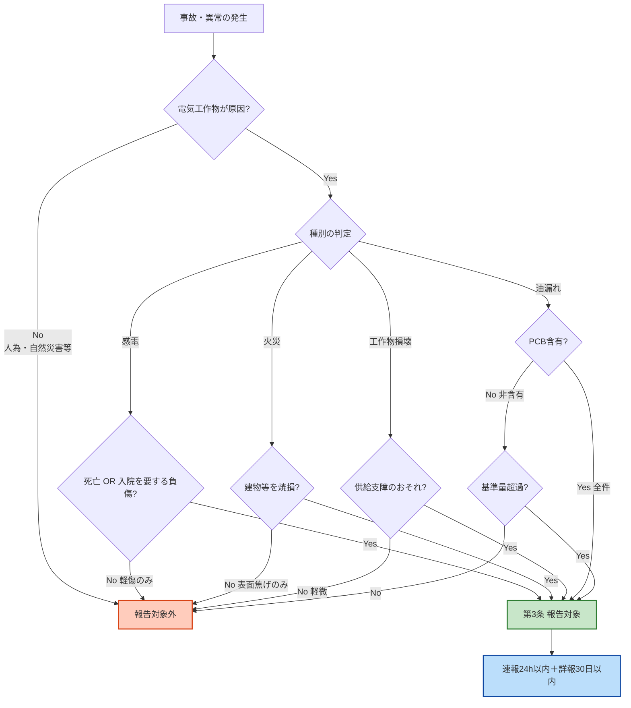

# 電気関係報告規則 第3条 — 事故報告

!!! note "📊 試験対策メタ"
    **出題頻度**: 🔥🔥🔥🔥🔥（過去14年で 6 回出題・**R05上以降4期連続**で法規分野の最頻出）

    **重要度**: **S**（最重要・R05以降毎回出題で R08 でも確実に出題が見込まれる）

    **直近出題**: R07下 問2（穴埋）／R07上 問2（論説）／R06上 問2（論説）／R05上 問2（穴埋）／R02 問2（穴埋）／H26 問2（穴埋）

> 電気関係報告規則第3条は、自家用電気工作物等で発生した事故について、設置者が報告を行う手続を定める。**速報＝24時間以内（電話等）／詳報＝30日以内（様式第13）** の二段階構造と、**起算点が「知った時」**（発生した時ではない）である点が最頻出論点。R05上以降、**4期連続で出題**されており、R08でも高確率で出題される。

| 項目 | 内容 |
|------|------|
| 条文 | 電気関係報告規則 第3条 |
| 規定内容 | 自家用電気工作物等の事故が発生した場合の報告手続（対象・期限・方法） |
| 性格 | 手続規定（数値規定＝期限24h／30日が条文本文に明記） |
| 上位 | 電気事業法 第106条（報告の徴収） |
| 報告先 | **原則：所轄産業保安監督部長** ／ 例外：事故種別により **経済産業大臣** |
| **典拠（一次ソース）** | 電気関係報告規則（昭和40年通商産業省令第54号、令和5年改正版）第3条 ／ 上位法：電気事業法第106条（報告の徴収） |
| **照合日** | 2026-05-05（kakomon.yml で出題実績6件を照合・H26問2／R02問2／R05上問2／R06上問2／R07上問2／R07下問2） |
| **隣接条文** | ← [第1条（定義）](jiko-1.md) ／ [第4条（公害報告）](jiko-4.md) ／ [第5条（自家用工作物届出）](jiko-5.md) → |
| **混同注意** | 同番号の **電気事業法第3条**（電気事業の許可）／**電技省令第3条**（適用除外）／**解釈第3条**（適用範囲）とは **別物**。本条は「報告規則」第3条 |

---

## 🎯 試験直前 最終暗記表

電験3種では、**A. まず暗記する内容** と **B. 条文上の正確な補足** を分けて押さえる。試験当日はA層を優先、A層が定着したらB層で取りこぼしを防ぐ。

### A. 試験でまず覚える内容（コア暗記）

| 論点 | 覚える内容 |
|------|------------|
| **速報** | 事故の発生を **知った時から24時間以内** |
| **詳報** | 事故の発生を **知った日から起算して30日以内** |
| **速報の方法** | **電話等** |
| **詳報の方法** | **様式第13** |
| **報告義務者** | **電気事業者、自家用電気工作物を設置する者** |
| **報告先** | **原則：所轄産業保安監督部長** |
| **感電死傷事故** | **死亡** 又は **入院を要する** 事故 |
| **電気火災事故** | **電気的異常が原因** となる火災 |
| **波及事故** | **自家用電気工作物** が **一般送配電事業者等** に **供給支障** を発生させる事故 |

### B. 条文上の正確な補足（B問題・論説対策）

| 論点 | 補足内容 |
|------|----------|
| **報告先の例外** | 事故種別によっては **経済産業大臣** が報告先となる場合がある |
| **事故分類** | 条文上は「感電・火災・波及・損壊・PCB・蓄電池・その他」など細分化されている |
| **最新改正** | **蓄電池・電力貯蔵装置** 関連の事故が報告対象として明確化 |
| **起算点の用語差** | 速報は「知った **時**」、詳報は「知った **日**」（用語が異なる） |
| **入院の判定** | 客観的医療判断（外来診療のみは対象外） |

---

## 1. 全体像と要点

- **二段階報告**：速報（==**24時間以内**==・電話等）→ 詳報（==**30日以内**==・様式第13）
- **起算点**：事故の発生を==**知った時**==（発生時ではない）
- **報告先**：原則 ==**所轄産業保安監督部長**==／例外として **経済産業大臣** の場合あり（事故種別による）
- **報告対象**：感電死傷／電気火災／**波及事故**／工作物の損壊／PCB漏油／**蓄電池等**／その他基準超過
- **「入院を要する」**＝感電事故の報告閾値（外来診療のみは対象外）
- **電気的異常が原因**であることが必要（人為・自然災害等が原因なら報告対象外）

### ① 全体像 — 速報と詳報の役割分担

<svg viewBox="0 0 800 360" xmlns="http://www.w3.org/2000/svg" width="100%" preserveAspectRatio="xMidYMid meet">
<defs>
<filter id="shJ3a" x="-20%" y="-20%" width="140%" height="140%"><feDropShadow dx="0" dy="2" stdDeviation="2" flood-opacity="0.15"/></filter>
<linearGradient id="gJ3main" x1="0" y1="0" x2="0" y2="1"><stop offset="0%" stop-color="#bbdefb"/><stop offset="100%" stop-color="#90caf9"/></linearGradient>
<linearGradient id="gJ3a" x1="0" y1="0" x2="0" y2="1"><stop offset="0%" stop-color="#ffccbc"/><stop offset="100%" stop-color="#ff8a65"/></linearGradient>
<linearGradient id="gJ3b" x1="0" y1="0" x2="0" y2="1"><stop offset="0%" stop-color="#fff9c4"/><stop offset="100%" stop-color="#fff176"/></linearGradient>
</defs>
<text x="400" y="26" text-anchor="middle" font-size="15" font-weight="700" fill="#212121">第3条 — 二段階報告のタイムライン</text>
<text x="400" y="44" text-anchor="middle" font-size="11" fill="#666">起算点は「事故発生を知った時」（発生した時ではない）</text>
<line x1="60" y1="160" x2="740" y2="160" stroke="#424242" stroke-width="2.5"/>
<polygon points="740,160 730,154 730,166" fill="#424242"/>
<circle cx="120" cy="160" r="9" fill="#d32f2f" stroke="#b71c1c" stroke-width="2.5"/>
<text x="120" y="138" text-anchor="middle" font-size="12" font-weight="700" fill="#b71c1c">事故発生を</text>
<text x="120" y="124" text-anchor="middle" font-size="12" font-weight="700" fill="#b71c1c">知った時 (T0)</text>
<text x="120" y="186" text-anchor="middle" font-size="10" fill="#616161">起算点</text>
<circle cx="320" cy="160" r="9" fill="#f57f17" stroke="#e65100" stroke-width="2.5"/>
<text x="320" y="138" text-anchor="middle" font-size="12" font-weight="700" fill="#e65100">T0 + 24時間</text>
<text x="320" y="186" text-anchor="middle" font-size="10" fill="#e65100">速報期限</text>
<circle cx="640" cy="160" r="9" fill="#2e7d32" stroke="#1b5e20" stroke-width="2.5"/>
<text x="640" y="138" text-anchor="middle" font-size="12" font-weight="700" fill="#1b5e20">T0 + 30日</text>
<text x="640" y="186" text-anchor="middle" font-size="10" fill="#1b5e20">詳報期限</text>
<rect x="220" y="210" width="200" height="120" rx="10" fill="url(#gJ3a)" stroke="#d84315" stroke-width="2.5" filter="url(#shJ3a)"/>
<text x="320" y="234" text-anchor="middle" font-size="13" font-weight="700" fill="#bf360c">速報（1次報告）</text>
<line x1="240" y1="244" x2="400" y2="244" stroke="#d84315" stroke-width="1"/>
<text x="320" y="262" text-anchor="middle" font-size="11" fill="#bf360c">期限：24時間以内</text>
<text x="320" y="280" text-anchor="middle" font-size="11" fill="#bf360c">方法：電話・FAX等</text>
<text x="320" y="298" text-anchor="middle" font-size="11" fill="#bf360c">内容：概要のみ</text>
<text x="320" y="320" text-anchor="middle" font-size="10" fill="#bf360c">理由：緊急対応の必要</text>
<rect x="540" y="210" width="200" height="120" rx="10" fill="url(#gJ3b)" stroke="#f9a825" stroke-width="2.5" filter="url(#shJ3a)"/>
<text x="640" y="234" text-anchor="middle" font-size="13" font-weight="700" fill="#f57f17">詳報（2次報告）</text>
<line x1="560" y1="244" x2="720" y2="244" stroke="#f9a825" stroke-width="1"/>
<text x="640" y="262" text-anchor="middle" font-size="11" fill="#f57f17">期限：30日以内</text>
<text x="640" y="280" text-anchor="middle" font-size="11" fill="#f57f17">方法：文書（様式）</text>
<text x="640" y="298" text-anchor="middle" font-size="11" fill="#f57f17">内容：原因・対策</text>
<text x="640" y="320" text-anchor="middle" font-size="10" fill="#f57f17">理由：原因調査に時間</text>
<line x1="320" y1="170" x2="320" y2="208" stroke="#d84315" stroke-width="1.5" stroke-dasharray="3,2"/>
<line x1="640" y1="170" x2="640" y2="208" stroke="#f9a825" stroke-width="1.5" stroke-dasharray="3,2"/>
</svg>

**読み解き**: 起算点は **「事故発生を知った時」**。夜間・休日に発生した事故は、発見・通報された時点から24時間／30日のカウントが始まる。速報は**緊急対応**（被害拡大防止・現場立入）のため、詳報は**原因調査**（分解・試験・聞き取り）のためという役割分担を理解すれば期限の差を間違えない。

### ② 要点（試験前30秒復習用）

| 観点 | 内容 |
|------|------|
| **期限の核心** | 速報 **24時間以内** ／ 詳報 **30日以内** |
| **起算点** | 事故の発生を **知った時** （「発生した時」ではない） |
| **報告先** | **所轄の産業保安監督部長** |
| **対象範囲** | 感電死傷／電気火災／工作物損壊／供給支障／PCB漏油／その他 |
| **「入院を要する」** | 報告対象の閾値（外来診療のみは対象外） |
| **対象外** | 軽傷／電気以外が原因の事故／計画停止 |

??? question "セルフチェック: 事故速報の期限は？その根拠は？"
    **24時間以内**。理由は緊急性 — 事故が発生したら、関係機関が現場立入・被害拡大防止のために直ちに対応する必要があるため、速報は概要だけでも電話で先に伝える設計。詳報は **30日以内** — 原因調査（分解検査・試験・聞き取り等）に時間を要するため。**起算点は「知った時」** であり、「発生した時」ではない点に注意。

??? question "セルフチェック: 夜間・無人事業場で事故が起きた場合、24時間はいつから？"
    **発見・通報された時点（=「知った時」）から起算**。条文は「発生した時から」ではなく「**事故が発生したことを知った時から**」と規定しており、設置者が事故の存在を認識した瞬間がT0。深夜2時に変圧器が爆発しても、翌朝7時に巡回で発見すれば、その7時から24時間／30日のカウントが始まる。

---

## 2. 条文原文

**電気関係報告規則 第3条（事故報告）**

> 電気事業者及び自家用電気工作物を設置する者は、その電気事業の用に供する電気工作物又は自家用電気工作物に関して<mark>事故</mark>が発生したときは、次の各号に掲げる事故の事故発生の日時及び場所、事故が発生した電気工作物並びに事故の概要について、当該事故の発生を<mark>知った時</mark>から<mark>24時間以内</mark>可能な限り速やかに電話等の方法により、かつ、<mark>事故の発生を知った日</mark>から起算して<mark>30日以内</mark>に様式第13の報告書を提出して、それぞれ<mark>所轄産業保安監督部長</mark>に報告しなければならない。

> <small>黄色マーカー = 過去問で実際に穴埋め出題されたキーワード</small>

**主な報告対象事故（条文各号の要約）**

| 事故種別 | 報告要件の核心 |
|---------|----------------|
| **感電死傷事故** | 死亡 OR **入院を要する** 負傷 |
| **電気火災事故** | **電気的異常が原因** となる火災（建物等を焼損したもの） |
| **電気工作物の損壊** | **供給支障のおそれ** がある損壊（破損・故障・誤操作等） |
| **波及事故** | **自家用電気工作物** が **一般送配電事業者等** に **供給支障** を発生させた事故 |
| **供給支障事故（事業者）** | 電気事業者の場合、一定規模以上の停電 |
| **PCB含有機器の漏油** | PCB含有機器は **全件** 報告（量に関係なし） |
| **蓄電池・電力貯蔵装置事故** | 大型蓄電池・電力貯蔵装置の損壊・火災等（**最新改正** で対象明確化） |
| **その他** | 経産大臣が定める基準を超える異常 |

!!! tip "電験3種で出やすい事故種別"
    **波及事故** は法規分野の超頻出論点。「自家用設備の事故が **一般送配電事業者** 側に波及して停電を起こす」構造を理解する。電気火災は条文上「**電気的異常が原因**」が要件で、外部から飛び火した火災（人為的失火等）は対象外。

!!! note "起算点の重要性"
    「事故が発生した時」ではなく「事故が発生したことを **知った時**」。条文中で速報は「知った時」起算、詳報は「知った日」起算と用語が分かれる点も論述問題で問われる。

### 過去問で問われた箇所

| 出題で狙われるキーワード | 過去問での扱い |
|---|---|
| **事故** | 報告事象として穴埋め |
| **24時間以内** | 速報期限の数値穴埋め（最頻出） |
| **30日以内** | 詳報期限の数値穴埋め |
| **知った時** ／ **知った日** | 起算点の表現として穴埋め（時 vs 日の使い分け） |
| **電話等** | 速報の方法として穴埋め |
| **様式第13** ／ **報告書** | 詳報の方法として穴埋め |
| **所轄産業保安監督部長** | 報告先として穴埋め |
| **入院を要する** | 感電事故の対象閾値として論述 |

!!! note "出典"
    電気関係報告規則（昭和40年通商産業省令第54号、令和5年改正版）第3条 — 期限・対象は条文本文に直接規定。本規則の上位法は電気事業法第106条（報告の徴収）。

---

## 3. 原文解析（ブロック分解）

条文を意味ブロック単位に分解し、それぞれの試験ポイントを整理する。

| 原文ブロック | 意味 | 試験のポイント |
|---|---|---|
| 「電気事業者及び自家用電気工作物を設置する者は」 | 報告義務者＝**事業者＋自家用設置者** | 「電気使用者一般」ではない。設置者責任 |
| 「事故が発生したときは」 | 報告事象＝**事故** | 「異常」「故障」全般ではなく条文各号で限定 |
| 「事故の発生を知った時から24時間以内」 | 速報の期限と起算点 | 「発生した時」は誤り。**「知った時」** が正解 |
| 「電話等の方法により」 | 速報の手段＝**口頭等** | 「文書のみ」は誤り。電話・FAX等の即時手段 |
| 「事故の発生を知った日から起算して30日以内」 | 詳報の期限と起算点 | 速報は「時」、詳報は「日」起算で **用語が異なる** |
| 「様式第13の報告書を提出して」 | 詳報の方法＝**所定様式の文書** | 形式自由ではなく定型書式 |
| 「所轄産業保安監督部長に報告しなければならない」 | 報告先＝**産業保安監督部長** | 「経済産業大臣」「都道府県知事」は誤り |

??? question "セルフチェック: 速報を文書（FAX）で送れば、詳報は省略できるか？"
    **誤り**。速報と詳報は **別個の義務** であり、片方で他方を兼ねることはできない。速報は緊急情報の通知（24h以内）、詳報は原因究明の正式報告（30日以内・様式第13）と目的が異なるため、両方を提出する必要がある。

??? question "セルフチェック: 「発電用電気工作物の事故」は対象外か？"
    **対象**。条文は「電気事業の用に供する電気工作物又は自家用電気工作物」と規定し、発電用・送電用・配電用・需要設備すべてを含む。発電所の事故（タービン破損・発電機損壊等）も第3条の対象。

---

## 4. かみ砕き解説（因果理解）

### なぜ二段階報告か — 緊急対応 vs 原因究明の役割分担

事故報告は **同時に2つの目的** を達成する必要がある：

1. **緊急対応**：被害拡大の防止、現場保全、関係機関の動員
2. **原因究明**：再発防止策の立案、業界横展開、規制改善

この2つは**時間軸が真逆**のため、一本の報告では成立しない：

| 観点 | 速報（24時間） | 詳報（30日） |
|------|---------------|--------------|
| 目的 | 緊急対応 | 原因究明・再発防止 |
| 必要な情報 | 概要のみ（誰が／何が／どこで） | 詳細（なぜ／どう防ぐ） |
| 必要な調査時間 | ゼロ（即時） | 数週間（分解・試験） |
| 手段 | 電話等の口頭（迅速性優先） | 様式第13の文書（正確性優先） |

つまり、**「速さ」と「深さ」を分離する**ことで両立させているのが二段階構造。

### なぜ起算点は「発生した時」ではなく「知った時」か

無人変電所・夜間事業場・遠隔監視設備など、**事故発生と発見にタイムラグ**があるケースが多い。「発生した時」起算だと：

- 事故発生から発見まで12時間 → 報告期限まで残り12時間しかない
- 監視機器の故障で1週間気付かない場合 → 既に期限切れで報告不可能

「知った時」起算なら、設置者が認識した瞬間からカウントが始まり、**現実的に報告可能な期限**として機能する。

### なぜ「入院を要する」が報告対象の閾値か

感電事故は軽微なもの（一時的にビリッとした程度）まで含めると年間膨大な件数となり、規制当局がすべてを処理できない。**「入院を要する」** という客観的な医療判断を閾値にすることで：

- 重大性を二項判定で確定（入院した／しなかった）
- 報告件数を実質的な重大事故に絞り込む
- 集計・分析の精度を確保

!!! tip "暗記のコツ"
    「24時間／30日」「知った時／知った日」「電話／様式」は **すべて2点セット** で覚える。片方だけ思い出して他方を間違える失点を防げる。

---

## 5. 図で理解

### 報告対象判定フロー

### 上位法（電気事業法）と本規則の階層

<svg viewBox="0 0 800 320" xmlns="http://www.w3.org/2000/svg" width="100%" preserveAspectRatio="xMidYMid meet">
<defs>
<filter id="shJ3b" x="-20%" y="-20%" width="140%" height="140%"><feDropShadow dx="0" dy="2" stdDeviation="2" flood-opacity="0.15"/></filter>
</defs>
<text x="400" y="26" text-anchor="middle" font-size="15" font-weight="700" fill="#212121">事故報告の法令体系</text>
<text x="400" y="44" text-anchor="middle" font-size="11" fill="#666">電気事業法（法律）→ 電気関係報告規則（省令）→ 第3条（手続）</text>
<rect x="240" y="60" width="320" height="56" rx="10" fill="#bbdefb" stroke="#0d47a1" stroke-width="2.5" filter="url(#shJ3b)"/>
<text x="400" y="83" text-anchor="middle" font-size="13" font-weight="800" fill="#0d47a1">電気事業法 第106条</text>
<text x="400" y="103" text-anchor="middle" font-size="11" fill="#1565c0">報告の徴収（経済産業大臣の権限）</text>
<line x1="400" y1="116" x2="400" y2="146" stroke="#0d47a1" stroke-width="2"/>
<polygon points="400,148 394,140 406,140" fill="#0d47a1"/>
<rect x="240" y="148" width="320" height="56" rx="10" fill="#c8e6c9" stroke="#2e7d32" stroke-width="2.5" filter="url(#shJ3b)"/>
<text x="400" y="171" text-anchor="middle" font-size="13" font-weight="800" fill="#1b5e20">電気関係報告規則（省令）</text>
<text x="400" y="191" text-anchor="middle" font-size="11" fill="#2e7d32">報告手続を具体化（第1〜5条）</text>
<line x1="400" y1="204" x2="400" y2="234" stroke="#2e7d32" stroke-width="2"/>
<polygon points="400,236 394,228 406,228" fill="#2e7d32"/>
<rect x="80" y="236" width="200" height="60" rx="10" fill="#ffccbc" stroke="#d84315" stroke-width="2" filter="url(#shJ3b)"/>
<text x="180" y="260" text-anchor="middle" font-size="12" font-weight="700" fill="#bf360c">第3条 — 事故報告</text>
<text x="180" y="278" text-anchor="middle" font-size="10" fill="#bf360c">速報24h／詳報30日</text>
<rect x="300" y="236" width="200" height="60" rx="10" fill="#fff9c4" stroke="#f9a825" stroke-width="2" filter="url(#shJ3b)"/>
<text x="400" y="260" text-anchor="middle" font-size="12" font-weight="700" fill="#f57f17">第4条 — 公害報告</text>
<text x="400" y="278" text-anchor="middle" font-size="10" fill="#f57f17">ばい煙・水質汚濁等</text>
<rect x="520" y="236" width="200" height="60" rx="10" fill="#e1bee7" stroke="#6a1b9a" stroke-width="2" filter="url(#shJ3b)"/>
<text x="620" y="260" text-anchor="middle" font-size="12" font-weight="700" fill="#4a148c">第5条 — 工作物届出</text>
<text x="620" y="278" text-anchor="middle" font-size="10" fill="#4a148c">設置・変更・廃止</text>
</svg>

**読み解き**: 第3条（事故報告）は、**電気事業法第106条**（経済産業大臣が事業者に報告を求める権限）を**省令レベルで具体化**した規定。「報告すべき事故の範囲・期限・手続」を細目として定める構造。試験では「報告規則は何法に基づくか」（→電気事業法）が穴埋めされることがある。

---

## 6. 報告手順とフロー

### Step 1: 速報（24時間以内 — 電話等）

1. 事故の発生を**認識**（発見・通報受領）
2. **所轄産業保安監督部** の当番に **電話・FAX等** で連絡
3. 発生日時・場所・設備名・被害概要を口頭で伝達
4. 電話記録簿等に記録を残す（後の詳報でも参照）

### Step 2: 詳報（30日以内 — 様式第13）

1. **原因調査**（分解検査・試験・関係者聞き取り・運転記録確認）
2. **責任要因の特定**（設計／施工／保全／運用のどこに起因するか）
3. **再発防止策**の立案（個別対策＋類似設備への横展開）
4. **様式第13の報告書** を作成し、所轄産業保安監督部長に提出

!!! note "原因分析の3階層"
    詳報で求められる原因分析は通常以下の階層で行う：

    1. **直接原因**: ケーブル短絡・過熱等の直接的な物理事象
    2. **根本原因**: 保全不足・設計不良・運用ミス等の背景要因
    3. **組織的要因**: マニュアル未整備・教育不足・点検制度の欠陥

### 報告書記載項目（様式第13の主な欄）

| 項目 | 内容 |
|------|------|
| 事故発生日時 | 年月日・時刻（**知った時**ではなく実際の発生時刻） |
| 事故発生場所 | 事業場名・住所・該当設備の系統位置 |
| 事故設備 | 機器名称・定格・製造者・運転履歴 |
| 事故の概要 | 発生事象・被害状況（人的／物的／供給支障） |
| 事故原因 | 直接原因・根本原因・組織的要因 |
| 再発防止策 | 個別対策・横展開対策・実施期限 |

!!! warning "様式第13は所定書式・電子申請が標準"
    旧来の紙提出から電子申請（経済産業省 産業保安届出システム等）への移行が進む。提出方法は所轄産業保安監督部の最新指示に従う。

---

## 7. 上位法（電気事業法）と本規則の関係

### 電気事業法 第106条（報告の徴収）

「経済産業大臣は、この法律の施行に必要な限度において、電気事業者に対し、その業務に関する報告を求めることができる」 → **報告義務の根拠**

### 電気関係報告規則（省令） 第3条

- 報告すべき事故を**列挙**（感電死傷／火災／工作物損壊／供給支障／PCB漏油／その他）
- 報告の**期限**を規定（速報24h／詳報30日）
- 報告の**方法と書式**を規定（電話等／様式第13）
- **権限委任**：経済産業大臣 → 所轄産業保安監督部長（実務窓口）

!!! note "上位法と下位法の関係"
    試験では：

    - 「事故が発生したら報告する義務がある」→ **電気事業法第106条**（権限の根拠）
    - 「速報24時間／詳報30日」「様式第13」→ **電気関係報告規則第3条**（具体的手続）

    報告規則は **電気事業法に基づく省令** であり、技術基準（電技省令）とは独立した別系統の規則。

### なぜ報告先が「所轄産業保安監督部長」なのか

報告先は **経済産業大臣ではなく、地方支分部局の産業保安監督部長**。これは権限委任の構造に理由がある：

| 理由 | 説明 |
|------|------|
| **地理的近接性** | 産業保安監督部は全国9ブロック（北海道・東北・関東東北・中部・中部近畿・近畿・中国四国・九州・那覇）に配置。事故現場への **立入検査・現地調査** を機動的に実施可能 |
| **専門人員の配置** | 各監督部に電気保安専門の **産業保安監督官** が常駐。技術的判断・原因究明の助言が即時に行える |
| **行政事務の効率化** | 全国で年間数百件発生する事故報告を経済産業大臣（本省）が直接受理するのは非現実的。**地方分権** で処理速度を確保 |
| **法的根拠** | 電気事業法施行令・経済産業省組織令により、本省（経済産業大臣）の権限の一部が **産業保安監督部長に委任** されている |

!!! tip "「所轄」の意味"
    「**所轄**」＝事故が発生した事業場の所在地を管轄する産業保安監督部。本社所在地ではなく **事故現場の所在地** で判断する。複数県にまたがる事業者の場合は、被害が発生した事業場の所轄部に報告する。

### 報告先の例外 — 経済産業大臣が報告先となる場合

電験3種では「**原則：所轄産業保安監督部長**」をまず暗記する。ただし条文上、事故の種類・規模・所管区分によっては **経済産業大臣** が直接の報告先となるケースもある：

| 観点 | 内容 |
|------|------|
| **原則の根拠** | 経済産業大臣の権限が地方支分部局（産業保安監督部長）に **委任** されている |
| **例外が生じる典型** | 大規模・広域に影響する事故、複数監督部にまたがる事故、特定種別（広域供給支障の一部等） |
| **試験での扱い** | A問題（穴埋）は「**所轄産業保安監督部長**」が正解として頻出。B問題・論説では「事故種別によっては経済産業大臣の場合あり」を補足できると正確 |

!!! warning "ひっかけ：A問題では「所轄産業保安監督部長」が原則正解"
    試験では選択肢に「経済産業大臣」「都道府県知事」「電力会社」が混入する。**A問題（穴埋）の頻出パターンでは「所轄産業保安監督部長」が正解**。論説では「ただし条文上は事故種別により経済産業大臣の場合もある」と補足できれば正確性が増す。

### 最新改正 — 蓄電池・電力貯蔵装置の事故報告対象拡大

近年、再生可能エネルギーの普及とともに **大型蓄電池・電力貯蔵装置** の設置が増加。これに伴い電気関係報告規則が改正され、これらの設備に係る事故も報告対象として明確化された。

| 観点 | 内容 |
|------|------|
| **背景** | 系統用蓄電池・産業用大型蓄電システムの増加。火災・損壊事故の可視化と再発防止 |
| **対象** | 自家用電気工作物としての **蓄電所・電力貯蔵装置** の損壊・火災・供給支障等 |
| **試験での扱い** | 直近の問題で「**蓄電池**」「**電力貯蔵装置**」が選択肢に登場する可能性あり。R08での新規出題に警戒 |

!!! note "出題予測"
    R07以降の最新改正論点として、選択肢に「蓄電池」「電力貯蔵装置」が混入する出題パターンが想定される。「これらは報告対象 **外** である」という誤った選択肢は **誤り**（最新改正で対象に明確化）。

---

## 8. 頻出ひっかけ・落とし穴

試験で実際に失点しやすいポイントを、重大度別に整理した。

### 🔴 致命的（これを間違えたら即失点）

| # | ❌ 誤った認識 | ✅ 正しい認識 |
|---|--------------|--------------|
| 1 | 速報は文書（書面）で提出 | **電話等の口頭** が条文の指定。迅速性優先の設計 |
| 2 | 詳報は事故発生当日に提出 | **30日以内**。原因調査に時間が必要 |
| 3 | 起算点は「事故が発生した時」 | **「事故の発生を知った時」**。発見時点からカウント |
| 4 | 発電用電気工作物は対象外 | **対象**。事業用・自家用問わず全電気工作物が対象 |
| 5 | 軽傷も全件報告 | **「入院を要する」**負傷が条件。外来診療のみは対象外 |

### 🟡 注意（出題頻度高い）

| # | ❌ 誤った認識 | ✅ 正しい認識 |
|---|--------------|--------------|
| 6 | 速報を提出すれば詳報は不要 | **両方とも別個の義務**。片方で他方を兼ねない |
| 7 | 報告先は **常に** 経済産業大臣（直接） | **原則は所轄産業保安監督部長**。事故種別により経済産業大臣の場合あり（例外） |
| 8 | 火災原因が他物（人為等）でも電気工作物の損壊なら報告 | **「電気工作物が原因」** の因果関係が必須。人為的火災は対象外 |
| 9 | PCB含有機器の漏油は基準量超過時のみ | **PCB含有は全件報告**（量に関係なし）。非含有は基準量超過時 |

### 🟢 軽微（余裕があれば）

| # | ❌ 誤った認識 | ✅ 正しい認識 |
|---|--------------|--------------|
| 10 | 速報の起算点と詳報の起算点は同じ表現 | 速報は「知った **時**」、詳報は「知った **日**」。用語が異なる |
| 11 | 報告は事業者の義務で受電者は無関係 | **電気事業者及び自家用電気工作物を設置する者** の双方が義務者 |

---

## 9. 穴埋め過去問チャレンジ

!!! abstract "問題1: 速報の期限と方法"
    自家用電気工作物を設置する者は、その工作物に関して事故が発生したときは、当該事故の発生を（　ア　）から（　イ　）時間以内可能な限り速やかに（　ウ　）等の方法により所轄産業保安監督部長に報告しなければならない。

??? success "解答"
    - ア = **知った時**
    - イ = **24**
    - ウ = **電話**

    「発生した時」「48時間」「文書」は典型的な誤答選択肢。3点セットで覚える。

!!! abstract "問題2: 詳報の期限と方法"
    速報の後、当該事故の発生を（　ア　）から起算して（　イ　）日以内に（　ウ　）の報告書を提出しなければならない。

??? success "解答"
    - ア = **知った日**
    - イ = **30**
    - ウ = **様式第13**

    速報は「知った **時**」、詳報は「知った **日**」と用語が異なる点を区別する。

!!! abstract "問題3: 報告対象事故の範囲"
    感電による死傷事故は、被災者が（　ア　）を要する場合に報告対象となる。電気火災は、電気工作物が原因で（　イ　）等を焼損した場合に報告対象となる。電気工作物の損壊は、（　ウ　）のおそれがある場合に報告対象となる。

??? success "解答"
    - ア = **入院**
    - イ = **建物**
    - ウ = **供給支障**

    「軽傷も対象」「表面焦げも対象」は典型的な誤答。客観的閾値の存在を理解する。

!!! abstract "問題4: 報告先と上位法"
    本規則は（　ア　）法第106条に基づき制定され、報告先は所轄（　イ　）長である。

??? success "解答"
    - ア = **電気事業**
    - イ = **産業保安監督部**

    「電気設備技術基準」「経済産業大臣（直接）」は誤答。報告規則の基づく法律と権限委任先を区別する。

---

## 10. まぎらわしい選択肢と正解の違い

| 誤った記述 | 正しい記述 | なぜ違うか |
|---|---|---|
| 「速報は事故発生から24時間以内」 | **事故の発生を知った時から24時間以内** | 起算点は「発生時」ではなく「**認識時**」 |
| 「詳報は事故発生から30日以内」 | **事故の発生を知った日から30日以内** | 詳報は「**知った日**」起算（速報の「時」と区別） |
| 「速報は文書で提出する」 | **電話等の方法**（口頭等）で提出 | 迅速性優先のため口頭手段 |
| 「詳報は形式自由の文書」 | **様式第13** の所定書式 | 定型書式での提出が条文上の要求 |
| 「軽傷の感電事故も全件報告」 | **入院を要する** 負傷から報告対象 | 客観的医療閾値での絞り込み |
| 「報告先は **常に** 経済産業大臣」 | **原則：所轄産業保安監督部長** ／ 例外：事故種別により経済産業大臣 | 原則と例外を区別する |
| 「PCB非含有油の漏れも全件報告」 | PCB含有は全件・**非含有は基準量超過時** | PCB の有無で要件が異なる |
| 「自家用設置者のみが報告義務者」 | **電気事業者＋自家用設置者** の双方 | 義務者は2類型ある |
| 「波及事故とは電力会社の停電事故」 | **自家用** 電気工作物が **一般送配電事業者等に** 供給支障を発生させた事故 | 方向は「自家用 → 系統」。電力会社側起因の停電は別カテゴリ |
| 「蓄電池・電力貯蔵装置の事故は報告対象外」 | **最新改正で対象に明確化** | 再エネ普及に伴う改正を反映

---

## 11. 関連条文・関連ページ

- [電気関係報告規則 第1条：定義](jiko-1.md) — 本条で使う「電気火災事故・破損事故・供給支障事故」等の用語定義の根拠
- [電気関係報告規則 第4条：公害報告](jiko-4.md) — 事故報告との違い（直接的害 vs 継続的影響）
- [電気関係報告規則 第5条：自家用電気工作物の届出](jiko-5.md) — 設置・変更・廃止の事前事後届出
- [電気事業法の体系](../../themes/jigyoho-taikei.md) — 報告規則の上位法としての位置づけ
- [電気施設管理](../../themes/shisetsu-kanri.md) — 現場での報告体制・記録管理

---

## 12. 過去問実績

| 年度 | 問 | 形式 | 論点 |
|------|-----|------|------|
| R07下 | 問2 | 穴埋 | 電気関係報告規則に基づく事故報告 |
| R07上 | 問2 | 論説 | 自家用電気工作物の事故報告 |
| R06上 | 問2 | 論説 | 自家用電気工作物の事故報告 |
| R05上 | 問2 | 穴埋 | 事故の定義及び事故報告（電気関係報告規則） |
| R02 | 問2 | 穴埋 | 電気関係報告規則に基づく事故報告 |
| H26 | 問2 | 穴埋 | 電気関係報告規則に基づく自家用電気工作物設置者の報告 |

!!! note "出題傾向"
    過去14年で6回出題。**R05上以降4期連続出題**で頻度が急上昇している。穴埋・論説の双方で出題され、論説では「報告制度の趣旨」「速報と詳報の役割分担」「再発防止策」が問われる。穴埋では期限の数値（24h／30日）と起算点（知った時／知った日）が頻出。

!!! note "R08 出題予測"
    R07下出題から1年以内は再出題確率が下がるが、**4期連続で出題**しているため引き続き高警戒。

    **予想パターン**:

    - 「感電死傷の報告要件」（**入院を要する** vs 軽傷）
    - 「速報と詳報の使い分け」（24h vs 30日／時 vs 日／電話 vs 様式）
    - 「起算点」（**知った時** vs 発生した時）
    - 「報告対象外の事故」（軽傷／電気以外原因／計画停止）
    - 「報告先」（**所轄産業保安監督部長**）

---

## 13. 用語集

第3条の条文や出題で登場する主要用語を整理した。

| 用語 | 読み | 意味 | 試験での注意点 |
|------|------|------|----------------|
| 速報 | そくほう | 事故発生を知った時から24時間以内に行う1次報告 | 「電話等」の口頭手段。書面ではない |
| 詳報 | しょうほう | 事故発生を知った日から30日以内に提出する正式報告書 | **様式第13** の所定書式 |
| 起算点 | きさんてん | 期限カウントの開始時点 | **「知った時」**（発生時ではない） |
| 産業保安監督部 | さんぎょうほあんかんとくぶ | 経済産業省の地方支分部局。電気保安行政を担当 | 報告先＝所轄産業保安監督部 **長** |
| 自家用電気工作物 | じかようでんきこうさくぶつ | 一般用以外の電気工作物（受電電圧600V超等）。事業者・需要設備両方を含む | 報告義務者の対象範囲 |
| 入院を要する | にゅういんをようする | 治療のために入院加療が必要な傷病 | 感電死傷の報告閾値。外来診療のみは対象外 |
| 供給支障 | きょうきゅうししょう | 電気の供給が継続できなくなる状態（停電・部分停電） | 工作物損壊の報告要件 |
| PCB | ぴーしーびー | ポリ塩化ビフェニル。絶縁油等に使われた有害物質 | PCB含有機器の漏油は **全件** 報告 |
| 様式第13 | ようしきだい13 | 電気関係報告規則別表で定める事故報告書の所定書式 | 詳報の提出形式として穴埋め頻出 |
| 経済産業大臣 | けいざいさんぎょうだいじん | 法律上の権限者。事故種別によっては直接の報告先となる | A問題では「所轄産業保安監督部長」が原則正解。「経産大臣の場合もある」のは例外として補足 |
| 波及事故 | はきゅうじこ | 自家用電気工作物が原因で **一般送配電事業者等に** 供給支障を発生させた事故 | 方向は「自家用→系統」。法規分野の頻出論点 |
| 電力貯蔵装置 | でんりょくちょぞうそうち | 大型蓄電池等で電力を貯える装置。蓄電所の中核 | 最新改正で事故報告対象に明確化。R08新規出題候補 |

---

## 14. 最終チェック

### 期限・数値暗記

- [ ] 速報 = **24時間以内** ／ 詳報 = **30日以内**
- [ ] 速報の起算点 = 事故の発生を **知った時**
- [ ] 詳報の起算点 = 事故の発生を **知った日**
- [ ] 速報の方法 = **電話等** の口頭手段
- [ ] 詳報の方法 = **様式第13** の文書

### 条文キーワード

- [ ] 報告義務者 = **電気事業者＋自家用電気工作物を設置する者**
- [ ] 報告先 = **原則：所轄産業保安監督部長** ／ 例外：事故種別により経済産業大臣
- [ ] 上位法 = **電気事業法 第106条**（報告の徴収）

### 報告対象事故

- [ ] 感電死傷：死亡 OR **入院を要する** 負傷
- [ ] 電気火災：**電気的異常が原因** となる火災（建物等を焼損）
- [ ] 工作物損壊：**供給支障のおそれ** がある損壊
- [ ] **波及事故**：自家用 → 一般送配電事業者等への供給支障
- [ ] 油漏れ：**PCB含有は全件** ／非含有は基準量超過時
- [ ] **蓄電池・電力貯蔵装置**：最新改正で対象明確化
- [ ] その他：経産大臣が定める基準を超える異常

### 因果理解

- [ ] なぜ二段階か = **緊急対応**（速報）＋**原因究明**（詳報）の役割分担
- [ ] なぜ「知った時」起算か = 無人設備・夜間事故の現実対応
- [ ] なぜ「入院を要する」閾値か = 重大事故への絞り込み・客観判定

### ひっかけ対策

- [ ] 「速報は文書」は誤り → **電話等**
- [ ] 「起算点は発生時」は誤り → **知った時**
- [ ] 「軽傷も対象」は誤り → **入院を要する**
- [ ] 「速報を出せば詳報省略可」は誤り → **両方必要**
- [ ] 「報告先は **常に** 経産大臣」は誤り → **原則：所轄産業保安監督部長**（例外：事故種別により大臣）
- [ ] 「波及事故＝電力会社の停電」は誤り → **自家用 → 系統** への供給支障
- [ ] 「蓄電池は対象外」は誤り → **最新改正で対象明確化**

---

## 監修ログ

- **2026-04-20**: v1.0初版作成（試験対策メタ・5秒で思い出す・条文の概要・報告期限の2段階フロー・報告対象事故の範囲・報告書作成手順・頻出落とし穴・過去問実績・関連ページ）
- **2026-05-05**: v2.0全面改修。`kijun/58.md` v2.2 ゴールドスタンダードに準拠して14セクション構成へ拡張。追加要素: (1) 全体像SVG（タイムライン）、(2) 条文原文ブロック＋実出題穴埋語の `<mark>` マーキング、(3) 原文解析表（条文ブロック分解）、(4) 因果理解（二段階の役割分担／知った時起算の現実対応／入院閾値の意義）、(5) 図で理解（mermaid判定フロー＋上位法体系SVG）、(6) 上位法（電気事業法第106条）と本規則の関係セクション、(7) ひっかけ重大度別❌/✅2列表（11項目）、(8) 穴埋め過去問チャレンジ4問、(9) まぎらわしい選択肢8行、(10) 用語集10語、(11) 最終チェック5分類。同時に **過去問実績の事実誤りを訂正**（kakomon.yml 照合）：H26問3→**問2**、R02問3→**問2**、R07上問3→**問2**（形式：穴埋→**論説**）、R06上問2を新規追加（4期連続出題に上方修正）、出題回数 5回→**6回** に修正。報告規則の手続性に合わせ58.md由来の「測定方法と手順」を「報告手順とフロー」に、「省令と解釈の関係」を「上位法（電気事業法）と本規則の関係」に置換。
- **2026-05-05**: v2.0.1 — ユーザーフィードバック3点反映。(1) 重要度を **A → S** に格上げ（R05以降4期連続出題で R08 確実出題見込み）、出題頻度マークも 4個→5個 に上方修正。(2) 第7条 に「**なぜ報告先が所轄産業保安監督部長なのか**」サブセクション新設（地理的近接性／専門人員配置／行政効率／法的委任根拠の4観点 + 「所轄」の地理判定ルール + ひっかけ対策）。(3) 第2条 主な報告対象事故テーブルから意味のない「号」列（プレースホルダ「—」のみ）を削除し、セル内の `==text==` マーカー（穴埋ハイライト）を太字に置換 — 表構造で既に強調されている要素への二重マーキングを除去して可読性向上。
- **2026-05-05**: v2.1 — ChatGPTレビュー反映（4点）。(1) 報告先の表現を「**常に所轄産業保安監督部長**」断定から「**原則：所轄産業保安監督部長／例外：事故種別により経済産業大臣**」に修正（冒頭メタ表・第1条全体像・第7条例外サブセクション・第8条ひっかけ #7・第10条まぎらわしい選択肢・第14条最終チェック・第13条用語集 経産大臣行 を一括更新）。(2) **A/B 2層構造の最終暗記表** を 第1条 直前に新設（A. 試験でまず覚える内容 9項目／B. 条文上の正確な補足 5項目）。(3) 第2条 主な報告対象事故テーブルに **波及事故**（自家用→一般送配電事業者等への供給支障）と **蓄電池・電力貯蔵装置事故** を追加。電気火災の定義を「電気工作物が原因＋焼損」から「**電気的異常が原因** となる火災」に条文表現で正確化。(4) 第7条 に「**最新改正：蓄電池・電力貯蔵装置の事故報告対象拡大**」サブセクション新設（背景／対象／試験での扱い／R08出題予測）。第13条用語集に **波及事故** と **電力貯蔵装置** の2語を追加。
- **2026-05-05 v2.2 テンプレートv2.3移行**: メタテーブルに「典拠／照合日／隣接条文／混同注意」4行追加。フッタにステータスラベル3軸（条文番号／出題実績／数値根拠）導入。誤記事件再発防止の構造化（解釈21条誤記事件 2026-05-05 の教訓反映）。
    - **条文番号確定根拠**: 電気関係報告規則 昭和40年通商産業省令第54号 令和5年改正版（経産省PDF） ／ 上位法：電気事業法第106条
    - **既存wiki参照の独立検証**: 実施（隣接 jiko-1（定義）／jiko-4（公害）／jiko-5（自家用届出）と内容重複なきこと確認・本条は「事故報告」固有内容）
    - **2026-05-09 補足**: 旧版 jiko-1.md は条見出しを「目的」と誤記していた事案が判明（eGov一次ソース照合で第1条 ArticleCaption=「定義」を確認）。本条の jiko-1 への参照表記を「目的」→「定義」に併修正
    - **未確認領域**: なし

## 🔗 関連ページ

- [報告先・届出先 早見マップ](../../reference/reporting-destinations.md) — 4法×宛先の逆引きマップ。事故報告の宛先と他の手続きの宛先を横断的に確認できる

---

*最終確認: 2026-05-05 | ステータス: v2.2（テンプレートv2.3移行）｜ 条文番号: ✅ 一次ソース照合済（報告規則第3条） ｜ 出題実績: ✅ kakomon DB 6件照合済（H26/R02/R05上/R06上/R07上/R07下） ｜ 数値根拠: ✅ 公式根拠記載済（24h／30日 = 報告規則第3条本文に直接明記） ｜ [バージョニング基準](../../reference/versioning.md)*
