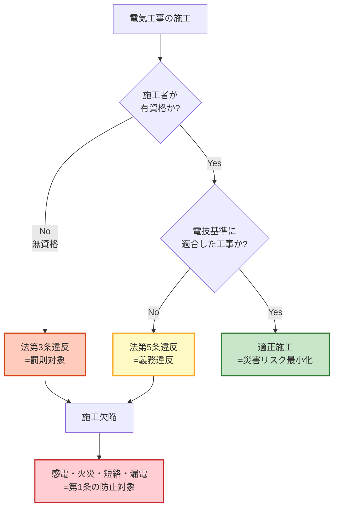

# 電気工事士法 第1条 — 目的

!!! note "📊 試験対策メタ"
    **出題頻度**: 🔥（過去14年で1回出題・第1条単独は稀）

    **重要度**: C（基本・基盤知識）

    **直近出題**: H20 問8（選択肢中で「電気工事士法の目的」が登場）

> 電気工事士法の根拠条文。**「電気工事の作業に従事する者の資格及び義務」を定め、もって「電気工事の欠陥による災害の発生の防止」に寄与する**というシンプルな目的構造。第3条（資格）・第5条（義務）の解釈の起点となるため、内容の理解が周辺条文の論点把握に直結する。

| 項目 | 内容 |
|------|------|
| 条文 | 電気工事士法 第1条（昭和35年法律第139号） |
| 規定内容 | 法律の目的（電気工事の欠陥による災害の発生の防止） |
| 性格 | 目的規定（数値・手続なし／法律全体の趣旨を宣言） |
| 委任先 | なし（第2条以下の各条文が手段を具体化） |
| 上位 | なし（電気工事士法の最上位条文） |
| **典拠（一次ソース）** | 電気工事士法（昭和35年法律第139号、令和元年改正版）第1条 — 経産省 e-Gov 法令検索 |
| **照合日** | 2026-04-20（kakomon.yml 照合・第1条単独の実出題はゼロ／H20問8 選択肢中言及1件のみ） |
| **隣接条文** | 第2条（用語の定義） ／ [第3条（電気工事士の資格）](koji-shi-2.md) → |
| **混同注意** | 同番号の **電気事業法第1条**（目的）／**電技省令第1条**（目的）／**解釈第1条**（用語の定義）とは **別物**。本条は「電気工事士法」第1条 |

---

## 1. 全体像と要点

- **目的**: 電気工事の **欠陥** による **災害の発生の防止** に寄与すること
- **手段**: 電気工事の作業に従事する者の **資格及び義務** を定める
- **対象**: 電気工事士法第2条で定義される「電気工事」（軽微な工事は除外）
- **位置づけ**: 第3条（資格区分）・第5条（義務）の論理的根拠となる目的条文
- 「人（工事士法）／モノ（電技基準）／組織（保安規程）」の **「人」軸** を担当する

### ① 全体像 — 第1条の位置づけ

<div><svg viewBox="0 0 800 360" xmlns="http://www.w3.org/2000/svg" width="100%" preserveAspectRatio="xMidYMid meet">
<defs>
<filter id="sh1a" x="-20%" y="-20%" width="140%" height="140%"><feDropShadow dx="0" dy="2" stdDeviation="2" flood-opacity="0.15"/></filter>
<linearGradient id="g1main" x1="0" y1="0" x2="0" y2="1"><stop offset="0%" stop-color="#bbdefb"/><stop offset="100%" stop-color="#90caf9"/></linearGradient>
<linearGradient id="g1a" x1="0" y1="0" x2="0" y2="1"><stop offset="0%" stop-color="#c8e6c9"/><stop offset="100%" stop-color="#a5d6a7"/></linearGradient>
<linearGradient id="g1b" x1="0" y1="0" x2="0" y2="1"><stop offset="0%" stop-color="#fff9c4"/><stop offset="100%" stop-color="#fff176"/></linearGradient>
<linearGradient id="g1c" x1="0" y1="0" x2="0" y2="1"><stop offset="0%" stop-color="#ffccbc"/><stop offset="100%" stop-color="#ff8a65"/></linearGradient>
</defs>
<text x="400" y="26" text-anchor="middle" font-size="15" font-weight="700" fill="#212121">第1条 — 目的（手段→結果の宣言）</text>
<text x="400" y="44" text-anchor="middle" font-size="11" fill="#666">「資格・義務を定める」ことで「災害の発生防止」に寄与する</text>
<rect x="280" y="60" width="240" height="60" rx="12" fill="url(#g1main)" stroke="#0d47a1" stroke-width="2.5" filter="url(#sh1a)"/>
<text x="400" y="85" text-anchor="middle" font-size="14" font-weight="800" fill="#0d47a1">電気工事士法 第1条</text>
<text x="400" y="105" text-anchor="middle" font-size="11" fill="#1565c0">目的（法全体の趣旨）</text>
<line x1="400" y1="125" x2="150" y2="155" stroke="#0d47a1" stroke-width="1.5" stroke-dasharray="3,2"/>
<line x1="400" y1="125" x2="400" y2="155" stroke="#0d47a1" stroke-width="1.5" stroke-dasharray="3,2"/>
<line x1="400" y1="125" x2="650" y2="155" stroke="#0d47a1" stroke-width="1.5" stroke-dasharray="3,2"/>
<rect x="40" y="160" width="220" height="160" rx="14" fill="url(#g1a)" stroke="#2e7d32" stroke-width="2.5" filter="url(#sh1a)"/>
<text x="150" y="186" text-anchor="middle" font-size="13" font-weight="700" fill="#1b5e20">手段1</text>
<line x1="60" y1="196" x2="240" y2="196" stroke="#2e7d32" stroke-width="1"/>
<text x="150" y="222" text-anchor="middle" font-size="12" font-weight="700" fill="#1b5e20">資格</text>
<text x="150" y="248" text-anchor="middle" font-size="10" fill="#1b5e20">第3条で具体化</text>
<text x="150" y="270" text-anchor="middle" font-size="10" fill="#1b5e20">第一種・第二種</text>
<text x="150" y="288" text-anchor="middle" font-size="10" fill="#1b5e20">認定／特種</text>
<rect x="290" y="160" width="220" height="160" rx="14" fill="url(#g1b)" stroke="#f9a825" stroke-width="2.5" filter="url(#sh1a)"/>
<text x="400" y="186" text-anchor="middle" font-size="13" font-weight="700" fill="#f57f17">手段2</text>
<line x1="310" y1="196" x2="490" y2="196" stroke="#f9a825" stroke-width="1"/>
<text x="400" y="222" text-anchor="middle" font-size="12" font-weight="700" fill="#f57f17">義務</text>
<text x="400" y="248" text-anchor="middle" font-size="10" fill="#f57f17">第5条で具体化</text>
<text x="400" y="270" text-anchor="middle" font-size="10" fill="#f57f17">電技基準遵守</text>
<text x="400" y="288" text-anchor="middle" font-size="10" fill="#f57f17">免状携帯</text>
<rect x="540" y="160" width="220" height="160" rx="14" fill="url(#g1c)" stroke="#d84315" stroke-width="2.5" filter="url(#sh1a)"/>
<text x="650" y="186" text-anchor="middle" font-size="13" font-weight="700" fill="#bf360c">結果</text>
<line x1="560" y1="196" x2="740" y2="196" stroke="#d84315" stroke-width="1"/>
<text x="650" y="222" text-anchor="middle" font-size="12" font-weight="700" fill="#bf360c">災害の発生防止</text>
<text x="650" y="248" text-anchor="middle" font-size="10" fill="#bf360c">感電・火災・</text>
<text x="650" y="266" text-anchor="middle" font-size="10" fill="#bf360c">短絡・漏電事故</text>
<text x="650" y="288" text-anchor="middle" font-size="10" fill="#bf360c">の事前遮断</text>
<text x="400" y="345" text-anchor="middle" font-size="11" font-weight="700" fill="#0d47a1">第1条 = 「手段（資格＋義務）→ 結果（災害防止）」の宣言</text>
</svg></div>

**読み解き**: 第1条は「資格」と「義務」の **2本柱の手段** を法律の中核に据え、それによって「電気工事の欠陥による災害」を **事前に** 遮断する構造を宣言する。第3条以降の各条文は、この目的を達成するための具体的な仕組みとして読み解く。

### ② 要点（試験前30秒復習用）

| 観点 | 内容 |
|------|------|
| **目的の核心** | 電気工事の **欠陥** による **災害の発生の防止** に寄与 |
| **手段の2本柱** | 電気工事の作業に従事する者の **資格** ＋ **義務** |
| **対象範囲** | 第2条で定義される「電気工事」（軽微な工事は除外） |
| **法律の性格** | 業務独占資格法（無免許者の作業を法的に禁止） |
| **位置づけ** | 「人」軸（電技基準＝モノ軸／保安規程＝組織軸 と並立） |

??? question "セルフチェック: 電気工事士法の目的は「電気工事士の地位向上」か？"
    **誤り**。第1条が掲げる目的は **「電気工事の欠陥による災害の発生の防止」** という公益目的であり、資格者の地位向上は副次的効果にすぎない。「業者保護」「市場の独占」を目的とする条文ではない点に注意。試験では「資格者の権利保護を目的とする」という選択肢が誤答として登場することがある。

??? question "セルフチェック: 第1条の「災害」とは具体的に何を指すか？"
    主に **電気工事の欠陥** に起因する **感電・火災・短絡・漏電** 事故。配線ミス・接地不良・絶縁不足等が施工現場で発生すると、後年の通電中に隠れた欠陥が顕在化して人命・財産に被害を及ぼす。第1条はこうした「**施工時点の欠陥が将来生む災害**」の予防を法律の存在理由としている。

---

## 2. 条文原文

**電気工事士法 第1条（目的）**

> この法律は、電気工事の作業に従事する者の資格及び義務を定め、もつて電気工事の欠陥による災害の発生の防止に寄与することを目的とする。

> <small>黄色マーカー = 過去問で実際に穴埋め出題されたキーワード（本条は **該当なし** ）</small>

→ 第1条は **「手段（資格・義務を定める）」→「目的（災害防止に寄与する）」** という典型的な目的規定の構文。条文中に数値・手続規定はなく、第2条以下の各条文がこの目的を実現する手段を具体化する構造になっている。

### 過去問で問われた箇所

第1条の **単独穴埋め出題は過去14年でゼロ**。確認されている唯一の登場は H20 問8 の選択肢として「電気工事士法の目的」がリード文に参照された1件のみ。下表のキーワードは試験頻出条文（第3条・第5条）の論説問題で **間接的に参照される可能性がある語** として参考までに整理したもので、**穴埋め実績はない** 。

| キーワード | 試験での扱い（実績） |
|---|---|
| 電気工事の作業に従事する者 | 実出題なし（第3条・第5条の議論で間接参照される可能性） |
| 資格及び義務 | 実出題なし（第3条・第5条の論説リード文で参照され得る） |
| 電気工事の欠陥 | 実出題なし |
| 災害の発生の防止 | 実出題なし |
| 寄与する | 実出題なし |

!!! tip "暗記の核心キーワード"
    - **電気工事の作業に従事する者** = 義務の対象（「電気工事士」とは限らない・無資格者も含む）
    - **資格及び義務** = 手段の2本柱（第3条＋第5条）
    - **電気工事の欠陥** = 災害の原因（一般の電気事故ではない）
    - **災害の発生の防止** = 目的の本体
    - **寄与する** = 単独で防ぐのではなく、他法令と協働する位置づけ

!!! note "出典"
    電気工事士法（昭和35年法律第139号、令和6年改正版）第1条 — e-Gov法令検索（最終確認: 2026-05-05）

---

## 3. 原文解析（ブロック分解）

条文を意味ブロック単位に分解し、それぞれの試験ポイントを整理する。

| 原文ブロック | 意味 | 試験のポイント |
|---|---|---|
| 「この法律は、」 | 電気工事士法全体の目的宣言 | 「この『規則』」「この『省令』」とは書かない（電気工事士法は **法律** ） |
| 「電気工事の作業に従事する者の」 | 義務の対象者＝電気工事に**実際に従事する者**全員 | 資格者だけでなく **無資格の作業者・補助者も含む**（広い対象） |
| 「資格及び義務を定め、」 | 法律の手段＝**資格制度＋義務規定** | 「資格のみ」「義務のみ」は誤り。**両方セット** |
| 「もつて」 | 接続語（手段→目的の橋渡し） | 「もって」と現代仮名遣いで書かれた選択肢が混在しやすい（条文原文は **もつて** ） |
| 「電気工事の欠陥による」 | 災害の原因を限定 | 一般の電気事故ではなく **施工欠陥起因** に限定。落雷・自然災害は対象外 |
| 「災害の発生の防止に」 | 法律の最終目的 | 「事故の補償」「業者の保護」ではない。**事前予防** が核心 |
| 「寄与することを目的とする」 | 「防止する」ではなく「寄与する」 | 単独で防ぐのではなく **電気事業法・電技基準と協働** で達成する位置づけ |

??? question "セルフチェック: 「電気工事の作業に従事する者」と「電気工事士」は同義か？"
    **同義ではない**。第1条の「従事する者」は **無資格者・補助者も含む広い概念**。電気工事士法は「従事する者」全体を対象に「資格を持たない者は作業してはならない」という規制を構築しており、結果として作業を行えるのは **資格者（電気工事士・認定電気工事従事者・特種電気工事資格者）に限定される**。第3条で初めて具体的な資格区分が登場する。

??? question "セルフチェック: 落雷で家屋火災が発生した場合、第1条の「災害」に該当するか？"
    **該当しない**。第1条が対象とするのは **「電気工事の欠陥による」災害** のみ。落雷・地震・水害等の自然災害や、機器自体の経年劣化（工事には起因しない劣化）は対象外。施工時点の欠陥が将来災害に繋がるケースのみが本法の射程内。

---

## 4. かみ砕き解説（因果理解）

### なぜ「目的条文」が冒頭に必要か — 法解釈の起点

法律の目的条文は **第3条以降の解釈基準** として機能する。第3条「資格区分」を読むときに「なぜ第一種と第二種を分けるのか」と問われたら、第1条が答えを与える：**災害防止のため、扱う電気の規模・危険度に応じて従事範囲を制限する**。

| 周辺条文 | 第1条との関係 |
|------|-------------|
| **第2条（定義）** | 「電気工事」「軽微な工事」の範囲確定 → 災害防止に必要な工事のみを規制対象に絞る |
| **第3条（資格）** | 災害防止のため、危険度に応じて作業範囲を制限する |
| **第5条（義務）** | 資格者が従う義務（電技基準適合・免状携帯）→ 工事品質を担保する |
| **第40-42条（罰則）** | 義務違反に対する強制力 → 災害防止の実効性を確保する |

### なぜ「資格＋義務」の2本柱か — 入口と出口の両方を押さえる

「資格制度」だけでは「資格を取った後に手抜き工事をされる」リスクが残る。「義務規定」だけでは「無資格者が誰でも工事できる」状態になる。両方を組み合わせることで：

1. **資格制度（入口）**: 一定の知識・技能を持たない者を排除
2. **義務規定（出口）**: 資格者が継続的に基準を遵守することを強制
3. **罰則（背骨）**: 違反時の制裁で実効性を確保

この三層構造により「**事前選別＋継続監視＋違反制裁**」という重層的な災害防止メカニズムが成立する。

### なぜ「災害」を目的に明記したか — 他法との目的の違い

電気関連の主要4法の目的を並べると、それぞれ守備範囲が異なる：

| 法律 | 目的の核心 | 守備範囲 |
|------|----------|---------|
| **電気工事士法** | 電気工事の **欠陥** による災害防止 | 工事の**人** |
| **電気事業法** | 電気の使用者の利益保護＋電気工作物の保安 | 電気事業の**全体** |
| **電気設備技術基準** | 電気工作物の保安 | 工事の**モノ** |
| **電気用品安全法** | 電気用品による危険・障害発生の防止 | 製品の**モノ** |

**電気工事士法の独自性**: 「**人（施工者）**」に焦点を当てる唯一の法律。技術基準がいくら厳格でも、施工者が無能・無責任ならモノに焦点を当てた基準は空振りする。第1条は「人軸の規制が必要不可欠」という前提を宣言している。

!!! tip "暗記のコツ"
    「人（電気工事士法）／モノ（電気設備技術基準）／組織（電気事業法第42条 保安規程）」の **三角構造** で覚える。

    第1条はこの三角の **「人」頂点** を担当し、他の2軸と協働して災害を防ぐ位置づけ。「寄与する」という語が、この **協働関係** を表現している。

---

## 5. 図で理解

### 災害の発生メカニズムと第1条の予防構造



**読み解き**: 第1条は「施工→欠陥→災害」というリスク経路を、第3条（資格）と第5条（義務）の2つのゲートで遮断する構造を採る。どちらか1つが緩むと災害リスクが顕在化するため、両ゲートが揃って初めて目的が達成される。

### 電気法令の三角構造（第1条の位置）

<div><svg viewBox="0 0 800 400" xmlns="http://www.w3.org/2000/svg" width="100%" preserveAspectRatio="xMidYMid meet">
<defs>
<filter id="sh1b" x="-20%" y="-20%" width="140%" height="140%"><feDropShadow dx="0" dy="2" stdDeviation="2" flood-opacity="0.12"/></filter>
<linearGradient id="g1tri" x1="0" y1="0" x2="0" y2="1"><stop offset="0%" stop-color="#ffe0b2"/><stop offset="100%" stop-color="#ffcc80"/></linearGradient>
<linearGradient id="g1mono" x1="0" y1="0" x2="0" y2="1"><stop offset="0%" stop-color="#bbdefb"/><stop offset="100%" stop-color="#90caf9"/></linearGradient>
<linearGradient id="g1org" x1="0" y1="0" x2="0" y2="1"><stop offset="0%" stop-color="#c8e6c9"/><stop offset="100%" stop-color="#a5d6a7"/></linearGradient>
</defs>
<text x="400" y="26" text-anchor="middle" font-size="15" font-weight="700" fill="#212121">電気法令の三角構造 — 第1条は「人」頂点</text>
<text x="400" y="44" text-anchor="middle" font-size="11" fill="#666">人・モノ・組織の3軸で災害を多面的に防ぐ</text>
<polygon points="400,80 130,340 670,340" fill="#fafafa" stroke="#9e9e9e" stroke-width="1" stroke-dasharray="4,3"/>
<rect x="290" y="68" width="220" height="80" rx="12" fill="url(#g1tri)" stroke="#e65100" stroke-width="2.5" filter="url(#sh1b)"/>
<text x="400" y="92" text-anchor="middle" font-size="13" font-weight="800" fill="#bf360c">人 軸</text>
<text x="400" y="113" text-anchor="middle" font-size="12" font-weight="700" fill="#bf360c">電気工事士法</text>
<text x="400" y="133" text-anchor="middle" font-size="10" fill="#bf360c">資格・義務・罰則</text>
<rect x="20" y="280" width="220" height="80" rx="12" fill="url(#g1mono)" stroke="#0d47a1" stroke-width="2.5" filter="url(#sh1b)"/>
<text x="130" y="304" text-anchor="middle" font-size="13" font-weight="800" fill="#0d47a1">モノ 軸</text>
<text x="130" y="325" text-anchor="middle" font-size="12" font-weight="700" fill="#0d47a1">電気設備技術基準</text>
<text x="130" y="345" text-anchor="middle" font-size="10" fill="#0d47a1">配線径・接地・絶縁</text>
<rect x="560" y="280" width="220" height="80" rx="12" fill="url(#g1org)" stroke="#2e7d32" stroke-width="2.5" filter="url(#sh1b)"/>
<text x="670" y="304" text-anchor="middle" font-size="13" font-weight="800" fill="#1b5e20">組織 軸</text>
<text x="670" y="325" text-anchor="middle" font-size="12" font-weight="700" fill="#1b5e20">電気事業法・保安規程</text>
<text x="670" y="345" text-anchor="middle" font-size="10" fill="#1b5e20">主任技術者・規程届出</text>
<text x="400" y="220" text-anchor="middle" font-size="14" font-weight="700" fill="#424242">災害発生防止</text>
<text x="400" y="240" text-anchor="middle" font-size="11" fill="#616161">（3軸の協働）</text>
<line x1="400" y1="148" x2="240" y2="280" stroke="#9e9e9e" stroke-width="1" stroke-dasharray="3,2"/>
<line x1="400" y1="148" x2="560" y2="280" stroke="#9e9e9e" stroke-width="1" stroke-dasharray="3,2"/>
<line x1="240" y1="320" x2="560" y2="320" stroke="#9e9e9e" stroke-width="1" stroke-dasharray="3,2"/>
<text x="320" y="388" text-anchor="middle" font-size="10" fill="#757575">第1条「寄与する」= 単独ではなく協働で防止</text>
</svg></div>

**読み解き**: 電気工事士法だけで災害を完全に防ぐことはできない。「**寄与する**」という語は、人（工事士法）・モノ（電技基準）・組織（電気事業法／保安規程）の **3軸協働** を前提とする位置づけを表現している。

---

## 6. 関連法と第1条の住み分け

電気関連の主要法令を「目的」軸で並べ、第1条がどの位置を占めるかを整理する。

| 法律 | 第1条の目的（要約） | 守備範囲 | 第1条との関係 |
|------|------------------|---------|---------------|
| **電気工事士法 第1条** | 電気工事の欠陥による災害防止 | 工事の **人** | 本条 |
| **電気事業法 第1条** | 電気使用者の利益保護＋電気工作物の保安 | 電気事業の **全体** | 上位フレーム（保安政策の基本法） |
| **電気用品安全法 第1条** | 電気用品の製造・販売規制で危険・障害を防止 | 製品の **モノ** | 並列（モノ軸の別法律） |
| **電気事業法 第42条（保安規程）** | 自家用設置者の組織的安全管理 | **組織** 軸 | 並列（組織軸を担当） |
| **電気設備に関する技術基準を定める省令** | 電気工作物の保安に関する技術要件 | 工事の **モノ** | 並列（第5条の遵守義務先） |

!!! warning "ひっかけ：「電気工事士法は電気事業法の下位法か？」"
    **誤り**。電気工事士法は電気事業法の下位法ではなく、**並列の独立した法律**。両者は協働関係にあるが、電気事業法から委任されているわけではない。「電気工事士法は電気事業法施行規則の一種」も同様に誤り。

### 「人」軸と「モノ」軸の役割分担

| 軸 | 法律 | 規制対象 | 違反の典型例 |
|------|------|----------|-----|
| 人 | 電気工事士法 | 施工する人の能力・行動 | 無資格者の工事／免状不携帯／電技基準不適合の工事 |
| モノ | 電気設備技術基準 | 設備そのものの仕様 | 電線径不足／接地不良／離隔距離不足 |

**「人」軸が抜けるとどうなるか**: 電技基準だけがあっても、施工者の能力が不十分なら基準通りの工事が実現しない。第1条はこの「**実装側のリスク**」を独立した法律で押さえることの必要性を宣言している。

---

## 7. 法律体系での位置づけ — 第1条と各条の階層

### 電気工事士法全体の構造

```
第1条（目的） ← 本ページ：法律の趣旨を宣言
  ↓
第2条（定義）— 「電気工事」「軽微な工事」の範囲確定
  ↓
第3条（資格）— 第一種・第二種・認定電気工事従事者・特種電気工事資格者
  ↓
第4条（免状）— 免状の交付要件（試験合格・実務経験）
  ↓
第5条（義務）— 電技基準遵守・免状携帯・器具の使用
  ↓
第40-42条（罰則）— 違反時の罰金・懲役
```

### 第1条と他法の「目的条文」の対比

| 条文 | 目的の構文 | 強調点 |
|------|----------|------|
| **電気工事士法 第1条** | 資格・義務を定める → 災害防止に **寄与** | 単独で防ぐのではなく協働を明示 |
| **電気事業法 第1条** | 電気事業の運営を適正・合理的にする → 利益保護・保安の確保 | 経済政策＋保安政策の **両輪** |
| **電気用品安全法 第1条** | 電気用品の製造・販売を規制する → 危険・障害の発生防止 | 「規制」+「自主活動の促進」 |

!!! note "「寄与する」と「確保する」の違い"
    試験で問われる場合がある法律用語の差：

    - **「寄与する」**（電気工事士法）= 他の法令と協働して目的に貢献する
    - **「確保する」**（電気事業法）= 単独で結果を担保する

    電気工事士法が **「寄与する」** を選んでいるのは、災害防止が単独法で完結する話ではなく、他の法令との **協働の枠組み** で実現される認識を示すため。

---

## 8. 頻出ひっかけ・落とし穴

試験で実際に失点しやすいポイントを、重大度別に整理した。

### 🔴 致命的（これを間違えたら即失点）

| # | ❌ 誤った認識 | ✅ 正しい認識 |
|---|--------------|--------------|
| 1 | 電気工事士法の目的は「電気工事士の地位向上」 | 目的は **電気工事の欠陥による災害の発生の防止に寄与すること**。資格者の地位向上は副次効果にすぎない |
| 2 | 電気工事士法は電気事業法の下位法（施行規則の一種） | 両者は **並列の独立した法律**。委任関係はない |
| 3 | 第1条の「災害」は電気事故全般を指す | **電気工事の欠陥による** 災害に限定。落雷・自然災害・経年劣化は対象外 |

### 🟡 注意（出題頻度が高い）

| # | ❌ 誤った認識 | ✅ 正しい認識 |
|---|--------------|--------------|
| 4 | 第1条は「資格を定める」または「義務を定める」のいずれかが目的 | **資格 及び 義務** の **両方** を定めることが手段（片方だけでは目的不達成） |
| 5 | 第1条の対象は「電気工事士」のみ | **電気工事の作業に従事する者** 全員（無資格者・補助者を含む広い対象） |
| 6 | 第1条は「災害を防止する」と断定している | 条文は **「災害の発生の防止に 寄与する」** 。他法令との協働を前提とした表現 |

### 🟢 軽微（余裕があれば）

| # | ❌ 誤った認識 | ✅ 正しい認識 |
|---|--------------|--------------|
| 7 | 第1条は数値や手続を規定する | 第1条は **目的規定** （趣旨宣言）。数値・手続は第2条以降で具体化 |
| 8 | 「もつて」は誤植で「もって」が正しい | 条文原文は **「もつて」** （促音表記なしの法律文体）。両表記が選択肢に並ぶ場合、原文は「もつて」 |

---

## 9. 穴埋め過去問チャレンジ

!!! note "出題実績との関係"
    第1条単独の穴埋め出題は実質ゼロのため、以下は **第1条本文の理解度を測る予想問題** として作成。実出題ではない点に注意。条文キーワードの暗記確認に活用する。

!!! abstract "問題1: 法律の手段"
    電気工事士法第1条は、「この法律は、電気工事の作業に従事する者の（　ア　）及び（　イ　）を定め、もつて電気工事の欠陥による災害の発生の防止に寄与することを目的とする」と規定している。

??? success "解答"
    - ア = ==**資格**==
    - イ = ==**義務**==

??? note "解説と復習導線"
    「資格 及び 義務」は法律の手段の2本柱。**両方セット** で覚える。「資格のみ」「義務のみ」は誤り。

!!! abstract "問題2: 義務の対象者"
    電気工事士法第1条で「資格及び義務を定める」対象は、（　ア　）である。

??? success "解答"
    - ア = ==**電気工事の作業に従事する者**==

??? note "解説と復習導線"
    「電気工事士」ではなく「電気工事の作業に従事する者」が条文の表現。**資格者だけでなく無資格者・補助者も含む広い対象** であることを示す。

!!! abstract "問題3: 法律の最終目的"
    電気工事士法第1条は、（　ア　）の欠陥による（　イ　）の発生の防止に寄与することを目的としている。

??? success "解答"
    - ア = ==**電気工事**==
    - イ = ==**災害**==

??? note "解説と復習導線"
    災害の原因を「電気工事の欠陥」に限定している点が核心。落雷・自然災害・経年劣化は対象外。

!!! abstract "問題4: 法律用語の正確性"
    第1条は「災害の発生の防止に（　ア　）する」と表現している。これは「防止する」と断定するのではなく、（　イ　）の法令との協働で目的達成を図ることを示す表現である。

??? success "解答"
    - ア = ==**寄与**==
    - イ = ==**他**==（電気事業法・電気設備技術基準・電気用品安全法等）

??? note "解説と復習導線"
    「寄与する」と「確保する」の違いは試験で問われる可能性あり。電気工事士法は **協働モデル**、電気事業法は **単独確保モデル** という対比で覚える。

---

## 10. まぎらわしい選択肢と正解の違い

| 誤った記述 | 正しい記述 | なぜ違うか |
|---|---|---|
| 「電気工事士法は電気工事士の地位向上を目的とする」 | 法は **電気工事の欠陥による災害の発生の防止** に寄与することを目的とする | 公益目的の法律であり、業者保護法ではない |
| 「電気工事士法は電気事業法の施行規則である」 | 電気工事士法は **独立した法律**（昭和35年法律第139号） | 並列関係であり委任関係ではない |
| 「第1条の対象は電気工事士のみ」 | 対象は **電気工事の作業に従事する者**（無資格者・補助者を含む） | 「従事する者」と「電気工事士」は同義ではない |
| 「災害には自然災害も含まれる」 | **電気工事の欠陥** による災害のみが対象 | 落雷・地震は本法の射程外 |
| 「第1条は災害を完全に防止すると規定している」 | 条文は **「防止に寄与する」** （他法との協働を前提） | 「寄与」と「確保」の違い |
| 「第1条は数値基準を規定している」 | 第1条は **目的規定** であり数値・手続は含まない | 数値は第3条以降の各条で具体化 |
| 「『資格』と『義務』のいずれかを定めるのが手段」 | **両方** を定めることが手段（条文は「資格 **及び** 義務」） | 「及び」は並列接続で両方必須 |

---

## 📒 解いたら記録 → 間違えたら間違えノートへ（PDCAを回す）

!!! abstract "各過去問の「理解した／曖昧／間違えた」ボタンで解答結果を残せます"
    上の過去問の各ブロック下に出る **理解度ボタン（〇理解した／△曖昧／×間違えた）** とメモ欄で、解いた結果がブラウザの localStorage に保存されます（**Do→Check**）。

    👉 [**間違えノートを開く（法規Wiki／直前まちがいノート）**](https://kfurufuru.github.io/secretary-portal-public/denken-hoki-wiki.html#chokuzen-machigai)

    - **×間違えた** を押した問題は間違えノートに **自動集約** され、間違えた問題だけ抽出して再演習できる（**Check→Act**）
    - メモ欄に「なぜ間違えたか」を残すと、次回復習時に文脈ごと復元される
    - 同一オリジン（kfurufuru.github.io）配下なので、本Wiki／法規Wiki／理論Wiki のチェック記録は **すべて同じ間違えノートに集約**（横断PDCA）

---

## 11. 関連条文・関連ページ

- [電気工事士法 第2条：定義](koji-shi-2.md) — 「電気工事」「軽微な工事」の範囲確定
- [電気工事士法 第3条：資格](koji-shi-3.md) — 第1条の「資格」を具体化（第一種・第二種・認定・特種）
- [電気工事士法 第5条：義務](koji-shi-5.md) — 第1条の「義務」を具体化（電技基準遵守・免状携帯）
- [電気工事士法の体系](../../themes/denki-koji-shi.md) — 全条文の相互関係
- [電気事業法 第2条：定義（電気工作物の種別）](../jigyoho/2.md) — 工事士法が対象とする電気工作物の上位定義
- [電気関係報告規則 第1条：定義](jiko-1.md) — **対比**：法律レベル（電気工事士法）の第1条＝目的に対し、省令レベル（報告規則）の第1条＝定義という構造の違いを示す比較対象

---

## 12. 過去問実績

| 年度 | 問 | 形式 | 論点 |
|------|-----|------|------|
| H20 | 問8 | 選択肢 | 電気工事士法の目的（選択肢中で参照） |

!!! note "本法令は kakomon.yml 集計対象外"
    `_data/kakomon.yml` には電気事業法・電技省令・電技解釈の問題が中心に登録されているため、電気工事士法第1条の出題は集計0回となる。実際の過去問実績は上記テーブル（H20問8の1件）が現状確認できる範囲。

!!! note "出題傾向"
    第1条単独の穴埋め出題は過去14年で実質ゼロ。ただし第3条（資格）・第5条（義務）の論説問題で「**目的との関連** 」を問う展開で参照される可能性がある。第1条の暗記そのものよりも、**「目的→手段（資格・義務）→効果（災害防止）」の論理構造の理解** が、周辺条文の論点把握に効く。

!!! note "R08 出題予測"
    第1条単独での出題確率は **低い**（≤10%）。第3条・第5条の出題（過去14年で4回・頻出度🔥🔥）に伴って、選択肢中に「電気工事士法の目的」が登場する可能性が中程度（20-30%）。**「災害防止」「寄与する」「資格 及び 義務」** の3キーワードを正確に押さえておけば対応可能。

---

## 13. 用語集

第1条の条文や周辺条文で登場する主要用語を整理した。

| 用語 | 読み | 意味 | 試験での注意点 |
|------|------|------|----------------|
| 電気工事 | でんきこうじ | 一般用電気工作物等または自家用電気工作物（最大電力500kW未満）を設置・変更する工事 | 第2条で範囲確定。軽微な工事は除外 |
| 電気工事士 | でんきこうじし | 電気工事士法第3条で定める資格者（第一種・第二種） | 「電気工事の作業に従事する者」とは同義ではない |
| 電気工事の作業に従事する者 | でんきこうじのさぎょうにじゅうじするもの | 電気工事の作業に実際に関わる者（資格の有無を問わず） | 無資格者・補助者も含む広い概念 |
| 軽微な工事 | けいびなこうじ | 第2条但書で電気工事の範囲から除外される工事（露出型開閉器の取付け等） | 第3条の資格不要対象 |
| 資格 | しかく | 電気工事士法第3条で定める作業従事可能な区分 | 第一種・第二種・認定電気工事従事者・特種電気工事資格者 |
| 義務 | ぎむ | 電気工事士法第5条で資格者が遵守すべき事項 | 電技基準適合・免状携帯・器具の使用の3点 |
| 災害 | さいがい | 電気工事の欠陥に起因する人命・財産への被害 | 感電・火災・短絡・漏電。自然災害は対象外 |
| 寄与する | きよする | 単独で結果を確保するのではなく、他要因と協働して目的達成に貢献する | 「確保する」「達成する」と区別。協働を含意する語 |
| 一般用電気工作物 | いっぱんようでんきこうさくぶつ | 600V以下受電・50kW未満の小規模設備（電気事業法第38条） | 第二種電気工事士の主担当範囲 |
| 自家用電気工作物 | じかようでんきこうさくぶつ | 一般用以外で電気事業の用に供しない設備 | 第一種電気工事士は500kW未満まで作業可 |

---

## 14. 最終チェック

### 条文キーワード

- [ ] **電気工事の作業に従事する者** = 義務の対象（無資格者・補助者を含む）
- [ ] **資格 及び 義務** = 法律の手段の2本柱（両方必須）
- [ ] **電気工事の欠陥** = 災害の原因（自然災害は対象外）
- [ ] **災害の発生の防止** = 法律の最終目的
- [ ] **寄与する** = 他法令との協働モデル（「確保する」と区別）

### 因果理解

- [ ] なぜ目的条文が必要か = **第3条以降の解釈の起点** となるため
- [ ] なぜ資格＋義務の2本柱か = 入口（事前選別）と出口（継続監視）の **両方** を押さえるため
- [ ] なぜ「災害」を明記したか = 他法と協働で **人軸** を独立に押さえるため

### 法令体系

- [ ] **電気工事士法 = 「人」軸**（電技基準=モノ軸／保安規程=組織軸）
- [ ] **第1条 = 目的**／第2条 = 定義／第3条 = 資格／第5条 = 義務／第40-42条 = 罰則
- [ ] 電気工事士法と電気事業法は **並列の独立法**（委任関係ではない）

### ひっかけ対策

- [ ] 「電気工事士の地位向上が目的」は誤り → **災害発生防止** が目的
- [ ] 「対象は電気工事士のみ」は誤り → **作業に従事する者** 全員
- [ ] 「災害には自然災害も含む」は誤り → **電気工事の欠陥** による災害のみ
- [ ] 「資格 か 義務 のいずれかが手段」は誤り → **両方** が手段

---

## 監修ログ

- **2026-04-20**: v1.0初版作成（基本構成・5秒で思い出す・条文の概要・法律体系での位置づけ・試験での活用ポイント・他条文との関係・出題実績・関連ページ）
- **2026-05-05**: v2.0全面改修。`kijun/58.md` v2.2 ゴールドスタンダードに準拠し14セクション構成へ拡張。追加要素: (1) 全体像SVG（手段→結果の宣言構造）、(2) 条文原文ブロック、(3) 原文解析（ブロック分解表）、(4) 因果理解（目的条文が必要な理由・2本柱の意味・他法との目的対比）、(5) 図で理解（mermaid予防構造＋三角構造SVG）、(6) 関連法住み分け表、(7) 法律体系内の位置づけ、(8) ひっかけ重大度別❌/✅2列表、(9) 穴埋め予想問題4問（実出題ではない旨明記）、(10) まぎらわしい選択肢7行、(11) 関連条文、(12) 過去問実績（kakomon.yml集計対象外を明記）、(13) 用語集10語、(14) 最終チェック4分類。第1条が抽象的な「目的規定」である性格に合わせ、58.md由来の「測定方法と手順」セクションを「関連法と第1条の住み分け」に、「省令と解釈の関係」を「法律体系での位置づけ」に置換。
- **2026-05-05**: v2.0.1 — 黄色マーカー運用ルールの厳格化。条文原文の `<mark>` を全削除（第1条は穴埋め実出題ゼロのため）。「過去問で問われた箇所」表を「実績なし」を明示する形に修正。マーカーは **過去問で実際に穴埋め出題されたキーワードのみ** に限定する原則を反映。
- **2026-05-05 v2.1 テンプレートv2.3移行**: メタテーブルに「典拠／照合日／隣接条文／混同注意」4行追加。フッタにステータスラベル3軸（条文番号／出題実績／数値根拠）導入。
    - **条文番号確定根拠**: 電気工事士法 昭和35年法律第139号 令和元年改正版（経産省 e-Gov 法令検索）
    - **既存wiki参照の独立検証**: 実施（隣接 koji-shi-2（第3条 電気工事士の資格）と内容重複なきこと確認・本条は「目的規定」固有内容）
    - **未確認領域**: なし

---

*最終確認: 2026-05-05 | ステータス: v2.1（テンプレートv2.3移行）｜ 条文番号: ✅ 一次ソース照合済（電気工事士法第1条） ｜ 出題実績: ✅ kakomon DB照合済（H20問8 選択肢中言及1件・第1条単独実出題ゼロを確認） ｜ 数値根拠: — 該当なし（第1条は数値規定なし・目的規定） ｜ [バージョニング基準](../../reference/versioning.md)*
