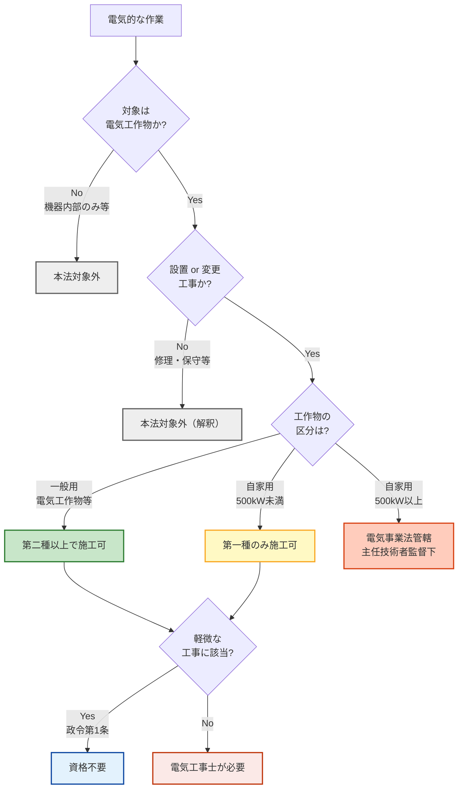

# 電気工事士法 第2条 — 用語の定義

!!! note "📊 試験対策メタ"
    **出題頻度**: 🔥🔥（過去14年で 3 回・選択肢中の確認）

    **重要度**: B（基本・第3条資格区分の前提）

    **直近出題**: R05上 問3（選択）／H29 問4（選択）／H27 問3（選択）

> 電気工事士法における **「電気工事」「一般用電気工作物等」「自家用電気工作物」「軽微な工事」** の用語を定義する条文。第3条の資格区分（第一種／第二種）が **どの工作物に適用されるか** を確定する前提条文として機能する。試験では **軽微な工事の具体例** と **500kW境界での電気事業法（電気主任技術者監督）への切替** がひっかけとして頻出する。

| 項目 | 内容 |
|------|------|
| 条文 | 電気工事士法 第2条（昭和35年法律第139号） |
| 規定内容 | 用語の定義（電気工事／一般用電気工作物等／自家用電気工作物／軽微な工事） |
| 性格 | 定義規定（数値・手続なし／法律全体の用語の意味を確定） |
| 委任先 | 軽微な工事の具体内容 → **電気工事士法施行令 第1条**（政令委任） |
| 上位 | 第1条（目的）／参照先：電気事業法第38条（電気工作物の区分） |
| **典拠（一次ソース）** | 電気工事士法（昭和35年法律第139号、令和元年改正版）第2条 ／ 同法施行令第1条（軽微な工事の具体例） — 経産省 e-Gov 法令検索 |
| **照合日** | 2026-05-05（kakomon.yml 照合・第2条単独の穴埋め実出題はゼロ／選択肢中の言及のみ） |
| **隣接条文** | ← [第1条（目的）](koji-shi-1.md) ／ 第3条（電気工事士の資格） → |
| **混同注意** | 同番号の **電気事業法第2条**（用語の定義）／**電技省令第2条**（用語の定義）／**解釈第2条**（用語の定義）とは **別物**。本条は「電気工事士法」第2条 |

---

## 1. 全体像と要点

- **電気工事** = 一般用電気工作物等または自家用電気工作物（500kW未満）を **設置・変更** する工事（軽微な工事を除く）
- **軽微な工事** = 政令で定める作業（差込接続器接続・電球交換・30VA以下の小型変圧器接続等）→ **資格不要**
- **500kW境界**: 500kW以上の自家用は電気工事士法の対象外 → **電気事業法**（電気主任技術者の監督下で工事する自主保安体系）の管轄に切替
- 第2条は「**第3条資格区分が誰の・何の工事に効くか**」を確定する **入口の定義条文**
- 過去問頻出：軽微な工事の具体例の弁別／一般用 vs 自家用の判定／500kW境界の認識

### ① 全体像 — 第2条の位置づけ

<div><svg viewBox="0 0 800 380" xmlns="http://www.w3.org/2000/svg" width="100%" preserveAspectRatio="xMidYMid meet">
<defs>
<filter id="sh2a" x="-20%" y="-20%" width="140%" height="140%"><feDropShadow dx="0" dy="2" stdDeviation="2" flood-opacity="0.15"/></filter>
<linearGradient id="g2main" x1="0" y1="0" x2="0" y2="1"><stop offset="0%" stop-color="#bbdefb"/><stop offset="100%" stop-color="#90caf9"/></linearGradient>
<linearGradient id="g2a" x1="0" y1="0" x2="0" y2="1"><stop offset="0%" stop-color="#c8e6c9"/><stop offset="100%" stop-color="#a5d6a7"/></linearGradient>
<linearGradient id="g2b" x1="0" y1="0" x2="0" y2="1"><stop offset="0%" stop-color="#fff9c4"/><stop offset="100%" stop-color="#fff176"/></linearGradient>
<linearGradient id="g2c" x1="0" y1="0" x2="0" y2="1"><stop offset="0%" stop-color="#ffccbc"/><stop offset="100%" stop-color="#ff8a65"/></linearGradient>
<linearGradient id="g2out" x1="0" y1="0" x2="0" y2="1"><stop offset="0%" stop-color="#eeeeee"/><stop offset="100%" stop-color="#bdbdbd"/></linearGradient>
</defs>
<text x="400" y="26" text-anchor="middle" font-size="15" font-weight="700" fill="#212121">第2条 — 「電気工事」の射程を確定する定義条文</text>
<text x="400" y="44" text-anchor="middle" font-size="11" fill="#666">「対象工作物 × 設置/変更工事」− 軽微な工事 = 規制対象</text>
<rect x="280" y="60" width="240" height="60" rx="12" fill="url(#g2main)" stroke="#0d47a1" stroke-width="2.5" filter="url(#sh2a)"/>
<text x="400" y="85" text-anchor="middle" font-size="14" font-weight="800" fill="#0d47a1">電気工事士法 第2条</text>
<text x="400" y="105" text-anchor="middle" font-size="11" fill="#1565c0">用語の定義</text>
<line x1="400" y1="125" x2="150" y2="155" stroke="#0d47a1" stroke-width="1.5" stroke-dasharray="3,2"/>
<line x1="400" y1="125" x2="400" y2="155" stroke="#0d47a1" stroke-width="1.5" stroke-dasharray="3,2"/>
<rect x="40" y="160" width="220" height="170" rx="14" fill="url(#g2a)" stroke="#2e7d32" stroke-width="2.5" filter="url(#sh2a)"/>
<text x="150" y="186" text-anchor="middle" font-size="13" font-weight="700" fill="#1b5e20">対象1: 一般用電気工作物等</text>
<line x1="60" y1="196" x2="240" y2="196" stroke="#2e7d32" stroke-width="1"/>
<text x="150" y="218" text-anchor="middle" font-size="11" fill="#1b5e20">600V以下受電</text>
<text x="150" y="236" text-anchor="middle" font-size="11" fill="#1b5e20">家庭・小規模事業所</text>
<text x="150" y="266" text-anchor="middle" font-size="12" font-weight="700" fill="#1b5e20">第二種電気工事士</text>
<text x="150" y="284" text-anchor="middle" font-size="11" fill="#1b5e20">以上が作業可</text>
<text x="150" y="306" text-anchor="middle" font-size="10" fill="#2e7d32">（第一種でも可）</text>
<rect x="290" y="160" width="220" height="170" rx="14" fill="url(#g2b)" stroke="#f9a825" stroke-width="2.5" filter="url(#sh2a)"/>
<text x="400" y="186" text-anchor="middle" font-size="13" font-weight="700" fill="#f57f17">対象2: 自家用電気工作物</text>
<line x1="310" y1="196" x2="490" y2="196" stroke="#f9a825" stroke-width="1"/>
<text x="400" y="218" text-anchor="middle" font-size="11" fill="#f57f17">最大電力 500kW未満</text>
<text x="400" y="236" text-anchor="middle" font-size="11" fill="#f57f17">中規模工場・ビル</text>
<text x="400" y="266" text-anchor="middle" font-size="12" font-weight="700" fill="#f57f17">第一種電気工事士</text>
<text x="400" y="284" text-anchor="middle" font-size="11" fill="#f57f17">＋認定/特種（限定）</text>
<text x="400" y="306" text-anchor="middle" font-size="10" fill="#f9a825">（第二種は不可）</text>
<rect x="540" y="160" width="220" height="170" rx="14" fill="url(#g2out)" stroke="#616161" stroke-width="2.5" filter="url(#sh2a)" stroke-dasharray="6,3"/>
<text x="650" y="186" text-anchor="middle" font-size="13" font-weight="700" fill="#424242">対象外</text>
<line x1="560" y1="196" x2="740" y2="196" stroke="#616161" stroke-width="1"/>
<text x="650" y="218" text-anchor="middle" font-size="11" fill="#424242">500kW以上の自家用</text>
<text x="650" y="236" text-anchor="middle" font-size="11" fill="#424242">大規模工場・発変電所</text>
<text x="650" y="266" text-anchor="middle" font-size="12" font-weight="700" fill="#424242">電気主任技術者</text>
<text x="650" y="284" text-anchor="middle" font-size="11" fill="#424242">の監督下で工事</text>
<text x="650" y="306" text-anchor="middle" font-size="10" fill="#424242">（電気事業法管轄）</text>
<rect x="170" y="345" width="460" height="28" rx="6" fill="#fbe9e7" stroke="#d84315" stroke-width="1.5"/>
<text x="400" y="364" text-anchor="middle" font-size="11" font-weight="700" fill="#bf360c">ただし「軽微な工事」（政令第1条で具体化）は除外 → 資格不要</text>
</svg></div>

**読み解き**: 第2条は **「電気工事」の射程を3つに分ける** 定義条文。①第二種以上が担当する一般用、②第一種が担当する自家用（500kW未満）、③管轄外の大規模自家用（500kW以上）。さらに **規模を問わず軽微な工事は資格不要** という除外規定を持ち、これが試験のひっかけの定番。

### ② 要点（試験前30秒復習用）

| 観点 | 内容 |
|------|------|
| **「電気工事」の核心** | 一般用電気工作物等または自家用電気工作物（500kW未満）の **設置・変更** 工事 |
| **除外規定** | 政令で定める **軽微な工事**（差込接続器接続・電球交換・30VA以下小型変圧器接続等） |
| **境界数値** | **500kW**（自家用の上限）／**30VA**（軽微な小型変圧器の上限） |
| **資格との接続** | 第3条で「一般用 → 第二種以上」「自家用500kW未満 → 第一種」と確定 |
| **管轄外の切替先** | 500kW以上 → **電気事業法**（電気主任技術者監督・工事計画届出等の自主保安体系） |

??? question "セルフチェック: 100V・15Aの電源タップをコンセントに差すのは電気工事か？"
    **電気工事ではない（軽微な工事に該当）**。差込接続器（プラグ）による接続は **政令第1条** で定める軽微な工事として除外され、資格不要。ただし壁コンセント本体を新規に取り付けるなら配線接続が伴うため、第2条の電気工事に該当し電気工事士の資格が必要。

??? question "セルフチェック: 第一種電気工事士は800kWの自家用工作物の工事ができるか？"
    **できない**。電気工事士法第2条の「自家用電気工作物」は **500kW未満** に限定されており、500kW以上は本法の対象外。ただし無資格で工事できるわけではなく、**電気事業法第43条で選任される電気主任技術者の監督下** で工事する自主保安体系に切り替わる（詳細は 第6条 を参照）。第一種でも500kW以上は工事士法の射程外という点は **R05上問3** をはじめ繰り返し問われている。

---

## 2. 条文原文

**電気工事士法 第2条（用語の定義）**

> この法律において「一般用電気工作物等」とは、電気事業法（昭和三十九年法律第百七十号）第三十八条第一項に規定する一般用電気工作物及び同条第二項に規定する小規模事業用電気工作物をいう。
>
> 2 この法律において「自家用電気工作物」とは、電気事業法第三十八条第四項に規定する自家用電気工作物（発電所、蓄電所、変電所、最大電力五百キロワット以上の需要設備、送電線路（発電所相互間、蓄電所相互間、変電所相互間及び発電所、蓄電所と変電所との間を連絡するものを除く。）及び保安通信設備を除く。）をいう。
>
> 3 この法律において「電気工事」とは、一般用電気工作物等又は自家用電気工作物を設置し、又は変更する工事をいう。ただし、政令で定める軽微な工事を除く。
>
> 4 この法律において「電気工事士」とは、次条第三項に規定する第一種電気工事士及び同条第四項に規定する第二種電気工事士をいう。

> <small>黄色マーカー = 過去問で実際に穴埋め出題されたキーワード（本条は **穴埋め実出題なし** ・選択肢中の確認のみ）</small>

→ 第2条は4項構成。**第1項**で「一般用電気工作物等」（小規模事業用を含む拡張概念）、**第2項**で「自家用電気工作物」（500kW以上の需要設備等を **除外** ）、**第3項**で「電気工事」、**第4項**で「電気工事士」を定義する。条文中の数値「**500kW**」が試験の核心境界。

### 過去問で問われた箇所

第2条は過去14年で計3回、いずれも **選択肢中** で出題されている。穴埋め形式の実出題はない。下表は選択肢で問われたポイントとして実績ベースで整理したもの。

| キーワード | 試験での扱い（実績） |
|---|---|
| 軽微な工事の具体例 | R05上 問3（4肢判定）／H29 問4（識別問題） |
| 一般用電気工作物 vs 自家用電気工作物の境界 | H27 問3（区分判定） |
| 500kW境界 | R05上 問3（選択肢中で誤答候補として登場） |
| 30VAの小型変圧器（軽微の上限） | H29 問4（選択肢で頻出ひっかけ） |

!!! tip "暗記の核心キーワード"
    - **設置又は変更する工事** = 「電気工事」の動作範囲（修理・点検は本条文上明示されず・解釈が分かれる）
    - **政令で定める軽微な工事** = 除外規定の入り口（具体は施行令第1条）
    - **一般用電気工作物 + 小規模事業用電気工作物** = 「一般用電気工作物等」の合成定義
    - **500kW未満** = 第2条が射程に含む自家用の上限（500kW以上は電気事業法管轄＝主任技術者監督下）
    - **発電所・蓄電所・変電所** = 自家用電気工作物の定義から除外される設備カテゴリ

!!! note "出典"
    電気工事士法（昭和35年法律第139号、令和6年改正版）第2条 — e-Gov法令検索（最終確認: 2026-05-05）

---

## 3. 原文解析（ブロック分解）

条文を意味ブロック単位に分解し、それぞれの試験ポイントを整理する。

### ブロック①「『一般用電気工作物等』とは」

- **意味**: 一般用電気工作物 ＋ 小規模事業用電気工作物 の合成概念
- **試験のポイント**: 単純な「一般用」ではなく **「等」付き**。小規模事業用（出力10kW未満の太陽光等）を含む

### ブロック②「電気事業法第38条第1項に規定する」

- **意味**: 上位定義は電気事業法側（電気工事士法は参照のみ）
- **試験のポイント**: 工事士法は電気事業法の **下位** ではなく **参照** 関係。定義の出典が他法という点が論点

### ブロック③「『自家用電気工作物』とは…最大電力500kW以上の需要設備…を除く」

- **意味**: 自家用のうち **大規模設備は除外**（第2条の自家用 = 500kW未満）
- **試験のポイント**: 500kW以上は電気事業法管轄に切替。第一種電気工事士でも500kW以上は本条対象外

### ブロック④「発電所、蓄電所、変電所」も除外

- **意味**: 規模を問わず発変電設備は本条の自家用から除外
- **試験のポイント**: 「家庭の太陽光なら一般用、業務用太陽光なら自家用」とは限らない。発電所相当は本条対象外

### ブロック⑤「『電気工事』とは…設置し、又は変更する工事をいう」

- **意味**: 動作範囲は **設置／変更** の2つに限定
- **試験のポイント**: 「修理」「保守」は条文上明示されず、解釈で別扱いになる

### ブロック⑥「ただし、政令で定める軽微な工事を除く」

- **意味**: 除外規定（資格不要の作業領域）
- **試験のポイント**: **政令委任**（電気工事士法施行令第1条）。差込接続器接続・電球交換・30VA以下変圧器接続等が列挙されている

### ブロック⑦「『電気工事士』とは…第一種電気工事士及び…第二種電気工事士をいう」

- **意味**: 工事士は **第一種＋第二種** の2種類のみ
- **試験のポイント**: 認定電気工事従事者・特種電気工事資格者は「電気工事士」ではない（第3条で規定される別の資格）

??? question "セルフチェック: 「電気工事士」と「電気工事の作業に従事する者」は同義か？"
    **同義ではない**。第2条第4項で「電気工事士」= **第一種＋第二種** に限定されるが、第1条が対象とする「電気工事の作業に従事する者」は **無資格者・補助者・認定電気工事従事者・特種電気工事資格者** も含む広い概念。第1条の対象範囲 ＞ 第2条第4項の電気工事士範囲。

??? question "セルフチェック: 出力5kWの家庭用太陽光発電を設置する工事は何条の対象か？"
    **電気工事士法第2条の電気工事（一般用電気工作物等）**。家庭用の小規模太陽光（10kW未満）は「小規模事業用電気工作物」に該当し、令和5年改正後は **「一般用電気工作物等」** として第2条の射程に含まれる。第二種電気工事士で作業可能。

---

## 4. かみ砕き解説（因果理解）

### なぜ「軽微な工事」を除外するか — 規制範囲の絞り込み

電気工事士法第1条の目的は **電気工事の欠陥による災害の発生の防止**。すべての電気的作業に資格を要求すれば達成度は最大化されるが、現実的には社会コストが過大で運用不能になる。そこで **構造的に災害リスクが極小な作業** を「軽微な工事」として **政令で具体的に列挙** し、規制対象を絞り込む設計を採る。

| 軽微な工事の例 | 除外される理由 | 対比：資格が必要な工事 |
|-----------|------|----------------------|
| **差込接続器による接続**（プラグ差し込み） | 既に完成した電気設備の機械的な接続。短絡・感電リスク極小 | 壁コンセント本体の新規取付（配線接続が必要） |
| **ねじ込み式ソケット取付**（電球交換） | 安全設計済みソケットへの取付のみ。配線作業なし | 照明器具の配線新規接続 |
| **定格 100V以下・30VA以下の小型変圧器接続**（インターホン・ベルトランス） | 超低電圧・低容量。短絡・火災リスク実質ゼロ | 通常変圧器（200V→100V等）の接続 |
| **二次電圧 36V以下の蓄電池端子接続** | 超低電圧。感電リスク無視可能 | 高圧蓄電池の端子接続 |

!!! tip "軽微な工事の判定基準（暗記補助）"
    1. **短絡・感電リスクが構造的に低い** か（既設安全設計を活用しているか）
    2. **特殊な工具・技能が不要** か（プラグ差し込み程度の操作で完結するか）
    3. **後年隠蔽される部位でない** か（壁内配線は隠蔽 → 軽微ではない）

    3つすべて満たす場合のみ軽微な工事に該当。**規模が小さい＝軽微** ではない点が試験のひっかけ（家庭用でも分電盤接続は資格必要）。

### なぜ500kWで切るか — 電気事業法との役割分担

500kW以上の自家用電気工作物は、規模が大きく **継続的な保安監督** が安全確保に不可欠。そこで **電気事業法第43条**（電気主任技術者の選任義務）・**第42条**（保安規程）・**第50条**（使用前自主検査）が「事業者の自主保安体系」を要求する制度を別に持っている。電気工事士法（事前資格選別）と電気事業法（継続監督・事後検査）を **二重に課すのは過剰** になるため、第2条は500kW以上を **明示的に除外** して役割分担している。

| 規模 | 担当法 | 規制の重点 |
|------|--------|-----------|
| 一般用電気工作物等 | 電気工事士法 第2条 | **施工者の資格**（第二種以上） |
| 自家用電気工作物（500kW未満） | 電気工事士法 第2条 | **施工者の資格**（第一種限定） |
| 自家用電気工作物（500kW以上） | **電気事業法**（第43条・第42条・第50条等） | **電気主任技術者の継続監督 ＋ 使用前自主検査** |

### なぜ「電気工事士」を狭く定義するか — 第3条との接続

第2条第4項は「電気工事士 = 第一種 ＋ 第二種」と狭く定義する。一方、第1条の対象は「電気工事の作業に従事する者」で広い。両者の差が **認定電気工事従事者・特種電気工事資格者** で、これらは「電気工事士」ではないが特定範囲の電気工事に従事できる **別資格** として第3条第3項以降で別途規定される。

!!! tip "暗記のコツ"
    「**第1条の対象（広）⊃ 第2条の電気工事士（狭）**」という包含関係で覚える。

    第1条 = 工事に関わる人すべて（無資格者含む）
    ⊃ 第3条の資格者全体（電気工事士＋認定＋特種）
    ⊃ 第2条第4項の電気工事士（第一種＋第二種のみ）

---

## 5. 図で理解

### 「電気工事」該当判定フロー



**読み解き**: 第2条は **3つのゲート**（工作物該当／設置変更／規模区分）と **1つの除外**（軽微な工事）で「電気工事士の必要性」を判定する構造。500kW以上は電気事業法（電気主任技術者監督下の自主保安体系）に **横にスライド** する点が、本条の射程を理解する核心。

### 500kW境界の規制切替

<div><svg viewBox="0 0 800 280" xmlns="http://www.w3.org/2000/svg" width="100%" preserveAspectRatio="xMidYMid meet">
<defs>
<filter id="sh2b" x="-20%" y="-20%" width="140%" height="140%"><feDropShadow dx="0" dy="2" stdDeviation="2" flood-opacity="0.12"/></filter>
</defs>
<text x="400" y="26" text-anchor="middle" font-size="15" font-weight="700" fill="#212121">最大電力で変わる規制法 — 500kW境界</text>
<text x="400" y="44" text-anchor="middle" font-size="11" fill="#666">第一種電気工事士でも 500kW以上の自家用は工事不可</text>
<line x1="80" y1="180" x2="720" y2="180" stroke="#424242" stroke-width="2"/>
<line x1="80" y1="172" x2="80" y2="188" stroke="#424242" stroke-width="2"/>
<text x="80" y="208" text-anchor="middle" font-size="11" fill="#616161">0kW</text>
<line x1="280" y1="172" x2="280" y2="188" stroke="#424242" stroke-width="2"/>
<text x="280" y="208" text-anchor="middle" font-size="11" fill="#616161">50kW</text>
<text x="280" y="222" text-anchor="middle" font-size="9" fill="#9e9e9e">（一般用上限）</text>
<line x1="500" y1="172" x2="500" y2="188" stroke="#d84315" stroke-width="3"/>
<text x="500" y="208" text-anchor="middle" font-size="13" font-weight="800" fill="#bf360c">500kW</text>
<text x="500" y="225" text-anchor="middle" font-size="10" fill="#bf360c">（工事士法の上限）</text>
<line x1="700" y1="172" x2="700" y2="188" stroke="#424242" stroke-width="2"/>
<text x="700" y="208" text-anchor="middle" font-size="11" fill="#616161">大規模</text>
<rect x="80" y="80" width="200" height="80" rx="10" fill="#c8e6c9" stroke="#2e7d32" stroke-width="2.5" filter="url(#sh2b)"/>
<text x="180" y="106" text-anchor="middle" font-size="12" font-weight="700" fill="#1b5e20">一般用電気工作物等</text>
<text x="180" y="126" text-anchor="middle" font-size="10" fill="#1b5e20">電気工事士法 第2条第1項</text>
<text x="180" y="146" text-anchor="middle" font-size="11" font-weight="700" fill="#1b5e20">第二種 以上</text>
<rect x="280" y="80" width="220" height="80" rx="10" fill="#fff9c4" stroke="#f9a825" stroke-width="2.5" filter="url(#sh2b)"/>
<text x="390" y="106" text-anchor="middle" font-size="12" font-weight="700" fill="#f57f17">自家用電気工作物</text>
<text x="390" y="126" text-anchor="middle" font-size="10" fill="#f57f17">電気工事士法 第2条第2項</text>
<text x="390" y="146" text-anchor="middle" font-size="11" font-weight="700" fill="#f57f17">第一種 のみ</text>
<rect x="500" y="80" width="220" height="80" rx="10" fill="#ffccbc" stroke="#d84315" stroke-width="2.5" filter="url(#sh2b)"/>
<text x="610" y="106" text-anchor="middle" font-size="12" font-weight="700" fill="#bf360c">大規模自家用</text>
<text x="610" y="126" text-anchor="middle" font-size="10" fill="#bf360c">電気事業法 第43条等</text>
<text x="610" y="146" text-anchor="middle" font-size="11" font-weight="700" fill="#bf360c">主任技術者監督下</text>
<line x1="500" y1="160" x2="500" y2="172" stroke="#d84315" stroke-width="3"/>
<polygon points="495,166 505,166 500,176" fill="#d84315"/>
<text x="400" y="258" text-anchor="middle" font-size="11" font-weight="700" fill="#0d47a1">「ただし、政令で定める軽微な工事を除く」 = 全領域共通の除外</text>
</svg></div>

**読み解き**: 横軸（最大電力）で規制法が変わる。500kWは **電気工事士法と電気事業法の境界線**。第一種電気工事士の資格を持っていても、500kW以上は工事士法の射程外なので、電気主任技術者の監督なしには工事できない（保安規程違反になり得る）。「**第一種なら何でもできる**」という思い込みが頻出ひっかけ。

---

## 6. 関連法と第2条の住み分け

電気関連の主要法令を「定義の対象」軸で並べ、第2条がどの位置を占めるかを整理する。

| 法律 | 定義する対象 | 第2条との関係 |
|------|------------|----------------|
| **電気工事士法 第2条** | 電気工事／工作物区分／工事士／軽微な工事 | 本条 |
| **電気事業法 第38条** | 一般用電気工作物／小規模事業用／自家用／事業用電気工作物 | **上位定義の出典**（第2条が参照する） |
| **電気事業法 第43条** | 自家用電気工作物の電気主任技術者選任義務 | **第2条が除外した500kW以上領域** の人軸規制 |
| **電気事業法 第42条／第48条** | 保安規程の届出／工事計画の届出 | 第2条が除外した領域の組織軸・手続軸の規制 |
| **電気工事士法施行令 第1条** | 軽微な工事の具体的内容 | **第2条第3項の政令委任先** |
| **電気用品安全法** | 電気用品の定義（差込接続器・ソケット等） | 並列（軽微な工事で扱う部品の安全規格を担当） |

!!! warning "ひっかけ：「電気工事士法は電気事業法の下位法か？」"
    **誤り**。電気工事士法は電気事業法の下位法ではなく、**並列の独立した法律**。ただし第2条は **定義の出典として電気事業法第38条を参照** しており、用語の意味は電気事業法側に従う。「並列だが定義は参照する」という関係性が試験の論点。

### 「人」軸と「モノ」軸での第2条の位置

| 軸 | 法律 | 規制対象 | 第2条が担う役割 |
|------|------|----------|------|
| 人 | 電気工事士法 | 施工する人の能力・行動 | **誰が**工事できるかの前提となる工事範囲を確定 |
| モノ | 電気事業法・電技基準 | 設備そのものの仕様・区分 | 第2条は工作物の **区分の出典** として電気事業法第38条を参照 |

**第2条が抜けるとどうなるか**: 第3条の資格区分（第一種・第二種）が「**何の工事に対する資格か**」を確定できなくなる。第2条は第3条以降の **解釈の前提** として機能する。

### 500kW以上の自家用は誰が工事するか？（重要）

「500kW以上は電気工事士法の対象外」だけ覚えると **「では誰でも工事できるのか？」** という誤解が生じる。実際は **電気工事士法に代わって、電気事業法の自主保安体系が適用される**。電気工事士法（事前資格による選別）から電気事業法（電気主任技術者の継続監督）へ、保安の枠組みが切り替わる。

| 規制軸 | 該当条文 | 内容 |
|------|---------|------|
| **人（誰が工事するか）** | 電気事業法 **第43条** | 500kW以上の自家用設置者は **電気主任技術者** を選任する義務。工事は主任技術者の **監督下** で実施（社内の電気工事担当者または委託業者） |
| **組織（保安体制）** | 電気事業法 **第42条** | **保安規程** を作成し経済産業大臣に届出。工事の手続き・検査体制を文書化 |
| **手続（一定規模以上）** | 電気事業法 **第48条** | 一定規模以上の工事は **工事計画の届出** が必要（事前審査） |
| **検査（工事完了後）** | 電気事業法 **第50条** | **使用前自主検査** を実施。電気工事士法の事前資格に代わって、事後の品質確認で安全を担保 |

!!! tip "保安フレームの切替（深い理解）"
    電気工事士法と電気事業法は **災害防止の手段が異なる**：

    - **電気工事士法（500kW未満）**: 「**事前選別**」型 — 工事士の資格試験で能力を担保
    - **電気事業法（500kW以上）**: 「**継続監督＋事後検査**」型 — 電気主任技術者が現場を監督し、使用前自主検査で品質確認

    どちらも目的は同じ「**電気工事の欠陥による災害の防止**」だが、規模に応じて **適切な保安手段** を選択している。500kW境界はこの **保安手段の切替点**。

??? question "セルフチェック: 500kW以上の自家用工事を、第一種電気工事士が「電気主任技術者の監督なく」自主的に実施するのはOKか？"
    **NG**。500kW以上の自家用は電気工事士法の射程外なので、電気工事士の資格で工事することは **法的根拠がない**。電気事業法第43条で選任された電気主任技術者の監督下で工事しなければ、保安規程違反（第42条）または工事計画違反（第48条）となり得る。「第一種だから何でもできる」は典型的な誤解。

---

## 7. 法律体系での位置づけ — 第2条と各条の階層

### 電気工事士法全体の構造

```
第1条（目的）— 災害防止に寄与
  ↓
第2条（定義）← 本ページ：用語の射程を確定
  ↓
第3条（資格）— 第一種・第二種・認定電気工事従事者・特種電気工事資格者
  ↓
第4条（免状）— 免状の交付要件（試験合格・実務経験）
  ↓
第5条（義務）— 電技基準遵守・免状携帯・器具の使用
  ↓
第40-42条（罰則）— 違反時の罰金・懲役
```

### 第2条と他の「定義条文」の対比

| 条文 | 定義する対象 | 性格 |
|------|------------|------|
| **電気工事士法 第2条** | 電気工事／工作物／工事士／軽微な工事 | **狭義定義**（資格規制の射程確定） |
| **電気事業法 第2条** | 電気事業／一般送配電事業者等の事業者区分 | **広義定義**（事業全体の枠組み） |
| **電気事業法 第38条** | 電気工作物の区分（一般用／小規模／自家用／事業用） | **工作物の分類定義**（第2条の参照先） |
| **電気用品安全法 第2条** | 電気用品の範囲 | **製品の分類定義**（並列） |

!!! note "「定義条文」の読み方"
    定義条文には2タイプある：

    - **自己完結型**: 条文内で意味を確定（電気事業法第2条等）
    - **参照型**: 上位法を参照して意味を借りる（**電気工事士法第2条**）

    工事士法第2条は第1項・第2項で **電気事業法第38条を明示参照** している。つまり「工作物の意味は電気事業法に従う」という構造。ここを理解しないと「工事士法だけ読んでも工作物の意味が確定しない」。

---

## 8. 頻出ひっかけ・落とし穴

試験で実際に失点しやすいポイントを、重大度別に整理した。

### 🔴 致命的（これを間違えたら即失点）

| # | ❌ 誤った認識 | ✅ 正しい認識 |
|---|--------------|--------------|
| 1 | 第一種電気工事士なら自家用すべての工事ができる | 第2条で自家用は **500kW未満** に限定。500kW以上は電気工事士法の射程外で、**電気事業法第43条で選任される電気主任技術者の監督下** で工事する自主保安体系（保安規程＋使用前自主検査）に切り替わる。第一種電気工事士の資格は500kW以上では法的根拠を持たない（詳細は 第6条 を参照） |
| 2 | 電球交換も電気工事に含まれるので資格が必要 | 電球交換（ねじ込み式ソケット取付）は **政令第1条の軽微な工事** に該当し **資格不要** |
| 3 | 「電気工事士」には認定電気工事従事者・特種電気工事資格者も含まれる | 第2条第4項の電気工事士は **第一種＋第二種のみ**。認定・特種は別の資格区分 |

### 🟡 注意（出題頻度が高い）

| # | ❌ 誤った認識 | ✅ 正しい認識 |
|---|--------------|--------------|
| 4 | 軽微な工事の判定は「規模が小さい」かどうか | **危険性・技能難度** で判定。家庭用でも分電盤接続は資格必要、業務用でも差込接続は軽微 |
| 5 | 軽微な工事の小型変圧器の上限は「100V 30A」（3kVA） | 上限は **30VA**（100V換算で 0.3A）。「30A」と「30VA」の混同が定番ひっかけ |
| 6 | 一般家庭の太陽光発電は必ず一般用電気工作物 | 出力により分類が変わる。10kW未満なら「小規模事業用電気工作物」（一般用電気工作物**等**に含む） |

### 🟢 軽微（余裕があれば）

| # | ❌ 誤った認識 | ✅ 正しい認識 |
|---|--------------|--------------|
| 7 | 軽微な工事の具体例は第2条本文に列挙されている | 第2条は「**政令で定める**」と委任のみ。具体例は **電気工事士法施行令 第1条** に列挙 |
| 8 | 電気工事士法の「電気工事」には修理・保守も含まれる | 条文は「**設置し、又は変更する工事**」のみ。修理・保守は条文上の明示なし（解釈で別扱い） |

---

## 9. 穴埋め過去問チャレンジ

!!! note "出題実績との関係"
    第2条の **穴埋め実出題はゼロ**（過去14年で3回はいずれも選択肢中の確認）。以下は **第2条本文の理解度を測る予想問題** として作成。実出題ではない点に注意。条文キーワードの暗記確認に活用する。

!!! abstract "問題1: 「電気工事」の定義"
    電気工事士法第2条第3項は、「『電気工事』とは、（　ア　）又は自家用電気工作物を（　イ　）し、又は（　ウ　）する工事をいう。ただし、政令で定める（　エ　）を除く」と規定している。

??? success "解答"
    - ア = ==**一般用電気工作物等**==
    - イ = ==**設置**==
    - ウ = ==**変更**==
    - エ = ==**軽微な工事**==

??? note "解説と復習導線"
    動作範囲は「設置・変更」のみ。「修理」「保守」は条文上明示なし。除外規定は「政令で定める軽微な工事」が定型表現。

!!! abstract "問題2: 自家用電気工作物の上限"
    第2条第2項では、「自家用電気工作物」の定義から（　ア　）の需要設備が除外されている。これに該当する大規模需要設備の工事は、（　イ　）法 第43条で選任される（　ウ　）の監督下で実施する自主保安体系の管轄となる。

??? success "解答"
    - ア = ==**最大電力500kW以上**==
    - イ = ==**電気事業**==
    - ウ = ==**電気主任技術者**==

??? note "解説と復習導線"
    500kW境界が電気工事士法（事前資格）と電気事業法（継続監督）の **保安フレーム切替点**。第一種電気工事士の資格を持っていても、500kW以上は主任技術者の監督なしには工事できない。

!!! abstract "問題3: 「電気工事士」の範囲"
    電気工事士法第2条第4項は、「『電気工事士』とは、第一種電気工事士及び（　ア　）電気工事士をいう」と規定している。なお、認定電気工事従事者・特種電気工事資格者は **本条文上の電気工事士には（　イ　）**。

??? success "解答"
    - ア = ==**第二種**==
    - イ = ==**含まれない**==（別の資格区分）

??? note "解説と復習導線"
    第2条第4項の「電気工事士」は **第一種＋第二種に限定**。認定・特種は第3条第3項以降で別途規定される別資格。「電気工事士法の対象範囲（第1条）」と「電気工事士の範囲（第2条第4項）」の **包含関係** に注意。

!!! abstract "問題4: 軽微な工事の判定"
    第2条第3項の「政令で定める軽微な工事」の具体は（　ア　）第1条に列挙されている。代表例として、定格 100V以下・（　イ　）VA以下の小型変圧器の二次側配線工事が含まれる。

??? success "解答"
    - ア = ==**電気工事士法施行令**==
    - イ = ==**30**==

??? note "解説と復習導線"
    軽微な工事の上限値「30VA」は「30A（3kVA）」との混同が試験定番ひっかけ。**100V換算で0.3A** という超低レベル。

---

## 10. まぎらわしい選択肢と正解の違い

### #1 「第一種電気工事士は自家用電気工作物すべての工事ができる」

- **正解**: **500kW未満** の自家用のみ。500kW以上は電気工事士法の射程外で、電気主任技術者の監督下に切替
- **理由**: 第2条第2項が500kW以上を **明示的に除外**

### #2 「電球交換は電気工事に該当するので電気工事士が必要」

- **正解**: **軽微な工事**（政令第1条）として除外され、資格不要
- **理由**: 「設置・変更」に該当しても、軽微な工事除外規定が優先する

### #3 「電気工事士には第一種・第二種・認定・特種が含まれる」

- **正解**: 第2条第4項の電気工事士は **第一種＋第二種のみ**
- **理由**: 認定電気工事従事者・特種電気工事資格者は「電気工事士」ではなく別の資格区分（第3条で別途規定）

### #4 「軽微な工事の上限は100V 30A」

- **正解**: **30VA**（100V換算で約0.3A）
- **理由**: 「30A（3kVA）」との混同が定番ひっかけ。VAとAは単位が異なる

### #5 「軽微な工事の判定は規模で決まる」

- **正解**: **危険性・技能難度** で決まる（規模ではない）
- **理由**: 政令第1条は具体的な作業内容を列挙する形式。規模基準は補助的

### #6 「軽微な工事の具体例は第2条本文に列挙されている」

- **正解**: 第2条は政令委任のみ。具体は **電気工事士法施行令第1条**
- **理由**: 法律は委任、政令で具体化する典型的な構造

### #7 「家庭の太陽光は必ず一般用電気工作物」

- **正解**: 出力10kW未満なら「**小規模事業用電気工作物**」として「一般用電気工作物**等**」に含む
- **理由**: 令和5年改正で「等」が追加された。出力区分により分類が変わる

### #8 「電気工事には修理・保守も含む」

- **正解**: 第2条第3項は「**設置し、又は変更する工事**」のみ規定
- **理由**: 修理・保守は条文上の明示なし（解釈で別扱い）

---

## 11. 関連条文・関連ページ

- [電気工事士法 第1条：目的](koji-shi-1.md) — 第2条の **定義の使われ先**（「電気工事の作業に従事する者」の射程を絞る）
- [電気工事士法 第3条：資格](koji-shi-3.md) — 第2条で確定した「電気工事」を **誰が施工できるか** を規定
- [電気工事士法 第5条：義務](koji-shi-5.md) — 電気工事士の遵守義務（電技基準適合等）
- [電気工事士法の体系](../../themes/denki-koji-shi.md) — 全条文の相互関係
- [電気事業法 第2条：定義](../jigyoho/2.md) — 電気事業者の区分定義
- [電気事業法 第38条：電気工作物の区分](../jigyoho/38.md) — 第2条第1・2項の **参照先**（一般用・小規模事業用・自家用の上位定義）

---

## 12. 過去問実績

| 年度 | 問 | 形式 | 論点 |
|------|-----|------|------|
| R05上 | 問3 | 選択 | 電気工事の定義・軽微な工事の範囲（4肢判定） |
| H29 | 問4 | 選択 | 軽微な工事の具体例識別 |
| H27 | 問3 | 選択 | 一般用 vs 自家用の区分判定 |

!!! note "本法令は kakomon.yml 集計対象外"
    `_data/kakomon.yml` には電気事業法・電技省令・電技解釈の問題が中心に登録されているため、電気工事士法第2条の出題は集計0回となる。実際の過去問実績は上記テーブル（3件）が現状確認できる範囲。

!!! note "出題傾向"
    第2条の **穴埋め単独出題は過去14年でゼロ**。3件はいずれも **選択肢中の確認**（軽微な工事の具体例識別／一般用vs自家用の判定）。穴埋めではなく **具体例の弁別力** が問われる出題形式。

!!! note "R08 出題予測"
    軽微な工事の **「定格100V以下・30VA以下」** という上限値は頻出ひっかけ。「100V 100W」「100V 30A」を見て「軽微に該当する／しない」を誤判定させる形式が定番。

    また、太陽光発電・蓄電池システムの普及で「**家庭用でも自家用に分類される場合がある**」「**小規模事業用電気工作物**（10kW未満）が一般用電気工作物等に含まれる」という新しい出題パターンが増加中。

---

## 13. 用語集

第2条の条文や周辺条文で登場する主要用語を整理した。

| 用語 | 読み | 意味 | 試験での注意点 |
|------|------|------|----------------|
| 電気工事 | でんきこうじ | 一般用電気工作物等または自家用電気工作物（500kW未満）を設置・変更する工事 | 軽微な工事は除外。修理・保守は条文上明示なし |
| 一般用電気工作物等 | いっぱんようでんきこうさくぶつとう | 一般用電気工作物 ＋ 小規模事業用電気工作物（出力10kW未満の太陽光等）の合成概念 | 「等」付きで覚える。令和5年改正で追加 |
| 自家用電気工作物 | じかようでんきこうさくぶつ | 一般用以外で電気事業の用に供しない設備のうち、500kW未満の需要設備（発変電所等は除く） | 500kW以上は本法対象外 |
| 軽微な工事 | けいびなこうじ | 政令で定める作業（差込接続器接続・電球交換・30VA以下小型変圧器接続等） | 具体は **電気工事士法施行令 第1条** |
| 電気工事士 | でんきこうじし | 第2条第4項の定義では **第一種＋第二種のみ** | 認定電気工事従事者・特種電気工事資格者は含まない |
| 認定電気工事従事者 | にんていでんきこうじじゅうじしゃ | 自家用電気工作物の簡易電気工事に従事できる別資格 | 「電気工事士」には含まれない |
| 特種電気工事資格者 | とくしゅでんきこうじしかくしゃ | ネオン工事・非常用予備発電装置工事に従事できる別資格 | 「電気工事士」には含まれない |
| 一般用電気工作物 | いっぱんようでんきこうさくぶつ | 600V以下受電・小規模設備（電気事業法第38条第1項） | 第二種電気工事士の主担当範囲 |
| 小規模事業用電気工作物 | しょうきぼじぎょうようでんきこうさくぶつ | 出力10kW未満の太陽光発電等（令和5年改正） | 「一般用電気工作物等」に含まれる |
| 設置 | せっち | 新規に電気工作物を取り付ける工事 | 「変更」とセットで第2条第3項のキーワード |
| 変更 | へんこう | 既設の電気工作物の構造・能力を改める工事 | 修理・保守との境界は解釈による |

---

## 14. 最終チェック

### 条文キーワード

- [ ] **電気工事** = 一般用電気工作物等または自家用（500kW未満）の **設置・変更** 工事
- [ ] **軽微な工事** = 政令で定める除外（差込接続器・電球交換・30VA以下変圧器等）
- [ ] **電気工事士** = 第一種＋第二種（認定・特種は含まない）
- [ ] **一般用電気工作物等** = 一般用 ＋ 小規模事業用（10kW未満太陽光等）

### 数値の核心

- [ ] **500kW** = 自家用の上限（500kW以上は電気事業法管轄＝電気主任技術者監督下）
- [ ] **30VA** = 軽微な工事の小型変圧器の上限（30Aではない）
- [ ] **10kW** = 小規模事業用電気工作物の上限（太陽光等）

### 因果理解

- [ ] なぜ軽微な工事を除外するか = **構造的にリスクが極小** ＋ **社会コスト過大を回避**
- [ ] なぜ500kWで切るか = **電気事業法（電気主任技術者監督・自主保安体系）** との **役割分担**
- [ ] なぜ「電気工事士」を狭く定義するか = 第3条の資格区分との接続のため

### 法令体系

- [ ] 第2条第1・2項 = **電気事業法第38条を参照**（参照型定義）
- [ ] 第2条第3項の軽微な工事 = **電気工事士法施行令第1条**に委任
- [ ] 電気工事士法 と 電気事業法 = **並列の独立法**（参照関係はあるが委任関係ではない）

### ひっかけ対策

- [ ] 「第一種なら自家用すべて工事可」は誤り → **500kW未満まで**
- [ ] 「電球交換は電気工事士が必要」は誤り → **軽微な工事**で資格不要
- [ ] 「軽微の上限は100V 30A」は誤り → **30VA**（0.3A相当）
- [ ] 「電気工事士に認定・特種を含む」は誤り → **第一種＋第二種のみ**

---

## 監修ログ

- **2026-04-20**: v1.0初版作成（試験対策メタ・5秒で思い出す・条文要旨・軽微な工事・試験で問われる形式・落とし穴・出題実績）
- **2026-05-05**: v2.0全面改修。`kijun/58.md` v2.2 ゴールドスタンダード ＋ `koji-shi-1.md` v2.0 sibling 構造に準拠して14セクション構成へ拡張。追加要素: (1) 全体像SVG（3区分＋管轄外図）、(2) 条文原文4項全文、(3) 原文解析（ブロック分解表）、(4) 因果理解（軽微除外・500kW境界・電気工事士狭義定義の3軸）、(5) 図で理解（mermaid該当判定フロー＋500kW境界SVG）、(6) 関連法住み分け表、(7) 法律体系内の位置づけ、(8) ひっかけ重大度別❌/✅2列表、(9) 穴埋め予想問題4問（実出題は選択肢のみと明記）、(10) まぎらわしい選択肢8行、(11) 関連条文、(12) 過去問実績（kakomon.yml集計対象外を明記）、(13) 用語集11語、(14) 最終チェック4分類。第2条が定義条文である性格に合わせ、58.md由来の「測定方法と手順」セクションを「関連法と第2条の住み分け」に、「省令と解釈の関係」を「法律体系での位置づけ」に置換（koji-shi-1.md v2.0と同じ置換パターン）。
- **2026-05-05**: 黄色マーカー運用ルール準拠（v2.0.1相当）。条文原文の `<mark>` を全削除（第2条は穴埋め実出題ゼロのため）。「過去問で問われた箇所」表を「選択肢出題の実績」を明示する形に修正。マーカーは穴埋め実出題キーワードのみに限定する原則に合わせ、本条では穴埋め予想問題の解答に限定使用。
- **2026-05-05**: v2.1改修（ユーザーフィードバック反映4点）。(1) 全体像SVGの資格名を明確化（「第二種」→「第二種電気工事士」、「第一種」→「第一種電気工事士」、「認定/特種（限定）」を補足）し、対象外への点線を削除＋対象外枠を破線スタイルに変更。(2) 第3条 原文解析を3列表→ブロック見出し＋リスト形式に変換し視認性向上。(3) 第6条 に「500kW以上の自家用は誰が工事するか？」セクションを新設（電気事業法第43条主任技術者選任・第42条保安規程・第48条工事計画届出・第50条使用前自主検査の保安フレーム切替を明示）。致命的ひっかけ#1も「では何ならOKか」を含む形に拡張。(4) 第10条 まぎらわしい選択肢を3列表→項目別見出し＋リスト形式に変換し視認性向上。
- **2026-05-05**: 法令引用の正確性向上。500kW以上自家用の管轄を「電気事業法第47条（工事計画の認可）」と表記していた箇所を全件修正。第47条は事業用電気工作物の認可制度であり、500kW以上自家用には不正確。正確には電気事業法第43条（電気主任技術者の選任義務）を中心とした自主保安体系（第42条保安規程・第48条工事計画届出・第50条使用前自主検査）の管轄。SVG・本文・mermaid・穴埋め問題・最終チェックの全関連箇所を整合化。
- **2026-05-05 v2.2 テンプレートv2.3移行**: メタテーブルに「典拠／照合日／隣接条文／混同注意」4行追加。フッタにステータスラベル3軸（条文番号／出題実績／数値根拠）導入。
    - **条文番号確定根拠**: 電気工事士法 昭和35年法律第139号 令和元年改正版（経産省 e-Gov 法令検索）／ 施行令第1条（軽微な工事の具体例の政令委任）
    - **既存wiki参照の独立検証**: 実施（隣接 koji-shi-1（第1条 目的）と内容重複なきこと確認・本条は「定義規定」固有内容／500kW境界は電気事業法第43条参照）
    - **未確認領域**: なし

---

*最終確認: 2026-05-05 | ステータス: v2.2（テンプレートv2.3移行）｜ 条文番号: ✅ 一次ソース照合済（電気工事士法第2条＋施行令第1条） ｜ 出題実績: ✅ kakomon DB照合済（穴埋め単独実出題ゼロ・選択肢中言及のみ） ｜ 数値根拠: ✅ 公式根拠記載済（30VA・500kW境界＝施行令第1条及び電気事業法第43条） ｜ [バージョニング基準](../../reference/versioning.md)*
