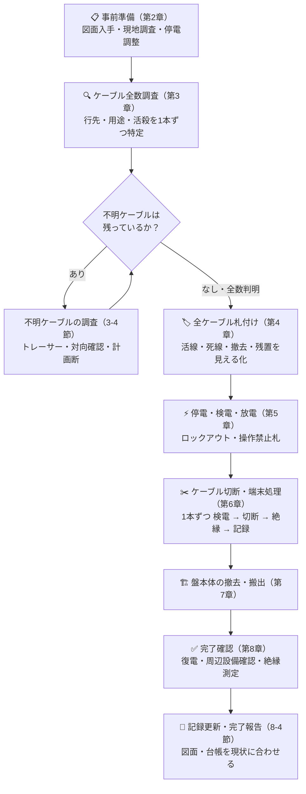
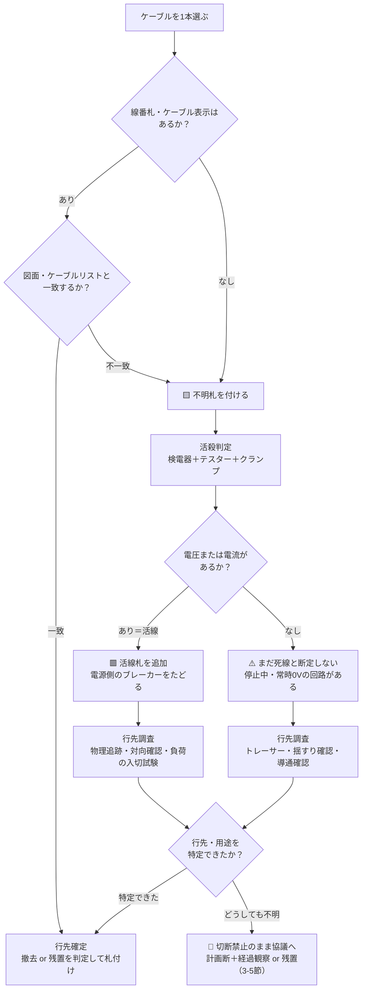

# 制御盤撤去工事ガイドライン

> 制御盤の撤去は「外して捨てるだけ」の工事ではありません。**何につながっているか分からないケーブルを1本ずつ特定し、札で見える化し、安全を確認してから切る**——この地道な手順こそが工事の本体です。本ガイドラインは、経験の浅い作業者でも感電ゼロ・誤切断ゼロ・無停電トラブルゼロで工事を完遂できることを目標に、調査 → 札付け → 停電 → 切断 → 撤去 → 後始末の全工程を定めます。

| 項目 | 内容 |
|------|------|
| 対象工事 | 低圧（600 V 以下）の制御盤・動力盤・分電盤の撤去 |
| 適用範囲 | 事前調査から停電・切断・搬出・完了報告まで |
| 対象外 | 高圧受電設備（キュービクル等）の撤去・高圧充電部の作業（電気主任技術者の指揮のもと別途計画する） |
| 必要資格 | 電気工事士 ＋ 低圧電気取扱業務特別教育（詳細は第2章） |
| 作業体制 | 作業指揮者を定め、**2名以上**で実施（単独作業禁止） |

!!! danger "絶対に守る三大原則"
    1. **検電なくして接触なし** — すべての電線・端子は「通電中」とみなす。検電器で無電圧を確認するまで素手で触れない。
    2. **不明ケーブルは切らない** — 「行先」「用途」「活殺（通電の有無）」の3点が確定するまで切断禁止。
    3. **札のないケーブルに手を出さない** — 盤に出入りする全ケーブルに札が付き、作業指揮者が確認するまで、切断作業を開始しない。

!!! note "本ガイドラインの位置づけ"
    一般的な低圧制御盤撤去の標準手順をまとめた実務参考資料です。実際の工事では、事業場の安全作業規程・発注者のルール・電気主任技術者の指示が本ガイドラインに**優先**します。矛盾を感じたら自己判断せず、作業指揮者に確認してください。

---

## 1. 工事全体の流れ

まず全体像をつかみます。**切断（第6章）より前の工程に全体の7割の労力をかける**のがこの工事の正しい配分です。調査と札付けが完璧なら、当日の切断作業は「確認して切るだけ」になります。

---

## 2. 事前準備

### 2-1. 集める図面・書類

| 図面・書類 | 何に使うか |
|-----------|-----------|
| 単線結線図 | 電源元（どの盤のどのブレーカーから受電しているか）の特定 |
| 展開接続図（シーケンス図） | 制御回路の渡り線・インターロックの洗い出し |
| ケーブルリスト（ケーブルスケジュール） | 全ケーブルの照合台帳。調査票のベースになる |
| 盤製作図（外形図・器具配置図・端子台図） | 盤内機器・重量・端子配置の把握 |
| 幹線系統図・電源系統図 | 停電範囲の確定 |
| 建築図 | 搬出経路・防火区画の位置確認 |

!!! tip "図面がない・古い場合"
    図面と現物が違うのは「例外」ではなく「よくあること」です。図面は**仮説**、現物が**正**。図面がない場合は調査工程を厚く取り、現物から実配線図（as-built）を起こしてから工事に着手します。図面がないことを理由に調査を省略してはいけません。

### 2-2. 現地調査で確認すること

- 盤の名称・銘板（形式・製造年・概算重量）
- **電源元**: どの盤のどのブレーカーから受電しているか（系統図と現物の両方で確認）
- 盤に出入りする**ケーブルの全数**（上出し・下出し・ラック・ピット内をすべて数える）
- **渡り線**の有無: 他盤との間のインターロック・警報・遠方操作・表示用の制御線 ★最重要
- UPS・直流電源（バッテリー）・非常用電源系統の有無
- 通信線・計装線（PLCリンク・LAN・4-20 mA 信号線）の有無
- 周辺の稼働設備（撤去作業や停電の影響が及ぶ範囲）
- 搬出経路（通路幅・段差・エレベーター・吊り代・養生範囲）
- 作業スペース・照明・換気

### 2-3. 関係者との調整

- 停電範囲と影響設備を一覧化し、施設管理者・発注者と**停電日時を合意**する
- 撤去する盤を**経由**して他設備に電源・信号が渡っていないか（渡っている場合は切替・移設工事を先行）
- 停電当日の周知（掲示・放送・関係部署への連絡）
- 電気主任技術者への工事内容の報告と指示の受領（自家用電気工作物の場合）

### 2-4. 体制と資格

| 区分 | 必要な資格・教育 |
|------|----------------|
| 一般用電気工作物の工事 | 第二種電気工事士以上 |
| 自家用電気工作物（最大電力 500 kW 未満の需要設備）の工事 | 第一種電気工事士（600 V 以下の部分は認定電気工事従事者でも可） |
| 自家用電気工作物（500 kW 以上） | 電気工事士法の対象外。電気主任技術者の保安監督のもとで施工 |
| 停電・検電・低圧充電電路の取り扱い | 低圧電気取扱業務特別教育（労働安全衛生規則 第36条第4号） |
| 吊り上げ搬出がある場合 | 玉掛け技能講習等 |

- 撤去も電気工事士法上の「電気工事」（設置し、又は変更する工事）に含まれます（軽微な工事を除く）→ [電気工事士法 第2条（定義・軽微な工事）](../articles/other/koji-shi-2.md)・[第3条（電気工事士の資格)](../articles/other/koji-shi-3.md)
- 作業指揮者を定め、停電作業の指揮・札と施錠の確認を行わせます（労働安全衛生規則 第350条）

### 2-5. 工具・保護具・測定器リスト

| 区分 | 品目 | 用途・使用前確認 |
|------|------|----------------|
| 測定器 | 低圧検電器 | 活殺判定・無電圧確認。**使用前にテストボタンか既知の電源で動作確認**（労働安全衛生規則 第352条の使用前点検） |
| 測定器 | テスター | 電圧値の測定・AC/DC の判別・導通確認 |
| 測定器 | クランプメーター | 通電電流の有無をケーブルを切らずに確認 |
| 測定器 | 絶縁抵抗計（メガー） | 完了時の絶縁測定・死線のペア特定 |
| 測定器 | ケーブルトレーサー（トーンジェネレータ＋プローブ） | 死線の行先特定 |
| 保護具 | 低圧用絶縁手袋・保護メガネ・ヘルメット・絶縁靴 | 着用前に外観点検（手袋は空気試験） |
| 安全用品 | 操作禁止札・ロックアウト器具（南京錠・ハスプ） | ブレーカーの誤投入防止 |
| 安全用品 | 絶縁シート・絶縁カバー | 残置する活線部の養生 |
| 工具 | 絶縁柄のケーブルカッター・ニッパ・ドライバー類 | 切断・解線 |
| 材料 | 各種札（第4章）・結束バンド・マーキングテープ | ケーブルの見える化 |
| 材料 | ビニルテープ・絶縁キャップ | 切断端末の**即時**絶縁処理 |
| 記録 | カメラ・ケーブル調査票・筆記具 | 作業前後の写真・調査記録 |

---

## 3. ケーブル調査と不明ケーブルの取り扱い

本工事で最も重要な章です。**事故のほとんどは「分かったつもりのケーブル」から起きます。**

### 3-1. なぜ不明ケーブルが生まれるのか

- 増設・改造の繰り返しで、図面が現物に追いついていない
- 廃止した設備のケーブルが、撤去されずに残置されている
- 線番札が脱落・退色して読めない
- 前任者が記録を残さなかった

つまり不明ケーブルは「前任者の記録不備の遺産」です。だからこそ、この工事の最後には**自分が正しい記録を残す**ことまでが仕事に含まれます（8-4節）。

### 3-2. 調査の進め方

1. 盤に出入りする全ケーブルを数え、**1本ずつ番号を振って調査票に登録**する（数が合わない＝見落としがある）
2. 線番札・ケーブル表示をケーブルリスト・図面と照合する
3. 照合できないケーブルには**不明札（黄）**を付け、3-3節のフローで調査する
4. 全ケーブルの「行先・用途・活殺」が確定し、調査票の空欄がゼロになったら調査完了

### 3-3. 不明ケーブル判定フロー

### 3-4. 調査手法カタログ

| 手法 | 対象 | 何が分かるか | 注意点 |
|------|------|-------------|--------|
| 線番札・シース表記の確認 | 全ケーブル | 回路名・行先（記載が正しければ） | 札も誤っていることがある。鵜呑みにせず必ず図面・現物と照合 |
| 検電器 | 活線 | 交流電圧の有無 | 使用前に動作確認。直流・シールド付きケーブル・絶縁トランス二次側は反応しないことがある |
| テスター（電圧測定） | 活線 | 電圧値・AC/DC の種別 | 対地間と線間の両方を測る |
| クランプメーター | 活線 | 負荷電流の有無 | **電流ゼロ＝死線ではない**（負荷が停止中なだけかもしれない） |
| 負荷の入切試験 | 活線 | 対向設備との対応関係 | 関係者立会いのうえ実施。勝手に負荷を入切しない |
| 物理追跡（目視） | 全ケーブル | 敷設ルート | ラック・配管の分岐で見失いやすい。マーキングしながら追う |
| 揺すり確認 | 死線と推定したもの | 対向側の特定 | 2人＋無線連絡で実施。活線や端子付近を強く揺らさない |
| トーンジェネレータ＋プローブ | 死線 | 行先の特定 | **活線への接続禁止**（活線対応機種を除く）。接続前に必ず検電 |
| 導通確認（テスター・メガー） | 死線（両端切離し済み） | ケーブルペアの特定 | 両端とも回路から切り離してから。長いケーブルは残留電荷に注意 |
| 計画断（試験停電） | 最終手段 | 影響範囲の確定 | 3-5節の承認・周知・即復旧体制が前提 |

### 3-5. それでも特定できないとき

どうしても行先・用途が特定できないケーブルは、**単独判断で切ってはいけません**。発注者・施設管理者・電気主任技術者と協議し、次のいずれかを選びます。

- **選択肢A: 残置** — 切らずに養生し、「不明・調査継続」札と台帳記録を残して撤去範囲から除外する
- **選択肢B: 計画断＋経過観察** — 関係者に周知のうえ、ブレーカー開放または端子部での切離し（切断ではなく復旧可能な方法）を行い、**1週間〜1か月**運用して影響がないことを確認してから撤去する

!!! warning "経過観察期間の落とし穴"
    季節運転の設備（暖房・冷房・凍結防止ヒーター）や月次・年次でしか動かない回路は、短い観察期間では影響が出ません。負荷の運転パターンを聞き取り、**少なくともその回路が一度は動くはずの期間**を観察してください。判断に迷う場合は選択肢A（残置）が安全です。

### 3-6. ケーブル調査票（フォーマット）

調査結果は口頭や記憶ではなく、必ず次の様式で記録します。**全行が埋まるまで切断作業は開始できません。**

| No | ケーブル表示 | 種類・サイズ | 電源側 | 負荷側（行先） | 活殺 | 判定方法 | 判定者／判定日 | 処置 |
|----|------------|-------------|--------|--------------|------|---------|---------------|------|
| 1 | P-101 | CV 3C-8sq | 電灯盤L-1 MCCB#3 | 制御盤本体（主回路） | 活 → 停電後 死 | 検電・系統図照合 | 古舘／06-10 | 撤去 |
| 2 | C-205 | CVV 7C-1.25sq | 制御盤B（渡り） | 本盤 TB2 | **活（AC100 V）** | テスター実測 | 古舘／06-10 | 相手盤側で開放後に撤去 |
| 3 | （表示なし） | IV 2sq | 不明 | 不明 | 無電圧 | 検電・クランプ | 古舘／06-10 | **不明札・調査中・切断禁止** |

??? question "セルフチェック: 検電器が反応しないケーブルを「死線」と断定してはいけないのはなぜですか？"
    **「いま電圧がない」ことと「回路として死んでいる」ことは別問題**だからです。

    - 負荷が停止中なだけの回路（タイマー制御・季節運転・予備機）は、いま無電圧でも運用上は生きている
    - 制御線・信号線には常時 0 V のもの（b接点回路・無電圧接点・通信線）が普通に存在する
    - 直流回路・微弱信号は、交流用検電器ではそもそも検出できない

    したがって「無電圧の確認」は切断の必要条件にすぎず、十分条件ではありません。**行先と用途の特定**が揃って初めて切断を判断できます。

---

## 4. 札（タグ）の運用ルール

調査結果を「現場で誰が見ても分かる形」に変換する装置が札です。記憶・口頭・個人のメモは引き継げませんが、札と調査票は引き継げます。

### 4-1. 札の種類

| 札 | 色（推奨） | 意味 | 取るべき行動 |
|----|----------|------|-------------|
| **活線札** | 赤 | 通電中 | 触れない・切断禁止。停電確認後に死線札へ付け替える |
| **死線札** | 白または青 | 停電・無電圧を確認済み | 切断可（ただし切断直前に毎回再検電） |
| **不明札** | 黄 | 行先・用途・活殺のいずれかが未確定 | **切断禁止**・調査継続 |
| **撤去札** | 橙 | 本工事で撤去する対象 | 死線札とセットになって初めて切断可 |
| **残置札** | 緑 | 撤去せず活かしたまま残す | 切断禁止・養生して保護 |
| **操作禁止札** | 赤（事業場の規定様式） | 開放したブレーカー・開閉器 | 投入禁止。施錠（ロックアウト）と併用 |

!!! note "色・様式は現場ルールが優先"
    札の色分けは事業場によって異なります。上表はあくまで一例で、重要なのは**作業に関わる全員が同じ意味で読めること**。工事開始前のTBMで「この現場の札の意味」を必ず全員で確認してください。

### 4-2. 札の記載事項

札には最低限、次を記載します。**記載のない札は「信用できない札」として不明扱い**にします。

- ケーブル番号（調査票のNoと一致させる）
- 行先（両端の盤名・機器名。例:「電灯盤L-1 → 本盤主回路」）
- 判定（活・死・不明）と判定方法（検電・クランプ・対向確認 など）
- 判定者名・判定日

### 4-3. 札付けの5原則

1. **全数札付けが切断開始の条件** — 札のないケーブルが1本でも残っていたら、切断作業を開始しない
2. **両端原則** — 盤側と相手側の両端に同じ番号の札を付ける（合札）。片端だけの札は相手側で誤切断を招く
3. **札＋検電のダブルチェック** — 札を信じて検電を省略しない。札は「過去の判定」、検電は「いまの事実」
4. **札は責任表示** — 判定者名・日付・判定方法まで書く。誰がいつどう判定したか分からない札は判断材料にならない
5. **札の付け替えは判定者本人か作業指揮者の承認で** — 他人の札を勝手に外さない・書き換えない

### 4-4. 図解: 札付けのイメージ

<svg viewBox="0 0 800 480" xmlns="http://www.w3.org/2000/svg" role="img" aria-label="制御盤撤去の札付けイメージ図">
  <text x="20" y="26" font-size="15" font-weight="bold" fill="#263238" font-family="sans-serif">札付けイメージ — 盤に出入りする全ケーブルを見える化する</text>

  <!-- 電源元盤 -->
  <rect x="30" y="60" width="150" height="130" fill="#eceff1" stroke="#546e7a" stroke-width="1.5" rx="4"/>
  <text x="105" y="82" font-size="13" fill="#263238" text-anchor="middle" font-family="sans-serif">電源元の分電盤</text>
  <rect x="55" y="95" width="100" height="30" fill="#ffffff" stroke="#546e7a" stroke-width="1.2"/>
  <text x="105" y="114" font-size="12" fill="#263238" text-anchor="middle" font-family="sans-serif">主幹MCCB（開放）</text>
  <rect x="55" y="135" width="100" height="26" fill="#c62828" rx="3"/>
  <text x="105" y="152" font-size="11" fill="#ffffff" text-anchor="middle" font-family="sans-serif">操作禁止札＋施錠</text>

  <!-- 電源ケーブル -->
  <line x1="180" y1="110" x2="320" y2="110" stroke="#37474f" stroke-width="3"/>
  <text x="250" y="95" font-size="11" fill="#455a64" text-anchor="middle" font-family="sans-serif">電源ケーブル</text>
  <rect x="225" y="115" width="52" height="18" fill="#ffffff" stroke="#607d8b" stroke-width="1.5" rx="2"/>
  <text x="251" y="128" font-size="10" fill="#37474f" text-anchor="middle" font-family="sans-serif">死線札</text>

  <!-- 撤去対象 制御盤 -->
  <rect x="320" y="55" width="180" height="260" fill="#fff8e1" stroke="#d84315" stroke-width="2.5" stroke-dasharray="9 5" rx="4"/>
  <text x="410" y="80" font-size="14" font-weight="bold" fill="#d84315" text-anchor="middle" font-family="sans-serif">撤去対象 制御盤</text>
  <text x="410" y="100" font-size="11" fill="#6d4c41" text-anchor="middle" font-family="sans-serif">出入りする全ケーブルに札</text>

  <!-- 負荷側ケーブル1: ポンプ -->
  <line x1="500" y1="130" x2="640" y2="130" stroke="#37474f" stroke-width="2.5"/>
  <rect x="545" y="108" width="52" height="18" fill="#ffffff" stroke="#607d8b" stroke-width="1.5" rx="2"/>
  <text x="571" y="121" font-size="10" fill="#37474f" text-anchor="middle" font-family="sans-serif">死線札</text>
  <rect x="640" y="110" width="120" height="40" fill="#eceff1" stroke="#546e7a" stroke-width="1.5" rx="4"/>
  <text x="700" y="134" font-size="12" fill="#263238" text-anchor="middle" font-family="sans-serif">ポンプ P-1</text>

  <!-- 負荷側ケーブル2: 照明 -->
  <line x1="500" y1="190" x2="640" y2="190" stroke="#37474f" stroke-width="2.5"/>
  <rect x="545" y="168" width="52" height="18" fill="#2e7d32" rx="2"/>
  <text x="571" y="181" font-size="10" fill="#ffffff" text-anchor="middle" font-family="sans-serif">残置札</text>
  <rect x="640" y="170" width="120" height="40" fill="#eceff1" stroke="#546e7a" stroke-width="1.5" rx="4"/>
  <text x="700" y="194" font-size="12" fill="#263238" text-anchor="middle" font-family="sans-serif">場内照明 L-3</text>

  <!-- 不明ケーブル -->
  <line x1="500" y1="250" x2="640" y2="280" stroke="#37474f" stroke-width="2.5"/>
  <rect x="545" y="240" width="52" height="18" fill="#f9a825" rx="2"/>
  <text x="571" y="253" font-size="10" fill="#263238" text-anchor="middle" font-family="sans-serif">不明札</text>
  <text x="660" y="295" font-size="12" font-weight="bold" fill="#e65100" font-family="sans-serif">行先不明？ → 切断禁止</text>

  <!-- 渡り制御線 -->
  <rect x="40" y="330" width="160" height="70" fill="#eceff1" stroke="#546e7a" stroke-width="1.5" rx="4"/>
  <text x="120" y="358" font-size="12" fill="#263238" text-anchor="middle" font-family="sans-serif">隣の制御盤B</text>
  <text x="120" y="378" font-size="11" fill="#455a64" text-anchor="middle" font-family="sans-serif">（稼働中・停電しない）</text>
  <line x1="200" y1="355" x2="370" y2="315" stroke="#c62828" stroke-width="2.5" stroke-dasharray="6 4"/>
  <rect x="255" y="345" width="52" height="18" fill="#c62828" rx="2"/>
  <text x="281" y="358" font-size="10" fill="#ffffff" text-anchor="middle" font-family="sans-serif">活線札</text>
  <text x="230" y="425" font-size="12" font-weight="bold" fill="#c62828" font-family="sans-serif">★渡り制御線（AC100 V）— 主幹MCCBを切っても生きている！</text>

  <!-- 凡例 -->
  <rect x="540" y="330" width="245" height="130" fill="#fafafa" stroke="#90a4ae" stroke-width="1" rx="4"/>
  <text x="552" y="350" font-size="12" font-weight="bold" fill="#263238" font-family="sans-serif">凡例（札の色）</text>
  <rect x="552" y="360" width="30" height="14" fill="#c62828" rx="2"/>
  <text x="590" y="371" font-size="11" fill="#37474f" font-family="sans-serif">活線＝触るな・切断禁止</text>
  <rect x="552" y="382" width="30" height="14" fill="#f9a825" rx="2"/>
  <text x="590" y="393" font-size="11" fill="#37474f" font-family="sans-serif">不明＝調査中・切断禁止</text>
  <rect x="552" y="404" width="30" height="14" fill="#ffffff" stroke="#607d8b" stroke-width="1.5" rx="2"/>
  <text x="590" y="415" font-size="11" fill="#37474f" font-family="sans-serif">死線確認済＝切断可</text>
  <rect x="552" y="426" width="30" height="14" fill="#2e7d32" rx="2"/>
  <text x="590" y="437" font-size="11" fill="#37474f" font-family="sans-serif">残置＝切らずに養生</text>
</svg>

---

## 5. 撤去当日: 停電とロックアウト

### 5-1. 朝礼・TBM-KY

- 本日の作業範囲・手順・役割分担（操作者・確認者・監視人）を共有する
- この現場の札の意味（4-1節）と、不明札のケーブルには触れないことを全員で確認する
- 危険予知（KY）: 「どこで感電しうるか」「どのケーブルを取り違えうるか」を具体的に挙げる

### 5-2. 停電操作手順

1. 関係部署へ停電開始を連絡する（放送・声かけ・掲示）
2. **負荷側から順に**停止・開放する（運転中のモーター等は先に停止操作）→ 最後に主幹MCCBを開放
3. 開放した開閉器に**操作禁止札＋施錠（ロックアウト）**を行う。鍵は作業指揮者が管理する（労働安全衛生規則 第339条: 施錠・通電禁止表示・監視人）
4. 操作は「操作者」と「確認者」の2名で、機器名を復唱しながら行う

### 5-3. 検電・放電・（必要に応じて）接地

1. **検電器の動作確認**（テストボタンまたは既知の電源で）
2. **全端子検電**: 主回路（R・S・T・N の全相）、制御回路端子、**外部から入ってくる全ケーブルの端子**を1つずつ検電する
3. **残留電荷の放電**: 進相コンデンサ・インバータの直流部などは安全な方法で放電させる（労働安全衛生規則 第339条）。インバータはチャージランプ消灯を確認のうえ、メーカー指定の待ち時間（目安5〜15分）の後、直流端子間の電圧測定で無電圧を確認する
4. 誤通電・他回路との混触・誘導のおそれがある場合は短絡接地を施す
5. 「無電圧確認よし」を指差呼称し、作業指揮者が作業開始を宣言する

### 5-4. ★主回路を切っても電気が残る場所（最重要）

感電災害の典型は「主幹を切ったから安全だと思った」です。盤の電気は主幹からだけ来るとは限りません。

| 残る電気 | 典型例 | 対策 |
|---------|--------|------|
| 他盤からの渡り制御電源 | インターロック・遠方表示用の AC100 V／DC24 V が**別盤から直接**来ている | 事前調査（2-2節）で渡り線を洗い出し、**相手盤側でも**開放・札掛けする |
| UPS・バッテリー | 計装電源・非常照明・PLCのバックアップ電源 | UPS出力系統を特定し、出力側も停止・確認する |
| コンデンサの残留電荷 | インバータ直流部・進相コンデンサ | 放電操作と電圧測定（5-3節） |
| 発電設備からの逆充電 | 太陽光パワーコンディショナ・非常用発電機 | 連系用遮断器・切替開閉器の開放を確認する |
| 並走ケーブルからの誘導 | 長距離で活線と並走するケーブルの誘導電圧 | 検電で確認し、必要に応じて接地する |

??? question "セルフチェック: 主幹ブレーカーを開放して主回路の検電もしたのに、なぜ「全端子検電」までやる必要があるのですか？"
    **盤に入ってくる電気の経路が主幹1本とは限らない**からです。

    - 渡り制御線・UPS・発電設備の逆充電など、主幹と無関係に生きている経路がある（5-4節の表）
    - 検電は「検電したその端子」の無電圧しか保証しない。検電していない端子は依然として「通電中とみなす」のが原則1
    - 特に渡り制御線は展開接続図を読まないと存在に気づけず、しかも AC100 V と感電に十分な電圧を持つ

    だから「外部から入る全ケーブルの端子を1つずつ」検電して初めて、盤全体を死んだとみなせます。

---

## 6. ケーブルの切断と端末処理

### 6-1. 切断開始の条件（すべて満たすまで切らない）

- [ ] 調査票の全行が埋まり、不明ケーブルがゼロ（または承認済みの処置方針あり）
- [ ] 全ケーブルに札が付いている（4-3節の原則1）
- [ ] 停電・全端子検電・放電が完了している
- [ ] 操作禁止札・施錠が完了している
- [ ] 作業指揮者が切断開始を宣言した

### 6-2. 1本ずつのサイクル（検電 → 切断 → 絶縁 → 記録）

ケーブル1本ごとに、次のサイクルを**毎回**回します。

1. **札確認** — 死線札＋撤去札の2枚がそろっていることを指差呼称（「No.5、死線札よし、撤去札よし」）
2. **検電** — その場でもう一度検電（「無電圧よし」）。札は過去の判定、検電はいまの事実
3. **切断** — 絶縁柄の工具で切断する
4. **端末絶縁** — 切断面の**両側とも即時**にビニルテープ巻きまたは絶縁キャップ。切りっぱなしで次に進まない
5. **記録** — 調査票の処置欄にチェックと時刻を記入

!!! warning "「まとめ切り」禁止"
    「全部死んでいるはずだから」と複数本を一気に切るのは、誤切断と感電の温床です。面倒でも1本ずつサイクルを回すこと。調査と札付けが完璧なら、このサイクルは1本あたり1〜2分で回ります。**急がば回れではなく、これが最速の手順です。**

### 6-3. 残置側ケーブルの処理

- 相手盤側や経路の途中で切り離した**残る側の端末**には、絶縁キャップ＋「廃止（YYYY-MM-DD ○○盤撤去に伴い切断・この先死線）」の札を付ける
- 可能であれば残置せず**大元から引き抜いて撤去**するのが最善（残置ケーブルは将来の「不明ケーブル」になる）
- やむを得ず残すケーブルは、台帳に「残置・廃止済み」として記録する

---

## 7. 盤本体の撤去・搬出

### 7-1. 盤内有害物の確認（解体・処分の前に）

- **PCB**: 1990年代前半以前に製造された変圧器・コンデンサ・安定器は PCB 含有（微量 PCB を含む）の可能性がある。銘板の製造年・形式を確認し、該当のおそれがあれば分析するか PCB 含有として扱う。低濃度 PCB 廃棄物の処分期限は **2027年3月31日** → 詳細は [PCB機器の取り扱い](../themes/pcb-kiki.md)
- **水銀**: 水銀リレー・水銀スイッチ・盤内蛍光灯
- **バッテリー**: 制御電源用の鉛蓄電池・ニカド電池（PLC・タイマーのバックアップ電池含む）

### 7-2. 搬出作業

- 銘板・図面から重量を見積もり、**2名以上または運搬機器**（台車・キャリー・チェーンブロック）で搬出する。無理な人力搬出をしない
- 吊り上げがある場合は玉掛け有資格者が行う
- 重量物（変圧器・コンデンサ・大型遮断器）は先に盤から抜くと、軽くなり重心も安定する
- アンカーボルトの切断でサンダー等を使う場合は、火気使用許可・養生・消火器の準備（盤内外の粉じん・ケーブル残材に着火させない）
- 搬出経路は事前に養生し、通行者の動線と交差する場合は監視人を置く

### 7-3. 開口部・貫通部の処理

- 盤撤去後の床開口・ピット開口は、転落・落下防止のため**その日のうちに**塞ぐか柵・表示で養生する
- **防火区画**を貫通していた配管・ケーブルの穴は、耐火材（モルタル・耐火パテ）で復旧する（消防法令上の義務。放置すると査察指摘・延焼リスク）
- 屋外盤撤去後の基礎・配管口は防水処理する

---

## 8. 完了確認と後始末

### 8-1. 復電と周辺設備の確認

- 残置回路へ復電する場合は、停電操作の逆順で投入し、投入後に周辺設備の正常稼働・警報の有無を確認する
- 撤去した盤と関係していた設備（インターロック相手・上位監視盤）に異常表示が出ていないか確認する

### 8-2. 残置回路の絶縁測定

- 今回の工事で手を入れた残置回路は、絶縁抵抗を測定して健全性を記録する
- 低圧電路の絶縁抵抗の基準値（電技省令 第58条）: 対地電圧 150 V 以下は 0.1 MΩ 以上／その他 300 V 以下は 0.2 MΩ 以上／300 V 超過は 0.4 MΩ 以上 → 詳細は [省令第58条（低圧電路の絶縁）](../articles/kijun/58.md)・[絶縁抵抗・絶縁性能マスタ](../reference/insulation-resistance.md)
- 電子機器がつながったままの回路は、印加電圧による損傷を防ぐため測定レンジ（500 V → 250 V 等)・切離しの要否を確認してから測定する

### 8-3. 廃棄物処理

- 産業廃棄物として分別（金属くず・廃電線・廃プラ・基板類）し、マニフェストを発行する
- PCB 含有機器は**特別管理産業廃棄物**として分別保管・届出・期限内処分（7-1節）
- 廃電線（銅）は有価物として売却できる場合がある（盗難防止のため当日搬出が原則）

### 8-4. 記録の更新 — 不明ケーブルを次の世代に残さない

- 単線結線図・展開接続図に撤去内容を反映する（現場赤入れ → 正式改訂）
- ケーブル台帳・盤リストを更新し、残置・廃止ケーブルを明記する
- ケーブル調査票・チェックリスト・作業前後の写真を完了報告書に綴じて提出する

!!! tip "この工事の本当のゴール"
    不明ケーブルは前任者の記録不備が生んだものでした（3-1節）。あなたが今日残す正確な記録が、**10年後の誰かの「不明ケーブル調査」を不要にします**。記録更新までが撤去工事です。

---

## 9. 仕事の進め方10箇条

手順書に書ききれない「仕事の仕方」をまとめます。これは安全のためであると同時に、**最短で終わらせるため**の作法です。

1. **指差呼称する** — 「札よし」「無電圧よし」。目視だけの確認は飛ぶ。声と指で確認を行動にする
2. **推測で切らない** — 「たぶん死んでる」「多分予備」は禁句。確認できていないなら、それは不明ケーブル
3. **二人一組で動く** — 停電操作・切断・高所は単独作業禁止。1人は手を動かし、1人は確認する
4. **1本ずつ進める** — まとめ切り禁止（6-2節）。サイクルを崩さないことが結局いちばん速い
5. **中断したら検電からやり直す** — 昼休憩・打合せで現場を離れたら、再開時は「いまの事実」を取り直す
6. **写真は切る前に撮る** — 復旧や検証で効くのは「切断前」の写真。困ってから撮ることはできない
7. **札と記録で引き継ぐ** — 記憶と口頭は翌日消える。複数日工事は、札と調査票が唯一の引き継ぎ手段
8. **整理整頓を保つ** — 切ったケーブルは即時搬出。床に転がる廃線は、つまずきと「切った／切ってない」の混乱を生む
9. **異変があれば即中断・報告する** — 焦げ臭・異音・警報・周辺設備の停止。続行の判断は作業指揮者が行う
10. **工程に追われても手順を飛ばさない** — 事故の典型は最終日夕方の手順省略。遅れの挽回は工程調整で行い、検電と札のプロセスでは行わない

---

## 10. よくある事故・失敗事例

### 🔴 重大（感電・設備停止クラス）

1. 🔴 **「たぶん死んでる」で不明ケーブルを切断** — 別系統で稼働中の設備が停止し、生産ライン・サーバーがダウン。→ 三大原則2。行先・用途・活殺の3点確定まで切らない（第3章）
2. 🔴 **主幹を切って安心し、渡り制御線の AC100 V で感電** — 隣の盤から来ているインターロック線は主幹と無関係に生きている。→ 全端子検電（5-4節）
3. 🔴 **インバータの直流部で感電** — 停電直後はコンデンサに残留電荷が残る。→ 放電待ち時間＋電圧測定（5-3節）
4. 🔴 **作業中に第三者がブレーカーを再投入** — 操作禁止札・施錠をしていなかった。→ ロックアウト・タグアウトの徹底（5-2節）

### 🟡 中程度（手戻り・二次トラブル）

5. 🟡 **図面を信じて現物確認を省略** — 増設で実配線が図面と違っていた。→ 図面は仮説、現物が正（2-1節）
6. 🟡 **札の記載不備で取り違え切断** — 番号も判定者も書いていない札は判断材料にならない。→ 札の記載事項と5原則（4-2・4-3節）
7. 🟡 **残置側端末を未絶縁のまま放置** — 復電後に端末が金属部に触れて地絡・漏電遮断器動作。→ 切断＝即時絶縁処理（6-2節）
8. 🟡 **防火区画の貫通穴を未処理** — 消防査察で指摘・是正命令。→ 耐火復旧（7-3節）

### 🟢 軽微（だが信用を失う）

9. 🟢 **PCB 含有コンデンサを金属くずとして処分しかけた** — 製造年の確認漏れ。→ 銘板確認と特管産廃の分別（7-1・8-3節）
10. 🟢 **図面・台帳を更新しなかった** — 数年後、その現場は再び「不明ケーブルだらけ」になり、調査費用が倍になって返ってくる。→ 記録更新までが工事（8-4節）

---

## 11. チェックリスト

印刷して現場に持ち込み、チェックを入れながら使ってください。

### 11-1. 事前準備（前日まで）

- [ ] 図面（単線結線図・展開接続図・ケーブルリスト）を入手した
- [ ] 現地調査で盤に出入りする全ケーブルをリストアップした（本数が現物と一致）
- [ ] 不明ケーブルがゼロになった（または処置方針が決まり、承認を得た）
- [ ] 全ケーブルに札を付けた（活線・死線・不明・撤去・残置）
- [ ] 渡り制御線・UPS・発電設備など「主幹以外の電源経路」を洗い出した
- [ ] 停電範囲・日時を関係者と合意し、周知した
- [ ] 作業体制（作業指揮者・2名以上）と資格・特別教育を確認した
- [ ] 工具・保護具・測定器・札・絶縁材を準備した
- [ ] PCB 等の有害物の有無を銘板で確認した

### 11-2. 当日作業開始前

- [ ] TBM-KY を実施し、本日の手順・札の意味・危険ポイントを全員で共有した
- [ ] 検電器の動作確認をした（テストボタン・既知の電源）
- [ ] 停電操作を手順どおり実施した（負荷側 → 主幹の順）
- [ ] 開放したブレーカーに操作禁止札＋施錠をした
- [ ] 全端子検電をした（主回路・制御回路・外部から入る全ケーブル）
- [ ] コンデンサ・インバータの放電を確認した
- [ ] 作業指揮者が作業開始を宣言した

### 11-3. 切断前（ケーブル1本ごと・毎回）

- [ ] 死線札と撤去札の両方が付いている
- [ ] **いま**検電して無電圧を確認した
- [ ] 切断面を即時絶縁処理する材料が手元にある
- [ ] 切断後、調査票の処置欄に記録した

### 11-4. 完了時

- [ ] 残置回路の絶縁測定をして記録した
- [ ] 復電し、周辺設備の正常稼働・警報なしを確認した
- [ ] 開口部・防火区画貫通部・屋外基礎の処理をした
- [ ] 廃棄物を分別し、マニフェストを発行した（PCB 等は特別管理産業廃棄物）
- [ ] 図面・ケーブル台帳を更新した
- [ ] 完了報告書（調査票・チェックリスト・写真）を提出した

---

## 12. 関連法令・関連ページ

### 関連法令

| 法令 | 関連箇所 | 本ガイドラインとの対応 |
|------|---------|----------------------|
| [労働安全衛生規則](https://laws.e-gov.go.jp/law/347M50002000032) | 第339条（停電作業を行う場合の措置） | 施錠・通電禁止表示・監視人／残留電荷の放電／高圧以上の検電・短絡接地（第5章） |
| 労働安全衛生規則 | 第350条（作業指揮者） | 停電作業の指揮・確認体制（2-4節） |
| 労働安全衛生規則 | 第352条（使用前点検） | 検電器具等の使用前点検（2-5節） |
| 労働安全衛生規則 | 第36条第4号（特別教育） | 低圧電気取扱業務特別教育（2-4節) |
| 電気工事士法 | 第2条・第3条 | 撤去工事に必要な資格（2-4節）→ [第2条](../articles/other/koji-shi-2.md)・[第3条](../articles/other/koji-shi-3.md) |
| 電技省令 | 第58条（低圧電路の絶縁） | 残置回路の絶縁測定基準（8-2節）→ [解説ページ](../articles/kijun/58.md) |
| 廃棄物処理法・PCB特別措置法 | 産廃マニフェスト・PCB 廃棄物 | 廃棄物処理（7-1・8-3節）→ [PCB機器の取り扱い](../themes/pcb-kiki.md) |
| 電気関係報告規則 | 第3条（事故報告） | 万一の感電死傷・波及事故時の報告 → [解説ページ](../articles/other/jiko-3.md) |

### 関連ページ（本Wiki内）

- [省令第58条（低圧電路の絶縁）](../articles/kijun/58.md) — 絶縁抵抗 3 段階の根拠条文
- [解釈第14条（低圧電路の絶縁性能）](../articles/kaishaku/14.md) — 絶縁測定の実施単位（開閉器で区切れる電路ごと）
- [絶縁抵抗・絶縁性能マスタ](../reference/insulation-resistance.md) — 数値早見表
- [PCB機器の取り扱い](../themes/pcb-kiki.md) — PCB の判定・保管・処分期限
- [安全靴・漏電・静電気](../themes/anzen-rouden-seidenki.md) — 感電災害の基礎知識
- [電気工事士の作業範囲](../themes/denki-koji-shi.md) — 資格と作業範囲の整理

---

*最終確認: 2026-06-11 | ステータス: v1.0 | 種別: 実務ガイドライン（試験対策ページではなく現場作業の標準手順書） | 法令条番号の照合: e-Gov（労働安全衛生規則）2026-06-11*
