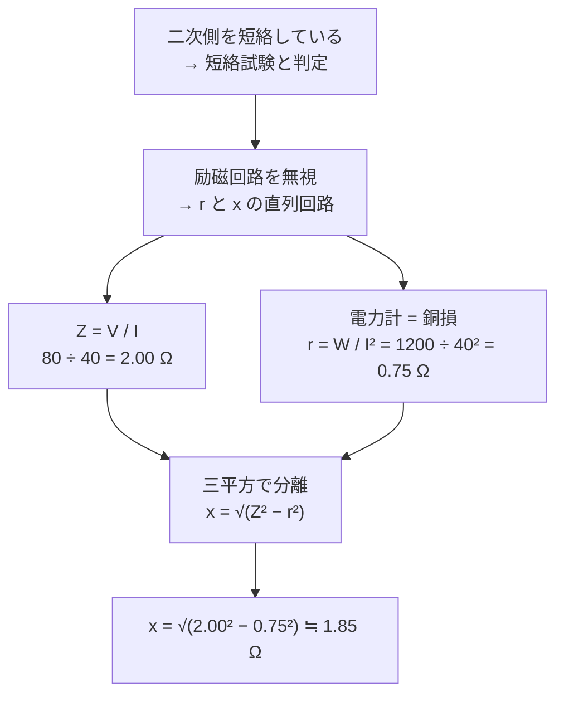

# :electric_plug: 変圧器の試験と等価回路

> 無負荷試験は「鉄損と励磁回路」、短絡試験は「銅損と巻線インピーダンス」。この対応さえ固定できれば、変圧器の試験問題は公式3本で処理できます。

---

## :dart: このページで得点するためのゴール

過去問で「どちらの試験か」「どの損失か」を取り違えずに得点するため、最終的に以下を即答できる状態を目指します。

- [ ] **無負荷試験と短絡試験**で、二次側の状態（開放／短絡）と電力計の読み（鉄損／銅損）を対応づけられる
- [ ] 短絡試験で **励磁回路を無視してよい理由** を2つ説明できる
- [ ] $Z=V/I$、$r=W/I^{2}$、$x=\sqrt{Z^{2}-r^{2}}$ の3本を、単位付きで即座に立てられる
- [ ] $x$ を **$Z-r$ の引き算で求めない**（$r$ と $x$ は 90 度ずれたベクトル）
- [ ] $r$ を $W/V^{2}$ で求めない（**直列回路なので電流基準 $I^{2}r$**）
- [ ] 短絡試験の結果が **%インピーダンス・電圧変動率・効率** のどこに繋がるかを言える

---

## 🧠 正答者 vs 誤答者の視点差

> 先に「正答者はどう考えているか」を見てから詳細に入ると効率が良いです。

| 観点 | :x: 誤答者 | :white_check_mark: 正答者 |
|------|----------|----------|
| 試験の区別 | 「無負荷」「短絡」の名前だけ覚えて損失と結びつかない | 二次側の状態（開放／短絡）→ 何が支配的か（磁束／電流）→ 損失（鉄損／銅損）と因果でたどる |
| 電力計の読み | 皮相電力 $VI$ と混同する | 電力計は常に**有効電力**。短絡試験なら銅損そのもの |
| $r$ の求め方 | $W/V^{2}$ や $V^{2}/W$ を使う | 直列回路だから電流基準 $r=W/I^{2}$ |
| $x$ の求め方 | $x=Z-r$ とスカラーで引く | $r$ と $x$ は直交ベクトル。$x=\sqrt{Z^{2}-r^{2}}$ |
| 求める量の取り違え | $Z$ を出した時点で答えてしまう | 問題文の「漏れリアクタンス」＝$x$ であって $Z$ ではないと確認する |
| 鉄損の扱い | 短絡試験でも鉄損を差し引こうとする | 印加電圧が定格の数 % → 鉄損は $V^{2}$ 比例で約 1/100 以下 → 無視と判断 |
| 検算 | 計算しっぱなし | 力率 $\cos\theta=W/(VI)$ から $r=Z\cos\theta$、$x=Z\sin\theta$ で二重チェックする |

---

## :zap: 5秒で思い出す { #self-check }

> **「開放は鉄損、短絡は銅損。$Z$ は割り算、$r$ は電力÷電流の2乗、$x$ は三平方」**

??? question "セルフチェック①: 短絡試験で励磁回路（励磁アドミタンス）を無視できるのはなぜか。2つの根拠を挙げて説明せよ"
    **根拠1（インピーダンスの大小）**: 励磁回路のインピーダンスは巻線の直列インピーダンスに比べて桁違いに大きい値です。二次側を短絡すると直列側は非常に低いインピーダンスになるため、電流はほぼ全量が直列側（$r$ と $x$）を流れ、励磁回路へ分流する分は無視できます。

    **根拠2（印加電圧の低さ）**: 定格電流を流すのに必要な電圧は定格電圧の数 % しかありません。磁束は $\phi \propto V/f$ なので磁束も数 %、したがって励磁電流も微小になります。

    同じ理由で **鉄損も無視**できます。鉄損は $B^{2}$ すなわち $V^{2}$ にほぼ比例するので、電圧が 1/10 なら鉄損は約 1/100 です。

??? question "セルフチェック②: 短絡試験で電力計が示す値は何か。なぜそう言えるのか"
    **銅損（抵抗損・負荷損）** です。等価回路が $r$ と $x$ の直列回路に簡略化され、有効電力を消費するのは $r$ だけだからです。リアクタンス $x$ は無効電力しか扱わないため電力計には現れません。よって $W=I^{2}r$ が成立します。

---

## :memo: まず覚える3公式

| 求めるもの | 式 | 根拠 | よくある誤り |
|-----------|----|------|-------------|
| **インピーダンス** $Z$ | $Z=\dfrac{V}{I}$ | オームの法則（大きさ＝斜辺） | $Z$ を答えて終わる（問われているのは $x$） |
| **抵抗** $r$ | $r=\dfrac{W}{I^{2}}$ | 電力計＝銅損 $I^{2}r$ | $W/V^{2}$ や $V^{2}/W$ を使う |
| **漏れリアクタンス** $x$ | $x=\sqrt{Z^{2}-r^{2}}$ | インピーダンス三角形 | $x=Z-r$ とスカラー引き算する |

!!! tip "力率経由の別解（検算に使う）"
    $\cos\theta=\dfrac{W}{VI}$ を求めれば、$r=Z\cos\theta$、$x=Z\sin\theta$ でも同じ答えが出ます。

    3公式で出した $r$ と、$Z\cos\theta$ で出した $r$ が一致すれば計算ミスなしと確認できます。

---

## :brain: 概念・趣旨

### なぜ2種類の試験を行うのか

変圧器の正確な等価回路には、直列の巻線抵抗 $r$・漏れリアクタンス $x$ に加えて、並列の**励磁回路**（励磁コンダクタンス $g_0$・励磁サセプタンス $b_0$）が入ります。この4つの定数を**一度の測定でまとめて決めることはできません**。

そこで、片方が無視できる条件をわざと作り出して、2回に分けて測定します。

- **二次側を開放**すれば、直列側には励磁電流しか流れない → 励磁回路が主役 → **無負荷試験**
- **二次側を短絡**すれば、励磁回路への分流が無視できる → 直列側が主役 → **短絡試験**

!!! note "試験名の別名"
    - 無負荷試験 ＝ **開放試験**（二次側を開放するため）
    - 短絡試験 ＝ **インピーダンス試験**（インピーダンス電圧を測るため）

    問題文でどちらの呼び方が出ても同じ試験を指します。

### 一次換算という前提

短絡試験で求まる $r$・$x$ は、**一次側に換算した合成値**です。巻数比を $a=N_1/N_2$ とすると次の関係になります。

$$
r = r_1 + a^{2} r_2 \qquad x = x_1 + a^{2} x_2
$$

問題文の「**一次側からみた**漏れリアクタンス」という表現は、この換算値を指しています。一次巻線だけの値ではない点に注意してください。

---

## 1. 無負荷試験（開放試験）

### 測定条件

- 二次側を **開放**（何も繋がない）
- 一次側に **定格電圧・定格周波数**を加える
- 一次側の電流計・電圧計・電力計を読む

### 読み取れるもの

流れる電流は励磁電流（定格電流の数 % 程度）だけです。巻線抵抗による損失は $I^{2}r$ で、$I$ が小さいため無視できます。したがって電力計の読みは **鉄損（無負荷損）** そのものになります。

| 測定値 | 意味 | 求まる量 |
|--------|------|---------|
| 電力計 $P_0$ | **鉄損**（ヒステリシス損＋渦電流損） | $g_0 = P_0 / V_n^{2}$ |
| 電流計 $I_0$ | 励磁電流 | $Y_0 = I_0 / V_n$ |
| 電圧計 $V_n$ | 定格電圧 | $b_0 = \sqrt{Y_0^{2}-g_0^{2}}$ |

!!! warning "鉄損は負荷に依存しない"
    鉄損は磁束の大きさで決まり、磁束は $V/f$ で決まります。定格電圧で運転する限り、**負荷が軽くても重くても鉄損はほぼ一定**です。この性質が後述の最大効率条件で効いてきます。

---

## 2. 短絡試験（インピーダンス試験）

### 測定条件

- 二次側を **短絡**（導線で直結）
- 一次側の電圧を **ゼロから徐々に上げ**、電流計が **定格電流**を示すところで止める
- そのときの電圧計・電流計・電力計を読む

このとき加えた電圧を **インピーダンス電圧** $V_s$ と呼びます。定格電圧の数 % 程度の低い値です。

!!! danger "いきなり定格電圧を加えてはいけない"
    二次側を短絡した状態で定格電圧を加えると、定格電流の 10〜25 倍の短絡電流が流れて変圧器を焼損します。**必ずゼロから昇圧**します。この手順自体が出題されることもあります。

### 図解：短絡試験の等価回路

<svg viewBox="0 0 720 300" width="100%" role="img" aria-label="短絡試験の等価回路。電流計と電力計を直列、電圧計を並列に接続し、抵抗rと漏れリアクタンスxを経て二次側を短絡する回路図">
  <rect x="0" y="0" width="720" height="300" fill="#ffffff"/>

  <!-- 電源端子 -->
  <circle cx="42" cy="80" r="6" fill="none" stroke="#333" stroke-width="2"/>
  <circle cx="42" cy="240" r="6" fill="none" stroke="#333" stroke-width="2"/>
  <text x="18" y="165" font-size="14" fill="#555" text-anchor="middle">一次側</text>

  <!-- 上側の幹線 -->
  <path d="M48 80 H176" stroke="#333" stroke-width="2" fill="none"/>
  <path d="M216 80 H262" stroke="#333" stroke-width="2" fill="none"/>
  <path d="M302 80 H396" stroke="#333" stroke-width="2" fill="none"/>
  <path d="M462 80 H500" stroke="#333" stroke-width="2" fill="none"/>
  <path d="M580 80 H648" stroke="#333" stroke-width="2" fill="none"/>

  <!-- 下側の幹線 -->
  <path d="M48 240 H648" stroke="#333" stroke-width="2" fill="none"/>

  <!-- 電圧計 V -->
  <path d="M110 80 V142" stroke="#333" stroke-width="2" fill="none"/>
  <path d="M110 178 V240" stroke="#333" stroke-width="2" fill="none"/>
  <circle cx="110" cy="160" r="18" fill="#ffffff" stroke="#1565c0" stroke-width="2"/>
  <text x="110" y="166" font-size="16" font-weight="bold" fill="#1565c0" text-anchor="middle">V</text>
  <circle cx="110" cy="80" r="3.5" fill="#333"/>
  <circle cx="110" cy="240" r="3.5" fill="#333"/>

  <!-- 電流計 A -->
  <circle cx="196" cy="80" r="20" fill="#ffffff" stroke="#c62828" stroke-width="2"/>
  <text x="196" y="86" font-size="16" font-weight="bold" fill="#c62828" text-anchor="middle">A</text>

  <!-- 電力計 W -->
  <circle cx="282" cy="80" r="20" fill="#ffffff" stroke="#2e7d32" stroke-width="2"/>
  <text x="282" y="86" font-size="16" font-weight="bold" fill="#2e7d32" text-anchor="middle">W</text>
  <path d="M282 100 V240" stroke="#2e7d32" stroke-width="1.5" stroke-dasharray="5 4" fill="none"/>
  <circle cx="282" cy="240" r="3.5" fill="#2e7d32"/>

  <!-- 等価インピーダンスの囲み -->
  <rect x="386" y="46" width="204" height="68" rx="10" fill="none" stroke="#8e24aa" stroke-width="1.5" stroke-dasharray="6 4"/>
  <text x="488" y="38" font-size="13" fill="#8e24aa" text-anchor="middle">一次側換算の等価インピーダンス</text>

  <!-- 抵抗 r -->
  <rect x="396" y="66" width="66" height="28" fill="#ffffff" stroke="#333" stroke-width="2"/>
  <text x="429" y="126" font-size="17" font-style="italic" fill="#333" text-anchor="middle">r</text>

  <!-- 漏れリアクタンス x（コイル） -->
  <path d="M500 80 q10 -20 20 0 q10 -20 20 0 q10 -20 20 0 q10 -20 20 0"
        fill="none" stroke="#333" stroke-width="2"/>
  <text x="540" y="126" font-size="17" font-style="italic" fill="#333" text-anchor="middle">x</text>

  <!-- 短絡 -->
  <path d="M648 80 V240" stroke="#333" stroke-width="3" fill="none"/>
  <text x="682" y="155" font-size="14" font-weight="bold" fill="#333" text-anchor="middle">短</text>
  <text x="682" y="173" font-size="14" font-weight="bold" fill="#333" text-anchor="middle">絡</text>

  <!-- 注記 -->
  <text x="360" y="278" font-size="13" fill="#666" text-anchor="middle">励磁回路（並列分）は無視できるため、r と x の直列回路になる</text>
</svg>

!!! info "図から読む値"
    - **電流計 A** は直列 → 変圧器を流れる電流 $I$ をそのまま示します
    - **電圧計 V** は並列 → 電源が加えたインピーダンス電圧 $V$ を示します
    - **電力計 W** は電流コイル（直列）と電圧コイル（並列・破線）を持ち、**有効電力**を示します
    - 破線で囲った部分が求めたい $r$ と $x$ です

### 読み取れるもの

| 測定値 | 意味 | 求まる量 |
|--------|------|---------|
| 電圧計 $V$ | インピーダンス電圧 | $Z=V/I$、%インピーダンス |
| 電流計 $I$ | 定格電流 | — |
| 電力計 $W$ | **銅損（負荷損）** | $r=W/I^{2}$、$x=\sqrt{Z^{2}-r^{2}}$ |

---

## :bar_chart: 無負荷試験 vs 短絡試験 比較表

| 項目 | 無負荷試験（開放試験） | 短絡試験（インピーダンス試験） |
|------|---------------------|---------------------------|
| 二次側の状態 | **開放** | **短絡** |
| 加える電圧 | **定格電圧** | 定格電流が流れる電圧（定格の数 %） |
| 流れる電流 | 励磁電流（定格の数 %） | **定格電流** |
| 無視できるもの | 銅損（$I$ が小さい） | 鉄損・励磁回路（$V$ が小さい） |
| 電力計が示す損失 | **鉄損（無負荷損）** | **銅損（負荷損）** |
| 求まる定数 | $g_0$、$b_0$（励磁アドミタンス） | $r$、$x$（巻線インピーダンス） |
| 負荷による変化 | ほぼ一定 | 負荷率の2乗に比例 |

!!! tip "覚え方"
    「**開けたら鉄、閉じたら銅**」— 二次側を**開**放すると**鉄**損、**短絡**して閉じると**銅**損。

---

## :abacus: 例題：令和6年度上期 機械 問9

!!! abstract "問題"
    単相変圧器の一次側に電流計、電圧計及び電力計を接続して、二次側を短絡し、一次側に定格周波数の電圧を供給し、電流計が 40 A を示すよう一次側の電圧を調整したところ、電圧計は 80 V、電力計は 1200 W を示した。この変圧器の一次側からみた漏れリアクタンス [Ω] の値として、最も近いものを次の(1)〜(5)のうちから一つ選べ。

    ただし、電流計、電圧計及び電力計は理想的な計器であるものとする。

    (1) 1.28　(2) 1.85　(3) 2.00　(4) 2.36　(5) 2.57

### 解法の流れ

### ステップ①：インピーダンスの大きさ

電圧計 80 V、電流計 40 A より、

$$
Z=\sqrt{r^{2}+x^{2}}=\frac{V}{I}=\frac{80}{40}=2.00
$$

すなわち $Z=$ ==**2.00**Ω== です。ここで求まるのは **ベクトルの大きさ（斜辺）** であって、$x$ そのものではありません。

### ステップ②：抵抗分を電力計から求める

電力計は有効電力すなわち銅損 $I^{2}r$ を示すので、

$$
W=I^{2}r \;\Longrightarrow\; 1200 = r \times 40^{2} \;\Longrightarrow\; r=\frac{1200}{1600}=0.75
$$

すなわち $r=$ ==**0.75**Ω== です。

### ステップ③：三平方の定理で分離

<svg viewBox="0 0 460 320" width="100%" role="img" aria-label="インピーダンス三角形。底辺が抵抗0.75オーム、高さが漏れリアクタンス1.85オーム、斜辺がインピーダンス2.00オーム">
  <rect x="0" y="0" width="460" height="320" fill="#ffffff"/>

  <!-- 三角形（1 Ω = 100 px の実寸比） -->
  <path d="M110 270 H185 V85 Z" fill="#e3f2fd" stroke="#1565c0" stroke-width="2.5"/>

  <!-- 直角記号 -->
  <path d="M167 270 V252 H185" fill="none" stroke="#1565c0" stroke-width="2"/>

  <!-- θ -->
  <path d="M110 270 a34 34 0 0 0 22 -25" fill="none" stroke="#c62828" stroke-width="2"/>
  <text x="150" y="262" font-size="16" fill="#c62828">θ</text>

  <!-- ラベル -->
  <text x="147" y="296" font-size="15" text-anchor="middle" fill="#333">
    <tspan font-style="italic">r</tspan> = <tspan font-weight="bold">0.75</tspan> <tspan>Ω</tspan>
  </text>
  <text x="212" y="182" font-size="15" fill="#333">
    <tspan font-style="italic">x</tspan> = <tspan font-weight="bold">1.85</tspan> <tspan>Ω</tspan>
  </text>
  <text x="88" y="172" font-size="15" text-anchor="end" fill="#1565c0">
    <tspan font-style="italic">Z</tspan> = <tspan font-weight="bold">2.00</tspan> <tspan>Ω</tspan>
  </text>
  <path d="M92 176 L142 165" stroke="#1565c0" stroke-width="1.2" fill="none"/>

  <!-- 補足 -->
  <text x="230" y="42" font-size="14" fill="#555" text-anchor="middle">r と x は 90 度ずれたベクトル</text>
  <text x="230" y="62" font-size="14" fill="#555" text-anchor="middle">＝ 引き算ではなく三平方で分離する</text>
</svg>

インピーダンス三角形（底辺 $r$、高さ $x$、斜辺 $Z$）より、

$$
x=\sqrt{Z^{2}-r^{2}}=\sqrt{2.00^{2}-0.75^{2}}=\sqrt{4-0.5625}=\sqrt{3.4375}=1.854
$$

??? success "答え"
    **(2) 1.85**

    $x \fallingdotseq$ ==**1.85**Ω==

### 検算：力率から求める別解

$$
\cos\theta=\frac{W}{VI}=\frac{1200}{80\times40}=0.375
$$

$$
\sin\theta=\sqrt{1-0.375^{2}}=\sqrt{0.859375}=0.9270
$$

$$
x=Z\sin\theta=2.00\times0.9270=1.854
$$

同じ値になりました。あわせて $r=Z\cos\theta=2.00\times0.375=0.75$ も一致するので、計算ミスがないと確認できます。

!!! note "この問題では %インピーダンスは求められない"
    %インピーダンスを出すには定格電圧または定格容量が必要ですが、本問では与えられていません。「40 A ＝ 定格電流」という情報だけでは $\%Z$ は確定しないので、そこまで踏み込まないのが正解です。

---

## 3. %インピーダンスと短絡電流

短絡試験の結果は、%インピーダンス（パーセントインピーダンス）に直結します。

$$
\%Z=\frac{I_n Z}{V_n}\times100=\frac{V_s}{V_n}\times100
$$

- $I_n$：定格電流、$V_n$：定格電圧、$V_s$：インピーダンス電圧
- **インピーダンス電圧が定格電圧の何 % か**、がそのまま %インピーダンスです

短絡電流は %インピーダンスの逆数で決まります。

$$
I_s=\frac{100}{\%Z} I_n
$$

!!! example "数値例"
    $\%Z=5$ % の変圧器なら、$I_s = (100/5) \times I_n = 20 I_n$。

    定格電流の **20 倍** の短絡電流が流れる計算になります。短絡試験でいきなり定格電圧を加えてはいけない理由がこの数字です。

!!! warning "%インピーダンスは基準容量に依存する"
    複数の変圧器を比較・並列運転するときは、**同じ基準容量に換算**してから足し引きします。

    $$
    \%Z_{\text{新}} = \%Z_{\text{旧}} \times \frac{S_{\text{新基準}}}{S_{\text{旧基準}}}
    $$

    容量が違う機器の %Z をそのまま比較するのは誤りです。

---

## 4. 電圧変動率

短絡試験で得た $r$・$x$ を %表示したものが、%抵抗降下 $p$ と %リアクタンス降下 $q$ です。

$$
p=\frac{I_n r}{V_n}\times100 \qquad q=\frac{I_n x}{V_n}\times100
$$

電圧変動率 $\varepsilon$ は次の近似式で求めます。

$$
\varepsilon \fallingdotseq p\cos\theta + q\sin\theta
$$

- $\theta$ は **負荷の力率角**（試験のときの力率角ではありません）
- 遅れ力率なら $+q\sin\theta$、**進み力率なら $-q\sin\theta$**（符号が反転します）

!!! warning "進み力率で符号を間違える"
    ❌「電圧変動率は必ず正の値になる」

    → ✅ 進み力率の負荷では $\sin\theta$ が負として効くため、**$\varepsilon$ が負（二次電圧が上昇）になることがあります**。フェランチ効果と同じ現象です。

---

## 5. 効率と最大効率の条件

無負荷試験の鉄損 $P_i$ と、短絡試験の全負荷銅損 $P_c$ が揃うと、**規約効率**が計算できます。負荷率を $\alpha$、定格容量を $S$、負荷力率を $\cos\theta$ とすると、

$$
\eta=\frac{\alpha S\cos\theta}{\alpha S\cos\theta + P_i + \alpha^{2}P_c}\times100
$$

分母の損失に注目すると、**鉄損は $\alpha$ に依存せず、銅損は $\alpha^{2}$ に比例**します。この非対称性から最大効率の条件が導けます。

$$
P_i = \alpha^{2}P_c \qquad \Longrightarrow \qquad \alpha=\sqrt{\frac{P_i}{P_c}}
$$

!!! tip "覚え方：最大効率は『鉄損＝銅損』のとき"
    全負荷（$\alpha=1$）で最大効率になるとは限りません。$P_i < P_c$ の変圧器は、**全負荷より軽い負荷**で効率が最大になります。

    配電用変圧器が「$\alpha=0.5$ 付近で最大効率」に設計されるのは、実際の平均負荷率がそのあたりだからです。

---

## :hole: 頻出論点と落とし穴

### 🔴 致命的（これを間違えたら即失点）

1. ❌「$x = Z - r$ で求められる」
    - → ✅ $r$ と $x$ は **90 度ずれたベクトル**です。$x=\sqrt{Z^{2}-r^{2}}$ で分離します。例題なら $2.00-0.75=1.25$ という誤答になり、正解 1.85 とは別物です
2. ❌「電力計の値を $V^{2}/r$ で処理する」
    - → ✅ 短絡試験の等価回路は **直列**です。電流が共通なので $W=I^{2}r$、すなわち $r=W/I^{2}$ を使います
3. ❌「$Z$ を求めた時点で答える」
    - → ✅ 問題文が聞いているのは「**漏れリアクタンス**」＝$x$ です。$Z=2.00$ は選択肢(3)に用意された引っかけです
4. ❌「短絡試験の電力計は全損失（鉄損＋銅損）を示す」
    - → ✅ 印加電圧が定格の数 % なので鉄損は約 1/100 以下。電力計の読みは **銅損だけ**と扱います

### 🟡 注意（差がつくポイント）

1. ❌「無負荷試験でも銅損を考慮する」
    - → ✅ 励磁電流は定格の数 % で、$I^{2}r$ は無視できる大きさです。電力計の読みは **鉄損だけ**です
2. ❌「電圧変動率の $\theta$ は短絡試験の力率角」
    - → ✅ **負荷の力率角**です。短絡試験の力率（例題なら 0.375）とは別物です
3. ❌「最大効率は必ず全負荷で起きる」
    - → ✅ **鉄損＝銅損** となる負荷率 $\alpha=\sqrt{P_i/P_c}$ のときです
4. ❌「%インピーダンスは容量が違っても比較できる」
    - → ✅ **基準容量への換算**が必要です

### 🟢 軽微（確認しておきたい）

1. ❌「開放試験と無負荷試験は別の試験」
    - → ✅ **同じ試験の別名**です。短絡試験＝インピーダンス試験も同様です
2. ❌「一次側からみた $r$ は一次巻線の抵抗のこと」
    - → ✅ $r=r_1+a^{2}r_2$ の **合成値（一次換算値）** です

---

## :rotating_light: まぎらわしい選択肢と正解の違い

例題で出やすい誤りを、値ごとに整理します。

| 出る値 | 例題の選択肢 | やってしまう操作 | 正答との違い |
|-------|:-----------:|---------------|-------------|
| 1.85 | (2) **正答** | $x=\sqrt{Z^{2}-r^{2}}$ | — |
| 2.00 | (3) にあり | $Z=V/I$ を求めた時点で答える | $Z$ は斜辺。求めるのは高さ $x$ |
| 1.25 | 選択肢になし | $x=Z-r=2.00-0.75$ とスカラー引き算 | ベクトル量なので三平方が必要 |
| 0.75 | 選択肢になし | $r$ を答えてしまう | $r$ は抵抗であってリアクタンスではない |

!!! note "選択肢の読み方"
    本問では $Z$ の値 2.00 がそのまま選択肢(3)に置かれています。1.25 や 0.75 は選択肢に無いため、**計算結果が選択肢に無いときは立式そのものを疑う**という使い方ができます。

    変圧器の試験問題では $Z$・$r$・$Z-r$ が誤答選択肢になりやすいので、「自分が今どれを求めたか」を計算の最後に確認してください。

---

## :link: 関連テーマ

- [自己・相互インダクタンス](../theory/inductance.md) — 巻数比・インピーダンス変換 $Z_1=a^{2}Z_2$ の根拠。一次換算の前提知識
- [交流回路](../theory/ac-circuit.md) — インピーダンス三角形・力率・$\cos\theta$ と $\sin\theta$ の関係
- [力率改善コンデンサ](../themes/ritsuryo-kaizen-capacitor.md) — 力率と有効電力・無効電力の関係
- [需要率・負荷率・不等率](../themes/juyoritsu-fukaritsu.md) — 変圧器容量の選定に繋がる指標

---

## :white_check_mark: 最終チェック

### 試験の区別

- [ ] 無負荷試験＝二次**開放**・**定格電圧**・電力計は**鉄損**、と即答できる
- [ ] 短絡試験＝二次**短絡**・**定格電流**・電力計は**銅損**、と即答できる
- [ ] 開放試験／インピーダンス試験という別名にも反応できる

### 計算

- [ ] $Z=V/I$ で求まるのは斜辺であって $x$ ではないと意識している
- [ ] $r=W/I^{2}$（電流基準）で立式できる
- [ ] $x=\sqrt{Z^{2}-r^{2}}$ を使い、引き算をしない
- [ ] $\cos\theta=W/(VI)$ からの別解で検算できる

### 応用

- [ ] $\%Z=V_s/V_n \times 100$、$I_s=(100/\%Z)I_n$ を書ける
- [ ] $\varepsilon \fallingdotseq p\cos\theta+q\sin\theta$ の $\theta$ が**負荷の**力率角だと分かっている
- [ ] 最大効率条件 $P_i=\alpha^{2}P_c$、$\alpha=\sqrt{P_i/P_c}$ を導ける

---

*最終確認: 2026-08-31 | ステータス: v1.0 | [バージョニング基準](../reference/versioning.md)*
