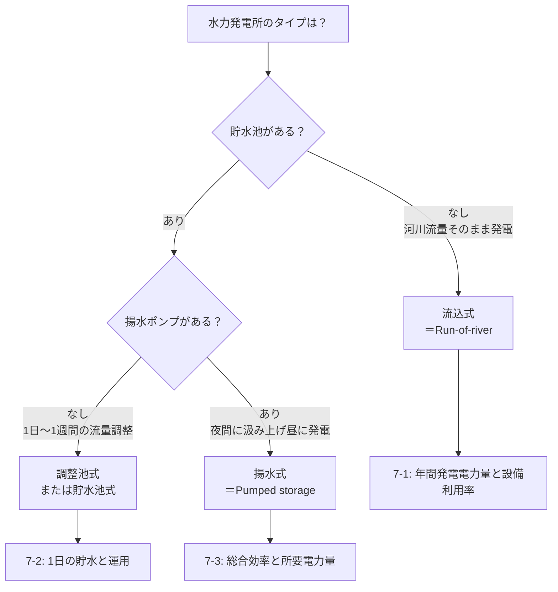

# B問題 計算テンプレート集

> 法規B問題（問10〜13）の計算パターンをステップバイステップでテンプレート化。
> 手順に沿って数値を代入するだけで解ける「再現性のある解法」を目指す。

---

## 1. 需要率・不等率・負荷率

### なぜ出る？

変圧器容量や配電設備の経済的な設計に直結。過大設備＝ムダ、過小設備＝過負荷事故。

### 解法テンプレート

```
【Step 1】問題文から3つの値を特定
  ├─ 設備容量 [kW]
  ├─ 最大需要電力 [kW]
  └─ 平均需要電力 [kW]（または電力量と時間から算出）

【Step 2】公式を選択
  ├─ 需要率 = 最大需要電力 ÷ 設備容量
  ├─ 負荷率 = 平均需要電力 ÷ 最大需要電力
  └─ 不等率 = 各負荷の最大需要電力の合計 ÷ 合成最大需要電力

【Step 3】複数負荷がある場合の合成最大需要電力
  合成最大 = 各最大の合計 ÷ 不等率
  ※ 不等率が与えられている場合はこの式で合成最大を求める

【Step 4】変圧器容量の決定
  変圧器容量 ≧ 合成最大需要電力 ÷ 力率
```

!!! warning "最頻出ミス"
    **需要率と負荷率の分母を逆にする**。覚え方：需要率の「需」＝「設備をどれだけ**需**要してるか」→ 分母は設備容量。

---

## 2. 力率改善（コンデンサ容量）

### なぜ出る？

力率が低い→電力損失I²R増大→電力会社の料金割増。コンデンサ設置は実務の基本。

### 解法テンプレート

```
【Step 1】問題文から抽出
  ├─ 有効電力 P [kW]
  ├─ 改善前の力率 cos θ1
  └─ 改善後の力率 cos θ2

【Step 2】tanを求める
  ├─ tan θ1 = sin θ1 ÷ cos θ1（cos→sinは √(1-cos²θ) で変換）
  └─ tan θ2 = sin θ2 ÷ cos θ2

【Step 3】コンデンサ容量を計算
  Qc = P × (tan θ1 − tan θ2) [kvar]

【Step 4】単位と方向を確認
  ├─ Qc > 0 であること（改善前tan > 改善後tan は必ず成立）
  └─ 三相回路なら P は三相有効電力 [kW]
```

!!! tip "速解テクニック"
    cos 0.6 → tan 1.333、cos 0.8 → tan 0.75、cos 0.85 → tan 0.620、cos 0.9 → tan 0.484、cos 0.95 → tan 0.329、cos 1.0 → tan 0。頻出値は暗記しておくと計算時間を大幅短縮。

---

## 3. 全日効率（変圧器）

### なぜ出る？

変圧器は24時間通電。最大効率時だけでなく1日トータルの効率で経済性を評価する。

### 解法テンプレート

```
【Step 1】問題文から抽出
  ├─ 定格容量 [kVA]
  ├─ 鉄損 Pi [kW]（無負荷損 = 常に一定）
  ├─ 銅損 Pc [kW]（全負荷時の値）
  └─ 負荷スケジュール: 各時間帯の負荷率 α と時間 t [h]

【Step 2】1日の出力電力量を計算
  Wout = Σ (α × 定格容量 × 力率 × t) [kWh]

【Step 3】1日の損失電力量を計算
  Wloss = 24 × Pi  +  Σ (α² × Pc × t) [kWh]
          ~~~~~~~~     ~~~~~~~~~~~~~~~~
          鉄損は24h固定   銅損はα²に比例

【Step 4】全日効率を計算
  η = Wout ÷ (Wout + Wloss) × 100 [%]
```

!!! warning "最頻出ミス"
    鉄損を負荷に比例させてしまう。**鉄損＝磁束による損失＝電圧が一定なら常に一定**。銅損だけがα²比例。

---

## 4. 絶縁耐力試験電圧

### なぜ出る？

新設・改修後の設備が絶縁性能を満たすか確認する法定試験。電圧値の計算が頻出。

### 解法テンプレート

```
【Step 1】最大使用電圧 Vm を求める
  ├─ 公称電圧 6,600V の場合: Vm = 6,600 × 1.15 ÷ 1.1 = 6,900V
  └─ 公称電圧 × (1.15/1.1) が基本（7,000V以下の場合）

【Step 2】試験電圧を算出
  ├─ 交流耐圧試験: Vm × 1.5 [V]（10分間）
  │   例: 6,900 × 1.5 = 10,350V
  └─ 直流耐圧試験: 交流試験電圧 × 2 [V]
      例: 10,350 × 2 = 20,700V
      ※ ケーブルの場合は直流で試験（充電電流が大きいため）

【Step 3】試験時間
  ├─ 交流: 連続10分間
  └─ 直流: 連続10分間
```

!!! note "実務の背景"
    なぜ1.5倍？ 通常使用電圧＋雷サージや開閉サージの過電圧を想定し、十分な絶縁マージンを確保するため。
## 5. %Z（パーセントインピーダンス）と短絡電流

### なぜ出る？

遮断器の遮断容量選定や保護協調の基礎。工場の受変電設備設計の実務そのもの。

### 解法テンプレート

```
【Step 1】問題文から抽出
  ├─ 変圧器の %Z [%]
  ├─ 定格容量 Pn [kVA]
  └─ 定格二次電圧 V2 [V]

【Step 2】定格二次電流を計算
  In = Pn ÷ (√3 × V2) [A]（三相の場合）

【Step 3】短絡電流を計算
  Is = In ÷ (%Z ÷ 100) = In × (100 ÷ %Z) [A]

【Step 4】短絡容量を計算（求められた場合）
  Ps = √3 × V2 × Is [VA]  = Pn × (100 ÷ %Z) [VA]

【基準容量換算が必要な場合】
  %Z' = %Z × (P基準 ÷ Pn)
  ※ 複数変圧器の並列や系統全体の計算では基準容量を統一する
```

!!! warning "最頻出ミス"
    **基準容量を揃え忘れる**。%Zは「定格容量ベース」で与えられる。異なる容量の変圧器を並列計算する際は、共通の基準容量に換算してから合成する。

---

## 6. 過電流継電器（OCR）の動作時間

### なぜ出る？

保護協調＝事故時に適切な遮断器だけが動作する設計。電力会社との協調も含めた実務的内容。

### 解法テンプレート

```
【Step 1】問題文から抽出
  ├─ CT比（例: 30/5）
  ├─ タップ値 [A]
  ├─ 事故電流 If [A]（一次側）
  └─ 限時特性曲線（レバー値・動作時間の関係）

【Step 2】CTの二次側電流を計算
  I2 = If ÷ CT比  [A]
  例: If=900A, CT比=30/5 → I2 = 900 × (5/30) = 150A

【Step 3】タップ倍数を計算
  倍数 = I2 ÷ タップ値
  例: I2=150A, タップ=5A → 倍数 = 30倍

【Step 4】限時特性曲線から動作時間を読み取る
  ├─ 倍数とレバー値の交点を読む
  └─ 上位・下位の協調（時間差0.3秒以上）を確認
```

---

## 7. 水力発電

### なぜ出る？

電気施設管理カテゴリの計算問題として頻出。R07上期問11（流込式）・過去5回以上の出題実績、再出題🔁が3件。「年間発電電力量・設備利用率・揚水総合効率」の組合せで出題され、**今後の再出題確率が高い**最重要計算カテゴリ。

### 共通基礎：公式と用語

**P [kW] = 9.8 × Q [m³/s] × H [m] × η**　（位置エネルギー mgh から導出。ρ=1000、g=9.8 を代入し /1000 で kW 換算）

| 記号 | 日常語 | 試験での意味 | 単位ひっかけ |
|---|---|---|---|
| Q | 流量 | 単位時間あたりの水の体積 | m³/h なら ÷3600、L/s なら ÷1000 |
| H | 落差 | 有効落差（総落差 − 損失落差） | 揚水時は実揚程 H' を使う |
| η | 総合効率 | 水車効率 η_t × 発電機効率 η_g | ポンプ時は分母に η_pump |

時間軸: 1年=8760時間／1日=86400秒。式の左辺と右辺で「秒」か「時」かを揃えてから代入する。

### 3方式の判別フロー



### 概念図（落差・流量・出力の関係）

<div>
<svg viewBox="0 0 720 320" xmlns="http://www.w3.org/2000/svg" style="max-width:720px;width:100%;height:auto;">
  <defs>
    <marker id="arrR" viewBox="0 0 10 10" refX="9" refY="5" markerWidth="8" markerHeight="8" orient="auto"><path d="M0,0 L10,5 L0,10 z" fill="#1565c0"/></marker>
    <marker id="arrDown" viewBox="0 0 10 10" refX="5" refY="9" markerWidth="8" markerHeight="8" orient="auto"><path d="M0,0 L10,0 L5,10 z" fill="#0288d1"/></marker>
  </defs>
  <!-- 上池 -->
  <rect x="40" y="30" width="180" height="60" fill="#e1f5fe" stroke="#0288d1" stroke-width="2"/>
  <text x="130" y="65" text-anchor="middle" font-size="14" fill="#01579b">上池（取水口）</text>
  <text x="130" y="20" text-anchor="middle" font-size="12" fill="#01579b">標高 H_u</text>
  <!-- 下池 -->
  <rect x="500" y="220" width="180" height="60" fill="#e1f5fe" stroke="#0288d1" stroke-width="2"/>
  <text x="590" y="255" text-anchor="middle" font-size="14" fill="#01579b">下池（放水口）</text>
  <text x="590" y="300" text-anchor="middle" font-size="12" fill="#01579b">標高 H_d</text>
  <!-- 水圧管路（斜め線） -->
  <line x1="220" y1="90" x2="500" y2="220" stroke="#0288d1" stroke-width="3" marker-end="url(#arrDown)"/>
  <text x="340" y="155" text-anchor="middle" font-size="13" fill="#0288d1">水圧管路 Q [m³/s]</text>
  <!-- 落差表示（縦線） -->
  <line x1="260" y1="90" x2="260" y2="250" stroke="#c62828" stroke-width="1.5" stroke-dasharray="4 4"/>
  <text x="245" y="180" text-anchor="middle" font-size="13" fill="#c62828" transform="rotate(-90 245 180)">有効落差 H</text>
  <!-- 水車・発電機 -->
  <rect x="430" y="180" width="80" height="50" fill="#fff3e0" stroke="#ef6c00" stroke-width="2"/>
  <text x="470" y="200" text-anchor="middle" font-size="12" fill="#bf360c">水車</text>
  <text x="470" y="218" text-anchor="middle" font-size="12" fill="#bf360c">η_t</text>
  <rect x="350" y="180" width="80" height="50" fill="#e8f5e9" stroke="#2e7d32" stroke-width="2"/>
  <text x="390" y="200" text-anchor="middle" font-size="12" fill="#1b5e20">発電機</text>
  <text x="390" y="218" text-anchor="middle" font-size="12" fill="#1b5e20">η_g</text>
  <line x1="430" y1="205" x2="350" y2="205" stroke="#666" stroke-width="2" marker-end="url(#arrR)"/>
  <!-- 出力 -->
  <text x="350" y="170" text-anchor="middle" font-size="13" fill="#1565c0" font-weight="bold">P = 9.8 × Q × H × η_t × η_g [kW]</text>
</svg>
</div>

---

### 7-1. 流込式：流量持続曲線で発電量を読む

対応過去問: **R07上期問11**（流込式水力発電所の年間発電電力量と設備利用率）／その他過去5回以上の出題実績

#### まず絵で理解：流量持続曲線（FDC）とは

「1年365日の流量を **多い順に並べ直した曲線**」が流量持続曲線。横軸は日数、縦軸は流量。豊水期は左、渇水期は右に来る。

<div>
<svg viewBox="0 0 720 380" xmlns="http://www.w3.org/2000/svg" style="max-width:720px;width:100%;height:auto;">
  <defs>
    <pattern id="useArea" patternUnits="userSpaceOnUse" width="6" height="6"><rect width="6" height="6" fill="#c8e6c9"/><line x1="0" y1="0" x2="6" y2="6" stroke="#2e7d32" stroke-width="0.5"/></pattern>
    <pattern id="wasteArea" patternUnits="userSpaceOnUse" width="6" height="6"><rect width="6" height="6" fill="#eeeeee"/><line x1="0" y1="6" x2="6" y2="0" stroke="#9e9e9e" stroke-width="0.5"/></pattern>
  </defs>
  <!-- 軸 -->
  <line x1="80" y1="320" x2="660" y2="320" stroke="#333" stroke-width="2"/>
  <line x1="80" y1="40" x2="80" y2="320" stroke="#333" stroke-width="2"/>
  <text x="360" y="360" text-anchor="middle" font-size="13" fill="#333">日数 d（流量を多い順に並べた順位）</text>
  <text x="40" y="180" text-anchor="middle" font-size="13" fill="#333" transform="rotate(-90 40 180)">流量 Q [m³/s]</text>
  <!-- 横軸の目盛 -->
  <line x1="80" y1="320" x2="80" y2="325" stroke="#333"/>
  <text x="80" y="338" text-anchor="middle" font-size="11">0日</text>
  <line x1="180" y1="320" x2="180" y2="325" stroke="#333"/>
  <text x="180" y="338" text-anchor="middle" font-size="11">90日</text>
  <line x1="280" y1="320" x2="280" y2="325" stroke="#333"/>
  <text x="280" y="338" text-anchor="middle" font-size="11">185日</text>
  <line x1="450" y1="320" x2="450" y2="325" stroke="#333"/>
  <text x="450" y="338" text-anchor="middle" font-size="11">275日</text>
  <line x1="620" y1="320" x2="620" y2="325" stroke="#333"/>
  <text x="620" y="338" text-anchor="middle" font-size="11">355日</text>
  <!-- 流量持続曲線（豊→渇への単調減少） -->
  <!-- 「使える水量」面積（QH線以下、曲線以下） -->
  <path d="M 180 160 L 180 320 L 620 320 L 620 220 Q 500 180, 360 165 Q 270 158, 180 160 Z" fill="url(#useArea)" stroke="none"/>
  <!-- 「捨てる水量」面積（曲線がQHより上の部分、d=0〜180） -->
  <path d="M 80 70 Q 110 90, 130 110 Q 155 135, 180 160 L 180 160 L 80 160 Z" fill="url(#wasteArea)" stroke="none"/>
  <!-- 流量持続曲線（曲線本体・濃い青） -->
  <path d="M 80 70 Q 110 90, 130 110 Q 155 135, 180 160 Q 270 158, 360 165 Q 500 180, 620 220" fill="none" stroke="#0d47a1" stroke-width="2.5"/>
  <!-- QH水平線（赤） -->
  <line x1="80" y1="160" x2="660" y2="160" stroke="#c62828" stroke-width="2" stroke-dasharray="6 3"/>
  <text x="666" y="164" font-size="12" fill="#c62828" font-weight="bold">QH</text>
  <text x="666" y="178" font-size="10" fill="#c62828">最大使用水量</text>
  <!-- 渇水量水平線（青点線） -->
  <line x1="80" y1="220" x2="660" y2="220" stroke="#1976d2" stroke-width="1.5" stroke-dasharray="3 3"/>
  <text x="666" y="224" font-size="12" fill="#1976d2" font-weight="bold">Qd</text>
  <text x="666" y="237" font-size="10" fill="#1976d2">渇水量</text>
  <!-- 縦の補助線（180日点） -->
  <line x1="180" y1="160" x2="180" y2="320" stroke="#666" stroke-width="0.8" stroke-dasharray="2 2"/>
  <!-- ラベル -->
  <text x="125" y="125" font-size="12" fill="#616161" font-weight="bold">捨てる水量</text>
  <text x="125" y="140" font-size="10" fill="#616161">（QHを超える流量）</text>
  <text x="380" y="245" text-anchor="middle" font-size="13" fill="#1b5e20" font-weight="bold">使える水量＝発電に回る</text>
  <text x="380" y="263" text-anchor="middle" font-size="11" fill="#1b5e20">（曲線下・QH以下の面積）</text>
  <!-- タイトル -->
  <text x="360" y="22" text-anchor="middle" font-size="14" fill="#0d47a1" font-weight="bold">流量持続曲線（Flow Duration Curve）</text>
</svg>
</div>

**この絵で押さえるべき3点**:

1. **曲線下の面積 = 1年に流れる総水量**。豊水期は線が高く、渇水期は線が低い。
2. **QH（最大使用水量）の水平線で頭打ち**。線より上の流量は水車で処理できず捨てるしかない（捨水）。
3. **使える水量＝曲線とQH線で囲まれた下側面積**。これに 9.8 × H × η × 24時間 を掛けて積分すれば年間発電電力量になる。

#### 用語の翻訳辞書（問題文を読み解くカギ）

| 法規用語 | 何を意味するか | 試験での読み方 |
|---|---|---|
| **渇水量 Qd** | 1年で **355日以上** 確保できる流量 | 流量曲線の「右端 d=355」で読む値 |
| **低水量** | 1年で 275日以上 確保できる流量 | d=275 で読む値（出題は少ない） |
| **平水量** | 1年で 185日以上 確保できる流量 | d=185 で読む値 |
| **豊水量** | 1年で **90日以上** 確保できる流量 | d=90 で読む値 |
| **最大使用水量 QH** | 水車が処理できる **流量の上限**＝設備容量 | 曲線にQHの水平線を引き、頭打ち区間を作る |
| **使用水量** | 実際に発電に使う流量 | min(その日の流量, QH) |

問題文に「最大使用水量は渇水量の2倍」と書かれていたら、**QH = 2 × Qd を曲線に水平線として描く**だけ。あとは曲線とこの水平線の交点で日数を読むのみ。

#### なぜ QH は渇水量の 2〜3倍に設計するのか

| QH の設計値 | 設備利用率 | 年間発電量 | コメント |
|---|---|---|---|
| QH = Qd（渇水量と同じ） | 100% | 小さい（渇水量×365日分のみ） | 設備は遊ばないが発電量が伸びない |
| QH = Qd × 2〜3 | 60〜90% | バランス良 | **実機のセオリー・出題の典型値** |
| QH = Qd × 10 | 10〜30% | やや大 | 豊水期しか稼働できず設備が遊ぶ |

**設備容量を大きくすればピーク発電量は増えるが、年間の大半は流量がそこまで来ないので遊休**。発電量と稼働率の妥協点が「渇水量の2〜3倍」。試験ではこの倍率で QH が与えられる。

#### Step（3つに圧縮）

```
【Step 1】曲線から QH と Qd を読む
  ├─ Qd = 流量曲線の d=355 点（または問題で直接与えられる）
  ├─ QH = 問題文「渇水量の○倍」「最大使用水量◯◯m³/s」から確定
  └─ QH の水平線を曲線に引き、交点の日数 d₁ を読む（QH以上の流量がある日数）

【Step 2】1年を2区間に分けて発電量を計算
  ├─ 区間A（0日〜d₁日）: QH 頭打ち
  │     W_A = 9.8 × QH × H × η × 24 × d₁  [kWh]
  └─ 区間B（d₁日〜365日）: 曲線に追従
        平均流量 Q_avg を曲線から読む（中点の値 or 積分）
        W_B = 9.8 × Q_avg × H × η × 24 × (365 − d₁)  [kWh]
  → 年間電力量 W = W_A + W_B

【Step 3】設備利用率
  P_max [kW] = 9.8 × QH × H × η  （定格出力）
  設備利用率 = W ÷ (P_max × 8760) × 100  [%]
```

!!! warning "最頻出ミス"
    **「渇水量」と「年平均流量」を混同する**。前者は355日点（曲線の右端）、後者は曲線下面積を365で割った値。問題文に「渇水量」と書かれていたら d=355 の値を使う。

!!! tip "速解テクニック"
    流込式の設備利用率は典型 **60〜90%**。30%以下や100%超は計算ミス。R07上期問11の正解 88.0% も典型値帯に収まる。

!!! note "R07上期問11の鍵"
    流量曲線が **Q = −0.05d + 25.5（d≥90日）** の直線で与えられたら、QH の水平線との交点 d₁ は方程式 **QH = −0.05d₁ + 25.5** を解くだけ。区間Bの平均流量も直線なので「両端の中点」で計算できる（積分不要）。

---

### 7-2. 調整池式：1日の貯水と放流サイクル

対応過去問: 調整池水力発電所の運転管理🔁／調整池式水力発電所の貯水量・発電電力🔁／調整池式水力発電の発電電力量と流量🔁

#### まず絵で理解：1日の流量と貯水量

河川は **1日中ほぼ一定の流量** で流れ込む（雨が降らない限り）。しかし電力需要は昼ピーク・夜オフピークで大きく変動する。**調整池はこのギャップを吸収するバッファ**。オフピーク時に溜めて、ピーク時に一気に放流する。

<div>
<svg viewBox="0 0 720 360" xmlns="http://www.w3.org/2000/svg" style="max-width:720px;width:100%;height:auto;">
  <!-- 上段：流量グラフ -->
  <text x="360" y="20" text-anchor="middle" font-size="13" fill="#0d47a1" font-weight="bold">上段：放流量の時間変化（ピーク時に一気に放流）</text>
  <line x1="80" y1="140" x2="660" y2="140" stroke="#333" stroke-width="2"/>
  <line x1="80" y1="40" x2="80" y2="140" stroke="#333" stroke-width="2"/>
  <text x="360" y="158" text-anchor="middle" font-size="11" fill="#333">時刻</text>
  <text x="40" y="90" text-anchor="middle" font-size="11" fill="#333" transform="rotate(-90 40 90)">流量 [m³/s]</text>
  <!-- 横軸目盛 -->
  <line x1="80" y1="140" x2="80" y2="143" stroke="#333"/><text x="80" y="155" text-anchor="middle" font-size="10">0時</text>
  <line x1="280" y1="140" x2="280" y2="143" stroke="#333"/><text x="280" y="155" text-anchor="middle" font-size="10">9時</text>
  <line x1="350" y1="140" x2="350" y2="143" stroke="#333"/><text x="350" y="155" text-anchor="middle" font-size="10">12時</text>
  <line x1="420" y1="140" x2="420" y2="143" stroke="#333"/><text x="420" y="155" text-anchor="middle" font-size="10">15時</text>
  <line x1="660" y1="140" x2="660" y2="143" stroke="#333"/><text x="660" y="155" text-anchor="middle" font-size="10">24時</text>
  <!-- 河川流入量 Q_in（一定線） -->
  <line x1="80" y1="115" x2="660" y2="115" stroke="#1976d2" stroke-width="2" stroke-dasharray="4 3"/>
  <text x="666" y="119" font-size="11" fill="#1976d2" font-weight="bold">Q_in</text>
  <text x="666" y="131" font-size="9" fill="#1976d2">河川流入量</text>
  <!-- ピーク放流量 Q_peak（9時〜15時） -->
  <rect x="280" y="60" width="140" height="80" fill="#ffcdd2" stroke="#c62828" stroke-width="2"/>
  <text x="350" y="55" text-anchor="middle" font-size="11" fill="#c62828" font-weight="bold">Q_peak（ピーク放流）</text>
  <line x1="80" y1="60" x2="660" y2="60" stroke="#c62828" stroke-width="1" stroke-dasharray="2 2" opacity="0.4"/>
  <text x="666" y="64" font-size="11" fill="#c62828" font-weight="bold">Q_peak</text>
  <!-- オフピーク放流量（少量、または0） -->
  <line x1="80" y1="135" x2="280" y2="135" stroke="#9e9e9e" stroke-width="2"/>
  <line x1="420" y1="135" x2="660" y2="135" stroke="#9e9e9e" stroke-width="2"/>
  <text x="180" y="125" text-anchor="middle" font-size="10" fill="#616161">オフピーク（貯水中）</text>
  <text x="540" y="125" text-anchor="middle" font-size="10" fill="#616161">オフピーク（貯水中）</text>

  <!-- 下段：貯水量グラフ -->
  <text x="360" y="195" text-anchor="middle" font-size="13" fill="#1b5e20" font-weight="bold">下段：調整池の貯水量（オフピークで溜め、ピークで放出）</text>
  <line x1="80" y1="320" x2="660" y2="320" stroke="#333" stroke-width="2"/>
  <line x1="80" y1="220" x2="80" y2="320" stroke="#333" stroke-width="2"/>
  <text x="360" y="338" text-anchor="middle" font-size="11" fill="#333">時刻</text>
  <text x="40" y="270" text-anchor="middle" font-size="11" fill="#333" transform="rotate(-90 40 270)">貯水量 V [m³]</text>
  <!-- 貯水量曲線：0〜9時 上昇、9〜15時 急落、15〜24時 上昇 -->
  <line x1="80" y1="290" x2="280" y2="245" stroke="#2e7d32" stroke-width="3"/>
  <line x1="280" y1="245" x2="420" y2="305" stroke="#2e7d32" stroke-width="3"/>
  <line x1="420" y1="305" x2="660" y2="260" stroke="#2e7d32" stroke-width="3"/>
  <!-- ピーク区間ハイライト -->
  <rect x="280" y="220" width="140" height="100" fill="#fff3e0" opacity="0.4"/>
  <text x="350" y="240" text-anchor="middle" font-size="10" fill="#bf360c">ピーク時に消費</text>
  <!-- 必要容量V矢印 -->
  <line x1="285" y1="245" x2="285" y2="305" stroke="#ef6c00" stroke-width="1.5" marker-end="url(#arrDown)" marker-start="url(#arrUp)"/>
  <text x="265" y="280" text-anchor="end" font-size="11" fill="#bf360c" font-weight="bold">必要容量V</text>
  <defs>
    <marker id="arrUp" viewBox="0 0 10 10" refX="5" refY="1" markerWidth="6" markerHeight="6" orient="auto"><path d="M0,10 L5,0 L10,10 z" fill="#ef6c00"/></marker>
  </defs>
</svg>
</div>

**この絵で押さえるべき3点**:

1. **流入量 Q_in は1日中一定**（青破線）。河川は人間の都合では変わらない。
2. **放流量はピーク時間（昼9〜15時）に Q_peak で大きく、オフピークは小さい**（赤い箱）。需要追従。
3. **必要な調整池容量 V** は「ピーク時に流入だけでは足りない分」＝（Q_peak − Q_in）× ピーク時間 × 3600。オフピーク時間に溜める量と等しい（保存則）。

#### 用語の翻訳辞書

| 用語 | 何を意味するか | 試験での読み方 |
|---|---|---|
| **河川流入量 Q_in** | 1日中ほぼ一定で池に流れ込む量 | 1日平均流量と同じ |
| **ピーク放流量 Q_peak** | 需要のピーク時間帯に放流する量 | Q_peak > Q_in が前提 |
| **ピーク時間 t_peak** | 高出力で発電する時間（典型 3〜6時間） | オフピークは 24 − t_peak |
| **必要調整池容量 V** | ピーク放流をまかなうために溜めておく必要のある水量 | (Q_peak − Q_in) × t_peak × 3600 [m³] |

#### Step（3つに圧縮）

```
【Step 1】1日の流入総量と放流総量を確認（保存則）
  V_in_total = Q_in × 86400 [m³]  （1日に流れ込む水量）
  V_out_total = Q_peak × t_peak × 3600 + Q_off × t_off × 3600
  ※ 保存則: V_in_total = V_out_total（池の水位が1日で同じに戻る場合）

【Step 2】必要調整池容量
  V = (Q_peak − Q_in) × t_peak × 3600  [m³]
  ※ ピーク時に「流入で足りない分」だけ池から取り出す
  ※ オフピークでこの量が再度溜まる

【Step 3】ピーク時発電出力
  P_peak [kW] = 9.8 × Q_peak × H × η
```

!!! warning "最頻出ミス"
    **時間と秒の混在**。流量 [m³/s] × 時間 [h] では次元が合わない。t_peak が「3時間」なら必ず ×3600 で秒に直してから掛ける。

!!! tip "速解テクニック"
    保存則「1日の流入＝1日の放流」を最初に書く。問題文で Q_peak または Q_off が抜けていてもこの式で出せる。

---

### 7-3. 揚水式：昼夜の電力サイクルと総合効率

対応過去問: 系統に接続する水力発電所の運用 タイプ

#### まず絵で理解：揚水発電所は系統の蓄電池

夜間（オフピーク）：原子力・石炭火力などのベースロード電源が**余る**。この余剰電力でポンプを回して下池の水を上池へ汲み上げる。  
昼（ピーク）：電力需要が大きい。汲み上げた水を落として発電し、不足分を補う。

**夜の安い電気 → 昼の高い電気** に変換する装置。系統運用の経済性を支える。

<div>
<svg viewBox="0 0 720 320" xmlns="http://www.w3.org/2000/svg" style="max-width:720px;width:100%;height:auto;">
  <defs>
    <marker id="arrPump" viewBox="0 0 10 10" refX="9" refY="5" markerWidth="8" markerHeight="8" orient="auto"><path d="M0,0 L10,5 L0,10 z" fill="#1976d2"/></marker>
    <marker id="arrGen" viewBox="0 0 10 10" refX="9" refY="5" markerWidth="8" markerHeight="8" orient="auto"><path d="M0,0 L10,5 L0,10 z" fill="#c62828"/></marker>
  </defs>
  <!-- タイトル -->
  <text x="360" y="18" text-anchor="middle" font-size="14" fill="#0d47a1" font-weight="bold">系統需要と揚水発電所の動作（24時間サイクル）</text>
  <!-- 系統需要曲線 -->
  <line x1="80" y1="240" x2="660" y2="240" stroke="#333" stroke-width="2"/>
  <line x1="80" y1="40" x2="80" y2="240" stroke="#333" stroke-width="2"/>
  <text x="360" y="262" text-anchor="middle" font-size="11" fill="#333">時刻</text>
  <text x="40" y="140" text-anchor="middle" font-size="11" fill="#333" transform="rotate(-90 40 140)">系統需要 [kW]</text>
  <!-- 横軸目盛 -->
  <line x1="80" y1="240" x2="80" y2="243" stroke="#333"/><text x="80" y="255" text-anchor="middle" font-size="10">0時</text>
  <line x1="220" y1="240" x2="220" y2="243" stroke="#333"/><text x="220" y="255" text-anchor="middle" font-size="10">6時</text>
  <line x1="360" y1="240" x2="360" y2="243" stroke="#333"/><text x="360" y="255" text-anchor="middle" font-size="10">12時</text>
  <line x1="500" y1="240" x2="500" y2="243" stroke="#333"/><text x="500" y="255" text-anchor="middle" font-size="10">18時</text>
  <line x1="660" y1="240" x2="660" y2="243" stroke="#333"/><text x="660" y="255" text-anchor="middle" font-size="10">24時</text>
  <!-- 系統需要曲線（昼ピーク・夜谷） -->
  <path d="M 80 220 Q 150 230, 220 215 Q 290 130, 360 90 Q 430 100, 500 110 Q 580 200, 660 215" fill="none" stroke="#0d47a1" stroke-width="2.5"/>
  <!-- ベースロード水平線 -->
  <line x1="80" y1="180" x2="660" y2="180" stroke="#666" stroke-width="1.5" stroke-dasharray="4 3"/>
  <text x="666" y="184" font-size="10" fill="#666">ベースロード</text>
  <!-- 夜（揚水）区間ハイライト -->
  <rect x="80" y="180" width="170" height="60" fill="#bbdefb" opacity="0.5"/>
  <text x="165" y="208" text-anchor="middle" font-size="11" fill="#0d47a1" font-weight="bold">夜：余剰電力</text>
  <text x="165" y="222" text-anchor="middle" font-size="10" fill="#0d47a1">→ 揚水（W_p消費）</text>
  <!-- 昼（発電）区間ハイライト -->
  <rect x="290" y="40" width="170" height="140" fill="#ffcdd2" opacity="0.5"/>
  <text x="375" y="60" text-anchor="middle" font-size="11" fill="#c62828" font-weight="bold">昼：需要ピーク</text>
  <text x="375" y="74" text-anchor="middle" font-size="10" fill="#c62828">→ 発電（W_g供給）</text>
  <!-- 矢印（夜揚水→昼発電） -->
  <path d="M 165 175 Q 250 130, 375 130" fill="none" stroke="#666" stroke-width="1.5" stroke-dasharray="4 3" marker-end="url(#arrGen)"/>
  <text x="280" y="120" text-anchor="middle" font-size="10" fill="#666">エネルギー時刻シフト</text>
  <!-- 下部：効率の関係式 -->
  <line x1="80" y1="285" x2="660" y2="285" stroke="#999" stroke-width="0.5"/>
  <text x="360" y="305" text-anchor="middle" font-size="13" fill="#0d47a1" font-weight="bold">η_total = W_g / W_p = (H_g × η_g × η_p) / H_p ≈ 0.65〜0.75</text>
</svg>
</div>

**この絵で押さえるべき3点**:

1. **夜の余剰電力 W_p で揚水**（青箱）→ 水のポテンシャルエネルギーに変換して上池に蓄える
2. **昼のピーク需要に W_g で発電**（赤箱）→ 上池の水を落として電気に戻す
3. **W_g < W_p**（往復で必ず損失）。比率が **総合効率 η_total ≈ 0.65〜0.75**（蓄電池でいう充放電効率）

#### 用語の翻訳辞書（H_g と H_p の使い分けが命）

| 用語 | 何を意味するか | 注意 |
|---|---|---|
| **有効落差 H_g** | 発電時、水が落下する有効な高さ | 上池-下池の差から **管路損失を引く**。「使える落差」 |
| **全揚程 H_p** | 揚水時、ポンプが水を持ち上げる総高さ | 上池-下池の差に **管路損失を足す**。「実際に必要な持ち上げ高さ」 |
| **発電効率 η_g** | 水の運動E → 電気E の変換効率 | 水車効率 × 発電機効率 |
| **ポンプ効率 η_p** | 電気E → 水のポテンシャルE の変換効率 | ポンプ効率 × 電動機効率 |
| **揚水総合効率 η_total** | 同水量を循環させたときの W_g / W_p | (H_g × η_g × η_p) / H_p |

**H_g < H_p が必ず成立**（管路損失は引く・足すの両方で効くため）。

#### なぜポンプ時の効率は「分母」なのか

- 発電時：水のエネルギー × η_g = 電気エネルギー → **電気側は η_g 倍に減る**（η_g を掛ける）
- 揚水時：必要な仕事 / η_p = 電気の入力 → **電気側は 1/η_p 倍に増える**（η_p で割る）

「**得る側に掛ける、消費する側で割る**」が普遍ルール。揚水でも発電でも同じ。

#### Step（3つに圧縮）

```
【Step 1】発電時の電力量
  P_g [kW] = 9.8 × Q_g × H_g × η_g
  W_g [kWh] = P_g × t_g

【Step 2】揚水時の所要電力量（同じ水量を循環）
  P_p [kW] = 9.8 × Q_p × H_p ÷ η_p
  W_p [kWh] = P_p × t_p
  ※ ポンプは消費側なので η_p は分母

【Step 3】総合効率
  η_total = W_g ÷ W_p
  同水量循環時: η_total = (H_g × η_g × η_p) / H_p
```

!!! warning "最頻出ミス"
    **H_g と H_p の混同**。問題文で「発電時 H_g = 〇〇 m、揚水時 H_p = 〇〇 m」と分けて与えられたら必ず使い分ける。**H_g に η_p を掛けて η_g を割る** など、効率の対応も間違えない。

!!! tip "速解テクニック"
    総合効率 0.65〜0.75 は「夜の電気 1.5 kWh 使って、昼に 1 kWh 取り戻す」イメージ。0.5 以下や 0.9 以上が出たら計算ミス。

---

### 7-4. 流量の単位換算早見表

冒頭「共通基礎」で軽く触れた単位ひっかけの完全版。落差3用語（総落差・有効落差・実揚程）と効率3用語（水車効率・発電機効率・総合効率）は冒頭表に統合済み。

| 与えられた単位 | m³/s への換算 |
|---|---|
| m³/h | × (1/3600) |
| L/s | × (1/1000) |
| L/min | × (1/60000) |
| m³/日 | × (1/86400) |

問題文の単位が m³/s でない場合は **必ず冒頭で換算**。式に代入してから単位だけ直そうとすると、後段の積計算で桁を踏み外す。

---

### §3 全日効率との関連

設備利用率は §3 全日効率の負荷率と数式構造が同じ：

- 負荷率（§3）= 平均需要電力 ÷ 最大需要電力
- 設備利用率（§7-1）= 平均出力 ÷ 最大（定格）出力

「最大需要」を「定格出力」と読み替えれば負荷率の式そのもの。発電所側の指標が **設備利用率**、消費側の指標が **負荷率**。

---

## 8. 太陽電池発電所（自家消費＋系統連系）

### なぜ出る？

電気施設管理カテゴリで再出題🔁が3件以上の頻出論点。R07上期問13（太陽電池発電所を設置した需要設備の電力需給）ほか過去複数回出題。再生可能エネルギー普及で出題頻度がさらに増す傾向。

### まず絵で理解：1日の発電と消費の重ね合わせ

太陽電池の発電曲線は **昼に山を持つ三角形（または台形）** 。一方、施設の消費は **時間帯ごとの階段状**。両者を24時間軸で重ね合わせると、**3つの領域**が見える：

<div>
<svg viewBox="0 0 720 360" xmlns="http://www.w3.org/2000/svg" style="max-width:720px;width:100%;height:auto;">
  <defs>
    <pattern id="selfUse" patternUnits="userSpaceOnUse" width="6" height="6"><rect width="6" height="6" fill="#c8e6c9"/><line x1="0" y1="0" x2="6" y2="6" stroke="#2e7d32" stroke-width="0.5"/></pattern>
    <pattern id="exportArea" patternUnits="userSpaceOnUse" width="6" height="6"><rect width="6" height="6" fill="#bbdefb"/><line x1="0" y1="0" x2="6" y2="6" stroke="#1565c0" stroke-width="0.5"/></pattern>
    <pattern id="importArea" patternUnits="userSpaceOnUse" width="6" height="6"><rect width="6" height="6" fill="#eeeeee"/><line x1="0" y1="6" x2="6" y2="0" stroke="#757575" stroke-width="0.5"/></pattern>
  </defs>
  <!-- タイトル -->
  <text x="360" y="20" text-anchor="middle" font-size="14" fill="#0d47a1" font-weight="bold">太陽電池発電と消費の重ね合わせ（R07上期問13ベース）</text>
  <!-- 軸 -->
  <line x1="80" y1="290" x2="680" y2="290" stroke="#333" stroke-width="2"/>
  <line x1="80" y1="40" x2="80" y2="290" stroke="#333" stroke-width="2"/>
  <text x="380" y="320" text-anchor="middle" font-size="12" fill="#333">時刻 [h]</text>
  <text x="40" y="170" text-anchor="middle" font-size="12" fill="#333" transform="rotate(-90 40 170)">電力 [kW]</text>
  <!-- 横軸目盛 -->
  <line x1="80" y1="290" x2="80" y2="293" stroke="#333"/><text x="80" y="307" text-anchor="middle" font-size="10">0</text>
  <line x1="155" y1="290" x2="155" y2="293" stroke="#333"/><text x="155" y="307" text-anchor="middle" font-size="10">6</text>
  <line x1="205" y1="290" x2="205" y2="293" stroke="#333"/><text x="205" y="307" text-anchor="middle" font-size="10">10</text>
  <line x1="230" y1="290" x2="230" y2="293" stroke="#333"/><text x="230" y="307" text-anchor="middle" font-size="10">12</text>
  <line x1="318" y1="290" x2="318" y2="293" stroke="#333"/><text x="318" y="307" text-anchor="middle" font-size="10">17</text>
  <line x1="380" y1="290" x2="380" y2="293" stroke="#333"/><text x="380" y="307" text-anchor="middle" font-size="10">21</text>
  <line x1="430" y1="290" x2="430" y2="293" stroke="#333"/><text x="430" y="307" text-anchor="middle" font-size="10">24</text>
  <!-- 縦軸目盛 -->
  <line x1="77" y1="290" x2="80" y2="290" stroke="#333"/><text x="73" y="294" text-anchor="end" font-size="10">0</text>
  <line x1="77" y1="250" x2="80" y2="250" stroke="#333"/><text x="73" y="254" text-anchor="end" font-size="10">100</text>
  <line x1="77" y1="170" x2="80" y2="170" stroke="#333"/><text x="73" y="174" text-anchor="end" font-size="10">300</text>
  <line x1="77" y1="130" x2="80" y2="130" stroke="#333"/><text x="73" y="134" text-anchor="end" font-size="10">400</text>
  <line x1="77" y1="50" x2="80" y2="50" stroke="#333"/><text x="73" y="54" text-anchor="end" font-size="10">600</text>
  <!-- ===== 領域塗り（背景に） ===== -->
  <!-- 自家消費領域 = min(発電, 消費) の下側 -->
  <!-- 0-7時: 発電0、消費100、自家消費=0 -->
  <!-- 7時(P=100,L=100) 〜 10時(P=400,L=100): 自家消費 = 消費(100)上限、つまり矩形(7-10, 0-100) -->
  <polygon points="167.5,290 167.5,250 205,250 205,290" fill="url(#selfUse)"/>
  <!-- 10-12時: 発電(400→600), 消費300、自家消費=300（消費上限） -->
  <polygon points="205,290 205,170 230,170 230,290" fill="url(#selfUse)"/>
  <!-- 12-15時: 発電(600→300), 消費300、自家消費=min(P,L) → 12-15は P>=300なので自家消費=300 -->
  <polygon points="230,290 230,170 268,170 268,290" fill="url(#selfUse)"/>
  <!-- 15-17時: 発電(300→200), 消費300、自家消費=発電（P側） -->
  <polygon points="268,290 268,170 318,210 318,290" fill="url(#selfUse)"/>
  <!-- 17-18時: 発電(200→0), 消費400、自家消費=発電 -->
  <polygon points="318,290 318,210 343,290" fill="url(#selfUse)"/>
  <!-- 系統送電領域（青）= 発電>消費 の上部 -->
  <!-- 7-10時: 発電(100→400), 消費100、送電=P-100 -->
  <polygon points="167.5,250 205,130 205,250" fill="url(#exportArea)"/>
  <!-- 10-12時: 発電(400→600), 消費300、送電=P-300 -->
  <polygon points="205,130 230,50 230,170 205,170" fill="url(#exportArea)"/>
  <!-- 12-15時: 発電(600→300), 消費300、送電=P-300 -->
  <polygon points="230,50 268,170 230,170" fill="url(#exportArea)"/>
  <!-- 系統購入領域（灰）= 消費>発電 の差分 -->
  <!-- 0-7時: 消費100、発電0 -->
  <polygon points="80,290 80,250 167.5,250 167.5,290" fill="url(#importArea)"/>
  <!-- 7-10時: 消費100、発電>100 → 購入なし -->
  <!-- 10時付近: 消費が100→300にジャンプ。発電400なのでまだ送電 -->
  <!-- 15-17時: 消費300、発電(300→200) → 購入=300-P -->
  <polygon points="268,170 318,170 318,210" fill="url(#importArea)"/>
  <!-- 17-18時: 消費400、発電(200→0) → 購入=400-P -->
  <polygon points="318,130 343,130 343,290 318,290 318,210" fill="url(#importArea)"/>
  <!-- 18-21時: 消費400、発電0 → 購入=400 -->
  <polygon points="343,130 380,130 380,290 343,290" fill="url(#importArea)"/>
  <!-- 21-24時: 消費100、発電0 → 購入=100 -->
  <polygon points="380,250 430,250 430,290 380,290" fill="url(#importArea)"/>
  <!-- ===== 曲線本体 ===== -->
  <!-- 発電曲線（三角形：6-12-18時） -->
  <polyline points="80,290 155,290 230,50 343,290 430,290" fill="none" stroke="#0d47a1" stroke-width="2.5"/>
  <text x="240" y="42" font-size="12" fill="#0d47a1" font-weight="bold">発電 P(t)</text>
  <!-- 消費曲線（階段状） -->
  <polyline points="80,250 205,250 205,170 318,170 318,130 380,130 380,250 430,250" fill="none" stroke="#c62828" stroke-width="2.5"/>
  <text x="335" y="125" font-size="12" fill="#c62828" font-weight="bold">消費 L(t)</text>
  <!-- 凡例 -->
  <rect x="475" y="50" width="200" height="120" fill="#fafafa" stroke="#999" stroke-width="0.5"/>
  <rect x="485" y="60" width="14" height="14" fill="url(#selfUse)"/>
  <text x="505" y="72" font-size="11" fill="#1b5e20" font-weight="bold">自家消費</text>
  <text x="505" y="84" font-size="9" fill="#1b5e20">min(P, L) の積分</text>
  <rect x="485" y="95" width="14" height="14" fill="url(#exportArea)"/>
  <text x="505" y="107" font-size="11" fill="#0d47a1" font-weight="bold">系統送電</text>
  <text x="505" y="119" font-size="9" fill="#0d47a1">max(P−L, 0) の積分</text>
  <rect x="485" y="130" width="14" height="14" fill="url(#importArea)"/>
  <text x="505" y="142" font-size="11" fill="#424242" font-weight="bold">系統購入</text>
  <text x="505" y="154" font-size="9" fill="#424242">max(L−P, 0) の積分</text>
</svg>
</div>

**この絵で押さえるべき3点**:

1. **発電曲線（青）** は太陽の高度に従い昼に山を持つ三角形（晴天理想）。雨天は台形・低め。
2. **消費曲線（赤）** は施設の利用パターンで階段状。ショッピングセンターなら開店から閉店までが高負荷。
3. **3領域** がすべて。
   - 緑（重なり下部）= **自家消費**：発電を施設で直接使う
   - 青（発電>消費の上）= **系統送電**：余った電力を売る（売電）
   - 灰（消費>発電の上）= **系統購入**：足りない電力を買う

### 用語の翻訳辞書（問題文を読み解くカギ）

| 用語 | 何を意味するか | 試験での読み方 |
|---|---|---|
| **パネル出力 P_max** | 太陽電池が最大に発電できる定格出力 | 三角形/台形の頂点の値 |
| **発電曲線 P(t)** | 時刻ごとの発電出力 | 「6時に立ち上がり12時で最大、18時に0」が典型 |
| **日負荷曲線 L(t)** | 時刻ごとの消費電力 | 階段状で時間帯別に与えられる |
| **自家消費** | 発電のうち施設で使った量 | 緑領域の面積＝min(P,L) の積分 |
| **系統送電（売電）** | 発電のうち電力会社に売った量 | 青領域の面積＝max(P−L, 0) の積分 |
| **系統購入（買電）** | 消費のうち電力会社から買った量 | 灰領域の面積＝max(L−P, 0) の積分 |
| **自給率** | 消費のうち自家発電で賄えた比率 | 自家消費 ÷ 総消費 [%] |

**保存則**: 総発電 = 自家消費 + 系統送電／総消費 = 自家消費 + 系統購入。**問題文で値が抜けていてもこの式で出せる**。

### Step（3つに圧縮）

```
【Step 1】発電曲線と消費曲線を時刻区間で表化
  ├─ 発電・消費の値が変わる「時刻区間」に分割（典型 4〜8区間）
  └─ 各区間で P(t) と L(t) を確認

【Step 2】発電 vs 消費の交点を特定し、領域分けして面積計算
  ├─ 発電>消費の区間: 系統送電 = ∫(P−L)dt（台形面積の和）
  ├─ 消費>発電の区間: 系統購入 = ∫(L−P)dt
  └─ 重なり下部: 自家消費 = ∫min(P,L)dt
  ※ 発電曲線が直線なら方程式 P(t) = L(t) で交点時刻を求める

【Step 3】保存則チェック＋自給率
  発電量 = 自家消費 + 系統送電  ← 検算用
  消費量 = 自家消費 + 系統購入  ← 検算用
  自給率 = 自家消費 ÷ 総消費 × 100  [%]
```

!!! warning "最頻出ミス"
    **発電曲線と消費曲線の交点（送電開始/終了時刻）の見落とし**。発電が直線なら方程式で交点を求める（例: P(t)=100(t−6) と L=100 の交点 → t=7時）。グラフだけで目分量で読むと境界時刻を1時間ずらして送電量計算を全部間違える。

!!! tip "速解テクニック"
    **保存則で検算**: (総発電)−(系統送電) と (総消費)−(系統購入) は両方とも自家消費に等しい。両者の値が一致しなければ計算ミス。R07上期問13なら 3600−1300 = 5000−2700 = 2300 で確認できる。

!!! note "R07上期問13の鍵"
    発電が三角形（6時0、12時600kW、18時0）なら傾きは ±100 [kW/h]。消費の階段（100→300→400）との交点は方程式で：
    - 100(t−6) = 100 → **t=7時**（送電開始）
    - 100(18−t) = 300 → **t=15時**（送電終了）
    - 100(18−t) = 200 ← 17時に消費が400に上がる前の参考。送電期間は7〜15時の8時間。

---

## 9. 接地工事と接地抵抗値（B種・D種）

### なぜ出る？

法規B問題の **過去30年で最頻出論点（8回以上・🔁多数）**。R06上期問13・H30問13・H22問10ほか、ほぼ毎回出題される。電気主任技術者の最重要実務（安全基準）と直結し、解釈第17条・18条の数値暗記＋並列回路計算の混合論点。

### まず絵で理解：混触事故時の電流経路

高圧側で1線地絡が起きると、変圧器の混触で低圧側の電位が上昇する。**B種接地は変圧器中性点を低抵抗で大地に落として、電位上昇を抑える**。さらに **D種接地は機器外箱を接地して、漏電時の感電を防ぐ**。下の絵で電流経路を追う。

<div>
<svg viewBox="0 0 720 360" xmlns="http://www.w3.org/2000/svg" style="max-width:720px;width:100%;height:auto;">
  <defs>
    <marker id="arrCur" viewBox="0 0 10 10" refX="9" refY="5" markerWidth="8" markerHeight="8" orient="auto"><path d="M0,0 L10,5 L0,10 z" fill="#c62828"/></marker>
  </defs>
  <!-- タイトル -->
  <text x="360" y="20" text-anchor="middle" font-size="14" fill="#0d47a1" font-weight="bold">混触事故時の電流経路（赤=地絡電流の流れ）</text>
  <!-- 高圧電路（左上） -->
  <line x1="60" y1="60" x2="200" y2="60" stroke="#0d47a1" stroke-width="2.5"/>
  <line x1="60" y1="80" x2="200" y2="80" stroke="#0d47a1" stroke-width="2.5"/>
  <text x="50" y="64" text-anchor="end" font-size="11" fill="#0d47a1">高圧</text>
  <text x="50" y="84" text-anchor="end" font-size="11" fill="#0d47a1">電路</text>
  <!-- 1線地絡発生点 -->
  <circle cx="170" cy="60" r="5" fill="#c62828"/>
  <text x="180" y="55" font-size="11" fill="#c62828" font-weight="bold">1線地絡発生</text>
  <text x="180" y="48" font-size="10" fill="#c62828">Ig = 5A</text>
  <!-- 変圧器（中央） -->
  <rect x="200" y="50" width="80" height="100" fill="#fff3e0" stroke="#ef6c00" stroke-width="2"/>
  <text x="240" y="80" text-anchor="middle" font-size="11" fill="#bf360c">変圧器</text>
  <text x="240" y="100" text-anchor="middle" font-size="10" fill="#bf360c">高圧↓低圧</text>
  <text x="240" y="115" text-anchor="middle" font-size="9" fill="#c62828">混触</text>
  <!-- 低圧電路 -->
  <line x1="280" y1="100" x2="500" y2="100" stroke="#1976d2" stroke-width="2.5"/>
  <line x1="280" y1="120" x2="500" y2="120" stroke="#1976d2" stroke-width="2.5"/>
  <text x="390" y="92" text-anchor="middle" font-size="11" fill="#1976d2">低圧電路 100V</text>
  <!-- 中性点（B種接地） -->
  <circle cx="280" cy="130" r="3" fill="#1b5e20"/>
  <line x1="280" y1="130" x2="280" y2="200" stroke="#1b5e20" stroke-width="2"/>
  <rect x="265" y="200" width="30" height="40" fill="#e8f5e9" stroke="#1b5e20" stroke-width="2"/>
  <text x="280" y="220" text-anchor="middle" font-size="10" fill="#1b5e20" font-weight="bold">R_B</text>
  <text x="280" y="234" text-anchor="middle" font-size="9" fill="#1b5e20">B種</text>
  <!-- 機器（負荷） -->
  <rect x="500" y="80" width="80" height="60" fill="#fafafa" stroke="#333" stroke-width="2"/>
  <text x="540" y="105" text-anchor="middle" font-size="11">機器</text>
  <text x="540" y="120" text-anchor="middle" font-size="10">（外箱）</text>
  <!-- 漏電想定点 -->
  <circle cx="580" cy="110" r="4" fill="#c62828"/>
  <text x="595" y="105" font-size="10" fill="#c62828">漏電</text>
  <!-- D種接地（機器外箱から） -->
  <line x1="580" y1="140" x2="580" y2="200" stroke="#1b5e20" stroke-width="2"/>
  <rect x="565" y="200" width="30" height="40" fill="#e8f5e9" stroke="#1b5e20" stroke-width="2"/>
  <text x="580" y="220" text-anchor="middle" font-size="10" fill="#1b5e20" font-weight="bold">R_D</text>
  <text x="580" y="234" text-anchor="middle" font-size="9" fill="#1b5e20">D種</text>
  <!-- 人体（D種に並列） -->
  <line x1="630" y1="140" x2="630" y2="200" stroke="#666" stroke-width="2" stroke-dasharray="3 2"/>
  <line x1="580" y1="140" x2="630" y2="140" stroke="#666" stroke-width="1" stroke-dasharray="2 2"/>
  <rect x="615" y="200" width="30" height="40" fill="#f5f5f5" stroke="#666" stroke-width="1.5"/>
  <text x="630" y="220" text-anchor="middle" font-size="10" fill="#424242">R_h</text>
  <text x="630" y="234" text-anchor="middle" font-size="9" fill="#424242">人体</text>
  <text x="630" y="248" text-anchor="middle" font-size="8" fill="#424242">6000Ω</text>
  <!-- 大地 -->
  <line x1="100" y1="260" x2="700" y2="260" stroke="#5d4037" stroke-width="3"/>
  <line x1="100" y1="260" x2="120" y2="270" stroke="#5d4037" stroke-width="1"/>
  <line x1="140" y1="260" x2="160" y2="270" stroke="#5d4037" stroke-width="1"/>
  <line x1="180" y1="260" x2="200" y2="270" stroke="#5d4037" stroke-width="1"/>
  <line x1="220" y1="260" x2="240" y2="270" stroke="#5d4037" stroke-width="1"/>
  <line x1="260" y1="260" x2="280" y2="270" stroke="#5d4037" stroke-width="1"/>
  <line x1="500" y1="260" x2="520" y2="270" stroke="#5d4037" stroke-width="1"/>
  <line x1="540" y1="260" x2="560" y2="270" stroke="#5d4037" stroke-width="1"/>
  <line x1="580" y1="260" x2="600" y2="270" stroke="#5d4037" stroke-width="1"/>
  <line x1="620" y1="260" x2="640" y2="270" stroke="#5d4037" stroke-width="1"/>
  <line x1="660" y1="260" x2="680" y2="270" stroke="#5d4037" stroke-width="1"/>
  <text x="400" y="280" text-anchor="middle" font-size="11" fill="#5d4037">大地</text>
  <!-- 地絡電流の流れ（赤矢印） -->
  <path d="M 170 60 L 240 60 L 240 90" fill="none" stroke="#c62828" stroke-width="1.5" marker-end="url(#arrCur)"/>
  <path d="M 280 130 L 280 240" fill="none" stroke="#c62828" stroke-width="1.5" stroke-dasharray="3 3" marker-end="url(#arrCur)"/>
  <text x="295" y="180" font-size="10" fill="#c62828">混触</text>
  <text x="295" y="192" font-size="10" fill="#c62828">による</text>
  <text x="295" y="204" font-size="10" fill="#c62828">地絡電流</text>
  <!-- 注釈 -->
  <text x="360" y="320" text-anchor="middle" font-size="11" fill="#0d47a1" font-weight="bold">B種：混触時の対地電圧を制限／D種：漏電時の感電を防止</text>
  <text x="360" y="338" text-anchor="middle" font-size="10" fill="#666">人体は外箱に触ったときD種に並列に接続される（接地電位×並列回路で人体電圧が決まる）</text>
</svg>
</div>

**この絵で押さえるべき3点**:

1. **B種接地（R_B）** は変圧器中性点と大地を結ぶ。混触時に低圧側の対地電圧が上がりすぎないよう **電位を引き下げる** 役割。
2. **D種接地（R_D）** は機器外箱と大地を結ぶ。漏電時に外箱の電位を抑え、**人が触っても感電しない** ようにする。
3. **人体は外箱に触ったとき D種に並列**。並列合成抵抗で人体に分圧される電圧を 60V 以下に抑えるのが設計目標。

### 用語の翻訳辞書

| 用語 | 何を意味するか | 試験での読み方 |
|---|---|---|
| **B種接地 R_B** | 変圧器低圧側中性点の接地 | 混触対策。基準は 150/Ig（緩和あり） |
| **D種接地 R_D** | 300V以下の低圧機器外箱の接地 | 感電防止。基準は 100Ω以下（緩和あり） |
| **1線地絡電流 Ig** | 高圧側で1線が大地に短絡した時の電流 | 問題文で与えられる（5A・10Aなど） |
| **混触** | 高圧と低圧が誤って接触する故障 | B種接地が緩和する対象 |
| **自動遮断時間** | 地絡から遮断までの時間 | 短いほど R_B の許容値が **緩和** される |
| **許容触電電圧 V_safe** | 人体が触れても安全な電圧 | V_safe = R_h × I_safe（典型 60V） |

### 数値早見表（電技解釈第17条・18条）

| 接地種別 | 基準抵抗値 | 自動遮断による緩和 |
|---|---|---|
| **A種** | 10 Ω以下 | 高圧用（特高機器外箱・避雷器など） |
| **B種** | 150 / Ig [Ω] | 1秒以内遮断 → **600 / Ig**、1〜2秒以内 → 300 / Ig |
| **C種** | 10 Ω以下 | 0.5秒以内遮断で 500 Ω |
| **D種** | 100 Ω以下 | 0.5秒以内遮断で 500 Ω |

**緩和の理屈**: 速く遮断できれば対地電圧の継続時間が短いから、抵抗値を上げてもよい（短時間なら多少電位が上がっても感電しない）。

### Step（3つに圧縮）

```
【Step 1】B種接地抵抗 R_B
  ├─ 自動遮断時間を確認 → 基準値 600/Ig（1秒以内）か 150/Ig（緩和なし）か
  ├─ 問題文の特殊条件（「許容値の1/3に維持」など）を反映
  └─ R_B = 基準値 × 緩和係数

【Step 2】許容触電電圧 V_safe を計算
  V_safe [V] = 人体抵抗 R_h × 許容流過電流 I_safe
  例: R_h=6000Ω, I_safe=10mA → V_safe = 60V

【Step 3】D種接地抵抗 R_D の上限
  並列回路解析: R_D || R_h を含む分圧式から外箱電圧 V_外箱 ≦ V_safe を解く
  V_外箱 = V_電源 × (R_D||R_h) ÷ (R_D||R_h + R_B)  ≦ V_safe
  → R_D の上限を導出
```

!!! warning "最頻出ミス"
    **遮断時間の段階を見落とす**。1秒以内・1〜2秒以内・2秒超で R_B の許容値が3段階に変わる。問題文に「0.8秒以内に自動遮断」とあれば 600/Ig、無記載なら 150/Ig。さらに「許容値の1/3に維持」のような追加条件があれば最後に掛ける。

!!! tip "速解テクニック"
    **R_B = 600/Ig** を最初に書く（典型的に最頻）。問題文に「○倍に維持」と書かれていればそれを掛ける。並列回路は「分圧で V_外箱 を出して V_safe と比較」の単純構造。

!!! note "R06上期問13の鍵"
    Ig=5A、0.8秒以内自動遮断 → 基準 = 600/5 = 120Ω。「許容値の1/3に維持」→ R_B = 120 × 1/3 = **40Ω**。  
    人体: V_safe = 6000 × 0.01 = 60V。並列回路で V_外箱 = 100 × X/(X+40) ≦ 60、X = R_D × 6000/(R_D + 6000) → 計算結果 R_D ≦ 60.6Ω → **60Ω**。

---

## 横断チェックリスト

解答後に確認する共通ミス防止リスト:

- [ ] **単位は統一したか？**（kW/MW、V/kV の混在に注意）
- [ ] **三相と単相を間違えていないか？**（√3 の有無）
- [ ] **分母・分子が逆になっていないか？**（需要率/負荷率/不等率）
- [ ] **「以上」「以下」「超える」「未満」を正確に区別したか？**
- [ ] **答えの桁数・オーダーが常識的か？**（短絡電流が数Aや数百万Aはおかしい）

---

## 関連ページ

- [電気施設管理](../themes/shisetsu-kanri.md) — テーマ別の概念解説・落とし穴
- [頻出数値一覧](numbers.md) — 計算の前提となる法定数値
- [絶縁性能・耐圧試験](../themes/zetsuen.md) — 耐圧試験の条文根拠

---

*最終更新: 2026-04-04 | v1.0（初版）*
