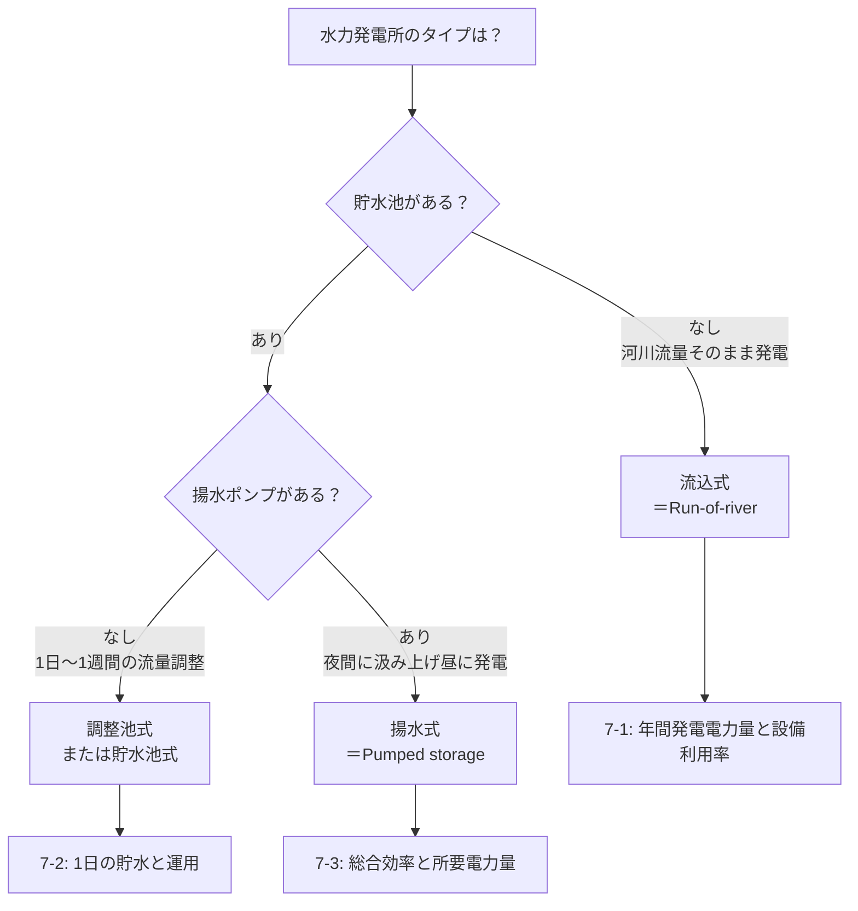

# B問題 計算テンプレート集

> 法規B問題（問10〜13）の計算パターンをステップバイステップでテンプレート化。
> 手順に沿って数値を代入するだけで解ける「再現性のある解法」を目指す。

---

## 1. 需要率・不等率・負荷率

### なぜ出る？

変圧器容量や配電設備の経済的な設計に直結。過大設備＝ムダ、過小設備＝過負荷事故。

### 解法テンプレート

```
【Step 1】問題文から3つの値を特定
  ├─ 設備容量 [kW]
  ├─ 最大需要電力 [kW]
  └─ 平均需要電力 [kW]（または電力量と時間から算出）

【Step 2】公式を選択
  ├─ 需要率 = 最大需要電力 ÷ 設備容量
  ├─ 負荷率 = 平均需要電力 ÷ 最大需要電力
  └─ 不等率 = 各負荷の最大需要電力の合計 ÷ 合成最大需要電力

【Step 3】複数負荷がある場合の合成最大需要電力
  合成最大 = 各最大の合計 ÷ 不等率
  ※ 不等率が与えられている場合はこの式で合成最大を求める

【Step 4】変圧器容量の決定
  変圧器容量 ≧ 合成最大需要電力 ÷ 力率
```

!!! warning "最頻出ミス"
    **需要率と負荷率の分母を逆にする**。覚え方：需要率の「需」＝「設備をどれだけ**需**要してるか」→ 分母は設備容量。

---

## 2. 力率改善（コンデンサ容量）

### なぜ出る？

力率が低い→電力損失I²R増大→電力会社の料金割増。コンデンサ設置は実務の基本。

### 解法テンプレート

```
【Step 1】問題文から抽出
  ├─ 有効電力 P [kW]
  ├─ 改善前の力率 cos θ1
  └─ 改善後の力率 cos θ2

【Step 2】tanを求める
  ├─ tan θ1 = sin θ1 ÷ cos θ1（cos→sinは √(1-cos²θ) で変換）
  └─ tan θ2 = sin θ2 ÷ cos θ2

【Step 3】コンデンサ容量を計算
  Qc = P × (tan θ1 − tan θ2) [kvar]

【Step 4】単位と方向を確認
  ├─ Qc > 0 であること（改善前tan > 改善後tan は必ず成立）
  └─ 三相回路なら P は三相有効電力 [kW]
```

!!! tip "速解テクニック"
    cos 0.6 → tan 1.333、cos 0.8 → tan 0.75、cos 0.85 → tan 0.620、cos 0.9 → tan 0.484、cos 0.95 → tan 0.329、cos 1.0 → tan 0。頻出値は暗記しておくと計算時間を大幅短縮。

---

## 3. 全日効率（変圧器）

### なぜ出る？

変圧器は24時間通電。最大効率時だけでなく1日トータルの効率で経済性を評価する。

### 解法テンプレート

```
【Step 1】問題文から抽出
  ├─ 定格容量 [kVA]
  ├─ 鉄損 Pi [kW]（無負荷損 = 常に一定）
  ├─ 銅損 Pc [kW]（全負荷時の値）
  └─ 負荷スケジュール: 各時間帯の負荷率 α と時間 t [h]

【Step 2】1日の出力電力量を計算
  Wout = Σ (α × 定格容量 × 力率 × t) [kWh]

【Step 3】1日の損失電力量を計算
  Wloss = 24 × Pi  +  Σ (α² × Pc × t) [kWh]
          ~~~~~~~~     ~~~~~~~~~~~~~~~~
          鉄損は24h固定   銅損はα²に比例

【Step 4】全日効率を計算
  η = Wout ÷ (Wout + Wloss) × 100 [%]
```

!!! warning "最頻出ミス"
    鉄損を負荷に比例させてしまう。**鉄損＝磁束による損失＝電圧が一定なら常に一定**。銅損だけがα²比例。

---

## 4. 絶縁耐力試験電圧

### なぜ出る？

新設・改修後の設備が絶縁性能を満たすか確認する法定試験。電圧値の計算が頻出。

### 解法テンプレート

```
【Step 1】最大使用電圧 Vm を求める
  ├─ 公称電圧 6,600V の場合: Vm = 6,600 × 1.15 ÷ 1.1 = 6,900V
  └─ 公称電圧 × (1.15/1.1) が基本（7,000V以下の場合）

【Step 2】試験電圧を算出
  ├─ 交流耐圧試験: Vm × 1.5 [V]（10分間）
  │   例: 6,900 × 1.5 = 10,350V
  └─ 直流耐圧試験: 交流試験電圧 × 2 [V]
      例: 10,350 × 2 = 20,700V
      ※ ケーブルの場合は直流で試験（充電電流が大きいため）

【Step 3】試験時間
  ├─ 交流: 連続10分間
  └─ 直流: 連続10分間
```

!!! note "実務の背景"
    なぜ1.5倍？ 通常使用電圧＋雷サージや開閉サージの過電圧を想定し、十分な絶縁マージンを確保するため。
## 5. %Z（パーセントインピーダンス）と短絡電流

### なぜ出る？

遮断器の遮断容量選定や保護協調の基礎。工場の受変電設備設計の実務そのもの。

### 解法テンプレート

```
【Step 1】問題文から抽出
  ├─ 変圧器の %Z [%]
  ├─ 定格容量 Pn [kVA]
  └─ 定格二次電圧 V2 [V]

【Step 2】定格二次電流を計算
  In = Pn ÷ (√3 × V2) [A]（三相の場合）

【Step 3】短絡電流を計算
  Is = In ÷ (%Z ÷ 100) = In × (100 ÷ %Z) [A]

【Step 4】短絡容量を計算（求められた場合）
  Ps = √3 × V2 × Is [VA]  = Pn × (100 ÷ %Z) [VA]

【基準容量換算が必要な場合】
  %Z' = %Z × (P基準 ÷ Pn)
  ※ 複数変圧器の並列や系統全体の計算では基準容量を統一する
```

!!! warning "最頻出ミス"
    **基準容量を揃え忘れる**。%Zは「定格容量ベース」で与えられる。異なる容量の変圧器を並列計算する際は、共通の基準容量に換算してから合成する。

---

## 6. 過電流継電器（OCR）の動作時間

### なぜ出る？

保護協調＝事故時に適切な遮断器だけが動作する設計。電力会社との協調も含めた実務的内容。

### 解法テンプレート

```
【Step 1】問題文から抽出
  ├─ CT比（例: 30/5）
  ├─ タップ値 [A]
  ├─ 事故電流 If [A]（一次側）
  └─ 限時特性曲線（レバー値・動作時間の関係）

【Step 2】CTの二次側電流を計算
  I2 = If ÷ CT比  [A]
  例: If=900A, CT比=30/5 → I2 = 900 × (5/30) = 150A

【Step 3】タップ倍数を計算
  倍数 = I2 ÷ タップ値
  例: I2=150A, タップ=5A → 倍数 = 30倍

【Step 4】限時特性曲線から動作時間を読み取る
  ├─ 倍数とレバー値の交点を読む
  └─ 上位・下位の協調（時間差0.3秒以上）を確認
```

---

## 7. 水力発電

### なぜ出る？

電気施設管理カテゴリの計算問題として頻出。R07上期問11（流込式）・過去5回以上の出題実績、再出題🔁が3件。「年間発電電力量・設備利用率・揚水総合効率」の組合せで出題され、**今後の再出題確率が高い**最重要計算カテゴリ。

### 共通基礎：公式と用語

**P [kW] = 9.8 × Q [m³/s] × H [m] × η**　（位置エネルギー mgh から導出。ρ=1000、g=9.8 を代入し /1000 で kW 換算）

| 記号 | 日常語 | 試験での意味 | 単位ひっかけ |
|---|---|---|---|
| Q | 流量 | 単位時間あたりの水の体積 | m³/h なら ÷3600、L/s なら ÷1000 |
| H | 落差 | 有効落差（総落差 − 損失落差） | 揚水時は実揚程 H' を使う |
| η | 総合効率 | 水車効率 η_t × 発電機効率 η_g | ポンプ時は分母に η_pump |

時間軸: 1年=8760時間／1日=86400秒。式の左辺と右辺で「秒」か「時」かを揃えてから代入する。

### 3方式の判別フロー



### 概念図（落差・流量・出力の関係）

<div>
<svg viewBox="0 0 720 320" xmlns="http://www.w3.org/2000/svg" style="max-width:720px;width:100%;height:auto;">
  <defs>
    <marker id="arrR" viewBox="0 0 10 10" refX="9" refY="5" markerWidth="8" markerHeight="8" orient="auto"><path d="M0,0 L10,5 L0,10 z" fill="#1565c0"/></marker>
    <marker id="arrDown" viewBox="0 0 10 10" refX="5" refY="9" markerWidth="8" markerHeight="8" orient="auto"><path d="M0,0 L10,0 L5,10 z" fill="#0288d1"/></marker>
  </defs>
  <!-- 上池 -->
  <rect x="40" y="30" width="180" height="60" fill="#e1f5fe" stroke="#0288d1" stroke-width="2"/>
  <text x="130" y="65" text-anchor="middle" font-size="14" fill="#01579b">上池（取水口）</text>
  <text x="130" y="20" text-anchor="middle" font-size="12" fill="#01579b">標高 H_u</text>
  <!-- 下池 -->
  <rect x="500" y="220" width="180" height="60" fill="#e1f5fe" stroke="#0288d1" stroke-width="2"/>
  <text x="590" y="255" text-anchor="middle" font-size="14" fill="#01579b">下池（放水口）</text>
  <text x="590" y="300" text-anchor="middle" font-size="12" fill="#01579b">標高 H_d</text>
  <!-- 水圧管路（斜め線） -->
  <line x1="220" y1="90" x2="500" y2="220" stroke="#0288d1" stroke-width="3" marker-end="url(#arrDown)"/>
  <text x="340" y="155" text-anchor="middle" font-size="13" fill="#0288d1">水圧管路 Q [m³/s]</text>
  <!-- 落差表示（縦線） -->
  <line x1="260" y1="90" x2="260" y2="250" stroke="#c62828" stroke-width="1.5" stroke-dasharray="4 4"/>
  <text x="245" y="180" text-anchor="middle" font-size="13" fill="#c62828" transform="rotate(-90 245 180)">有効落差 H</text>
  <!-- 水車・発電機 -->
  <rect x="430" y="180" width="80" height="50" fill="#fff3e0" stroke="#ef6c00" stroke-width="2"/>
  <text x="470" y="200" text-anchor="middle" font-size="12" fill="#bf360c">水車</text>
  <text x="470" y="218" text-anchor="middle" font-size="12" fill="#bf360c">η_t</text>
  <rect x="350" y="180" width="80" height="50" fill="#e8f5e9" stroke="#2e7d32" stroke-width="2"/>
  <text x="390" y="200" text-anchor="middle" font-size="12" fill="#1b5e20">発電機</text>
  <text x="390" y="218" text-anchor="middle" font-size="12" fill="#1b5e20">η_g</text>
  <line x1="430" y1="205" x2="350" y2="205" stroke="#666" stroke-width="2" marker-end="url(#arrR)"/>
  <!-- 出力 -->
  <text x="350" y="170" text-anchor="middle" font-size="13" fill="#1565c0" font-weight="bold">P = 9.8 × Q × H × η_t × η_g [kW]</text>
</svg>
</div>

---

### 7-1. 流込式：年間発電電力量と設備利用率

対応過去問: **R07上期問11**（流込式水力発電所の年間発電電力量と設備利用率）

#### なぜ出る？

河川流量がそのまま発電量に直結。1年を通した平均流量と最大出力の関係から「設備をどれだけ有効に使えているか」を定量評価する基本論点。

#### 解法テンプレート

```
【Step 1】問題文から抽出
  ├─ 平均流量 Q_avg [m³/s]
  ├─ 有効落差 H [m]
  ├─ 総合効率 η（= 水車効率 × 発電機効率）
  └─ 期間 T [h]（年間なら 8760、月間なら 24×日数）

【Step 2】平均出力 P_avg を計算
  P_avg [kW] = 9.8 × Q_avg × H × η

【Step 3】期間の発電電力量 W を計算
  W [kWh] = P_avg × T
  例: 年間なら W = P_avg × 8760

【Step 4】設備利用率を計算
  設備利用率 = W ÷ (P_max × T)
            = P_avg ÷ P_max
  ※ P_max は定格出力（または最大出力）
```

!!! warning "最頻出ミス"
    **流量の単位ミス**。Q が m³/h や L/s で与えられたら m³/s に直してから代入する。さらに「平均流量」と「最大流量」を取り違えると設備利用率の答えが分母分子で狂う。

!!! tip "速解テクニック"
    流込式の設備利用率は典型 **0.5〜0.7**。極端に小さい（<0.3）または1超の答えが出たら計算ミス。

---

### 7-2. 調整池式：1日の貯水と運用

対応過去問: 調整池水力発電所の運転管理🔁／調整池式水力発電所の貯水量・発電電力🔁／調整池式水力発電の発電電力量と流量🔁

#### なぜ出る？

調整池で1日の流量を平準化し、ピーク時間に多めに発電する運用。需要の山谷に合わせる**ピーク追従運転**の基本パターン。

#### 解法テンプレート

```
【Step 1】問題文から抽出
  ├─ 河川流入量 Q_in [m³/s]（1日平均）
  ├─ ピーク時間 t_peak [h]、オフピーク時間 t_off [h]（合計24h）
  ├─ ピーク時放流量 Q_peak [m³/s]
  ├─ 有効落差 H [m]、総合効率 η
  └─ 必要な調整池容量 V [m³]（求める対象）

【Step 2】1日の総流入量を計算（秒換算）
  V_in_total = Q_in × 86400 [m³]
  ※ 86400 = 24 × 3600

【Step 3】ピーク時の総放流量を計算
  V_peak = Q_peak × t_peak × 3600 [m³]

【Step 4】調整池に必要な容量
  V_pool ≥ V_peak − Q_in × t_peak × 3600
        = (Q_peak − Q_in) × t_peak × 3600 [m³]
  ※ オフピークに溜める量と等しい

【Step 5】ピーク時発電出力
  P_peak [kW] = 9.8 × Q_peak × H × η
```

!!! warning "最頻出ミス"
    **時間と秒の単位混在**。流量 [m³/s] × 時間 [h] では次元が合わない。必ず時間を秒（×3600）に直してから掛ける。

!!! note "実務の背景"
    調整池容量は「ピーク時の余分流量 × ピーク時間」で決まる。需要のピークが昼の3時間なら、その3時間分の余剰流量を夜間に溜める必要がある。

---

### 7-3. 揚水式：総合効率と所要電力量

対応過去問: 系統に接続する水力発電所の運用 タイプ

#### なぜ出る？

夜間の余剰電力で水を汲み上げ、昼のピークで発電する**蓄電池の代わり**。発電時とポンプ時で効率が異なるため、総合効率の理解が必須。

#### 解法テンプレート

```
【Step 1】問題文から抽出
  ├─ 発電時の有効落差 H_g [m]、ポンプ時の全揚程 H_p [m]
  │   ※ H_p ≥ H_g（管路損失で揚水時のほうが大きい）
  ├─ 発電時総合効率 η_g（= 水車 × 発電機）
  ├─ ポンプ時総合効率 η_p（= ポンプ × 電動機）
  ├─ 発電電力量 W_g [kWh] または発電時間 t_g [h] と出力 P_g [kW]
  └─ 揚水量 V [m³] または揚水時間 t_p [h]

【Step 2】発電電力量を計算（発電時）
  P_g [kW] = 9.8 × Q_g × H_g × η_g
  W_g [kWh] = P_g × t_g

【Step 3】揚水所要電力量を計算（ポンプ時）
  P_p [kW] = 9.8 × Q_p × H_p ÷ η_p
  W_p [kWh] = P_p × t_p
  ※ ポンプは電気を機械に変えるので η は分母

【Step 4】揚水総合効率
  η_total = W_g ÷ W_p
          = (Q_g × H_g × η_g × t_g) ÷ (Q_p × H_p ÷ η_p × t_p)

  同水量を循環させる場合（Q_g × t_g = Q_p × t_p = V/3600）:
  η_total = (H_g × η_g × η_p) ÷ H_p
```

!!! warning "最頻出ミス"
    **H_g と H_p の混同**。発電時は有効落差（管路損失を引く）、揚水時は実揚程（管路損失を足す）。同じ「落差」と書かれていても物理的に別物。問題文で「発電時◯◯m、揚水時◯◯m」と分けて与えられたら必ず使い分ける。

!!! tip "速解テクニック"
    揚水総合効率の典型値は **0.65〜0.75**。0.5以下や0.9以上は計算ミスの可能性大。

---

### 7-4. 単位換算と用語の整理（横断ひっかけ予防）

#### 流量の単位換算早見表

| 与えられた単位 | m³/s への換算 |
|---|---|
| m³/h | × (1/3600) |
| L/s | × (1/1000) |
| L/min | × (1/60000) |
| m³/日 | × (1/86400) |

#### 落差3用語の使い分け

| 用語 | 意味 | 試験での扱い |
|---|---|---|
| 総落差 | 上池と下池の水面差 | 物理的な高低差 |
| 有効落差 H | 総落差 − 管路損失 | **発電出力計算で使う** |
| 実揚程 H' | 下池と上池の水面差 + 管路損失 | **揚水ポンプの所要動力で使う** |

#### 効率3用語の積

| 用語 | 記号 | 意味 |
|---|---|---|
| 水車効率 | η_t | 水の運動エネルギー → 機械エネルギー |
| 発電機効率 | η_g | 機械エネルギー → 電気エネルギー |
| 総合効率（発電時） | η = η_t × η_g | P=9.8QHη の η に入る |

ポンプ時は逆向き（電気→機械→水）なので、η_total（揚水）= η_pump × η_motor で別物。

---

### §3 全日効率との関連

設備利用率は §3 全日効率の負荷率と数式構造が同じ：

- 負荷率（§3）= 平均需要電力 ÷ 最大需要電力
- 設備利用率（§7-1）= 平均出力 ÷ 最大（定格）出力

「最大需要」を「定格出力」と読み替えれば負荷率の式そのもの。発電所側の指標が **設備利用率**、消費側の指標が **負荷率**。

---

## 横断チェックリスト

解答後に確認する共通ミス防止リスト:

- [ ] **単位は統一したか？**（kW/MW、V/kV の混在に注意）
- [ ] **三相と単相を間違えていないか？**（√3 の有無）
- [ ] **分母・分子が逆になっていないか？**（需要率/負荷率/不等率）
- [ ] **「以上」「以下」「超える」「未満」を正確に区別したか？**
- [ ] **答えの桁数・オーダーが常識的か？**（短絡電流が数Aや数百万Aはおかしい）

---

## 関連ページ

- [電気施設管理](../themes/shisetsu-kanri.md) — テーマ別の概念解説・落とし穴
- [頻出数値一覧](numbers.md) — 計算の前提となる法定数値
- [絶縁性能・耐圧試験](../themes/zetsuen.md) — 耐圧試験の条文根拠

---

*最終更新: 2026-04-04 | v1.0（初版）*
