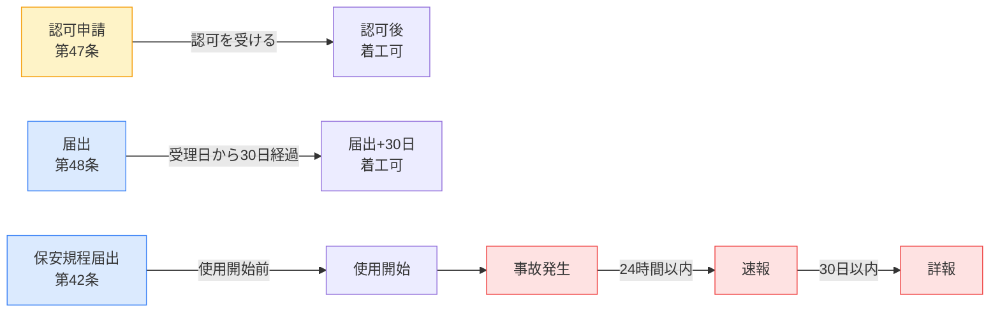
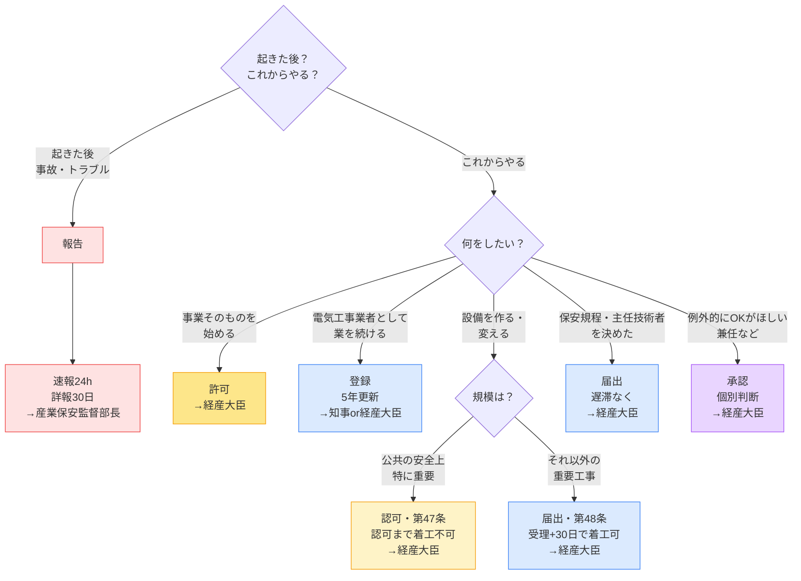

# 手続き6用語の使い分け（許可・認可・登録・届出・承認・報告）

> **結論**: 試験で問われる本質は「**事前か事後か**」「**誰に**」「**待機期間や条件**」の3点。用語の意味自体を厳密に覚える必要はなく、**この3点と紐付けて識別**できれば足りる。

---

## ① 6用語の識別表（1秒で見分ける決め手）

| 用語 | タイミング | 役所の応答 | 識別の決め手 | 代表例 |
|------|-----------|-----------|-------------|--------|
| **許可** | 事前 | 拒否されたら**絶対NG** | 「**本来禁止**＋例外で許す」性格の事業 | 一般送配電事業（電事法第3条）|
| **認可** | 事前 | 認可を受けるまで**着工不可** | **公共の安全確保上、特に重要な工事** | 工事計画認可（電事法第47条）|
| **登録** | 事前 | 名簿に載れば開業可（**有効期間あり**） | 「**業として続ける者**」の管理 | 電気工事業者登録（5年更新）|
| **承認** | 事前 | **個別案件**ごとに判断 | 「**例外的にOKを出してほしい**」申請 | 主任技術者の兼任承認 |
| **届出** | 事前 | **種類で扱いが違う**（→§③） | 「**通知して把握してもらう**」だけ | 工事計画／保安規程／主任技術者選任 |
| **報告** | **事後** | 事実の伝達 | **何かが起きた後**に伝える | 事故報告（24h速報・30日詳報）|

!!! warning "受験生が最も混同するペア"
    - **認可（47条） vs 届出（48条）** — 工事計画はどちらも事前だが、**第47条＝認可（認可されるまで着工不可）**／**第48条＝届出（受理後30日経過で着工可）**。需要設備では**受電電圧1万V以上**の設置工事が届出対象になり得る。
    - **許可 vs 認可** — 「許可」は**事業そのもの**（一般送配電事業など）、「認可」は**個別の工事計画**。電験3種で「許可」は出にくく、「認可」が頻出。
    - **届出 vs 報告** — **事前=届出／事後=報告**。例：保安規程は使用前=**届出**、事故は発生後=**報告**。

---

## ② 「誰に」が違う理由 — 1行ルール

| 送り先 | 担当する手続き | なぜここに送るか |
|--------|---------------|----------------|
| **経済産業大臣** | 工事計画認可・届出、保安規程届出、主任技術者選任届出 | 設備の**安全性・公益性**は国レベルで管理 |
| **産業保安監督部長**※ | 事故報告（速報・詳報） | **現場で即時対応**が要るので、地方の現業組織へ |
| **都道府県知事** | 電気工事業者登録（**1県内**で営業する場合） | **地域内の業者管理**は地方が担う |
| **経済産業大臣** | 電気工事業者登録（**2県以上**で営業する場合） | 広域は国が一元管理 |

※ 産業保安監督部 = 経済産業省の地方出先機関（北海道・東北・関東東北・中部近畿・中国四国・九州の6部）。

!!! note "なぜ事故報告だけ「産業保安監督部長」なのか"
    事故は**現地調査**が要る。本省（霞が関）に紙だけ送っても遅い。**地方の現業部署に直送**して即動いてもらう仕組み。

---

## ③ 事前届出・認可（工事着工前）

| 内容 | 区分 | 誰に | 期限・タイミング | 根拠 | 備考（対象規模）|
|------|------|------|----------------|------|------|
| **工事計画の認可申請** | 認可 | 経済産業大臣 | **認可を受けるまで着工不可** | 電事法第47条 | **大規模かつ公共の安全確保上、特に重要な工事のみ**（例：大規模火力・水力発電所の設置など）。**小規模工事は対象外**。|
| **工事計画の届出** | 届出 | 経済産業大臣 | **届出受理後30日を経過後に着工可** | 電事法第48条 | **第47条の認可対象を除く重要工事**（中規模設備。例：**受電電圧1万V以上**の自家用需要設備の設置など）|
| **保安規程の届出** | 届出 | 経済産業大臣 | 使用開始**前** | 電事法第42条 | 変更時は変更後**遅滞なく** |
| **主任技術者の選任届出** | 届出 | 経済産業大臣 | 選任後**遅滞なく** | 電事法第43条⑤ | 解任・死亡の場合も同様 |

!!! tip "規模で覚える"
    **大規模＝認可（第47条）／中規模＝届出（第48条）／小規模＝手続き不要**。
    試験では「**1万V以上の自家用需要設備**＝届出（第48条）」が頻出。

!!! warning "「届出」と一括りにしない — 種類で扱いが違う"
    **すべての届出に30日待機があるわけではない**。試験では「届出」という用語だけで判断せず、**何の届出か**までセットで見る。

    | 届出の種類 | 期限・タイミング | 根拠 |
    |-----------|----------------|------|
    | **工事計画届出** | **届出受理後30日を経過後に着工可**（待機期間あり） | 電事法第48条 |
    | **保安規程届出** | **使用開始前**に届け出る（待機期間なし） | 電事法第42条 |
    | **主任技術者選任届出** | **選任後、遅滞なく**届け出る（事後の通知）| 電事法第43条⑤ |

    また**事故は「届出」ではなく「報告」**。事故時は届出と書かれた選択肢を弾くのが正解への近道。

### ④ 事後（発生後・完了後）

| 内容 | 区分 | 誰に | 期限 | 根拠 | 備考 |
|------|------|------|------|------|------|
| **事故速報** | 報告 | 産業保安監督部長 | 知った時から**24時間以内** | 電気関係報告規則第3条 | 感電死傷・電気火災・供給支障等 |
| **事故詳報** | 報告 | 産業保安監督部長 | 知った時から**30日以内** | 電気関係報告規則第3条 | 速報後に詳細を追加提出 |

### ⑤ 業の管理（電気工事業者）

| 内容 | 区分 | 誰に | 期限・タイミング | 根拠 | 備考 |
|------|------|------|----------------|------|------|
| **電気工事業者の登録** | 登録 | 知事（1県内）／経産大臣（2県以上） | 開業**前**（**5年**更新制） | 電気工事業法第3条 | 主任電気工事士の選任要 |

詳細な期限・条文番号は → [届出・申請期限一覧](deadlines.md)

---

## ⑥ タイムライン（時間軸イメージ）

**色分け**: 🟡 認可 ／ 🔵 届出 ／ 🔴 報告（事後）

---

## ⑦ 判断フロー — 「これは何の手続き？」と問われたら

!!! tip "迷ったときの最終手段"
    用語名（許可/認可/届出 …）を忘れても、**「事前 or 事後」「誰に」「待機条件」の3点が合えば正答**できる選択肢が多い。3点セットで覚えるのが最も効率的。

---

## ⑧ ひっかけパターン（試験での誤答）

| 誤った理解 | 正しい理解 |
|-----------|-----------|
| 工事計画はどんな規模でも**届出**で済む | **大規模・特に重要な工事は認可（第47条／認可まで着工不可）**。それ以外の重要工事が**届出（第48条／受理+30日で着工可）**。規模で送るルートが変わる |
| 届出は「**30日前までに**出す」 | 条文は「**届出受理後30日を経過後に着工可**」（届出のタイミングは"着工計画次第"。30日経過しないと着工できない、という待機期間規定）|
| **届出はすべて30日待機**がある | **30日待機は工事計画届出（第48条）のみ**。**保安規程届出は使用開始前**、**主任技術者選任届出は選任後遅滞なく**。「何の届出か」で扱いが違う |
| 事故は「届出」する | **事故は「報告」**（事前=届出／事後=報告）|
| 事故は経済産業大臣に報告 | **産業保安監督部長**（地方の現業組織。即対応のため）|
| 主任技術者の選任は「承認」 | **届出**（遅滞なく）。**承認**は兼任・外部委託など個別の例外申請 |
| 電気工事業者の登録は経産大臣 | **1県内なら知事**／**2県以上なら経産大臣**（広域=国） |
| 保安規程は使用後に届出 | **使用開始前**に届出（変更時は変更後遅滞なく）|

---

## ⑨ 自己チェック（4択3問・易→難）

??? question "🟢 易 — 学習直後の確認"
    工場で電気火災が発生し、感電死傷者が出た。事業者が最初に行うべき手続きとして正しいものはどれか。

    A. 経済産業大臣に**届出**を行う
    B. 産業保安監督部長に**24時間以内に速報**を行う
    C. 経済産業大臣に**承認**を申請する
    D. 都道府県知事に**登録**を行う

    **答え：B**
    事故は「事前」ではなく「**事後の報告**」。送り先は**産業保安監督部長**（現場で即時対応が要るため地方の現業組織）。期限は**24時間以内（速報）／30日以内（詳報）**。

??? question "🟡 中 — 1週間後の復習"
    受電電圧6,600Vの自家用電気工作物の設置工事を行う場合、工事計画について事業者が取るべき手続きとして最も適切なものはどれか。なお、当該工事は電事法第47条の認可対象には該当しないものとする。

    A. 経済産業大臣に**認可**を申請し、認可を受けてから着工する
    B. 経済産業大臣に**届出**を行い、受理日から30日を経過後に着工する
    C. 産業保安監督部長に**届出**を行い、即日着工する
    D. 都道府県知事の**承認**を得てから着工する

    **答え：B**
    第47条の認可対象を除く重要工事は**第48条の届出**対象。**届出受理日から30日を経過後**でなければ着工できない（届出受理日 + 30日後に着工可）。送り先は経済産業大臣。

??? question "🔴 難 — 試験直前の検証"
    次の組み合わせのうち、**手続き名／送り先／タイミング** がすべて正しいものはどれか。

    A. 工事計画の認可（第47条）／経済産業大臣／**着工90日以上前に申請**
    B. 主任技術者の選任／**産業保安監督部長**／選任後遅滞なく
    C. 電気工事業者の登録（2県にまたがる）／**経済産業大臣**／開業前（5年更新）
    D. 保安規程の届出／経済産業大臣／**使用開始後30日以内**

    **答え：C**
    解説：
    - **A** ✗ — 第47条は「**認可されるまで着工不可**」が条文表現。「90日前」は法定ではない（学習教材の俗称）。
    - **B** ✗ — 主任技術者選任の届出先は**経済産業大臣**（電事法第43条⑤）。産業保安監督部長は事故報告の宛先。
    - **C** ✓ — 電気工事業者登録は**1県内なら知事**／**2県以上なら経産大臣**。有効期間5年。
    - **D** ✗ — 保安規程は**使用開始前**（事前届出）。事後ではない。

---

## ⑩ 自己テスト — 6用語チェックリスト

次の6用語、それぞれ**決め手1語**を即答できるか？

- [ ] **許可** → 本来禁止＋例外で許す（事業そのもの）
- [ ] **認可** → 認可まで着工不可（第47条・特に重要な工事）
- [ ] **登録** → 業として続ける者の管理（5年更新）
- [ ] **承認** → 個別案件のOK（兼任など）
- [ ] **届出** → 種類で扱いが違う（工事計画=受理+30日／保安規程=使用前／選任=遅滞なく）
- [ ] **報告** → 事後の事実伝達（産業保安監督部長へ）

全部即答できたら本番OK。詰まった用語があればこのページの該当節に戻る。

---

## 参照クロスリンク

- [届出・申請期限一覧](deadlines.md)（数値・期限の確定リスト）
- [罰則・罰金比較表](penalties.md)（届出義務違反の罰則）
- [法体系の全体構造](hourei-taikei.md)（法律→政令→省令の階層）
- [用語の使い分け（決め手集）](term-usage.md)（施設/敷設/架設等の物理的設置語）

---

*最終更新: 2026-05-05 | v1.2（届出の種類別扱いを明記：工事計画=30日待機／保安規程=使用前／選任=遅滞なく）*
