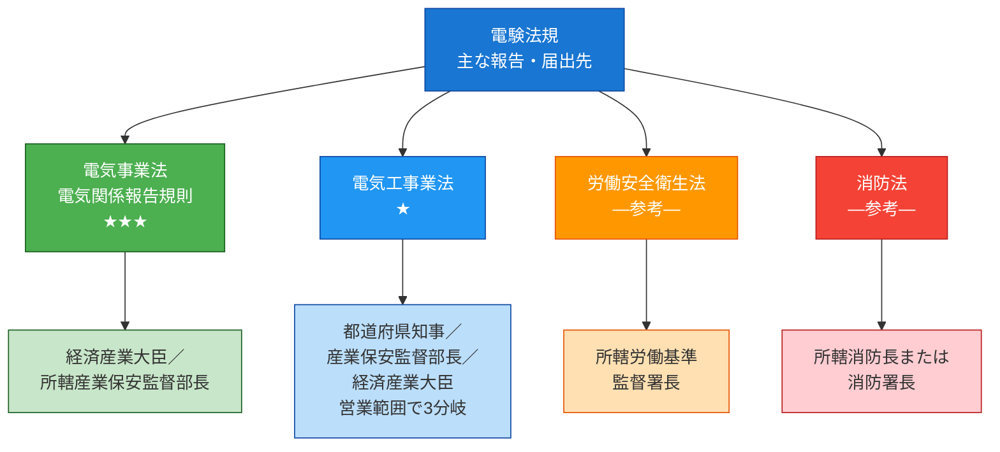
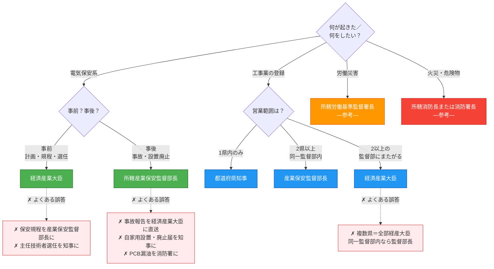

# 報告先・届出先 早見マップ

> **結論**: 電気のことは経産省、工事業者は知事、ケガは労基署、火事は消防——だからそれぞれの担当機関に送る。電験3種では**電気事業法・電気関係報告規則の2法が試験の中核**。労安法・消防法は実務では絡むが、電験3種の出題実績はゼロ（参考扱い）。

---

## ① 棲み分けマップ — 3軸の参照ページ

| こう問われたら | 参照すべきページ |
|----------------|------------------|
| 「これは認可？届出？登録？」（**種別**を判別したい） | [手続き6用語の使い分け](permit-types.md) |
| 「24時間？30日？5年？」（**期限**を判別したい） | [届出・申請期限一覧](deadlines.md) |
| 「**どこに**送る？」（**宛先**を判別したい） | **本ページ** |

3ページは同じ法規体系を**異なる軸**で整理した逆引きセット。本ページは「宛先」を起点に逆引きする。

!!! tip "言葉の整理（本ページ共通）"
    - **法令上の宛先**: 法令条文で指定された名宛人（例：経済産業大臣）。試験で問われるのはここ。
    - **提出窓口**: 実際に書類を出す行政組織（例：所轄産業保安監督部）。委任により法令上の宛先と異なる場合がある。
    - **届出先・報告先**: 一般用語。両者を含む広い言い方。試験では「法令上の宛先」を答える。

---

## ② 4法×宛先 早見マップ

色分けはユーザーが暗記時に思い浮かべるインフォグラフィックの色配置と一致：🟢 電気保安 ／ 🔵 工事業者 ／ 🟠 労働 ／ 🔴 火災。

---

## ③ 4法×宛先×趣旨 統合一覧表（コア暗記）

| 法令 | 主な宛先 | 該当手続き例（条項番号） | 出題頻度 | なぜそこか（1行） |
|------|----------|--------------------------|----------|------------------|
| **電気事業法** | 経済産業大臣 | 工事計画認可第47条①／工事計画届出第48条①（**受電電圧1万V以上の需要設備等**）／保安規程届出第42条②／主任技術者選任又は解任届出第43条③ | ★★★ | 設備の安全性・公益性は**国レベル**で管理 |
| **電気関係報告規則** | 所轄産業保安監督部長 ※ | 事故速報24h・詳報30日第3条／自家用設置・廃止届第5条 | ★★★ | 事故は**地方の現業組織に直送**して即時に現地対応させるため |
| **電気工事業法** | 営業範囲で3分岐 → §④ 参照 | 電気工事業者登録第3条／変更届／開始・廃止 | ★ | 業者は**地域密着**だが営業範囲が広がるほど監督主体が広域化 |
| **労働安全衛生法** | 所轄労働基準監督署長 | 労働災害報告／重大災害報告 | ―（電験3種出題なし／**参考**） | 労働者の安全は**労働行政**の所管 |
| **消防法** | 所轄消防長または消防署長 | 防火管理者選任／消防計画／危険物関係 | ―（電験3種出題なし／**参考**） | 火災・危険物は**消防行政**の所管 |

※ **事故報告は原則 産業保安監督部長／例外的に経済産業大臣**（事故種別による。詳細は §④ 参照）

!!! tip "判定キー1行ルール"
    迷ったらこれ：
    **事前**の手続き（計画・規程・選任）→ **大臣**
    ／ **事後**の報告（事故・廃止）→ **監督部長**

---

## ④ 同じ手続きでも宛先・原則例外が変わるケース

「届出」「報告」「登録」は一括りにできない。**手続きごとに宛先の分岐ルールが違う**ため、サブタイプを併記して覚える。

| 手続き | 原則 | 例外・分岐 |
|--------|------|-----------|
| **事故報告**（電気関係報告規則第3条） | 所轄産業保安監督部長 | **事故種別により経済産業大臣**の場合あり（高圧ガス保安法等との複合事故） |
| **主任技術者選任又は解任届出**（電事法第43条③） | **法令上の宛先＝経済産業大臣** | **提出窓口は所轄産業保安監督部でOK**（省令委任）。宛先＝大臣は変わらない |
| **工事計画 第47条 vs 第48条**（着工制限の差） | 第47条＝**認可**（経産大臣・**認可まで着工不可**） | 第48条＝**届出**（経産大臣・**受理後30日経過まで着工不可**）。**需要設備では受電電圧1万V以上**が対象 |

### 電気工事業者登録の3分岐（電気工事業法第3条）

電験3種では「1県内→知事／2県以上→経産大臣」の**2分岐で出題される**ことが多いが、**実務上は3分岐**。試験対策としては最低 1県内 vs 複数県 の区別、余裕があれば3分岐を押さえる。

| 営業所の所在 | 法令上の宛先 |
|------|--------|
| **1の都道府県の区域内のみ** | 都道府県知事 |
| **2以上の都道府県にまたがる、かつ同一の産業保安監督部の管轄区域内** | 産業保安監督部長 |
| **2以上の産業保安監督部の管轄区域にまたがる** | 経済産業大臣 |

参考：産業保安監督部は全国に**6部**（北海道・東北・関東東北・中部近畿・中国四国・九州）。「複数県だが同一監督部内」のケースは実務上ありうる（例：関東圏内の複数県）。

!!! note "「委任」とは？"
    国（経済産業大臣）の権限の一部を地方の出先機関（**産業保安監督部**）に代行させる仕組み。
    **法令上の宛先＝経済産業大臣**だが、**提出窓口は地方でOK**、という関係。
    試験では「**法令上の宛先**」が問われる。「提出窓口」は実務確認事項。

!!! warning "「届出」をひと括りにしない"
    試験では「届出」という用語だけで判断せず、**何の届出か**まで見る：

    - **工事計画届出**（第48条）→ 受理後30日経過まで着工不可（**受電電圧1万V以上**の需要設備等）
    - **保安規程届出**（第42条②）→ 使用開始前（待機なし）
    - **主任技術者選任又は解任届出**（第43条③）→ 選任後、遅滞なく
    - **自家用電気工作物の設置・廃止届**（報告規則第5条）→ 産業保安監督部長

    宛先・期限・対象規模がそれぞれ違う。

---

## ⑤ 最新改正（直近で対象拡大した範囲）

近年の改正で報告対象が広がった項目。

- **電力貯蔵装置（蓄電池）の事故報告対象拡大**
    - **令和7年11月20日施行**の電気関係報告規則改正により、**容量20kWh超**の電力貯蔵装置が事故報告対象となった。
    - **専ら非常用**の電力貯蔵装置は対象外となる場合がある。
    - 詳細はMETI「電力貯蔵装置（蓄電池）・蓄電所を設置する場合の手引き」を一次ソースとして確認する。
- **波及事故の報告対象明確化**
    - 自家用電気工作物 → 一般送配電事業者等への**供給支障**を引き起こした事故が、明確に報告対象として位置付けられている。
    - 「波及事故」は法規分野の超頻出語彙（R02・R05上・R06上・R07上・R07下で出題）。

---

## ⑥ 判断フロー＋頻出ひっかけ

「いま目の前の手続き、どこに送る？」を分岐で辿る。各分岐の脇に**よくある誤答（✗）**を併記。

**ひっかけ整理（フロー図と対応）**

| ✗ 誤った理解 | ✓ 正しい理解 |
|-------------|--------------|
| 事故報告を**経済産業大臣**に直送 | 原則 **産業保安監督部長**（例外あり）。**現場対応**のため地方の現業組織 |
| 電気工事業者登録は2県以上なら全部経産大臣 | **同一監督部内なら監督部長**、**2以上の監督部にまたがる場合のみ経産大臣** |
| 保安規程は産業保安監督部長 | **経済産業大臣**（電事法第42条②）|
| 主任技術者選任は知事 | **経済産業大臣**（電事法第43条③）|
| 自家用電気工作物の設置・廃止届は都道府県知事 | **産業保安監督部長**（電気関係報告規則第5条）|
| PCB漏油は消防署 | **産業保安監督部長**（電気関係報告規則）|
| 受電 6,600V の需要設備設置は第48条届出対象 | **対象外**。第48条 の需要設備設置の届出対象は**受電電圧1万V以上** |

---

## ⑦ 自己チェック（3問）

??? question "🟢 易 — 学習直後の確認"
    自家用電気工作物で**感電死傷事故**が発生した。事業者がまず**24時間以内**に速報すべき宛先として正しいものはどれか。

    A. 経済産業大臣に直接報告する
    B. **所轄産業保安監督部長**に報告する
    C. 都道府県知事に報告する
    D. 所轄労働基準監督署長に報告する

    **答え：B**
    事故は**事後の報告**。原則の宛先は**所轄産業保安監督部長**（地方の現業組織で即時対応のため）。電気関係報告規則第3条。

??? question "🟡 中 — 1週間後の復習（ひっかけ対策）"
    ある事業者が**受電電圧 6,600V** の自家用需要設備を新設しようとしている。電気事業法第48条の工事計画届出（受電電圧1万V以上の需要設備の設置等が対象）について、本件は対象に該当するか。

    A. 該当する。受電電圧6,600Vの需要設備の設置はすべて第48条届出対象である
    B. 該当する。高圧受電のため例外なく届出が必要である
    C. **該当しない。6,600Vは1万V未満であり、需要設備の設置を理由とする第48条の届出対象とはならない**（ただし**他の工事・設備条件**で届出対象になる場合はあり得る）
    D. 該当しない。届出はすべて1万V以上の特別高圧設備のみ

    **答え：C**
    「需要設備の設置」を理由とする 第48条 工事計画届出は**受電電圧1万V以上**が対象。**6,600V は1万V未満なので原則 該当しない**。ただし需要設備の設置以外の事由（特定の工事種別・設備種別）で届出対象となる場合があるため、選択肢では「ただし他の条件で対象になる場合はあり得る」と留保している。

??? question "🔴 難 — 試験直前の検証（電気工事業者登録の3分岐）"
    次の3社のうち、**電気工事業者登録の宛先**として正しい組合せはどれか。

    | 記号 | 営業所の所在 | 想定宛先 |
    |------|--------------|----------|
    | A | 東京都内のみ | 都道府県知事 |
    | B | 東京都＋神奈川県（いずれも関東東北産業保安監督部の管轄区域内）| **産業保安監督部長** |
    | C | 東京都＋大阪府（関東東北産業保安監督部 と 中部近畿産業保安監督部 にまたがる）| **経済産業大臣** |

    A〜C すべての宛先が正しい組合せはどれか：(1) A・Bのみ正  (2) A・Cのみ正  (3) B・Cのみ正  (4) A・B・C すべて正

    **答え：(4) A・B・C すべて正**
    解説：
    - **A** ✓ 1の都道府県の区域内のみ → 都道府県知事
    - **B** ✓ 2以上の都道府県にまたがるが、**同一の産業保安監督部の管轄区域内** → **産業保安監督部長**
    - **C** ✓ 2以上の産業保安監督部の管轄区域にまたがる → **経済産業大臣**

    電験3種では2分岐（1県内 vs 2県以上）で出題されることが多いが、**実務上は3分岐**。「2県以上＝必ず経産大臣」は誤り。

---

## ⑧ 参照クロスリンク

- [手続き6用語の使い分け（許可・認可・登録・届出・承認・報告）](permit-types.md) — 種別軸
- [届出・申請期限一覧](deadlines.md) — 期限軸
- [電気事業法 第42条（保安規程）](../articles/jigyoho/42.md)
- [電気事業法 第43条（主任技術者）](../articles/jigyoho/43.md)
- [電気事業法 第47条（工事計画認可）](../articles/jigyoho/47.md)
- [電気事業法 第48条（工事計画届出）](../articles/jigyoho/48.md)
- [電気関係報告規則 第3条（事故報告）](../articles/other/jiko-3.md)
- [電気関係報告規則 第5条（自家用設置・廃止届）](../articles/other/jiko-5.md)

---

## メタ・典拠

| 項目 | 内容 |
|------|------|
| **典拠（一次ソース）** | 電気事業法本文／電気関係報告規則本文（令和7年11月20日施行改正反映）／電気工事業法本文・施行令／METI「電力貯蔵装置（蓄電池）・蓄電所を設置する場合の手引き」／（参考）労働安全衛生法・消防法概要 |
| **照合日** | 2026-05-05（古舘さんと照合・ChatGPT検証反映） |
| **隣接参照** | [permit-types.md](permit-types.md)（種別軸）／ [deadlines.md](deadlines.md)（期限軸） |
| **混同注意** | 「届出」は手続きごとに宛先・期限・対象規模が違う（§④ 参照）／「法令上の宛先」と「提出窓口」を混同しない |

---

## 監修ログ

- **2026-05-05 v1.0 初版**
    - **条文番号確定根拠**: 電気事業法本文／電気関係報告規則本文／電気工事業法本文（既存記事 jiko-3.md v2.2・permit-types.md v1.2・deadlines.md v1.2 とクロスチェック）
    - **既存wiki参照の独立検証**: 実施（permit-types.md §② の「誰に」1行ルールを起点に、各条文記事と整合確認）
    - AI監修3者レビュー（江間・早川・佐藤可士和）反映済（10セクション → 7セクションに圧縮）
- **2026-05-05 v1.2 ChatGPT追加指摘 — 主任技術者選任届出の条項番号修正**
    - **第43条第5項 → 第43条第3項** に4箇所修正（§③/§④/§④warning/§⑥ひっかけ表）
    - 文言も「**選任届出**」→「**選任又は解任届出**」に正確化（条文は選任・解任の両方を扱う）
    - **横展開未実施**: permit-types.md / deadlines.md / jiko-3.md など既存ページにも 第43条⑤ 誤記が広がっている可能性あり（要ユーザー判断）
- **2026-05-05 v1.1 ChatGPT指摘6点反映（法令正確性最優先）**
    - **電気工事業者登録の宛先**: 「2分岐」から **3分岐**に修正（1県内→知事／同一監督部内の複数県→監督部長／2以上の監督部にまたがる→大臣）。§②/§③/§④/§⑥/§⑦ を一括修正。
    - **第47条/第48条 の対象規模明記**: 需要設備の設置を理由とする 第48条 届出対象は **受電電圧1万V以上** と明示。§③/§④/§⑥ ひっかけに追記。
    - **自己チェック中問**: 「6,600Vを第48条対象として扱う」誤りを **6,600Vが対象外であることを問うひっかけ問題** に差し替え（推奨案B）。
    - **自己チェック難問**: 電気工事業者登録の **3分岐識別問題** に差し替え（軸を宛先に統一）。
    - **§⑤ 蓄電池改正**: 「省令番号要確認」を削除し、**令和7年11月20日施行・容量20kWh超・専ら非常用は対象外**を確定情報として記載。METI手引きを一次ソースに追加。
    - **「法令上の宛先 vs 提出窓口」概念整理**: 冒頭 tip と §④ 主任技術者行・§④ note アドモニションで明示。

### ステータス

- 条文番号：✅ 再照合済
- 電気工事業者登録の宛先分岐：✅ 3分岐に修正済（1県内／同一監督部内複数県／複数監督部にまたがる）
- 6,600V自己チェック：✅ 修正済（1万V未満ひっかけ問題に差替）
- 主任技術者選任届出：✅ **第43条第3項**に修正済（v1.2）
- 蓄電池・電力貯蔵装置改正：✅ 令和7年11月20日施行改正を反映済
- 「法令上の宛先」と「提出窓口」の概念分離：✅ 明示済
- **次回確認**: 令和8年度試験公示後

---

*ステータス: v1.2 ｜ 条文番号: ✅ 一次ソース照合済（第43条③確認） ｜ 出題実績: ✅ kakomon DB 照合済（宛先関連15問）｜ 法令正確性: ✅ ChatGPT指摘反映済 ｜ [バージョニング基準](versioning.md)*
