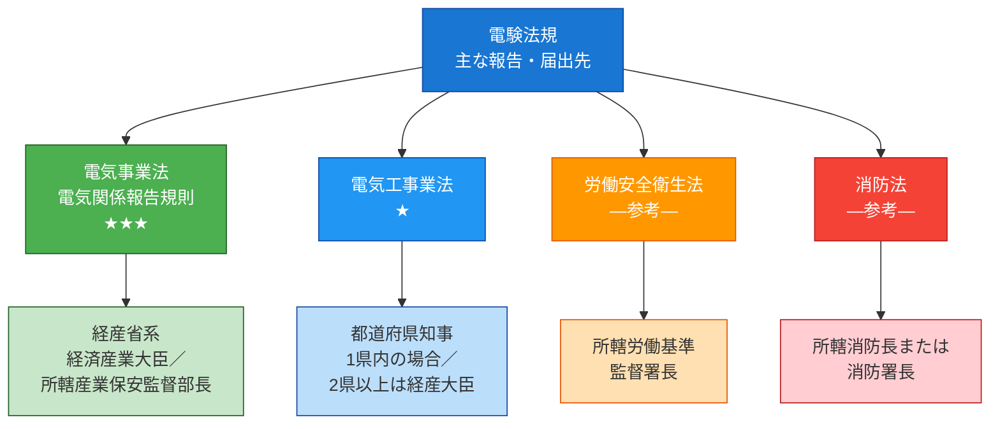
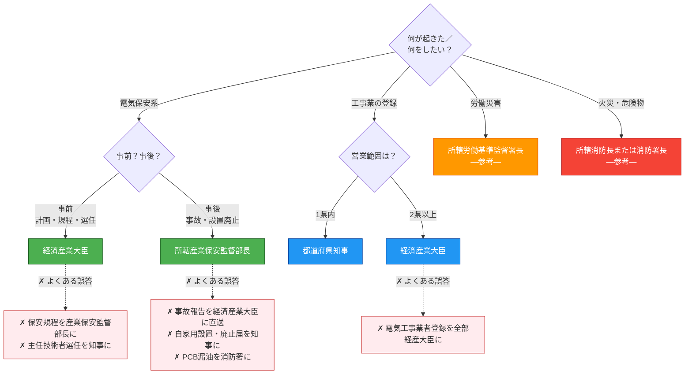

# 報告先・届出先 早見マップ

> **結論**: 電気のことは経産省、工事業者は知事、ケガは労基署、火事は消防——だからそれぞれの担当機関に送る。電験3種では**電気事業法・電気関係報告規則の2法が試験の中核**。労安法・消防法は実務では絡むが、電験3種の出題実績はゼロ（参考扱い）。

---

## ① 棲み分けマップ — 3軸の参照ページ

| こう問われたら | 参照すべきページ |
|----------------|------------------|
| 「これは認可？届出？登録？」（**種別**を判別したい） | [手続き6用語の使い分け](permit-types.md) |
| 「24時間？30日？5年？」（**期限**を判別したい） | [届出・申請期限一覧](deadlines.md) |
| 「**どこに**送る？」（**宛先**を判別したい） | **本ページ** |

3ページは同じ法規体系を**異なる軸**で整理した逆引きセット。本ページは「宛先」を起点に逆引きする。

---

## ② 4法×宛先 早見マップ

色分けはユーザーが暗記時に思い浮かべるインフォグラフィックの色配置と一致：🟢 電気保安 ／ 🔵 工事業者 ／ 🟠 労働 ／ 🔴 火災。

---

## ③ 4法×宛先×趣旨 統合一覧表（コア暗記）

| 法令 | 主な宛先 | 該当手続き例（条項番号） | 出題頻度 | なぜそこか（1行） |
|------|----------|--------------------------|----------|------------------|
| **電気事業法** | 経済産業大臣 | 工事計画認可§47①／工事計画届出§48①／保安規程届出§42②／主任技術者選任届出§43⑤ | ★★★ | 設備の安全性・公益性は**国レベル**で管理 |
| **電気関係報告規則** | 所轄産業保安監督部長 ※ | 事故速報24h・詳報30日§3／自家用設置・廃止届§5 | ★★★ | 事故は**地方の現業組織に直送**して即時に現地対応させるため |
| **電気工事業法** | 都道府県知事（1県内）／経産大臣（2県以上） | 電気工事業者登録§3／変更届／開始・廃止 | ★ | 業者は**地域密着**なので地方が管理／2県以上は重複申請を防ぐため**国が一元化** |
| **労働安全衛生法** | 所轄労働基準監督署長 | 労働災害報告／重大災害報告 | ―（電験3種出題なし／**参考**） | 労働者の安全は**労働行政**の所管 |
| **消防法** | 所轄消防長または消防署長 | 防火管理者選任／消防計画／危険物関係 | ―（電験3種出題なし／**参考**） | 火災・危険物は**消防行政**の所管 |

※ **事故報告は原則 産業保安監督部長／例外的に経済産業大臣**（事故種別による。詳細は §④ 参照）

!!! tip "判定キー1行ルール"
    迷ったらこれ：
    **事前**の手続き（計画・規程・選任）→ **大臣**
    ／ **事後**の報告（事故・廃止）→ **監督部長**

---

## ④ 同じ手続きでも宛先・原則例外が変わるケース

「届出」「報告」「登録」は一括りにできない。**手続きごとに宛先の分岐ルールが違う**ため、サブタイプを併記して覚える。

| 手続き | 原則 | 例外・分岐 |
|--------|------|-----------|
| **事故報告**（電気関係報告規則§3） | 所轄産業保安監督部長 | **事故種別により経済産業大臣**の場合あり（高圧ガス保安法等との複合事故） |
| **主任技術者選任届出**（電事法§43⑤） | 経済産業大臣 | 省令委任により**産業保安監督部長への提出も可**（提出窓口の話。**宛先＝大臣は変わらない**） |
| **電気工事業者登録**（電気工事業法§3） | **1県内** → 都道府県知事 | **2県以上にまたがる** → 経済産業大臣 |
| **工事計画 §47 vs §48**（着工制限の差） | §47＝**認可**（経産大臣・**認可まで着工不可**） | §48＝**届出**（経産大臣・**受理後30日経過まで着工不可**）。規模で振り分け |

!!! note "「委任」とは？"
    国（経済産業大臣）の権限の一部を地方の出先機関（**産業保安監督部**）に代行させる仕組み。
    **宛先＝経済産業大臣**だが、**提出窓口は地方でOK**、という関係。
    試験では「宛先は経産大臣」が正解になるケースが多い。

!!! warning "「届出」をひと括りにしない"
    試験では「届出」という用語だけで判断せず、**何の届出か**まで見る：

    - **工事計画届出**（§48）→ 受理後30日経過まで着工不可
    - **保安規程届出**（§42②）→ 使用開始前（待機なし）
    - **主任技術者選任届出**（§43⑤）→ 選任後、遅滞なく
    - **自家用電気工作物の設置・廃止届**（報告規則§5）→ 産業保安監督部長

    宛先・期限・タイミングがそれぞれ違う。

---

## ⑤ 最新改正（直近で対象拡大した範囲）

近年の改正で報告対象が広がった項目。R08以降は要注意。

- **蓄電池・電力貯蔵装置の事故報告対象拡大**
    - 電気関係報告規則の改正で、蓄電池・電力貯蔵装置に関する事故が報告対象として明確化された。
    - 試験対策上は「事故報告の対象範囲に**蓄電池・電力貯蔵装置を含む**」と覚える。
- **波及事故の報告対象明確化**
    - 自家用電気工作物 → 一般送配電事業者等への**供給支障**を引き起こした事故が、明確に報告対象として位置付けられている。
    - 「波及事故」は法規分野の超頻出語彙（R02・R05上・R06上・R07上・R07下で出題）。

!!! warning "改正規則の典拠"
    最新改正の省令番号・施行日は、出題前に [電気関係報告規則 第3条](../articles/other/jiko-3.md) と一次ソース（経産省サイト）で再確認すること。

---

## ⑥ 判断フロー＋頻出ひっかけ

「いま目の前の手続き、どこに送る？」を分岐で辿る。各分岐の脇に**よくある誤答（✗）**を併記。

**ひっかけ整理（フロー図と対応）**

| ✗ 誤った理解 | ✓ 正しい理解 |
|-------------|--------------|
| 事故報告を**経済産業大臣**に直送 | 原則 **産業保安監督部長**（例外あり）。**現場対応**のため地方の現業組織 |
| 電気工事業者登録は全部経産大臣 | **1県内なら知事**／2県以上なら経産大臣 |
| 保安規程は産業保安監督部長 | **経済産業大臣**（電事法§42②）|
| 主任技術者選任は知事 | **経済産業大臣**（電事法§43⑤）|
| 自家用電気工作物の設置・廃止届は都道府県知事 | **産業保安監督部長**（電気関係報告規則§5）|
| PCB漏油は消防署 | **産業保安監督部長**（電気関係報告規則）|

---

## ⑦ 自己チェック（4択3問）

??? question "🟢 易 — 学習直後の確認"
    自家用電気工作物で**感電死傷事故**が発生した。事業者がまず**24時間以内**に速報すべき宛先として正しいものはどれか。

    A. 経済産業大臣に直接報告する
    B. 所轄**産業保安監督部長**に報告する
    C. 都道府県知事に報告する
    D. 所轄労働基準監督署長に報告する

    **答え：B**
    事故は**事後の報告**。原則の宛先は**所轄産業保安監督部長**（地方の現業組織で即時対応のため）。電気関係報告規則§3。

??? question "🟡 中 — 1週間後の復習"
    受電電圧 **6,600V** の自家用電気工作物の設置工事を行う事業者がいる（電事法第47条の認可対象には該当しない）。最も適切な手続きと宛先はどれか。

    A. 経済産業大臣に**認可**を申請し、認可後に着工する
    B. **経済産業大臣**に**届出**を行い、受理後30日経過後に着工する
    C. 所轄産業保安監督部長に届出を行い、即日着工する
    D. 都道府県知事に**登録**を行ってから着工する

    **答え：B**
    第47条認可対象を除く重要工事は**第48条の届出**対象（受電1万V以上の自家用需要設備等）。宛先は**経済産業大臣**、待機は**受理後30日**。

??? question "🔴 難 — 試験直前の検証"
    次の4組（手続き／宛先）のうち、**正しい組合せのみ**を選び出した選択肢はどれか。

    | 記号 | 手続き | 宛先 |
    |------|--------|------|
    | A | 工事計画届出（§48）| **都道府県知事** |
    | B | 主任技術者選任届出（§43⑤）| **経済産業大臣** |
    | C | 電気工事業者登録（**2県以上**）| **都道府県知事** |
    | D | 事故速報（電気関係報告規則§3）| **所轄産業保安監督部長** |

    選択肢：(1) A・B  (2) B・D  (3) A・C  (4) C・D

    **答え：(2) B・D**
    解説：
    - **A** ✗ 工事計画届出（§48）の宛先は**経済産業大臣**。都道府県知事ではない。
    - **B** ✓ 主任技術者選任届出は経済産業大臣（電事法§43⑤）。
    - **C** ✗ 電気工事業者登録は**1県内なら知事／2県以上なら経済産業大臣**。「2県以上→知事」は逆。
    - **D** ✓ 事故速報の原則の宛先は所轄産業保安監督部長（電気関係報告規則§3）。

---

## ⑧ 参照クロスリンク

- [手続き6用語の使い分け（許可・認可・登録・届出・承認・報告）](permit-types.md) — 種別軸
- [届出・申請期限一覧](deadlines.md) — 期限軸
- [電気事業法 第42条（保安規程）](../articles/jigyoho/42.md)
- [電気事業法 第43条（主任技術者）](../articles/jigyoho/43.md)
- [電気事業法 第47条（工事計画認可）](../articles/jigyoho/47.md)
- [電気事業法 第48条（工事計画届出）](../articles/jigyoho/48.md)
- [電気関係報告規則 第3条（事故報告）](../articles/other/jiko-3.md)
- [電気関係報告規則 第5条（自家用設置・廃止届）](../articles/other/jiko-5.md)

---

## メタ・典拠

| 項目 | 内容 |
|------|------|
| **典拠（一次ソース）** | 電気事業法本文／電気関係報告規則本文（最終改正：実装時に省令番号要確認）／電気工事業法本文／（参考）労働安全衛生法・消防法概要 |
| **照合日** | 2026-05-05（古舘さんと照合） |
| **隣接参照** | [permit-types.md](permit-types.md)（種別軸）／ [deadlines.md](deadlines.md)（期限軸） |
| **混同注意** | 「届出」は手続きごとに宛先・期限が違う（§④ 参照） |

---

## 監修ログ

- **2026-05-05 v1.0 初版**
    - **条文番号確定根拠**: 電気事業法本文／電気関係報告規則本文／電気工事業法本文（既存記事 jiko-3.md v2.2・permit-types.md v1.2・deadlines.md v1.2 とクロスチェック）
    - **既存wiki参照の独立検証**: 実施（permit-types.md §② の「誰に」1行ルールを起点に、各条文記事と整合確認）
    - **未確認領域**: 蓄電池・電力貯蔵装置の事故報告拡大の最新省令番号（実装時に経産省サイトで再確認予定）
- AI監修3者レビュー（江間・早川・佐藤可士和）反映済（10セクション → 7セクションに圧縮、因果列を一覧表に統合、ひっかけを判断フローに統合）

---

*ステータス: v1.0 ｜ 条文番号: ✅ 一次ソース照合済 ｜ 出題実績: ✅ kakomon DB 照合済（宛先関連15問）｜ [バージョニング基準](versioning.md)*
