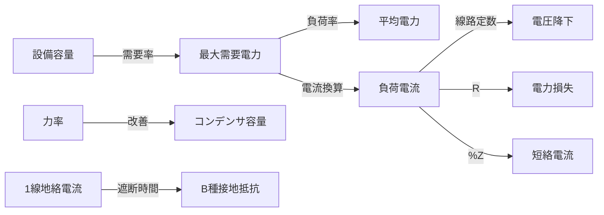

# B問題メソッド化 — 計算パターンの体系的攻略

> B問題の8つの計算パターンを**Python風メソッドシグネチャ**で定義し、再現可能な解法を構築する

---

## なぜメソッド化するのか

B問題は配点が大きく（各問10点×2小問）、合否を分ける最重要パート。
計算パターンを「メソッド（関数）」として定義し、入力→処理→出力を明確にすることで、
試験本番で**迷わず解ける再現性**を獲得する。

---

## 8つの計算パターン

### Pattern 1: 需要率・負荷率・不等率

```python
def demand_factor(max_demand: float, total_capacity: float) -> float:
    """需要率 = 最大需要電力 / 設備容量の合計"""
    return max_demand / total_capacity

def load_factor(avg_power: float, max_demand: float) -> float:
    """負荷率 = 平均電力 / 最大需要電力"""
    return avg_power / max_demand

def diversity_factor(sum_of_max: float, combined_max: float) -> float:
    """不等率 = 各負荷の最大需要電力の和 / 合成最大需要電力"""
    return sum_of_max / combined_max
```

**因果関係**: 設備容量 → 需要率で最大需要電力を推定 → 負荷率で平均電力を推定

| 入力 | 処理 | 出力 |
|------|------|------|
| 設備容量, 需要率 | 乗算 | 最大需要電力 |
| 最大需要電力, 負荷率 | 乗算 | 平均電力 |

---

### Pattern 2: 電圧降下

```python
def voltage_drop_single(r: float, x: float, I: float, cos_theta: float, sin_theta: float) -> float:
    """単相2線式の電圧降下"""
    return 2 * I * (r * cos_theta + x * sin_theta)

def voltage_drop_three(r: float, x: float, I: float, cos_theta: float, sin_theta: float) -> float:
    """三相3線式の電圧降下"""
    return sqrt(3) * I * (r * cos_theta + x * sin_theta)
```

**因果関係**: 線路定数(R,X) + 負荷電流(I) + 力率(cos) → 電圧降下

---

### Pattern 3: 短絡電流

```python
def short_circuit_current(V: float, Z_percent: float, capacity: float) -> float:
    """短絡電流の計算"""
    I_rated = capacity / (sqrt(3) * V)
    return I_rated * (100 / Z_percent)
```

**因果関係**: 変圧器容量 + %インピーダンス → 定格電流 → 短絡電流

---

### Pattern 4: B種接地抵抗

```python
def b_type_grounding(Ig: float, time_limit: float = 1.0) -> float:
    """B種接地抵抗値の計算"""
    if time_limit <= 1.0:
        return 150 / Ig
    elif time_limit <= 2.0:
        return 300 / Ig
    else:
        return 600 / Ig
```

**因果関係**: 1線地絡電流(Ig) + 遮断時間 → 必要接地抵抗値

---

### Pattern 5: 電力損失

```python
def power_loss(I: float, R: float, phase: str = "three") -> float:
    """電力損失の計算"""
    if phase == "single_2wire":
        return 2 * I**2 * R
    elif phase == "single_3wire":
        return 2 * I**2 * R  # 平衡時
    elif phase == "three":
        return 3 * I**2 * R
```

---

### Pattern 6: 力率改善

```python
def capacitor_for_pf(P: float, cos1: float, cos2: float) -> float:
    """力率改善に必要なコンデンサ容量"""
    sin1 = sqrt(1 - cos1**2)
    sin2 = sqrt(1 - cos2**2)
    tan1 = sin1 / cos1
    tan2 = sin2 / cos2
    return P * (tan1 - tan2)
```

**因果関係**: 有効電力(P) + 改善前力率 + 目標力率 → 必要コンデンサ容量[kvar]

---

### Pattern 7: 変圧器の効率

```python
def transformer_efficiency(P_out: float, P_iron: float, P_copper: float, load_ratio: float = 1.0) -> float:
    """変圧器の効率"""
    P_loss = P_iron + (load_ratio**2) * P_copper
    return P_out / (P_out + P_loss) * 100
```

---

### Pattern 8: 支線の強度計算

```python
def stay_wire_tension(wind_load: float, span: float, height: float, angle: float) -> float:
    """支線に加わる張力"""
    horizontal_force = wind_load * span
    return horizontal_force * height / (height * cos(radians(angle)))
```

---

!!! info "Pattern 8 以外の計算（水力発電など）"
    水力発電（流込式・調整池・揚水）は **9.8QHη + 期間積算** の単純構造で関数化する意味が薄いため、本ページにはパターン化しない。R07上期問11ほか過去5回以上の出題実績あり、解法は [B問題計算テンプレート集 §7 水力発電](../reference/b-mondai-template.md) を直接参照のこと。

---

## 因果関係モデル（全体マップ）



---

## 演習チェックリスト

| パターン | 過去問演習数 | 目標 | 状態 |
|---------|------------|------|------|
| 需要率・負荷率 | 0/3 | 3問 | 未着手 |
| 電圧降下 | 0/3 | 3問 | 未着手 |
| 短絡電流 | 0/3 | 3問 | 未着手 |
| B種接地抵抗 | 0/3 | 3問 | 未着手 |
| 電力損失 | 0/3 | 3問 | 未着手 |
| 力率改善 | 0/3 | 3問 | 未着手 |
| 変圧器効率 | 0/2 | 2問 | 未着手 |
| 支線強度 | 0/2 | 2問 | 未着手 |

---

## 関連ページ

- [攻略戦略トップ](index.md)
- [B問題計算テンプレート集](../reference/b-mondai-template.md)
- [需要率・負荷率・不等率](../themes/juyoritsu-fukaritsu.md)
