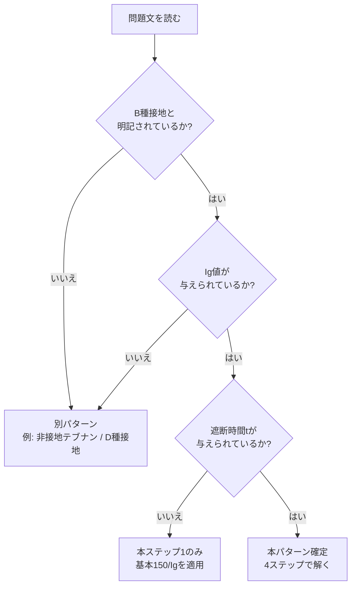
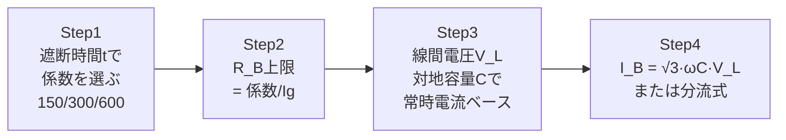

# B種接地150/Ig パターン — B問題で「混触遮断時間×1線地絡電流」を見たら即この型

> 混触防止のB種接地工事の抵抗値上限を、変圧器高圧側1線地絡電流 Ig と自動遮断時間で **3段階に緩和** する規定を題材にしたB問題は、年度を超えて **同じ4ステップ** で解ける。R05上問12 をフラッグシップに、B種接地150/Ig 計算パターンを1枚で固める。

**重要度**: **A**（B問題の頻出計算パターン・解釈第17条の3段階緩和規定が必須暗記）

---

## 0. 棲み分けマップ — ほかページとの境界

| ページ | 役割 | 本ページとの違い |
|--------|------|-----------------|
| [R05上問12 個別解説](../kakomon/R05-up-12.md) | フラッグシップ例題の **完全詳細** | 本ページのセクション3でリンク参照。詳細式・フェーザ図・対比SVGはあちらが本体 |
| [非接地テブナンパターン](hiseichi-thevenin-pattern.md) | 非接地3φ3W＋対地容量＋絶縁低下の **別パターン** | 「B種接地工事の抵抗値」ではなく「中性点電位と地絡電流」を求める計算 |
| [接地工事比較](../reference/grounding-comparison.md) | A〜D種の物理量比較・本体規定 | 接地工事の **種類選定**。本ページは **計算解法** |
| [絶縁テーマ](../themes/zetsuen.md) | 解釈第14条・省令第58条（絶縁抵抗値） | B種は **接地** 側。「絶縁が破れたあと」の最後の砦 |
| [B問題得点戦略](b-mondai-strategy.md) | 時間配分・捨て問・部分点全体戦略 | パターン横断のメタ戦略。本ページは **1パターンの完全攻略** |

!!! tip "使い分けの目安"
    試験本番で問題文に「**B種接地**」「**自動遮断装置**（動作時間）」「**1線地絡電流 Ig**」のうち2つ以上が同時に現れたら、本ページの4ステップを反射的に取り出す。

---

## 1. パターン認識 — これは「B種接地150/Ig」だ

### 1-1. トリガーワード5つ

設問文に以下のうち **3つ以上** が現れたら、ほぼ確実にこの型。

| # | トリガーワード | 役割 |
|---|---------------|------|
| ① | B種接地工事 | 解釈第17条の本体規定 |
| ② | 高圧側1線地絡電流 Ig [A] | 緩和ルールの分母 |
| ③ | 自動遮断装置の動作時間 t [秒] | 緩和ルールの倍率分岐 |
| ④ | 対地静電容量C（任意・常時電流計算用） | 小問(b)で登場することが多い |
| ⑤ | 線間電圧 V_L [V]（低圧側） | 常時電流計算で必要 |

### 1-2. 認識フローチャート

### 1-3. 用語・記号対応表

| 記号 | 意味 | よくある別表記 |
|------|------|---------------|
| `Ig` | 高圧側1線地絡電流 [A] | I_g, Ig |
| `t` | 混触時の自動遮断時間 [秒] | t_o, T |
| `R_B` | B種接地抵抗の上限値 [Ω] | RB |
| `V_L` | 低圧側線間電圧 [V] | V, V_2 |
| `C` | **1相あたり** の対地静電容量 [F] | Co, Cg |
| `I_B` | R_B に常時流れる電流 [A or mA] | IB |

---

## 2. 万能テンプレ — 4ステップで解ける

### 2-1. ステップ概要

### 2-2. 各ステップの中身

#### Step 1 — 遮断時間で「係数」を3段階分岐

解釈第17条はB種接地抵抗の上限を **遮断時間で3段階** に緩和する。

| 自動遮断装置の動作時間 | 係数 | B種接地抵抗の上限 | 倍率 |
|----------------------|------|-----------------|------|
| なし／**2秒超** | 150 | **150 / Ig** Ω | ×1（基本） |
| **1秒を超え2秒以下** | 300 | **300 / Ig** Ω | ×2（緩和） |
| **1秒以下** | 600 | **600 / Ig** Ω | ×4（強緩和） |

> **核心**：遮断が速ければ、混触しても短時間で切れるから、抵抗が高めでも危険時間が短い。だから **速い遮断＝抵抗を緩めてよい**。

#### Step 2 — Ig で割って R_B 上限を出す

$$
R_B \leq \frac{係数}{I_g}
$$

#### Step 3 — 常時電流の電源（対地容量経由）

低圧側がB種接地された1端子経由で大地に流れる常時電流は、**対地容量Cと線間電圧V_L** が決める。

3φ3W で B種が1端子に取り付くと、他の2端子（A相・C相）の対地電圧は **線間電圧V_L** になり、その2本の対地容量電流が R_B を経由して循環する。

#### Step 4 — I_B を求める

R_B に常時流れる電流（容量電流の合成）：

$$
I_B = \sqrt{3} \cdot \omega C \cdot V_L
$$

または、分流計算で R_B 経由とその他経由の比から求める変種もあり（R05下問11 系）。

### 2-3. 数値検証PASS（次元・極限）

| 検査項目 | 計算 | 期待値 | 判定 |
|---------|------|--------|------|
| `R_B` の次元 | 無次元 / [A] = [Ω] | [Ω] | PASS |
| `I_B` の次元 | 無単位×[F/s]×[V] = [A] | [A] | PASS |
| `t = 0.5s` （1秒以下） | 600/Ig 適用 | 例: Ig=5A → R_B ≤ 120Ω | PASS |
| `t = 1.3s` （1〜2秒） | 300/Ig 適用 | 例: Ig=5A → R_B ≤ 60Ω | PASS |
| `t = 3s` （2秒超） | 150/Ig 適用 | 例: Ig=5A → R_B ≤ 30Ω | PASS |
| 単位 mA | A単位の結果に ×1000 | 失念で1000倍差 | 注意 |

---

## 3. フラッグシップ例題 — 令和5年度上期 法規 問12

### 3-1. 問題の骨格

| 項目 | 内容 |
|------|------|
| 出題年度 | 令和5年度上期（2023年8月） |
| 問番号 | 問12（B問題・配点14点） |
| 形式 | 計算 2小問（a）（b）／5択 |
| 関連条文 | 解釈第17条（B種接地工事の本体）／解釈第18条（特例） |
| 一次照合 | [yaku-tik R5上問12](https://yaku-tik.com/denken/r5f-h12/) |
| 詳細解説 | **→ [R05-up-12 個別解説ページ](../kakomon/R05-up-12.md)（完全版）** |

### 3-2. 与条件（要約）

- 低圧側線間電圧 V_L = 200 [V]、周波数 f = 50 [Hz]
- 1相あたり対地静電容量 C = 0.1 [μF]
- 高圧側1線地絡電流 Ig = 5 [A]（与えられる値）
- 混触時の自動遮断時間 t = 1.3 [秒]
- (b) 現在の接地抵抗 R_B = 10 [Ω]

### 3-3. 4ステップ適用

#### Step 1 — 遮断時間 t=1.3 [秒] は「1秒超〜2秒以下」 → 係数 **300**

#### Step 2 — R_B 上限

$$
R_B \leq \frac{300}{I_g} = \frac{300}{5} = \boxed{60 \text{ Ω}}
$$

→ **(a) の答え = 60 Ω（選択肢4）**

#### Step 3 — 常時電流ベース（対地容量C・線間V_L）

3φ3W のB種接地は1端子に取り付くため、他2端子の対地電圧が線間V_L=200V になり、容量電流の合成が R_B を流れる。

#### Step 4 — I_B 計算

$$
I_B = \sqrt{3} \cdot \omega C \cdot V_L = \sqrt{3} \times 2\pi \times 50 \times 0.1 \times 10^{-6} \times 200 \approx 10.88 \text{ mA} \approx \boxed{11 \text{ mA}}
$$

→ **(b) の答え = 11 mA（選択肢1）**

### 3-4. 視覚比較：中性点接地 vs 1端子接地（概念図）

<svg viewBox="0 0 720 300" xmlns="http://www.w3.org/2000/svg" style="max-width:100%;height:auto;background:#fafafa;border:1px solid #ddd;border-radius:6px">
  <text x="360" y="22" font-size="14" font-weight="bold" text-anchor="middle" fill="#333">図1：B種接地は1端子につく → 平衡が崩れ I_B が流れる</text>
  <!-- LEFT: 仮想中性点接地 -->
  <text x="170" y="50" font-size="13" font-weight="bold" text-anchor="middle" fill="#1976d2">① 仮想中性点接地（理想）</text>
  <line x1="60" y1="80" x2="280" y2="80" stroke="#333" stroke-width="2"/>
  <line x1="60" y1="110" x2="280" y2="110" stroke="#333" stroke-width="2"/>
  <line x1="60" y1="140" x2="280" y2="140" stroke="#333" stroke-width="2"/>
  <text x="40" y="84" font-size="11" fill="#333">A</text>
  <text x="40" y="114" font-size="11" fill="#333">B</text>
  <text x="40" y="144" font-size="11" fill="#333">C</text>
  <line x1="100" y1="80" x2="100" y2="200" stroke="#1976d2" stroke-width="1.5"/>
  <line x1="160" y1="110" x2="160" y2="200" stroke="#1976d2" stroke-width="1.5"/>
  <line x1="220" y1="140" x2="220" y2="200" stroke="#1976d2" stroke-width="1.5"/>
  <line x1="100" y1="240" x2="220" y2="240" stroke="#333" stroke-width="1.5"/>
  <line x1="160" y1="240" x2="160" y2="265" stroke="#333" stroke-width="1.5"/>
  <rect x="148" y="265" width="24" height="20" fill="none" stroke="#d32f2f" stroke-width="1.5"/>
  <text x="178" y="278" font-size="10" fill="#d32f2f">R_B</text>
  <line x1="100" y1="200" x2="100" y2="240" stroke="#1976d2" stroke-width="1.5"/>
  <line x1="160" y1="200" x2="160" y2="240" stroke="#1976d2" stroke-width="1.5"/>
  <line x1="220" y1="200" x2="220" y2="240" stroke="#1976d2" stroke-width="1.5"/>
  <text x="170" y="180" font-size="11" font-weight="bold" fill="#2e7d32">I_a+I_b+I_c=0</text>
  <text x="170" y="295" font-size="12" font-weight="bold" fill="#2e7d32">→ I_B = 0</text>
  <!-- Divider -->
  <line x1="370" y1="40" x2="370" y2="290" stroke="#999" stroke-width="1" stroke-dasharray="4,3"/>
  <!-- RIGHT: 1端子接地 -->
  <text x="540" y="50" font-size="13" font-weight="bold" text-anchor="middle" fill="#d32f2f">② 1端子接地（本問・3φ3W）</text>
  <line x1="420" y1="80" x2="650" y2="80" stroke="#333" stroke-width="2"/>
  <line x1="420" y1="110" x2="650" y2="110" stroke="#333" stroke-width="2"/>
  <line x1="420" y1="140" x2="650" y2="140" stroke="#333" stroke-width="2"/>
  <text x="400" y="84" font-size="11" fill="#333">A</text>
  <text x="395" y="114" font-size="11" font-weight="bold" fill="#d32f2f">B(接地)</text>
  <text x="400" y="144" font-size="11" fill="#333">C</text>
  <line x1="460" y1="80" x2="460" y2="200" stroke="#1976d2" stroke-width="1.5"/>
  <line x1="600" y1="140" x2="600" y2="200" stroke="#d32f2f" stroke-width="1.5"/>
  <text x="465" y="225" font-size="10" fill="#1976d2">I_a (V_L)</text>
  <text x="605" y="225" font-size="10" fill="#d32f2f">I_c (V_L)</text>
  <line x1="530" y1="110" x2="530" y2="265" stroke="#d32f2f" stroke-width="2"/>
  <rect x="518" y="265" width="24" height="20" fill="none" stroke="#d32f2f" stroke-width="1.5"/>
  <text x="548" y="278" font-size="10" fill="#d32f2f">R_B</text>
  <line x1="460" y1="240" x2="600" y2="240" stroke="#333" stroke-width="1.5"/>
  <line x1="460" y1="200" x2="460" y2="240" stroke="#1976d2" stroke-width="1.5"/>
  <line x1="600" y1="200" x2="600" y2="240" stroke="#d32f2f" stroke-width="1.5"/>
  <text x="540" y="180" font-size="11" font-weight="bold" fill="#2e7d32">I_a+I_c の合成</text>
  <text x="540" y="295" font-size="12" font-weight="bold" fill="#2e7d32">→ I_B = √3·ωC·V_L</text>
</svg>

詳細フェーザ図・等価回路は **[R05-up-12 個別解説ページ](../kakomon/R05-up-12.md)** を参照。

---

## 4. 類似パターン横展開表

| 過去問 | 与条件の違い | 適用ステップ | ひっかけ要素 | 答えの方針 |
|--------|-------------|-------------|-------------|-----------|
| **R05上 問12**（本ページ セクション3） | 線間200V・遮断1.3秒・Ig=5A | 4ステップそのまま | 1.3秒の係数判定／I_B 単位mA／√3 忘れ | R_B=60Ω / I_B=11mA |
| R06上 問13 | B種＋D種の組合せ計算 | Step1〜2＋D種規定追加 | B種/D種の規定値混同／合成抵抗計算 | 解釈第17条（D種：100Ω・0.5秒なら500Ω） |
| R06下 問12 | B種抵抗値・常時電流 | 4ステップそのまま | 遮断時間の3段階分岐ミス | R05上問12 とほぼ同型 |
| R01 問13 | B種接地工事の抵抗値計算 | Step1〜2 のみ | 係数150/300/600の選定 | 解釈第17条の本体 |
| H24 問10 | B種接地抵抗値（古い年度） | Step1〜2 のみ | 同上 | 解釈第17条の本体 |

!!! tip "本パターンが効くのは「B種接地」が明示されているときだけ"
    「非接地」「対地静電容量から地絡電流」と書かれていたら [非接地テブナンパターン](hiseichi-thevenin-pattern.md) を使う。混同しないこと。

---

## 5. ひっかけポイント総まとめ

| 重大度 | ひっかけ | 正しい理解 |
|--------|---------|-----------|
| 🔴 致命 | 「1.3秒は1秒くらい」と感覚で 600/Ig を使う | t > 1秒 なら確実に **300/Ig**。600/Ig は **t ≤ 1秒の厳格条件** |
| 🔴 致命 | I_B を 単純に ωC·V_L で計算（√3 忘れ） | 1端子接地で他2端子の対地電圧が線間V_L → 2本の容量電流が60°のなす角で合成 → **√3 が出る** |
| 🟡 注意 | B種接地の係数を「150」固定で覚える | **150/300/600** の3段階。遮断時間ごとに切り替わる |
| 🟡 注意 | Ig を自分で計算しに行く | Igは **問題文で与えられる値**（高圧側1線地絡電流） |
| 🟢 軽度 | 単位 mA / A の取り違え | (b) でmAが問われるパターンが多い。最後に ×1000 を必ず確認 |
| 🟢 軽度 | D種接地と混同 | D種は **100Ω**（0.5秒以下なら500Ω）。B種は **150/Ig** 系 |

---

## 6. 関連条文・理論ページとの接続

### 6-1. 法令側

- [解釈第17条](../articles/kaishaku/17.md) — B種接地工事の本体規定（150/300/600の3段階）
- 解釈第18条 — B種接地工事の特例（共用接地など）
- 省令第10条 — 電気設備の接地（原則規定）

### 6-2. 理論側

- [三相交流理論](../theory/sansou-kouryuu.md) — 線間電圧と相電圧の関係、平衡条件、容量電流の合成
- [交流回路](../theory/ac-circuit.md) — フェーザ図とインピーダンスの合成

### 6-3. 戦略側

- [B問題得点戦略](b-mondai-strategy.md) — B問題全体の時間配分と捨て問判断
- [接地工事比較](../reference/grounding-comparison.md) — A〜D種の物理量比較
- [非接地テブナンパターン](hiseichi-thevenin-pattern.md) — 「非接地＋対地容量」の別パターン

### 6-4. 出題実績（本パターン適用問題）

| 年度 | 問 | 形式 | 何が問われたか |
|------|-----|------|--------------|
| **R05上** | **問12** | **計算（B問題）** | **本ページ セクション3 で要約＋ [個別解説](../kakomon/R05-up-12.md)** |
| R06上 | 問13 | 計算（B問題） | B種・D種接地抵抗値の組合せ計算 |
| R06下 | 問12 | 計算（B問題） | B種抵抗値及び常時電流（R05上問12 と同型） |
| R01 | 問13 | 計算（B問題） | B種接地工事の抵抗値計算 |
| H24 | 問10 | 計算（B問題） | B種接地抵抗値（基本問題） |

→ 出題頻度：**:star::star::star::star::star:**（B問題で5回以上・最頻出パターン）

---

## 7. 典拠・更新履歴

### 一次ソース

- yaku-tik：[https://yaku-tik.com/denken/r5f-h12/](https://yaku-tik.com/denken/r5f-h12/)（令和5年上期 法規 問12）
- eGov：電気設備技術基準の解釈 第17条・第18条

### 監修プロセス

| 検査項目 | 状態 |
|---------|------|
| 一次照合（yaku-tik / R05-up-12.md と整合確認） | ✅ 2026-05-16 |
| 数値検証PASS（次元・遮断時間3段階） | ✅ セクション 2-3 参照 |
| wiki_check.py CI-clean | ✅ 実行確認 |
| AI社員3者諮問（ホリエモン案GO・型確立フェーズ） | ✅ 第2号 hiseichi-thevenin で型確定→第3号として量産 |

### バージョン履歴

| 版 | 日付 | 変更内容 |
|----|------|----------|
| v1.0 | 2026-05-16 | 新規作成。R05上問12 をフラッグシップ例題として4ステップテンプレを確立 |

---

*最終確認: 2026-05-16 | ステータス: v1.0 完全版 | [バージョニング基準](../reference/versioning.md)*
