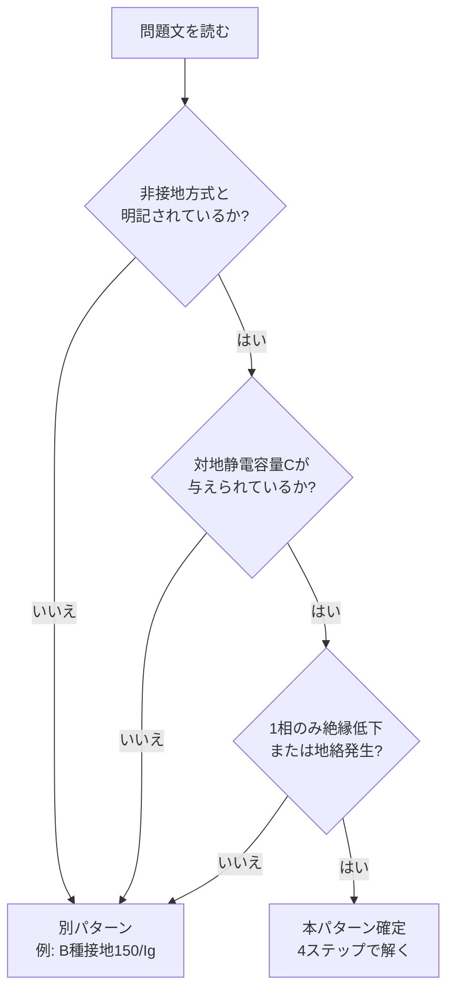
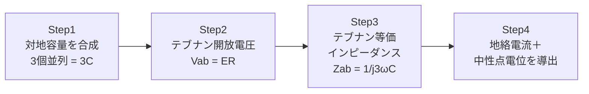

# 非接地テブナンパターン — B問題で「対地容量＋絶縁低下」を見たら即この型

> 対称三相3線式・非接地方式の高圧電路で、ある相の絶縁抵抗が低下したときの **地絡電流** と **中性点電位** を求める B問題は、すべて **同じ4ステップ** で解ける。年度を超えて再利用できる「型」を1枚で固める。

**重要度**: **A**（B問題の頻出計算パターン・テブナンの定理＋対地静電容量の合成が必須）

---

## 0. 棲み分けマップ — ほかページとの境界

| ページ | 役割 | 本ページとの違い |
|--------|------|-----------------|
| [絶縁テーマ](../themes/zetsuen.md) | 条文ベース（電路の絶縁／高圧・低圧の絶縁性能） | 「条文・基準値の暗記」が中心。本ページは「式の組み立て」 |
| [接地工事比較](../reference/grounding-comparison.md) | A〜D種の物理量比較・本体規定 | 接地工事の **種類選定**。本ページは **計算解法** |
| [B問題得点戦略](b-mondai-strategy.md) | 時間配分・捨て問・部分点全体戦略 | パターン横断のメタ戦略。本ページは **1パターンの完全攻略** |
| [三相交流理論](../theory/sansou-kouryuu.md) | 平衡条件・フェーザ・線間/相電圧 | 理論。本ページは **法規B問題での適用** |
| [解釈第13条](../articles/kaishaku/13.md) | 電路は大地から絶縁する（原則） | 条文原文（背景）。本ページは **絶縁低下時の計算** |
| [解釈第15条](../articles/kaishaku/15.md) | 高圧・特別高圧の電路の絶縁性能（試験電圧） | 条文原文（高圧電路の絶縁基準）。本ページは **絶縁低下時の地絡電流計算** |
| [解釈第17条](../articles/kaishaku/17.md) | B種接地工事（150/Ig 系） | 接地系の **対立パターン** 条文。本ページは **非接地系の計算** |

!!! tip "使い分けの目安"
    試験本番で問題文に「**非接地方式**」「**対地静電容量C**」「**絶縁抵抗が低下**」のうち2つ以上が同時に現れたら、本ページの4ステップを反射的に取り出す。

---

## 1. パターン認識 — これは「非接地テブナン」だ

### 1-1. トリガーワード5つ

設問文に以下のうち **3つ以上** が現れたら、ほぼ確実にこの型。

| # | トリガーワード | 役割 |
|---|---------------|------|
| ① | 対称三相3線式・非接地方式 | 中性点がフリー（=テブナンの基準） |
| ② | 対地静電容量C[F]（各相） | 対地への漏れ経路 |
| ③ | R相（または1相）の絶縁抵抗が **RG**[Ω]に低下 | 故障の挿入位置 |
| ④ | 地絡電流 IG | 求める量A |
| ⑤ | 中性点電位 VO | 求める量B |

### 1-2. 認識フローチャート

### 1-3. 用語・記号対応表

| 記号 | 意味 | よくある別表記 |
|------|------|---------------|
| `ER` | R相の電源電圧（相電圧E） | E, V_p, E_p |
| `ω` | 角周波数（=2πf） | omega |
| `C` | **1相あたり** の対地静電容量[F] | Co, Cg |
| `RG` | 低下した絶縁抵抗値[Ω] | Rg, R_G |
| `IG` | 地絡電流（=I_AG） | I_g, Ig |
| `VO` | 変圧器中性点O点の電位 | V_0, Vn |

---

## 2. 万能テンプレ — 4ステップで解ける

### 2-1. ステップ概要

### 2-2. 各ステップの中身

#### Step 1 — 対地容量3個を「RGから見て」並列合成

RG（地絡点 a-b 間）から回路を見ると、テブナン等価インピーダンスの算出では電源を短絡する。電源を短絡すると、3相の対地容量Cは **a点（R相導体）と大地（b点）の間に、3本すべて並列に見える**。**直列ではない**。

$$
C_{total} = C + C + C = 3C \quad \Rightarrow \quad Z_C = \frac{1}{j \cdot 3\omega C}
$$

<svg viewBox="0 0 760 320" xmlns="http://www.w3.org/2000/svg" style="max-width:100%;height:auto;background:#fafafa;border:1px solid #ddd;border-radius:6px">
  <text x="380" y="22" font-size="14" font-weight="bold" text-anchor="middle" fill="#333">図A：電源短絡 → 3個の対地容量Cが並列 → 合成3C</text>
  <!-- 左：元の三相非接地回路（電源短絡前） -->
  <text x="170" y="50" font-size="12" font-weight="bold" text-anchor="middle" fill="#1976d2">① 元の三相非接地回路</text>
  <!-- 中性点 O -->
  <circle cx="80" cy="170" r="5" fill="#1976d2"/>
  <text x="60" y="165" font-size="10" fill="#1976d2">O</text>
  <!-- 3相電源 -->
  <line x1="80" y1="170" x2="140" y2="110" stroke="#333" stroke-width="2"/>
  <line x1="80" y1="170" x2="140" y2="170" stroke="#333" stroke-width="2"/>
  <line x1="80" y1="170" x2="140" y2="230" stroke="#333" stroke-width="2"/>
  <text x="100" y="135" font-size="10" fill="#d32f2f">E_R</text>
  <text x="100" y="165" font-size="10" fill="#388e3c">E_S</text>
  <text x="100" y="248" font-size="10" fill="#1976d2">E_T</text>
  <!-- 3相線 -->
  <line x1="140" y1="110" x2="290" y2="110" stroke="#d32f2f" stroke-width="2"/>
  <line x1="140" y1="170" x2="290" y2="170" stroke="#388e3c" stroke-width="2"/>
  <line x1="140" y1="230" x2="290" y2="230" stroke="#1976d2" stroke-width="2"/>
  <text x="295" y="113" font-size="10" font-weight="bold" fill="#d32f2f">R(a)</text>
  <text x="295" y="173" font-size="10" font-weight="bold" fill="#388e3c">S</text>
  <text x="295" y="233" font-size="10" font-weight="bold" fill="#1976d2">T</text>
  <!-- 対地容量C×3 -->
  <line x1="220" y1="110" x2="220" y2="135" stroke="#666" stroke-width="1.5"/>
  <line x1="212" y1="135" x2="228" y2="135" stroke="#666" stroke-width="2"/>
  <line x1="212" y1="143" x2="228" y2="143" stroke="#666" stroke-width="2"/>
  <line x1="220" y1="143" x2="220" y2="280" stroke="#666" stroke-width="1.5" stroke-dasharray="3,3"/>
  <text x="230" y="143" font-size="10" fill="#666">C</text>
  <line x1="240" y1="170" x2="240" y2="195" stroke="#666" stroke-width="1.5"/>
  <line x1="232" y1="195" x2="248" y2="195" stroke="#666" stroke-width="2"/>
  <line x1="232" y1="203" x2="248" y2="203" stroke="#666" stroke-width="2"/>
  <line x1="240" y1="203" x2="240" y2="280" stroke="#666" stroke-width="1.5" stroke-dasharray="3,3"/>
  <text x="250" y="203" font-size="10" fill="#666">C</text>
  <line x1="260" y1="230" x2="260" y2="245" stroke="#666" stroke-width="1.5"/>
  <line x1="252" y1="245" x2="268" y2="245" stroke="#666" stroke-width="2"/>
  <line x1="252" y1="253" x2="268" y2="253" stroke="#666" stroke-width="2"/>
  <line x1="260" y1="253" x2="260" y2="280" stroke="#666" stroke-width="1.5" stroke-dasharray="3,3"/>
  <text x="270" y="253" font-size="10" fill="#666">C</text>
  <!-- 大地 -->
  <line x1="80" y1="285" x2="320" y2="285" stroke="#333" stroke-width="2"/>
  <text x="200" y="305" font-size="10" fill="#666">大地（b点）</text>
  <!-- 矢印（→） -->
  <line x1="335" y1="170" x2="425" y2="170" stroke="#333" stroke-width="2"/>
  <polygon points="425,170 415,164 415,176" fill="#333"/>
  <text x="380" y="158" font-size="11" font-weight="bold" text-anchor="middle" fill="#388e3c">電源短絡</text>
  <text x="380" y="188" font-size="10" text-anchor="middle" fill="#666">（テブナン Z 算出）</text>
  <!-- 右：a-b間から見たC×3並列 -->
  <text x="580" y="50" font-size="12" font-weight="bold" text-anchor="middle" fill="#d32f2f">② a-b間：C×3 並列 → 3C</text>
  <!-- a点（上） -->
  <text x="455" y="95" font-size="11" font-weight="bold" fill="#d32f2f">a (R相)</text>
  <line x1="455" y1="100" x2="700" y2="100" stroke="#d32f2f" stroke-width="2"/>
  <!-- C×3 並列 -->
  <line x1="490" y1="100" x2="490" y2="155" stroke="#666" stroke-width="1.5"/>
  <line x1="478" y1="155" x2="502" y2="155" stroke="#666" stroke-width="2"/>
  <line x1="478" y1="165" x2="502" y2="165" stroke="#666" stroke-width="2"/>
  <line x1="490" y1="165" x2="490" y2="220" stroke="#666" stroke-width="1.5"/>
  <text x="475" y="195" font-size="10" fill="#666">C</text>
  <line x1="580" y1="100" x2="580" y2="155" stroke="#666" stroke-width="1.5"/>
  <line x1="568" y1="155" x2="592" y2="155" stroke="#666" stroke-width="2"/>
  <line x1="568" y1="165" x2="592" y2="165" stroke="#666" stroke-width="2"/>
  <line x1="580" y1="165" x2="580" y2="220" stroke="#666" stroke-width="1.5"/>
  <text x="565" y="195" font-size="10" fill="#666">C</text>
  <line x1="670" y1="100" x2="670" y2="155" stroke="#666" stroke-width="1.5"/>
  <line x1="658" y1="155" x2="682" y2="155" stroke="#666" stroke-width="2"/>
  <line x1="658" y1="165" x2="682" y2="165" stroke="#666" stroke-width="2"/>
  <line x1="670" y1="165" x2="670" y2="220" stroke="#666" stroke-width="1.5"/>
  <text x="655" y="195" font-size="10" fill="#666">C</text>
  <!-- b点（下：大地） -->
  <line x1="455" y1="220" x2="700" y2="220" stroke="#333" stroke-width="2"/>
  <text x="455" y="240" font-size="11" font-weight="bold" fill="#666">b (大地)</text>
  <!-- 結論 -->
  <text x="580" y="270" font-size="13" font-weight="bold" text-anchor="middle" fill="#2e7d32">合成 = 3C → Z_ab = 1/(j·3ωC)</text>
  <text x="580" y="290" font-size="10" text-anchor="middle" fill="#666">（電源短絡で S相・T相も a と同電位に落ちるので C は3本とも a-b 間に並列）</text>
</svg>

#### Step 2 — RGを取り外したときの開放電圧（テブナンVth）

健全時（RG=∞）は対称3相平衡。a点（R相の対地点）b点（大地）間の電圧は **R相の相電圧E_R そのもの**。

$$
V_{ab} = E_R
$$

#### Step 3 — RGから見たテブナン等価インピーダンス

電源を短絡（=R相とS相とT相をすべて中性点に短絡）すると、a-b間には **3個の対地容量Cが並列** に見える。

$$
Z_{ab} = \frac{1}{j \cdot 3\omega C}
$$

#### Step 4 — 地絡電流と中性点電位

RGをテブナン回路に接続して直列回路として解く。

$$
I_G = \frac{V_{ab}}{Z_{ab} + R_G} = \frac{E_R}{\dfrac{1}{j3\omega C} + R_G} = \frac{j 3\omega C \cdot E_R}{1 + j 3\omega C \cdot R_G}
$$

中性点電位はキルヒホッフ第2法則（中性点O→R相電源→a点→RG→大地→中性点O への閉路）から：

$$
V_O = -E_R + R_G \cdot I_G = -E_R \cdot \frac{1}{1 + j 3\omega C \cdot R_G}
$$

### 2-3. 数値検証PASS（次元・極限）

| 検査項目 | 計算 | 期待値 | 判定 |
|---------|------|--------|------|
| `IG` の次元 | [V] / [Ω] = [A] | [A] | PASS |
| `VO` の次元 | [V] × 無次元 = [V] | [V] | PASS |
| `RG → 0`（完全地絡） | `IG → j3ωC·ER`（= 充電電流の合計）／`VO → 0`（中性点が大地と同電位） | 物理整合 | PASS |
| `RG → ∞`（健全状態） | `IG → 0`（地絡なし）／`VO → -ER · (1/∞) → 0`（厳密には極限0、ただし `j3ωC·RG` 項が支配的なら -ER/(j3ωC·RG)）| 健全時の中性点フリー | PASS |
| `C → 0`（対地容量なし） | `IG → 0`（電流路なし）／`VO → -ER`（R相電源が直接中性点を引き下げる） | 単相等価で整合 | PASS |

---

## 3. フラッグシップ例題 — 令和4年度下期 法規 問13

### 3-1. 問題の骨格

| 項目 | 内容 |
|------|------|
| 出題年度 | 令和4年度下期（2022年） |
| 問番号 | 問13（B問題・配点14点） |
| 形式 | 計算 2小問（a）（b）／5択 |
| 関連条文 | 解釈第13条（電路の絶縁／原則）・解釈第15条（高圧電路の絶縁性能）／対比：解釈第17条（B種接地） |
| 一次出典 | [一般財団法人 電気技術者試験センター 過去問題（令和4年度下期 法規 問13）](https://www.shiken.or.jp/answer/) |
| 解説補助 | [yaku-tik R4下問13](https://yaku-tik.com/denken/r4s-h13/) ／ [denken-ou houkir4-2-13](https://denken-ou.com/houkir4-2-13/) |
| 照合日 | 2026-05-16 |

!!! warning "条文の射程に注意（高圧 vs 低圧）"
    本問は **高圧電路の非接地方式・対地静電容量C・絶縁低下** をテブナンの定理で解く計算問題。**省令第58条・解釈第14条は低圧電路の絶縁抵抗値の規定** であり、本問の計算式の直接根拠ではない。背景条文として参照するのは **解釈第13条（電路の絶縁）** と **解釈第15条（高圧又は特別高圧の電路の絶縁性能）**。

### 3-2. 与条件と回路

- 対称三相3線式高圧電路
- 各相の相電圧 `ER`、角周波数 `ω`
- 変圧器中性点 O は **非接地方式**
- 各相の対地静電容量 `C`[F]
- R相のみ絶縁抵抗 `RG`[Ω] に低下（a点=R相導体、b点=大地）

<svg viewBox="0 0 720 320" xmlns="http://www.w3.org/2000/svg" style="max-width:100%;height:auto;background:#fafafa;border:1px solid #ddd;border-radius:6px">
  <text x="360" y="22" font-size="14" font-weight="bold" text-anchor="middle" fill="#333">図1：非接地3φ3W＋対地容量C×3＋RG（R相絶縁低下）</text>
  <!-- 変圧器中性点 O -->
  <circle cx="120" cy="160" r="6" fill="#1976d2"/>
  <text x="100" y="155" font-size="11" font-weight="bold" fill="#1976d2">O</text>
  <text x="55" y="180" font-size="10" fill="#666">非接地</text>
  <!-- 3相電源（中性点から3方向） -->
  <line x1="120" y1="160" x2="200" y2="90" stroke="#333" stroke-width="2"/>
  <line x1="120" y1="160" x2="200" y2="160" stroke="#333" stroke-width="2"/>
  <line x1="120" y1="160" x2="200" y2="230" stroke="#333" stroke-width="2"/>
  <text x="155" y="115" font-size="11" fill="#d32f2f">E_R</text>
  <text x="155" y="155" font-size="11" fill="#388e3c">E_S</text>
  <text x="155" y="248" font-size="11" fill="#1976d2">E_T</text>
  <!-- 3相線 -->
  <line x1="200" y1="90" x2="500" y2="90" stroke="#d32f2f" stroke-width="2"/>
  <line x1="200" y1="160" x2="500" y2="160" stroke="#388e3c" stroke-width="2"/>
  <line x1="200" y1="230" x2="500" y2="230" stroke="#1976d2" stroke-width="2"/>
  <text x="220" y="82" font-size="11" font-weight="bold" fill="#d32f2f">R相 (a点)</text>
  <text x="220" y="152" font-size="11" font-weight="bold" fill="#388e3c">S相</text>
  <text x="220" y="222" font-size="11" font-weight="bold" fill="#1976d2">T相</text>
  <!-- 対地容量3個 -->
  <line x1="380" y1="90" x2="380" y2="125" stroke="#666" stroke-width="1.5"/>
  <line x1="370" y1="125" x2="390" y2="125" stroke="#666" stroke-width="2"/>
  <line x1="370" y1="135" x2="390" y2="135" stroke="#666" stroke-width="2"/>
  <line x1="380" y1="135" x2="380" y2="265" stroke="#666" stroke-width="1.5" stroke-dasharray="3,3"/>
  <text x="392" y="135" font-size="10" fill="#666">C</text>
  <line x1="430" y1="160" x2="430" y2="195" stroke="#666" stroke-width="1.5"/>
  <line x1="420" y1="195" x2="440" y2="195" stroke="#666" stroke-width="2"/>
  <line x1="420" y1="205" x2="440" y2="205" stroke="#666" stroke-width="2"/>
  <line x1="430" y1="205" x2="430" y2="265" stroke="#666" stroke-width="1.5" stroke-dasharray="3,3"/>
  <text x="442" y="205" font-size="10" fill="#666">C</text>
  <line x1="480" y1="230" x2="480" y2="245" stroke="#666" stroke-width="1.5"/>
  <line x1="470" y1="245" x2="490" y2="245" stroke="#666" stroke-width="2"/>
  <line x1="470" y1="255" x2="490" y2="255" stroke="#666" stroke-width="2"/>
  <line x1="480" y1="255" x2="480" y2="280" stroke="#666" stroke-width="1.5" stroke-dasharray="3,3"/>
  <text x="492" y="255" font-size="10" fill="#666">C</text>
  <!-- 絶縁抵抗 RG（R相のみ） -->
  <rect x="540" y="78" width="44" height="24" fill="none" stroke="#d32f2f" stroke-width="2"/>
  <text x="562" y="95" font-size="11" font-weight="bold" text-anchor="middle" fill="#d32f2f">R_G</text>
  <line x1="500" y1="90" x2="540" y2="90" stroke="#d32f2f" stroke-width="2"/>
  <line x1="584" y1="90" x2="640" y2="90" stroke="#d32f2f" stroke-width="2"/>
  <line x1="640" y1="90" x2="640" y2="285" stroke="#d32f2f" stroke-width="2"/>
  <text x="600" y="80" font-size="10" font-weight="bold" fill="#d32f2f">I_G ↓</text>
  <!-- 大地 -->
  <line x1="120" y1="290" x2="660" y2="290" stroke="#333" stroke-width="2"/>
  <line x1="120" y1="290" x2="115" y2="298" stroke="#333" stroke-width="1.5"/>
  <line x1="140" y1="290" x2="135" y2="298" stroke="#333" stroke-width="1.5"/>
  <line x1="160" y1="290" x2="155" y2="298" stroke="#333" stroke-width="1.5"/>
  <line x1="180" y1="290" x2="175" y2="298" stroke="#333" stroke-width="1.5"/>
  <text x="200" y="305" font-size="11" fill="#666">大地（b点）</text>
</svg>

### 3-3. 設問

- **(a)** RG を取り外したa-b間：開放電圧 **Vab=（ア）**、a-b間インピーダンス **Zab=（イ）**、RG を接続したときの電流 **IG=（ウ）** を求めよ。
- **(b)** 中性点O点の電位 VO について、キルヒホッフから VO = **（エ）** + RG·IG = **（オ）** を求めよ。

### 3-4. 4ステップ適用

#### Step 1（イ）— 対地容量を合成

3本の対地容量Cが中性点から見て並列 → 合成は3C。

$$
Z_{ab} = \frac{1}{j \cdot 3\omega C} \quad \Rightarrow \quad \boxed{\text{（イ）}=\frac{1}{j 3\omega C}}
$$

#### Step 2（ア）— RG除去時の開放電圧

健全時は対称3相平衡で中性点O は対地基準で電位ゼロ。よってa点（R相導体）b点（大地）間は **R相の相電圧 ER**。

$$
\boxed{\text{（ア）}=E_R}
$$

#### Step 3（ウ）— テブナン直列回路で IG

$$
I_G = \frac{V_{ab}}{Z_{ab} + R_G} = \frac{E_R}{\dfrac{1}{j 3\omega C} + R_G} = \frac{j 3\omega C \cdot E_R}{1 + j 3\omega C \cdot R_G}
$$

$$
\boxed{\text{（ウ）}=\frac{j 3\omega C \cdot E_R}{1 + j 3\omega C \cdot R_G}}
$$

→ **(a) の正解は選択肢 (1)**

#### Step 4（エ）（オ）— 中性点電位

キルヒホッフ第2法則：O→電源（R相）→a→RG→大地→Oの閉路で、

$$
V_O = -E_R + R_G \cdot I_G
$$

$$
\boxed{\text{（エ）}=-E_R}
$$

(ウ)を代入：

$$
V_O = -E_R + R_G \cdot \frac{j 3\omega C \cdot E_R}{1 + j 3\omega C \cdot R_G} = -E_R \cdot \frac{1 + j 3\omega C R_G - j 3\omega C R_G}{1 + j 3\omega C R_G} = -\frac{E_R}{1 + j 3\omega C R_G}
$$

$$
\boxed{\text{（オ）}=-\frac{E_R}{1 + j 3\omega C R_G}}
$$

→ **(b) の正解は選択肢 (1)**

### 3-5. テブナン等価への変換図

<svg viewBox="0 0 720 280" xmlns="http://www.w3.org/2000/svg" style="max-width:100%;height:auto;background:#fafafa;border:1px solid #ddd;border-radius:6px">
  <text x="360" y="22" font-size="14" font-weight="bold" text-anchor="middle" fill="#333">図2：テブナン等価への変換（R_Gから見た回路）</text>
  <!-- 左：元の回路の要約 -->
  <text x="160" y="50" font-size="12" font-weight="bold" text-anchor="middle" fill="#1976d2">変換前：3相電源＋対地容量3個</text>
  <rect x="60" y="70" width="200" height="120" fill="none" stroke="#1976d2" stroke-width="1.5"/>
  <text x="160" y="110" font-size="11" text-anchor="middle" fill="#333">対称3相平衡</text>
  <text x="160" y="130" font-size="11" text-anchor="middle" fill="#333">各相 E_R, E_S, E_T</text>
  <text x="160" y="150" font-size="11" text-anchor="middle" fill="#333">対地容量 C × 3</text>
  <text x="160" y="175" font-size="11" font-weight="bold" text-anchor="middle" fill="#666">↓ R_Gの両端から見ると</text>
  <!-- 矢印 -->
  <line x1="280" y1="130" x2="420" y2="130" stroke="#333" stroke-width="2"/>
  <polygon points="420,130 410,124 410,136" fill="#333"/>
  <text x="350" y="120" font-size="11" font-weight="bold" text-anchor="middle" fill="#388e3c">テブナンの定理</text>
  <!-- 右：テブナン等価 -->
  <text x="560" y="50" font-size="12" font-weight="bold" text-anchor="middle" fill="#d32f2f">変換後：テブナン等価</text>
  <!-- 開放電圧 Vth = ER -->
  <circle cx="460" cy="120" r="14" fill="none" stroke="#d32f2f" stroke-width="2"/>
  <text x="460" y="125" font-size="11" font-weight="bold" text-anchor="middle" fill="#d32f2f">~</text>
  <text x="425" y="125" font-size="11" font-weight="bold" fill="#d32f2f">E_R</text>
  <line x1="460" y1="106" x2="460" y2="80" stroke="#333" stroke-width="2"/>
  <line x1="460" y1="80" x2="540" y2="80" stroke="#333" stroke-width="2"/>
  <!-- 等価インピーダンス Zab -->
  <rect x="540" y="68" width="50" height="24" fill="none" stroke="#388e3c" stroke-width="2"/>
  <text x="565" y="85" font-size="10" font-weight="bold" text-anchor="middle" fill="#388e3c">1/j3ωC</text>
  <line x1="590" y1="80" x2="660" y2="80" stroke="#333" stroke-width="2"/>
  <text x="650" y="72" font-size="11" font-weight="bold" fill="#666">a点</text>
  <!-- R_G接続点 -->
  <rect x="610" y="118" width="44" height="24" fill="none" stroke="#d32f2f" stroke-width="2"/>
  <text x="632" y="135" font-size="11" font-weight="bold" text-anchor="middle" fill="#d32f2f">R_G</text>
  <line x1="660" y1="80" x2="660" y2="118" stroke="#333" stroke-width="2"/>
  <line x1="610" y1="130" x2="600" y2="130" stroke="#d32f2f" stroke-width="2"/>
  <line x1="600" y1="130" x2="600" y2="200" stroke="#d32f2f" stroke-width="2"/>
  <line x1="654" y1="130" x2="700" y2="130" stroke="#d32f2f" stroke-width="2"/>
  <line x1="700" y1="130" x2="700" y2="200" stroke="#d32f2f" stroke-width="2"/>
  <text x="650" y="155" font-size="11" font-weight="bold" fill="#d32f2f">I_G ↓</text>
  <!-- 大地ライン -->
  <line x1="460" y1="134" x2="460" y2="200" stroke="#333" stroke-width="2"/>
  <line x1="460" y1="200" x2="700" y2="200" stroke="#333" stroke-width="2"/>
  <text x="580" y="220" font-size="11" text-anchor="middle" fill="#666">b点（大地）</text>
  <!-- 結論 -->
  <text x="360" y="265" font-size="12" font-weight="bold" text-anchor="middle" fill="#2e7d32">→ I_G = E_R / (1/j3ωC + R_G) で一発</text>
</svg>

---

## 4. 類似パターン横展開表

| 過去問 | 与条件の違い | 適用ステップ | ひっかけ要素 | 答えの方針 |
|--------|-------------|-------------|-------------|-----------|
| **R04下 問13**（本ページ セクション3） | 対称三相非接地・R相絶縁低下 | 4ステップそのまま | 3C を C/3 と誤認・VOの符号 | IG=j3ωCER/(1+j3ωCRG) / VO=-ER/(1+j3ωCRG) |
| R05下 問11 | 小規模事業所・変圧器付近1線地絡 | Step 1〜3 のみ（VO問われず） | 高圧側の充電電流計算式の係数 | IG = √3·ωC·V_L 系（線間電圧基準） |
| R01 問13 | B種接地150/Ig 計算系（**別パターン**） | 4ステップ不適用 | 「B種=150/Ig」のほうを使う | [B問題得点戦略](b-mondai-strategy.md) 参照 |
| R06上 問13 | B種ED種接地（**別パターン**） | 4ステップ不適用 | 接地工事種別ごとの抵抗値計算 | 解釈第17条の本体規定 |
| H30 問13 | B種接地計算（**別パターン**） | 4ステップ不適用 | 同上 | 同上 |

!!! tip "本パターンが効くのは「非接地＋対地容量＋絶縁低下」の3点セットがそろったときだけ"
    B種接地系の問題（R01・R06上・H30）は同じB問題でも別パターン（150/Ig）で解く。混同しないこと。

---

## 5. ひっかけポイント総まとめ

| 重大度 | ひっかけ | 正しい理解 |
|--------|---------|-----------|
| 🔴 致命 | 対地容量3個を **C/3** と直列合成してしまう | 中性点から見て **並列**＝3C。直列計算は誤り |
| 🔴 致命 | VO の符号を **+** にしてしまう | キルヒホッフで O→電源→a→RG→大地→O の閉路を回る向きで **-ER+RG·IG** |
| 🔴 致命 | 省令第58条・解釈第14条の **低圧の絶縁抵抗値（0.1/0.2/0.4 MΩ）** をこの **高圧計算問題** にそのまま当てる | 本問は高圧電路の非接地・対地容量・絶縁低下のテブナン計算。省令58・解釈14は **低圧電路の絶縁性能基準** であり、計算式の根拠にはならない（背景は解釈第13条／第15条） |
| 🟡 注意 | jωを省略してDC扱いで解く | 対地容量Cは交流回路でのみ電流を流す。`Z_C=1/(jωC)` の j を消すと位相が崩れる |
| 🟡 注意 | 電圧基準を **線間V_L** と **相電圧E_R** で混同 | 本パターンは **R相の相電圧 ER** が基準。線間V_L=√3·ER を使うのは別パターン |
| 🟢 軽度 | 単位 mA / A の取り違え | 問題文の選択肢の単位を最後に必ず再確認 |
| 🟢 軽度 | 極限値（RG→0 / RG→∞）の確認忘れ | 答えが出たら必ず両極限で物理的に整合するかチェック（セクション2-3参照） |

---

## 6. 関連条文・理論ページとの接続

### 6-1. 法令側

- [解釈第13条](../articles/kaishaku/13.md) — 電路の絶縁（原則）。「絶縁低下＝条文違反の状態」の背景
- [解釈第15条](../articles/kaishaku/15.md) — 高圧又は特別高圧の電路の絶縁性能（試験電圧）。本問が対象とする **高圧電路の絶縁** の本体規定
- [解釈第17条](../articles/kaishaku/17.md) — B種接地工事（150/Ig）。本パターンの **対立パターン**（接地系）として併習推奨
- （参考）解釈第14条／省令第58条 — **低圧電路** の絶縁抵抗値。本問（高圧）の計算根拠ではないので混同しない

### 6-2. 理論側

- [三相交流理論](../theory/sansou-kouryuu.md) — 線間電圧と相電圧の関係、平衡条件
- [交流回路](../theory/ac-circuit.md) — テブナンの定理・インピーダンスの合成

### 6-3. 戦略側

- [B問題得点戦略](b-mondai-strategy.md) — B問題全体の時間配分と捨て問判断
- [接地工事比較](../reference/grounding-comparison.md) — A〜D種の物理量比較

### 6-4. 出題実績（本パターン適用問題）

| 年度 | 問 | 形式 | 何が問われたか |
|------|-----|------|--------------|
| **R04下** | **問13** | **計算（B問題）** | **本ページ セクション3 で完全解説** |
| R05下 | 問11 | 計算（B問題） | 小規模事業所の1線地絡電流（線間電圧基準） |

→ 本パターン以外の B問題地絡計算（B種150/Ig 系）は [B問題得点戦略](b-mondai-strategy.md) を参照。

---

## 7. 典拠・更新履歴

### 一次出典（試験原本）

- **一般財団法人 電気技術者試験センター**：令和4年度 第三種電気主任技術者 **下期試験 法規科目 問13**（試験問題・正解）
    - [試験問題と解答（公式ページ）](https://www.shiken.or.jp/answer/)
    - 注：問題用紙PDFは年度・期ごとに公開フォルダが変わるため、上記公式ページから「令和4年度下期 第三種 法規」をたどる

### 解説補助（二次ソース・照合用）

- yaku-tik：[https://yaku-tik.com/denken/r4s-h13/](https://yaku-tik.com/denken/r4s-h13/)（令和4年下期 法規 問13）
- 電験王（denken-ou）：[https://denken-ou.com/houkir4-2-13/](https://denken-ou.com/houkir4-2-13/)（同上）

### 関連条文（背景）

- **電気設備の技術基準の解釈**：第13条（電路の絶縁／原則）・第15条（高圧又は特別高圧の電路の絶縁性能）・第17条（B種接地工事・対比）
- 参考：解釈第14条／省令第58条は **低圧電路の絶縁性能** であり、本問（高圧）の計算式の直接根拠ではない

### 監修プロセス

| 検査項目 | 状態 |
|---------|------|
| 一次照合（yaku-tik / denken-ou 両方で問題文・選択肢・正解確認） | ✅ 2026-05-16 |
| 数値検証PASS（次元・極限値・特殊ケース） | ✅ セクション 2-3 参照 |
| wiki_check.py CI-clean | ✅ 実行確認 |
| AI社員3者諮問（落合・ひろゆき・ホリエモン） | ✅ プラン段階で全員一致Reshape→ひろゆき案採用 |

### バージョン履歴

| 版 | 日付 | 変更内容 |
|----|------|----------|
| v1.0 | 2026-05-16 | 新規作成。R04下問13 をフラッグシップ例題として4ステップテンプレを確立 |
| v1.1 | 2026-05-16 | ChatGPTレビュー反映：(1) 関連条文を解釈第13・15条（背景）＋第17条（対比）に修正、低圧基準（解釈第14・省令58）を計算根拠から外す／(2) 一次出典を電気技術者試験センターに格上げ、yaku-tik・電験王は解説補助に格下げ／(3) 「電源短絡→C×3並列＝3C」の変換図A を Step 1 に追加／(4) 低圧基準の流用ひっかけ行を追加 |

---

*最終確認: 2026-05-16 | ステータス: v1.1 完全版 | [バージョニング基準](../reference/versioning.md)*
