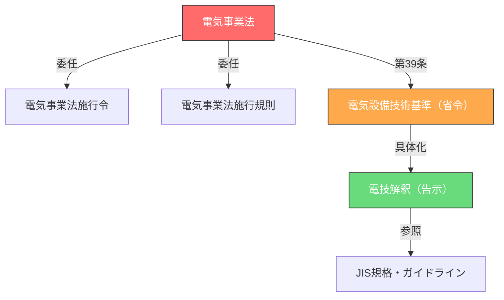

# 法令マスタ — 法令階層構造の攻略

> 電気事業法→技術基準→解釈の**3層構造**を理解し、頻出条文を効率的に攻略する

---

## 法令の階層構造

電験法規の出題は、以下の階層構造に基づいています。

### 各層の役割

| 層 | 法令名 | 役割 | 試験での位置づけ |
|---|--------|------|-----------------|
| 第1層 | **電気事業法** | なぜ規制するか（目的・義務） | A問題で毎年2〜3問 |
| 第2層 | **電気設備技術基準**（省令） | 何を守るか（性能要件） | A問題の条文穴埋め |
| 第3層 | **電技解釈**（告示） | どうやって守るか（具体的数値） | A問題の数値問題・B問題計算 |

---

## 頻出条文ヒートマップ

過去20年間の出題データに基づく条文別出題頻度です。

### 電気事業法（頻出TOP）

| 条文 | テーマ | 出題回数 | 重要度 |
|------|--------|---------|--------|
| 第39条 | 技術基準適合義務 | 15回 | ★★★★★ |
| 第42条 | 保安規程 | 14回 | ★★★★★ |
| 第43条 | 主任技術者の選任 | 13回 | ★★★★★ |
| 第47条 | 工事計画・事前届出 | 10回 | ★★★★☆ |
| 第106条 | 報告の徴収 | 8回 | ★★★★☆ |
| 第44条 | 主任技術者免状 | 7回 | ★★★☆☆ |

### 電気設備技術基準（頻出TOP）

| 条文 | テーマ | 出題回数 | 重要度 |
|------|--------|---------|--------|
| 第10条 | 接地 | 12回 | ★★★★★ |
| 第58条 | 低圧電路の絶縁 | 10回 | ★★★★★ |
| 第14条 | 過電流保護 | 9回 | ★★★★☆ |
| 第15条 | 地絡保護 | 8回 | ★★★★☆ |
| 第56条 | 配線の感電防止 | 7回 | ★★★☆☆ |

### 電技解釈（頻出TOP）

| 条文 | テーマ | 出題回数 | 重要度 |
|------|--------|---------|--------|
| 第17条 | A種接地工事 | 11回 | ★★★★★ |
| 第18条 | B種接地工事 | 10回 | ★★★★★ |
| 第156条 | 低圧屋内配線の工事種類 | 9回 | ★★★★☆ |
| 第68条 | 低圧架空電線の高さ | 8回 | ★★★★☆ |
| 第220条 | 分散型電源の系統連系 | 6回 | ★★★☆☆ |

---

## 数値プロパティ集約表

法規で頻出の「覚えるべき数値」をカテゴリ別に整理。

### 電圧区分

| 区分 | 直流 | 交流 |
|------|------|------|
| 低圧 | 750V以下 | 600V以下 |
| 高圧 | 750V超〜7000V以下 | 600V超〜7000V以下 |
| 特別高圧 | 7000V超 | 7000V超 |

### 接地抵抗値

| 接地種別 | 接地抵抗値 | 適用 |
|---------|----------|------|
| A種 | 10Ω以下 | 高圧・特別高圧機器の外箱 |
| B種 | 150/I_g Ω以下 | 混触防止（変圧器中性点） |
| C種 | 10Ω以下（緩和: 500Ω） | 300V超の低圧機器外箱 |
| D種 | 100Ω以下（緩和: 500Ω） | 300V以下の低圧機器外箱 |

### 絶縁抵抗値

| 電路の使用電圧区分 | 絶縁抵抗値 |
|-------------------|----------|
| 300V以下（対地電圧150V以下） | 0.1MΩ以上 |
| 300V以下（その他） | 0.2MΩ以上 |
| 300V超 | 0.4MΩ以上 |

### 架空電線の高さ

| 場所 | 低圧 | 高圧 |
|------|------|------|
| 道路横断 | 6m以上 | 6m以上 |
| 鉄道横断 | 5.5m以上 | 5.5m以上 |
| 横断歩道橋上 | 3.5m以上 | 3.5m以上 |
| その他 | 5m以上 | 5m以上 |

---

## 学習の進め方

1. **まず第1層**（電気事業法）の骨格を掴む → [電気事業法の体系](../themes/jigyoho-taikei.md)
2. **次に第3層**（解釈）の数値を暗記 → [頻出数値一覧](../reference/numbers.md)
3. **最後に第2層**（技術基準）で穴埋め対策

!!! warning "よくある間違い"
    「技術基準」と「解釈」を混同しがち。技術基準は**性能規定**（「〜であること」）、解釈は**具体的方法**（「〜とする」）。

---

## 関連ページ

- [攻略戦略トップ](index.md)
- [条文一覧](../articles/index.md)
- [法体系の全体構造](../reference/hourei-taikei.md)
