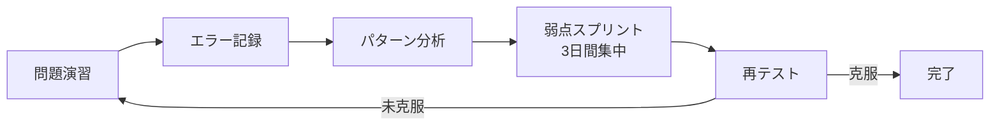

# 弱点ログ — スプリント運用で弱点を克服

> 間違えた問題を記録・分析し、**スプリント方式**で集中的に弱点を克服する

---

## スプリント運用サイクル



### サイクルの詳細

| フェーズ | 期間 | 内容 |
|---------|------|------|
| 演習 | 1日 | 過去問1年分または分野別20問 |
| 記録 | 演習直後 | 間違えた問題をログに記録 |
| 分析 | 翌日 | エラーパターンを分類・原因特定 |
| スプリント | 3日間 | 弱点分野の集中学習 |
| 再テスト | スプリント後 | 同じ問題+類題で定着確認 |

---

## 問題ID記録テンプレート

### 記録フォーマット

```markdown
## [日付] Sprint-XXX

### 間違えた問題

| 問題ID | 年度 | 問番号 | 分野 | エラー種別 | 正答 | 自分の解答 | 原因分析 |
|--------|------|--------|------|-----------|------|----------|---------|
| R06-A07 | R06 | A問7 | 接地工事 | 知識不足 | ウ | ア | B種接地のIg計算を忘れた |
| R06-B11 | R06 | B問11 | 電圧降下 | 計算ミス | 4.2V | 3.8V | 単相と三相の係数を間違えた |

### 今回のスプリント目標
- [ ] B種接地抵抗の公式を完全暗記
- [ ] 電圧降下の単相/三相の使い分けを整理
```

---

## エラー種別の分類

| エラー種別 | 説明 | 対策 |
|-----------|------|------|
| **知識不足** | 条文・数値を知らなかった | 該当条文の再学習 |
| **計算ミス** | 公式は知っていたが計算を間違えた | メソッドの再確認・演習追加 |
| **読解ミス** | 問題文の条件を読み違えた | 問題文のキーワード抽出練習 |
| **混同** | 似た条文・数値を取り違えた | 比較表の作成・対比学習 |
| **時間切れ** | 時間内に解けなかった | 時間配分の練習・計算の高速化 |
| **ケアレス** | 単純な転記・単位ミス | チェックリストの活用 |

---

## 分野別エラー集計表

### テンプレート

| 分野 | 演習数 | 正答数 | 正答率 | 主なエラー種別 | 状態 |
|------|--------|--------|--------|--------------|------|
| 電気事業法 | 0 | 0 | - | - | 未着手 |
| 接地工事 | 0 | 0 | - | - | 未着手 |
| 絶縁性能 | 0 | 0 | - | - | 未着手 |
| 保護装置 | 0 | 0 | - | - | 未着手 |
| 架空電線路 | 0 | 0 | - | - | 未着手 |
| 配線工事 | 0 | 0 | - | - | 未着手 |
| 需要率・負荷率 | 0 | 0 | - | - | 未着手 |
| 電圧降下 | 0 | 0 | - | - | 未着手 |
| 短絡電流 | 0 | 0 | - | - | 未着手 |
| 力率改善 | 0 | 0 | - | - | 未着手 |
| 分散型電源 | 0 | 0 | - | - | 未着手 |
| 施設管理 | 0 | 0 | - | - | 未着手 |

### 正答率の目安

| 正答率 | 判定 | アクション |
|--------|------|-----------|
| 90%以上 | 安定 | 維持・定期復習 |
| 70〜89% | 要注意 | スプリント1回 |
| 50〜69% | 弱点 | スプリント2回以上 |
| 50%未満 | 重点弱点 | 基礎から再学習 |

---

## スプリント記録

### Sprint-001（テンプレート）

- **期間**: YYYY/MM/DD 〜 YYYY/MM/DD
- **対象分野**: （弱点分野を記入）
- **目標**: （具体的な目標を記入）
- **結果**: （スプリント後の正答率を記入）

| 日 | 学習内容 | 時間 | メモ |
|----|---------|------|------|
| Day 1 | | | |
| Day 2 | | | |
| Day 3 | | | |
| 再テスト | | | |

---

## 関連ページ

- [攻略戦略トップ](index.md)
- [B問題メソッド](b-mondai-method.md)
- [過去問マッピング](../kakomon/index.md)
- [テスト記録（外部）](https://kfurufuru.github.io/denken3-study/quiz.html)
