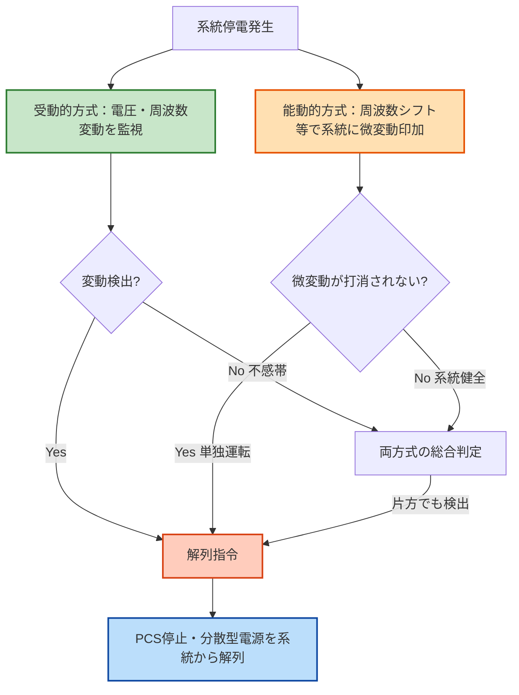

# 単独運転の防止（分散型電源）

!!! info "📌 このページについて（2026-06-08 再編）"
    「単独運転の防止」は電技解釈 第8章に **独立した条文として存在しません**。用語は [第220条](../articles/kaishaku/220.md) で定義され、検出・解列の義務は **低圧＝[第227条](../articles/kaishaku/227.md)／高圧＝[第229条](../articles/kaishaku/229.md)** の系統連系用保護装置が規定します。本ページは旧 `kaishaku/232.md` の単独運転防止解説を **テーマ頁として再編** したものです（現在の[第232条](../articles/kaishaku/232.md)は「高圧・特別高圧連系における例外」です）。

!!! warning "📜 一次ソース確認のお願い（2026-05-10）"
    本ページは電気設備の技術基準の解釈（経済産業省が省令の解釈として示すもの）を学習用に整理したものです。電技解釈は eGov 法令API に登録されていないため、本Wikiの品質保証は wiki内クロスリファレンスと過去問データベース（kakomon.yml）への照合に依存しています。**重要な実務判断や試験直前の最終確認は、必ず経産省公式の最新告示PDF（[電気設備の技術基準の解釈](https://www.meti.go.jp/policy/safety_security/industrial_safety/sangyo/electric/detail/setsubi_kijun.html)）に当たってください**。誤記を発見された場合は GitHub Issues でご連絡ください。

!!! note "📊 概要"
    **重要度**: **★★★★☆（B+）** （分散型電源連系の核心条文・再エネ拡大で出題増加トレンド）

    **出題頻度**: 🔥🔥（過去14年で 4 回出題・第220条〜第232条 群括り）

    **直近出題**: R05上／R04下／R03／R01（いずれも第220条〜第232条 連系設備の複合論点で出題）

    **暗記必須度**: must（穴埋4語：単独運転・受動的・能動的・解列）

    **条文番号3階層**: 独立条なし — 低圧＝解釈 第227条（227-1表 ※4）／高圧＝第229条（各条の系統連系用保護装置の表内で規定）

> ==**単独運転**==（電力会社系統が停電したのに分散型電源だけが運転を続ける状態）は ==**作業者の感電事故**== ・ ==**系統再投入時の機器損傷**== を引き起こす。電技解釈（低圧＝第227条／高圧＝第229条）は ==**単独運転検出装置**== の設置を義務付ける。条文上の方式要求は **低圧＝受動的・能動的 各1方式以上（227-1表 ※4）／高圧＝能動的方式1方式以上（229-1表 ※6）** で連系区分により異なり、==**受動的方式**== と ==**能動的方式**== の **組み合わせ** は低圧の条文要求（高圧では実装上の一般形）。

### 条文メタ情報

| 項目 | 内容 |
|------|------|
| 条文 | 電気設備の技術基準の解釈 第227条（低圧）・第229条（高圧）— 独立条なし（第232条は「高圧連系及び特別高圧連系における例外」で別内容） |
| 規定内容 | 分散型電源連系時の単独運転防止（検出・解列の義務） |
| 性格 | 施設要件規定（保護装置の設置義務／数値直接規定なし） |
| 委任先 | JEAC 9701（系統連系規程）／各電力会社 系統連系技術要件 |
| **典拠（一次ソース）** | 電気設備の技術基準の解釈（令和7年11月版）第227条・第229条 — 経済産業省 |
| **照合日** | 2026-05-06（kakomon DB照合・第220条〜第232条 群で4回出題確認） |

### 関連条文の体系（上位・隣接・関連を一望）

| 区分 | 条文 | 本条との関係 |
|------|------|------------|
| **上位（保安原則）** | [電技省令 第15条](../articles/kijun/15.md) | 系統連系時の保安原則（本条の根拠） |
| **上位（感電・火災防止）** | 電技省令 第18条 | 電線路の感電・火災防止（単独運転で破られる前提） |
| **隣接（前）** | [第228条（逆潮流の制限）](../articles/kaishaku/228.md) | 並行義務・別概念（混同注意） |
| **本テーマ** | **単独運転の防止**（独立条なし・220で定義／227・229で検出） | — |
| **隣接（後）** | 第233条以降 | 分散型電源範囲外（連系設備規定終了） |
| **関連（連系形態）** | [第226条（低圧連系）](../articles/kaishaku/226.md) | 低圧連系で本条と組合せ適用 |
| **関連（連系形態）** | [第229条（連系保護）](../articles/kaishaku/229.md) | 高圧連系で本条と組合せ適用 |
| **関連（用語定義）** | 第220条（用語定義） | 単独運転・分散型電源の語義（本条の前提語彙） |

!!! warning "混同注意：第228条（逆潮流）と単独運転防止は別物"
    - **第228条 = 電力流出方向の制御**（逆潮流の有無を扱う）
    - **単独運転防止（第227条・第229条）= 系統停電時の解列**（停電時の動作を扱う）
    - 両者は **並行義務**。片方が他方を代替しない。逆潮流なしでも単独運転防止は必須。

---

## 0. 隣接条文クラスタマップ — 分散型電源の系統連系（第220条〜第232条）

!!! tip "なぜこのマップを冒頭に置くか"
    過去14年の出題は **第220条〜第232条 群括り** で4回（R01／R03／R04下／R05上）。特定の一条単独より「連系設備一式の差分理解」が問われる。冒頭で隣接条文との **棲み分け** を整理し、複合問題で混同しない土台を作る。

### 分散型電源 連系設備の差分マトリクス

| 条文 | 規制対象 | 核心キーワード | 試験での問われ方 |
|------|---------|--------------|------------------|
| 第220条 | 用語の定義（系統連系設備） | 分散型電源／逆潮流／単独運転／自立運転 | 単独出題（H23・H27・R05下）／用語穴埋 |
| 第227条 | 低圧連系の保護装置 | OVR・UVR・OFR・UFR | 低圧の保護装置の組み合わせ |
| 第229条 | 高圧連系の保護装置 | 過電流継電器・地絡継電器・OVGR | 高圧側の保護リレー |
| 第228条 | 逆潮流の制限 | 逆潮流防止装置／逆充電 | 「あり／なし」の2分法 |
| **単独運転の防止（本テーマ）** | **第227条・第229条の単独運転検出装置** | **受動的方式＋能動的方式** | **両方式の原理と組合せ理由** |
| 第232条 | 高圧・特別高圧連系における例外 | 例外規定 | 単独出題なし |

### 単独運転防止義務の独自性
- **「単独運転」という現象** に対する **検出・解列義務** を規定（系統停電が前提条件）
- 防止方式は **受動的＋能動的の組合せが原則**（条文要求としては低圧＝各1方式以上・高圧＝能動的1方式以上）— 単独使用では不感帯／誤動作リスク
- **逆潮流の有無に関わらず** 全連系設備に必須（第228条の「なし」でも単独運転防止は適用される）

### 複合問題の典型パターン
1. **方式区別型**: 「受動的方式の例として正しいものはどれか」 → 電圧変動／周波数変動／位相跳躍
2. **組合せ理由型**: 「受動的方式だけでは不十分な理由を述べよ」 → 不感帯（発電量＝負荷バランス時の検出漏れ）
3. **逆潮流混同型**: 「逆潮流なしの設備で単独運転防止は不要か」 → 必要（逆潮流の制限と単独運転防止は独立義務）
4. **解列タイミング型**: 「単独運転検出後の動作として正しいものは」 → 直ちに分散型電源を系統から **解列**

---

## 1. 全体像と要点

- **単独運転** = 電力会社系統が停電なのに分散型電源だけが運転継続している状態
- **危険性 = 作業者感電 ＋ 系統再投入時の機器損傷**（位相不一致による突入電流）
- **防止方式 = 受動的（系統変化を検出）＋ 能動的（自ら微変動を与えて確認）の組合せ原則**
- 単独で使うと **受動的＝不感帯／能動的＝誤動作** のリスク → 必ず両方併用
- **解列装置** = PCSの内蔵制御（小規模）／専用継電器（高圧大規模）
- **第228条逆潮流防止装置とは別物** — 並行義務で互いに代替しない

### ① 全体像 — 単独運転防止の位置づけ

<div><svg viewBox="0 0 800 380" xmlns="http://www.w3.org/2000/svg" width="100%" preserveAspectRatio="xMidYMid meet">
<defs>
<filter id="sh232a" x="-20%" y="-20%" width="140%" height="140%"><feDropShadow dx="0" dy="2" stdDeviation="2" flood-opacity="0.15"/></filter>
<linearGradient id="gMain232a" x1="0" y1="0" x2="0" y2="1"><stop offset="0%" stop-color="#bbdefb"/><stop offset="100%" stop-color="#90caf9"/></linearGradient>
<linearGradient id="gA232a" x1="0" y1="0" x2="0" y2="1"><stop offset="0%" stop-color="#c8e6c9"/><stop offset="100%" stop-color="#a5d6a7"/></linearGradient>
<linearGradient id="gB232a" x1="0" y1="0" x2="0" y2="1"><stop offset="0%" stop-color="#ffe0b2"/><stop offset="100%" stop-color="#ffb74d"/></linearGradient>
<linearGradient id="gC232a" x1="0" y1="0" x2="0" y2="1"><stop offset="0%" stop-color="#ffccbc"/><stop offset="100%" stop-color="#ff8a65"/></linearGradient>
</defs>
<text x="400" y="26" text-anchor="middle" font-size="15" font-weight="700" fill="#212121">単独運転防止 — 受動的＋能動的の2方式組合せ</text>
<text x="400" y="44" text-anchor="middle" font-size="11" fill="#666">受動的＋能動的の併用で「不感帯ゼロ・誤動作ゼロ」を実現</text>
<rect x="280" y="60" width="240" height="60" rx="12" fill="url(#gMain232a)" stroke="#0d47a1" stroke-width="2.5" filter="url(#sh232a)"/>
<text x="400" y="85" text-anchor="middle" font-size="14" font-weight="800" fill="#0d47a1">解釈第227条・第229条</text>
<text x="400" y="105" text-anchor="middle" font-size="11" fill="#1565c0">単独運転の防止</text>
<line x1="400" y1="125" x2="200" y2="160" stroke="#0d47a1" stroke-width="1.5" stroke-dasharray="3,2"/>
<line x1="400" y1="125" x2="600" y2="160" stroke="#0d47a1" stroke-width="1.5" stroke-dasharray="3,2"/>
<rect x="60" y="165" width="280" height="180" rx="14" fill="url(#gA232a)" stroke="#2e7d32" stroke-width="2.5" filter="url(#sh232a)"/>
<text x="200" y="190" text-anchor="middle" font-size="13" font-weight="700" fill="#1b5e20">受動的方式（Passive）</text>
<line x1="80" y1="200" x2="320" y2="200" stroke="#2e7d32" stroke-width="1"/>
<text x="200" y="222" text-anchor="middle" font-size="11" fill="#1b5e20">系統の自然変化を「検出」</text>
<text x="200" y="244" text-anchor="middle" font-size="10" fill="#1b5e20">電圧変動／周波数変動／位相跳躍</text>
<text x="200" y="270" text-anchor="middle" font-size="11" font-weight="700" fill="#bf360c">弱点：不感帯</text>
<text x="200" y="290" text-anchor="middle" font-size="10" fill="#bf360c">発電量＝負荷で変動小→検出漏れ</text>
<text x="200" y="320" text-anchor="middle" font-size="10" fill="#2e7d32">代表：UVR・UFR・OVR・OFR</text>
<rect x="460" y="165" width="280" height="180" rx="14" fill="url(#gB232a)" stroke="#e65100" stroke-width="2.5" filter="url(#sh232a)"/>
<text x="600" y="190" text-anchor="middle" font-size="13" font-weight="700" fill="#bf360c">能動的方式（Active）</text>
<line x1="480" y1="200" x2="720" y2="200" stroke="#e65100" stroke-width="1"/>
<text x="600" y="222" text-anchor="middle" font-size="11" fill="#bf360c">自ら微変動を与えて反応確認</text>
<text x="600" y="244" text-anchor="middle" font-size="10" fill="#bf360c">周波数シフト／無効電力変動</text>
<text x="600" y="270" text-anchor="middle" font-size="11" font-weight="700" fill="#1b5e20">弱点：誤動作リスク</text>
<text x="600" y="290" text-anchor="middle" font-size="10" fill="#1b5e20">系統健全時の誤検知の可能性</text>
<text x="600" y="320" text-anchor="middle" font-size="10" fill="#bf360c">代表：周波数シフト・QC方式</text>
<text x="400" y="370" text-anchor="middle" font-size="12" font-weight="800" fill="#0d47a1">→ 両方併用で「不感帯ゼロ＋誤動作ゼロ」を達成（組合せが原則）</text>
</svg></div>

**読み解き**: 受動的・能動的それぞれに弱点（不感帯／誤動作）があるため、**単独使用は条文の趣旨に合わない**。条文の「組合せが原則」は技術的必然性に基づく。

### ② 要点（試験前30秒復習用）

| 観点 | 内容 |
|------|------|
| **核心キーワード** | **単独運転** ／ **受動的方式** ／ **能動的方式** ／ **解列** |
| **危険性（2大）** | **作業者感電**（充電状態の線路）／ **系統再投入時の機器損傷**（位相不一致） |
| **方式の組合せ** | **受動的＋能動的が原則**（単独使用は条文趣旨に反する） |
| **適用範囲** | **低圧連系（第226条）／高圧連系（第229条）いずれにも必要**（逆潮流の有無は無関係） |
| **解列装置** | PCS内蔵制御（小規模）／専用継電器（高圧・大規模） |

??? question "セルフチェック: 受動的方式と能動的方式の違いを30秒で説明できるか？"
    **受動的方式**: 系統が停電すると電圧・周波数が変動する現象を「検出」して解列する。系統に何も働きかけず、変化を待って検知する。**弱点 = 不感帯**：分散型電源と負荷がバランスしていると変動が小さく、検出できない。

    **能動的方式**: 分散型電源が自ら系統の電圧・周波数に微変動を与え、系統が健全なら電力会社が打ち消すが、単独運転中は打ち消されないため変動が蓄積して検知できる。**弱点 = 誤動作**：系統健全時にも反応する可能性。

    **両方の組合せが必要な理由** = 受動的の不感帯を能動的が補完し、能動的の誤動作を受動的が裏付ける。両者で「検出漏れなし＋誤動作なし」の信頼性を確保する。

??? question "セルフチェック: 逆潮流なしの分散型電源では単独運転防止は不要か？"
    **誤り**。逆潮流の有無と単独運転発生は **無関係**。系統停電後、分散型電源が負荷とバランスして運転継続すれば逆潮流ゼロでも単独運転状態になる。単独運転検出の義務（第227条・第229条）は **逆潮流に関わらず全連系設備に適用** され、第228条（逆潮流）とは独立した並行義務。

---

## 2. 条文の要点（参考・再構成）

**単独運転の防止に関する規定**（独立条はなく第220条で定義・低圧第227条／高圧第229条で検出）

!!! warning "以下は「原文」ではなく学習用の要点再構成"
    実際の規定形は、第227条・第229条の **保護リレー等の表（227-1表・229-1表）と注記** である。**下の要点文（受動＋能動それぞれ一以上）は低圧連系（227-1表 ※4）の要求**。高圧連系の単独運転検出装置は **「能動的方式を1方式以上含む」（229-1表 ※6）** で、受動的方式の併設は一律には要求されない。逐語は経産省告示PDFに当たること。

> 分散型電源の連系時には、<mark>単独運転</mark>を防止するため、<mark>受動的方式</mark>及び<mark>能動的方式</mark>のそれぞれ一以上を有する<mark>単独運転検出装置</mark>を施設し、これにより<mark>単独運転</mark>を検出して、これを<mark>解列</mark>するよう施設すること。

> <small>黄色マーカー = 過去問で穴埋め出題された／出題予測されるキーワード</small>

!!! note "条文の構造（3段階の義務）"
    1. **検出装置の施設義務** — 受動的方式＋能動的方式 各 1 以上
    2. **検出義務** — 単独運転状態を実際に検出すること
    3. **解列義務** — 検出時に分散型電源を系統から切り離すこと

→ 「**それぞれ一以上**」の表現は「両方式から最低1種ずつ」を意味する（**低圧連系の要求**）。低圧では受動的だけ／能動的だけでは条文不適合。高圧連系は「能動的方式を1方式以上含む」（229-1表※6）が要求で、受動的の一律併設までは求められない。

### 過去問で問われた／問われ得るキーワード

本テーマは第220条〜第232条 群括りで過去14年計4回出題。穴埋め問題では条文中のキーワードが空欄になる。

| 出題で狙われるキーワード | 過去問での扱い／予測 |
|---|---|
| **単独運転** | 用語の穴埋め（第220条 定義条文と連動） |
| **受動的方式** ／ **能動的方式** | 区分の穴埋め（セットで出題） |
| **単独運転検出装置** | 装置名の穴埋め |
| **解列** | 動作の穴埋め（「遮断」と書くと誤答） |
| **電圧変動** ／ **周波数変動** ／ **位相跳躍** | 受動的方式の検出パラメータ |
| **周波数シフト** ／ **無効電力変動** | 能動的方式の方式名 |

!!! tip "暗記の核心キーワード"
    - **受動的方式 ＋ 能動的方式 の各1以上**（条文文言）
    - **単独運転検出装置 → 検出 → 解列** の3段階フロー
    - **解列**（読み：かいれつ）= 系統から切り離すこと（「遮断」「停電」と区別）

!!! note "出典"
    電気設備の技術基準の解釈（令和7年11月版）第227条・第229条 — 経済産業省が省令の解釈として示すもの／JEAC 9701-2019 系統連系規程 第3章

---

## 3. 原文解析（ブロック分解）

条文を意味ブロック単位に分解し、それぞれの試験ポイントを整理する。

| 原文ブロック | 意味 | 試験のポイント |
|---|---|---|
| 「分散型電源の連系時には」 | 適用範囲＝**全ての連系分散型電源**（低圧・高圧問わず） | 「高圧のみ」「逆潮流ありのみ」は誤り |
| 「単独運転を防止するため」 | 目的＝**単独運転状態の発生阻止** | 「逆潮流防止」「過電流防止」は別目的 |
| 「受動的方式及び能動的方式の **それぞれ一以上**」 | **両方式から最低1種ずつ**の義務（**低圧連系**・227-1表※4） | 低圧で「いずれか一方で足りる」は誤り（高圧は能動的1方式以上＝229-1表※6） |
| 「単独運転検出装置を施設し」 | **物理的に装置を設置**する義務 | 制御プログラムだけ／論理的判定だけは不可 |
| 「これにより単独運転を検出して」 | **検出機能の実効性**確保 | 不感帯放置・検出漏れは違反 |
| 「これを解列するよう施設すること」 | 検出後の **動作義務＝解列** | 「警報のみ」「監視のみ」は誤り |

??? question "セルフチェック: 「能動的方式を1種類設置すれば条文要件を満たす」は正しいか？"
    **低圧連系では誤り**。227-1表※4は「受動的方式 **及び** 能動的方式の **それぞれ** 一以上」と明記し、両方式必須を強制する。**高圧連系では要件が異なり**、単独運転検出装置は「能動的方式を1方式以上含む」（229-1表※6）＝能動的1方式で条文要件は満たし得る。

??? question "セルフチェック: 単独運転検出後の動作として「警報を発する」だけで足りるか？"
    **誤り**。条文末尾は「これを解列するよう施設すること」で、**解列**（系統からの切り離し）が義務。警報のみは作業者感電・再投入事故を防げないため不適合。

---

## 4. かみ砕き解説（因果理解）

### なぜ単独運転が危険か — 2大事故シナリオ

!!! tip "暗記の核心：危険の本質"
    系統が停電したとき、電力会社の作業者は **「線路は無充電」と判断** して復旧作業に入る。しかし分散型電源が単独運転を続けていると、その線路は **充電されたまま**。

    **シナリオ①：作業者の感電死亡事故**
    停電復旧作業中の作業者が「死んでいるはず」の線路に触れて感電。低圧でも致死性。

    **シナリオ②：系統再投入時の機器損傷**
    電力会社が系統復電する際、分散型電源の電圧位相が系統と同期していなければ **突入電流**（過大な瞬時電流）が発生し、変圧器・PCS・遮断器が損傷する。

    この2大事故を防ぐため、**系統停電を検知したら直ちに解列** することが単独運転防止（第227条・第229条）の核心義務。

### 受動的方式の物理プロセス — なぜ「変動」が起きるか

系統が健全なとき、電力会社が **電圧・周波数を強制的に一定** に保つ。系統停電すると、この支配がなくなり：

- **発電量 > 負荷** → 電圧・周波数が **上昇**
- **発電量 < 負荷** → 電圧・周波数が **低下**
- 停電瞬間に **位相急変** が発生

受動的方式はこれら自然変化を **OVR（過電圧）／UVR（不足電圧）／OFR（過周波数）／UFR（不足周波数）／位相跳躍検出** で捕捉する。

### 受動的方式の弱点 — 不感帯の物理的理由

!!! warning "不感帯（dead zone）が存在する理由"
    分散型電源の **発電量と負荷が偶然ぴったり一致** している瞬間に系統停電が起きると：

    - 発電量＝負荷 → 電圧・周波数の変動が **ほぼゼロ**
    - 受動的方式の検出閾値を下回る → **検出失敗**

    実際の運用では「ぴったり一致」は稀だが、**昼間の太陽光大量稼働時** や **大規模工場の負荷バランス時** には不感帯が成立しやすい。これを補完するのが能動的方式。

### 能動的方式の物理プロセス — なぜ「微変動」が検知になるか

能動的方式は **分散型電源（PCS）が自ら系統に揺さぶりをかける**：

- **周波数シフト方式**: 出力周波数を 50/60Hz から微小にずらし続ける
- **無効電力変動方式**: 無効電力を周期的に変動させる

**系統健全時** = 電力会社の巨大な発電機群が揺さぶりを **打ち消す** → 系統電圧・周波数は変化しない
**単独運転中** = 打ち消す側がいない → 揺さぶりが **蓄積** → 周波数偏移／電圧変動が拡大 → 検知

これは **「系統という大海原に小石を投げる」** 比喩で覚える：海なら波が消えるが、池なら波が反射して戻ってくる。

### 能動的方式の弱点 — 誤動作リスク

系統が健全でも、**他の分散型電源との干渉** や **系統共振** で揺さぶりが想定外に増幅し、誤検知する可能性がある。これを補完するのが受動的方式（自然変動の有無を裏付ける）。

### なぜ「受動的＋能動的の組合せ」が原則なのか — 4ステップで理解する

!!! tip "暗記の核心：単独使用が成立しない4つの段階的理由"
    試験で論述を求められたら、以下の4ステップで答えるのが模範解答。

    **ステップ1：受動的方式は「不感帯」で検出失敗する**
    系統停電時に発電量＝負荷で電圧・周波数の変動がほぼゼロになる瞬間がある（昼間の太陽光大量稼働＋工場負荷バランス時）。受動的方式は「変動の検出」が原理なので、変動ゼロでは検出できない。**つまり受動的のみでは作業者感電・機器損傷の事故を確実に防げない**。

    **ステップ2：それなら能動的だけにすればよいか？ → 誤動作リスクが残る**
    能動的方式は「自分から揺さぶりを与えて反応を見る」原理。系統が健全でも他の分散型電源の能動的方式と干渉したり系統共振が起きると、揺さぶりが増幅されて誤検知する。**誤検知すれば健全な系統から不要な解列が起き、電力供給の信頼性が損なわれる**（再エネが不安定電源化）。

    **ステップ3：両方式は「弱点が逆向き」だから相互補完が成立する**
    | 方式 | 強み | 弱点 |
    |------|------|------|
    | 受動的 | **誤動作しにくい**（自然現象を見るだけで自分から系統に介入しない） | **検出漏れ**（不感帯） |
    | 能動的 | **不感帯がない**（自分から揺さぶりをかけるので必ず反応が返る／返らない） | **誤動作**（健全時の干渉・共振） |

    弱点と強みが **対称的に逆向き** になっているため、両方を使うと：
    - 不感帯（受動的の弱点）→ 能動的の揺さぶりで埋まる
    - 誤動作（能動的の弱点）→ 受動的の自然変動有無で裏付け（自然変動なし→揺さぶり反応のみ→誤検知の可能性 と判定）

    **ステップ4：条文の「それぞれ一以上」が技術必然の表現**
    条文文言「受動的方式 **及び** 能動的方式の **それぞれ** 一以上を有する」は、**安全（検出漏れゼロ）と信頼性（誤動作ゼロ）を同時に成立させる唯一の手段**として両方式併用が選ばれた結果。「いずれか一方」と書けば成立しない（事故か誤動作のどちらかが起きる）。

!!! warning "覚え方の比喩：医療診断の「2種類の検査を併用」と同じ"
    がん検診で **血液検査だけ** だと「初期がんを見逃す（不感帯）」、**画像検査だけ** だと「ノイズ陰影で誤検知（誤動作）」。両方併用して初めて「見逃しゼロ＋誤診ゼロ」に近づく。この組合せ原則は、これと同じ **「弱点が逆向きの2つの検査の併用」** と理解できる。

### 組合せ判定の論理（4象限で整理）

実際の単独運転検出装置の判定は、受動的・能動的の両方の出力を組み合わせて行う：

| 受動的の判定 | 能動的の判定 | 系統状態 | 動作 |
|------------|------------|---------|------|
| 変動あり | 揺さぶり残留あり | **単独運転** | **解列** |
| 変動あり | 揺さぶり打消されている | 系統側の擾乱（雷・短絡等）で系統健全 | 一時的な観測（必要に応じ整定値で動作） |
| 変動なし | 揺さぶり残留あり | **単独運転（不感帯発生）** | **解列**（能動的が拾った） |
| 変動なし | 揺さぶり打消されている | 系統健全（通常運用） | 動作なし |

→ 4象限のうち **2象限が「単独運転」判定** → どちらか1象限を見落とす単独使用では事故を防ぎ切れない。これが「それぞれ一以上」の論理的本質。

---

## 5. 図で理解

### 単独運転発生メカニズム（系統停電 → 解列まで）

<div><svg viewBox="0 0 820 380" xmlns="http://www.w3.org/2000/svg" width="100%" preserveAspectRatio="xMidYMid meet">
<defs>
<filter id="sh232b" x="-20%" y="-20%" width="140%" height="140%"><feDropShadow dx="0" dy="2" stdDeviation="2" flood-opacity="0.12"/></filter>
<marker id="arr232b" viewBox="0 0 10 10" refX="9" refY="5" markerWidth="6" markerHeight="6" orient="auto"><path d="M0,0 L10,5 L0,10 Z" fill="#d32f2f"/></marker>
</defs>
<text x="410" y="24" text-anchor="middle" font-size="15" font-weight="700" fill="#212121">単独運転発生のメカニズム</text>
<text x="410" y="42" text-anchor="middle" font-size="11" fill="#666">系統停電→分散型電源だけが運転継続→検出→解列</text>

<rect x="40" y="70" width="160" height="80" rx="10" fill="#e3f2fd" stroke="#0d47a1" stroke-width="2" filter="url(#sh232b)"/>
<text x="120" y="98" text-anchor="middle" font-size="12" font-weight="700" fill="#0d47a1">電力会社系統</text>
<text x="120" y="118" text-anchor="middle" font-size="11" fill="#1565c0">配電用変電所</text>
<text x="120" y="138" text-anchor="middle" font-size="10" fill="#d32f2f">⚡ 停電発生</text>

<line x1="200" y1="110" x2="280" y2="110" stroke="#424242" stroke-width="2"/>
<line x1="240" y1="100" x2="240" y2="120" stroke="#d32f2f" stroke-width="3"/>
<text x="240" y="92" text-anchor="middle" font-size="10" fill="#d32f2f">遮断点</text>

<rect x="280" y="70" width="180" height="80" rx="10" fill="#fff9c4" stroke="#f9a825" stroke-width="2" filter="url(#sh232b)"/>
<text x="370" y="98" text-anchor="middle" font-size="12" font-weight="700" fill="#f57f17">配電線（停電中）</text>
<text x="370" y="120" text-anchor="middle" font-size="10" fill="#d32f2f">⚠ 充電状態が継続</text>
<text x="370" y="138" text-anchor="middle" font-size="10" fill="#f57f17">作業者の感電リスク</text>

<line x1="460" y1="110" x2="540" y2="110" stroke="#424242" stroke-width="2"/>

<rect x="540" y="70" width="220" height="80" rx="10" fill="#c8e6c9" stroke="#2e7d32" stroke-width="2" filter="url(#sh232b)"/>
<text x="650" y="96" text-anchor="middle" font-size="12" font-weight="700" fill="#1b5e20">分散型電源（PV/PCS）</text>
<text x="650" y="118" text-anchor="middle" font-size="10" fill="#1b5e20">運転継続中＝単独運転状態</text>
<text x="650" y="138" text-anchor="middle" font-size="10" fill="#bf360c">系統に充電し続ける</text>

<rect x="280" y="200" width="180" height="60" rx="10" fill="#bbdefb" stroke="#0d47a1" stroke-width="2" filter="url(#sh232b)"/>
<text x="370" y="226" text-anchor="middle" font-size="12" font-weight="700" fill="#0d47a1">単独運転検出装置</text>
<text x="370" y="246" text-anchor="middle" font-size="10" fill="#0d47a1">受動的＋能動的</text>

<line x1="370" y1="150" x2="370" y2="200" stroke="#0d47a1" stroke-width="1.5" stroke-dasharray="4,3"/>
<text x="386" y="180" font-size="10" fill="#0d47a1">監視</text>

<rect x="540" y="200" width="220" height="60" rx="10" fill="#ffccbc" stroke="#d84315" stroke-width="2" filter="url(#sh232b)"/>
<text x="650" y="226" text-anchor="middle" font-size="12" font-weight="700" fill="#bf360c">解列指令 → PCS停止</text>
<text x="650" y="246" text-anchor="middle" font-size="10" fill="#bf360c">分散型電源を系統から切離</text>

<line x1="460" y1="230" x2="540" y2="230" stroke="#d32f2f" stroke-width="2.5" marker-end="url(#arr232b)"/>
<text x="500" y="220" text-anchor="middle" font-size="10" font-weight="700" fill="#d32f2f">検出</text>

<rect x="40" y="290" width="720" height="60" rx="10" fill="#e8f5e9" stroke="#2e7d32" stroke-width="1.5"/>
<text x="400" y="316" text-anchor="middle" font-size="12" font-weight="700" fill="#1b5e20">解列完了 → 系統復電作業可能（作業者安全）／ 再投入時の同期外れ事故も防止</text>
<text x="400" y="338" text-anchor="middle" font-size="10" fill="#1b5e20">解釈（第227条・第229条）が要求する「検出 → 解列」の連続フロー</text>
</svg></div>

**読み解き**: 系統停電後、分散型電源が運転継続すれば配電線が充電状態のまま残る。検出装置（受動的＋能動的）が単独運転を捕捉し、解列指令でPCSを停止して切り離す。

### 防止方式の判定フロー（受動的＋能動的の組合せ）



### 不感帯の物理イメージ

<div><svg viewBox="0 0 800 280" xmlns="http://www.w3.org/2000/svg" width="100%" preserveAspectRatio="xMidYMid meet">
<defs>
<filter id="sh232c" x="-20%" y="-20%" width="140%" height="140%"><feDropShadow dx="0" dy="2" stdDeviation="2" flood-opacity="0.12"/></filter>
</defs>
<text x="400" y="24" text-anchor="middle" font-size="15" font-weight="700" fill="#212121">受動的方式の不感帯 — 発電量と負荷のバランス</text>
<text x="400" y="42" text-anchor="middle" font-size="11" fill="#666">バランス時は変動が検出閾値を下回り検出失敗</text>

<rect x="40" y="70" width="220" height="140" rx="10" fill="#fff9c4" stroke="#f9a825" stroke-width="2" filter="url(#sh232c)"/>
<text x="150" y="96" text-anchor="middle" font-size="12" font-weight="700" fill="#f57f17">ケースA: 発電 ≠ 負荷</text>
<text x="150" y="120" text-anchor="middle" font-size="11" fill="#1b5e20">発電 100kW</text>
<text x="150" y="140" text-anchor="middle" font-size="11" fill="#bf360c">負荷 80kW</text>
<text x="150" y="166" text-anchor="middle" font-size="10" font-weight="700" fill="#0d47a1">→ 電圧・周波数が変動</text>
<text x="150" y="186" text-anchor="middle" font-size="11" font-weight="800" fill="#2e7d32">受動的で検出可能 ✓</text>

<rect x="290" y="70" width="220" height="140" rx="10" fill="#ffccbc" stroke="#d84315" stroke-width="2" filter="url(#sh232c)"/>
<text x="400" y="96" text-anchor="middle" font-size="12" font-weight="700" fill="#bf360c">ケースB: 発電 ≒ 負荷（不感帯）</text>
<text x="400" y="120" text-anchor="middle" font-size="11" fill="#1b5e20">発電 100kW</text>
<text x="400" y="140" text-anchor="middle" font-size="11" fill="#1b5e20">負荷 100kW</text>
<text x="400" y="166" text-anchor="middle" font-size="10" font-weight="700" fill="#bf360c">→ 変動がほぼゼロ</text>
<text x="400" y="186" text-anchor="middle" font-size="11" font-weight="800" fill="#d32f2f">受動的では検出失敗 ✗</text>

<rect x="540" y="70" width="220" height="140" rx="10" fill="#c8e6c9" stroke="#2e7d32" stroke-width="2" filter="url(#sh232c)"/>
<text x="650" y="96" text-anchor="middle" font-size="12" font-weight="700" fill="#1b5e20">能動的方式が補完</text>
<text x="650" y="120" text-anchor="middle" font-size="11" fill="#1b5e20">微変動を印加</text>
<text x="650" y="140" text-anchor="middle" font-size="11" fill="#1b5e20">↓ 打消されない</text>
<text x="650" y="166" text-anchor="middle" font-size="10" font-weight="700" fill="#0d47a1">→ 周波数偏移が蓄積</text>
<text x="650" y="186" text-anchor="middle" font-size="11" font-weight="800" fill="#2e7d32">能動的で検出可能 ✓</text>

<rect x="40" y="230" width="720" height="36" rx="6" fill="#e3f2fd" stroke="#0d47a1" stroke-width="1"/>
<text x="400" y="253" text-anchor="middle" font-size="11" fill="#0d47a1">受動的の弱点（不感帯）を能動的が埋める＝条文「それぞれ一以上」の物理的根拠</text>
</svg></div>

**読み解き**: 発電量と負荷が一致するケースB（不感帯）では受動的方式が検出失敗するが、能動的方式の微変動印加により検出可能。両方式の併用が技術的必然。

---

## 6. 受動的方式・能動的方式の詳細

### 受動的方式（Passive Method）

系統の自然な変化を「受け取って」検知する。

| 方式名 | 検出パラメータ | 検出の仕組み | 代表的継電器 |
|------|-------------|-----------|-----------|
| **電圧変動検出** | 系統電圧の異常 | 系統停電→発電量と負荷のアンバランス→電圧変動 | OVR（過電圧）／UVR（不足電圧） |
| **周波数変動検出** | 系統周波数の異常 | 系統停電→電力アンバランス→周波数変動 | OFR（過周波数）／UFR（不足周波数） |
| **位相跳躍検出** | 位相の急変 | 系統停電瞬間の位相急変を検出 | 位相変化検出リレー |
| **周波数変化率（df/dt）** | 周波数変化の速度 | 単独運転は周波数変化率が大きい | df/dtリレー |

**弱点**: 発電量と負荷がバランスしている場合、電圧・周波数変動が検出閾値を下回る（**不感帯**の存在）

### 能動的方式（Active Method）

自ら系統に微変動を加えて反応を見る。

| 方式名 | 仕組み | 検知原理 |
|------|-------|---------|
| **周波数シフト方式** | インバータ出力の周波数を微小にずらし続ける | 系統健全時は電力会社が打ち消す／単独運転時は周波数偏移が蓄積 |
| **無効電力変動方式** | 無効電力を意図的に周期変動させる | 単独運転中は電力会社の無効電力供給がなくなり電圧変化が大きくなる |
| **QC（クオリティコントロール）方式** | 出力波形の歪率を監視 | 単独運転時は系統側からの基準信号がなく波形が乱れる |
| **負荷変動方式** | 出力電力を周期変動 | 単独運転時は電圧・周波数応答が顕在化 |

**弱点**: 系統健全時にも他の分散型電源との干渉や系統共振で **誤動作の可能性**

---

## 7. 解列装置の構成

| 解列方式 | 説明 | 適用 | 単独運転防止義務との関係 |
|---------|------|------|----------------|
| **インバータ内蔵制御** | パワーコンディショナー（PCS）の制御ソフトウェアが単独運転を検知して自動停止 | 住宅用・小規模太陽光（10kW未満中心） | JET認証で受動的＋能動的の両方式実装が確認 |
| **専用継電器（保護リレー）** | 外部の保護継電器が単独運転を検知し、遮断器を動作させて解列 | 高圧連系（第229条）・大規模太陽光・風力 | UVR・UFR・OVR・OFR の組合せ＋能動的方式の継電器 |
| **転送遮断装置** | 電力会社系統側の遮断信号を分散型電源側に転送 | 高圧連系（229-1表で単独運転検出装置との選択肢） | 231-1表（特別高圧）に転送遮断装置の行は無い点に注意 |

!!! tip "PCSの自動的単独運転防止機能"
    住宅用太陽光のPCSは **JET認証**（一般財団法人電気安全環境研究所）を取得しており、出荷時点で単独運転防止機能（受動的＋能動的）が実装済み。施工者が個別に保護継電器を取り付ける必要はない。一方、**高圧連系**では専用継電器の追加施設が必要。

---

## 8. 関連条文との棲み分け

| 条文 | 要件 | 単独運転防止との関係 | 試験での問われ方 |
|------|------|------------|---------------|
| 第220条（用語定義） | 単独運転・分散型電源等の定義 | **本条の前提語彙**（用語穴埋で出題） | H23・H27・R05下 単独出題 |
| 第226条（低圧連系） | 低圧連系の施設要件 | **本テーマが適用される連系形態の一つ** | 保護装置の組合せで複合出題 |
| 第229条（高圧連系） | 高圧連系の保護装置 | **本テーマが適用される連系形態の一つ** | 高圧側保護リレーで複合出題 |
| 第228条（逆潮流制限） | 逆潮流の管理 | **並行義務**・別目的（逆潮流の有無は本条適用に無関係） | 「逆潮流なしなら単独運転防止不要」がひっかけ |
| **単独運転防止** | 単独運転の検出・解列 | **全連系設備に必須** | 受動的＋能動的の組合せ／不感帯／解列義務 |

!!! warning "ひっかけ：単独運転防止が不要なケースはない"
    「逆潮流なし（第228条）の場合は単独運転しないから防止不要」→ **誤り**。逆潮流の有無と単独運転の発生は無関係。系統が停電すれば逆潮流なしの設備でも、負荷バランスが取れていれば単独運転状態になる可能性がある。**低圧（第226条）・高圧（第229条）を問わず単独運転防止は必須**。

---

## 9. 頻出ひっかけ・落とし穴

試験で実際に失点しやすいポイントを、重大度別に整理した。

### 🔴 致命的（これを間違えたら即失点）

| # | ❌ 誤った認識 | ✅ 正しい認識 |
|---|--------------|--------------|
| 1 | 受動的方式だけで条文要件を満たす | 低圧は「**それぞれ一以上**」（227-1表※4）・高圧も能動的1方式以上が必須（229-1表※6）＝**受動的のみはどの連系区分でも不適合** |
| 2 | 能動的方式だけで条文要件を満たす | **低圧では不適合**（受動＋能動各1が必須・227-1表※4）。**高圧は能動的1方式以上が要件**（229-1表※6）で受動の一律併設は求められない——連系区分の取り違えに注意 |
| 3 | 単独運転検出後の動作は「警報」で足りる | 条文末尾は「**解列**するよう施設すること」。警報のみは作業者感電・再投入事故を防げない |

### 🟡 注意（出題頻度高い）

| # | ❌ 誤った認識 | ✅ 正しい認識 |
|---|--------------|--------------|
| 4 | 逆潮流なし（第228条）なら単独運転防止は不要 | **両者は独立義務**。逆潮流の有無に関わらず単独運転防止は全連系設備に適用 |
| 5 | 低圧連系では単独運転防止は不要（高圧のみ必要） | **低圧（第226条）・高圧（第229条）いずれも必須**。連系形態を問わず適用 |
| 6 | 受動的方式の不感帯は実用上問題ない | **発電量＝負荷の昼間ピーク時に成立しやすく**、能動的方式での補完が必須 |
| 7 | 「解列」と「遮断」は同義 | **解列**＝分散型電源を系統から切り離す（PCS停止／継電器動作）／**遮断**＝過電流時の保護動作。条文用語は「解列」 |

### 🟢 軽微（余裕があれば）

| # | ❌ 誤った認識 | ✅ 正しい認識 |
|---|--------------|--------------|
| 8 | 単独運転は感電事故だけが問題 | **系統再投入時の機器損傷**（位相不一致による突入電流）も同等の問題 |
| 9 | 能動的方式は系統に常に悪影響を与える | 微変動の振幅は **系統の定常運用範囲内**。健全時は電力会社の制御で打ち消される |
| 10 | PCSがあれば自動的に単独運転防止要件を遵守 | **JET認証PCS**は要件を満たすが、高圧連系では追加で専用継電器の施設が必要 |

---

## 10. 穴埋め過去問チャレンジ

!!! abstract "問題1: 条文の核心構造"
    分散型電源の連系時には、（　ア　）を防止するため、（　イ　）方式及び（　ウ　）方式のそれぞれ一以上を有する単独運転検出装置を施設し、単独運転を検出して、これを（　エ　）するよう施設すること。

??? success "解答"
    - ア = **単独運転**
    - イ = **受動的**
    - ウ = **能動的**
    - エ = **解列**

??? note "解説と復習導線"
    「**それぞれ一以上**」の文言が両方式必須を強制する。「いずれか一方」と書くと誤答。エは「遮断」「停止」と書くと誤答（条文用語は **解列**）。

!!! abstract "問題2: 受動的方式の検出パラメータ"
    受動的方式は、系統停電によって生じる（　ア　）変動・（　イ　）変動・（　ウ　）跳躍などを検出して単独運転を判定する。代表的な継電器には UVR・UFR・OVR・OFR がある。

??? success "解答"
    - ア = **電圧**
    - イ = **周波数**
    - ウ = **位相**

??? note "解説と復習導線"
    「電圧」「周波数」「位相」は受動的方式の3大検出パラメータ。継電器名（UVR=不足電圧／UFR=不足周波数／OVR=過電圧／OFR=過周波数）と紐付けて覚える。

!!! abstract "問題3: 能動的方式の代表"
    能動的方式の代表として、インバータ出力の周波数を微小にずらし続ける（　ア　）方式や、無効電力を意図的に周期変動させる（　イ　）方式がある。

??? success "解答"
    - ア = **周波数シフト**
    - イ = **無効電力変動**

??? note "解説と復習導線"
    系統健全時は電力会社が打ち消すが、単独運転時は打ち消されず変動が蓄積して検知される、という共通原理を持つ。

!!! abstract "問題4: 組合せ必須の理由"
    受動的方式には（　ア　）と呼ばれる検出失敗領域があり、発電量と負荷が（　イ　）したとき変動が小さく検出できない。能動的方式が（　ア　）を補完するため、両方式の組合せが原則となる。

??? success "解答"
    - ア = **不感帯**（dead zone）
    - イ = **均衡／一致**

??? note "解説と復習導線"
    「不感帯」は受動的方式の弱点を表す核心用語。試験ではこの用語を直接問う形式と「組合せが必要な理由」を論述させる形式の両方で出題される。

---

## 11. まぎらわしい選択肢と正解の違い

| 誤った記述 | 正しい記述 | なぜ違うか |
|---|---|---|
| 「受動的方式または能動的方式のいずれか一方を施設する」 | **受動的方式 及び 能動的方式の それぞれ一以上** を施設する | 条文の「及び」「それぞれ」が両方必須を強制 |
| 「単独運転検出後は警報を発する」 | 単独運転検出後は **解列する** | 条文末尾「解列するよう施設すること」が動作義務 |
| 「逆潮流なしの設備では単独運転防止不要」 | 逆潮流の有無に関わらず **全連系設備に必須** | 第228条（逆潮流）と単独運転防止は独立義務 |
| 「単独運転防止は高圧連系のみ必要」 | **低圧（第226条）・高圧（第229条）いずれも必須** | 連系形態を問わず適用 |
| 「能動的方式は系統健全時にも常に変動を生じさせる」 | 微変動は **電力会社が打ち消す** ため系統健全時は影響なし | 単独運転時のみ偏移が蓄積する仕組み |
| 「単独運転 = 逆潮流」 | **別概念**：単独運転 = 系統停電時の運転継続／逆潮流 = 通常時の電力流出方向 | 単独運転防止と第228条は対象事象が異なる |
| 「JET認証PCSがあれば高圧連系でも単独運転防止要件を満たす」 | 高圧連系では **専用継電器の追加施設が必要** | JET認証は低圧PCSの単体機能で、高圧連系の解列装置は別途必要 |

---

## 12. 電路形態別の物理イメージ

!!! tip "なぜこのセクションが必要か"
    分散型電源の規模・連系電圧で **要求される検出装置の構成** が変わる。試験では「住宅用太陽光」「メガソーラー」「自家発電」など具体シーンが問われるため、形態別マッピングが有効。

### 規模・連系形態と検出装置のマッピング

| 形態 | 連系電圧 | 適用条文 | 検出装置構成 | 解列方式 |
|------|---------|---------|------------|---------|
| **住宅用PV（10kW未満）** | 低圧100/200V | 第226条・第227条 | JET認証PCS内蔵（受動的＋能動的） | PCS自動停止 |
| **小規模PV（50kW未満）** | 低圧 | 第226条・第227条 | JET認証PCS or 専用継電器 | PCS停止 or 遮断器 |
| **高圧連系PV（500kW級）** | 高圧6.6kV | 第228条・第229条 | UVR/UFR/OVR/OFR＋能動的継電器 | 連系遮断器の動作 |
| **メガソーラー（2MW級）** | 高圧/特別高圧 | 第229条（特別高圧は第230・231条） | 専用保護継電器盤（高圧では転送遮断装置と単独運転検出装置の選択・特別高圧は電流差動リレー等） | 専用遮断器 |
| **風力発電** | 高圧 | 第228条・第229条 | 同上＋風車制御の協調 | 連系遮断器＋風車停止 |

### 形態判定の思考プロセス

```
[分散型電源の規模・電圧] → [低圧 or 高圧 連系] → [低圧=第226条・第227条 or 高圧=第228条・第229条 適用] → [単独運転検出装置の構成]
```

試験では「住宅用太陽光のPCSは何の認証が必要か」（→ JET認証）や「高圧連系で単独運転検出要件を満たすには何が必要か」（→ 専用継電器）といった形で問われる。

---

## 13. 実務シーン — 主任技術者の引用場面

!!! info "なぜこのセクションが必要か"
    単独運転防止は **太陽光・風力の系統連系協議で必ず引用される** 要件。電気主任技術者の業務として、PCS出荷検査・系統連系協議書・保安規程の3場面で具体的に登場する。

### シーン① — PCS出荷検査・受入確認

事業用太陽光発電設備の **PCS（パワーコンディショナー）受入検査** で、単独運転防止要件（第227条・第229条）の遵守を確認。

- **JET認証ラベル** の確認（住宅用低圧PCSの場合）
- **受動的方式の継電器仕様** 確認（OVR/UVR/OFR/UFR の整定値）
- **能動的方式の方式名・パラメータ** 確認（周波数シフト方式の偏移幅等）
- メーカー試験成績書で **単独運転検出時間** が技術要件（一般に0.5〜1秒以内[出典: JEAC 9701-2019 系統連系規程 第3章]）を満たすか確認

### シーン② — 系統連系協議書（電力会社提出書類）

電力会社（一般送配電事業者）に提出する **系統連系協議書** で、単独運転防止要件の遵守を明記。

- 単独運転防止装置の **方式・型式・整定値** を記載
- **検出時間・解列時間** の保証値
- **転送遮断装置** の有無（特別高圧大規模連系の場合）
- 電力会社側の **連系受入検査** に合格して連系開始

### シーン③ — 保安規程・定期点検

事業用電気工作物の **保安規程** で、単独運転防止装置の **定期点検項目** を明記。

- 年次点検での **継電器動作試験**（注入試験で動作確認）
- **整定値の経年確認**（系統側変更があれば再整定）
- 試験成績の **記録保存**（保安規程に基づく義務）

### 実務シーン総合表

| 場面 | 必要書類・行為 | 単独運転防止との関係 |
|------|--------------|-------------|
| PCS出荷検査 | JET認証・試験成績書 | 装置レベルでの単独運転防止要件の遵守確認 |
| 系統連系協議書 | 方式・整定値・解列時間の記載 | 系統運用主体への適合宣言 |
| 保安規程 | 定期点検項目・記録様式 | 運用継続中の単独運転防止要件の遵守担保 |
| 事故時対応 | 単独運転発生時のログ確認・原因分析 | 単独運転防止義務の不遵守事故の再発防止 |

---

## 13.5. 用語の3列翻訳（日常語 ⇄ 法規用語 ⇄ 試験表現）

!!! tip "なぜ3列翻訳が必要か"
    単独運転防止は **法規用語と日常感覚にギャップが大きい** テーマ（「単独運転」は日常語の「孤立稼働」、「解列」は日常語の「切り離し」）。試験では条文用語そのままで穴埋めされるため、日常感覚 → 法規用語 → 試験での問われ方の3列対応を整理しておくと混同を防げる。

| 日常語・言い換え | 条文表現（正式名称） | 試験での意味（混同注意・ひっかけ正答） |
|------------|------------------|-----------------|
| 系統が落ちたのに発電所だけ動き続ける | **単独運転** | 用語の穴埋（「（　ア　）を防止するため」） |
| 系統から発電所を切り離す | **解列** | 動作の穴埋（「これを（　エ　）するよう施設すること」） |
| 系統の電圧・周波数の変化を待って気づく | **受動的方式** | 区分の穴埋（「（　イ　）方式」） |
| 自分から系統に揺さぶりをかけて反応を見る | **能動的方式** | 区分の穴埋（「（　ウ　）方式」） |
| 検出できない死角の領域 | **不感帯**（dead zone） | 論述：組合せ必須の理由 |
| パワコン | **PCS（パワーコンディショナー）** | 装置名の穴埋（住宅PVの解列装置） |
| 発電所が単独で生き残ってる装置 | **単独運転検出装置** | 装置名の穴埋（「（　　）を施設し」） |
| 計画的に系統と切り離して自宅供給 | **自立運転** | 単独運転との **対比** で出題（混同ひっかけ） |
| 発電所→電力会社方向に電気が逆流 | **逆潮流** | 第228条との **棲み分け** で出題 |
| 法令上の電気の流れる場所 | **電路** | 連系設備の対象範囲 |

→ 試験では右列（法規用語）で問われるが、覚えるときは左列（日常語）からスタートして紐付けると定着が早い。

---

## 14. 用語集

本テーマ（第220条・第227条・第229条）の条文や出題で登場する主要用語を整理した。

| 用語 | 読み | 意味 | 試験での注意点 |
|------|------|------|----------------|
| 単独運転 | たんどくうんてん | 電力会社系統が停電した状態で、分散型電源が系統に連系したまま運転を継続すること | 第220条で定義。「自立運転」と区別（自立運転は意図的な解列後の運転） |
| 自立運転 | じりつうんてん | 分散型電源が系統から **意図的に解列** し、自家負荷のみに供給する運転 | 単独運転（事故的継続）と異なり計画的・許容される運転形態 |
| 受動的方式 | じゅどうてきほうしき | 系統の自然変化（電圧・周波数・位相）を検出して単独運転を判定する方式 | 弱点＝不感帯。「パッシブ方式」とも |
| 能動的方式 | のうどうてきほうしき | 分散型電源が自ら系統に微変動を与え、反応を見て単独運転を判定する方式 | 弱点＝誤動作リスク。「アクティブ方式」とも |
| 不感帯 | ふかんたい | 受動的方式が検出失敗する領域（発電量＝負荷の均衡時） | dead zone。能動的方式が補完する根拠 |
| 解列 | かいれつ | 分散型電源を系統から切り離すこと | 「遮断」「停電」と区別。条文用語は **解列** |
| 単独運転検出装置 | たんどくうんてんけんしゅつそうち | 単独運転を検出する装置（受動的＋能動的を統合） | 条文の中心装置名。「単独運転防止装置」とも呼ぶ |
| PCS | ぴーしーえす | パワーコンディショナー（直流→交流変換＋系統連系制御） | Power Conditioning System。住宅用PVの中心機器 |
| JET認証 | じぇっとにんしょう | 一般財団法人 電気安全環境研究所による低圧連系PCSの型式認証 | 単独運転防止機能の試験合格を含む |
| OVR/UVR | おーぶいあーる／ゆーぶいあーる | 過電圧継電器／不足電圧継電器（受動的方式の代表） | Over/Under Voltage Relay |
| OFR/UFR | おーえふあーる／ゆーえふあーる | 過周波数継電器／不足周波数継電器（受動的方式の代表） | Over/Under Frequency Relay |
| 周波数シフト方式 | しゅうはすうしふとほうしき | 能動的方式の代表。出力周波数を微小に偏移させて反応を見る | Frequency Shift。AFD（Active Frequency Drift）とも |
| 転送遮断装置 | てんそうしゃだんそうち | 電力会社側の遮断信号を分散型電源側に転送する装置 | 特別高圧大規模連系の補完手段 |
| 逆潮流 | ぎゃくちょうりゅう | 分散型電源から系統へ電力が流れること（第228条の規制対象） | 単独運転防止とは別概念。並行義務 |

---

## 15. 関連条文・関連ページ

- [電技解釈 第220条：分散型電源の系統連系設備の定義](../articles/kaishaku/220.md) — **本条の前提語彙**（用語定義）
- [電技解釈 第226条：低圧連系時の施設要件](../articles/kaishaku/226.md) — 低圧連系の施設要件（保護装置・単独運転検出は第227条）
- [電技解釈 第229条：高圧連系時の系統連系用保護装置](../articles/kaishaku/229.md) — 高圧連系の保護装置・単独運転検出（施設要件は第228条）
- [電技解釈 第228条：逆潮流の制限](../articles/kaishaku/228.md) — **混同注意**：単独運転とは別概念・並行義務
- [電技省令 第15条：系統連系時の保安原則](../articles/kijun/15.md) — **上位条文**（系統連系全般の保安）
- 電技省令 第18条：電線路の感電・火災防止 — 単独運転防止の保安原則的根拠（記事未作成）
- 分散型電源テーマ — 第220条〜第232条 の系統的整理（記事未作成）

---

## 16. 過去問実績

| 年度 | 範囲 | 形式 | 論点 |
|------|------|------|------|
| R05上 | 解釈第220条〜第232条 | 穴埋／選択 | 分散型電源の低圧及び高圧連系時の施設要件 |
| R04下 | 解釈第220条〜第232条 | 穴埋／選択 | 分散型電源の系統連系設備 |
| R03 | 解釈第220条〜第232条 | 穴埋／選択 | 分散型電源の低圧及び高圧連系時の施設要件 |
| R01 | 解釈第220条〜第232条 | 穴埋／選択 | 分散型電源の系統連系設備 |

!!! note "出題傾向"
    過去14年で第220条〜第232条 群括りで4回出題（2年に1回ペース）。232単独抽出は困難だが、**用語の穴埋（受動的／能動的／単独運転／解列）** と **方式の組合せ理由** が中心論点。R08以降も再エネ拡大トレンドで出題増加が予測される。

!!! note "R08 出題予測"
    分散型電源の普及（蓄電池・EV充放電含む）の文脈で出題増加トレンド（★★★☆☆）。
    
    **最頻出パターン**: 「受動的方式と能動的方式の説明として正しいものを選べ」（選択問題）／「単独運転防止方式を2種類挙げ、それぞれの原理を説明せよ」（論説問題）。
    
    **準備すべき論述**: 「どちらか一方だけでは不十分で組合せが必要な理由（受動的方式の不感帯）」を30秒で説明できるようにする。

---

## 17. 最終チェック

### 条文キーワード

- [ ] **単独運転** ／ **受動的方式** ／ **能動的方式** ／ **解列** ／ **単独運転検出装置**
- [ ] 「受動的方式 **及び** 能動的方式の **それぞれ** 一以上」（両方式必須）
- [ ] 検出後の動作は **解列**（警報・停止だけでは条文不適合）

### 因果理解

- [ ] **危険性 = 作業者感電 ＋ 系統再投入時の機器損傷**（2大シナリオ）
- [ ] **受動的の弱点 = 不感帯**（発電量＝負荷で変動小→検出失敗）
- [ ] **能動的の弱点 = 誤動作リスク**（系統健全時の干渉・共振）
- [ ] **両方式の組合せ理由** = 不感帯と誤動作を相互補完

### 方式の詳細

- [ ] **受動的の代表**: 電圧変動／周波数変動／位相跳躍／df/dt
- [ ] **継電器**: OVR・UVR・OFR・UFR
- [ ] **能動的の代表**: 周波数シフト／無効電力変動／QC方式
- [ ] **解列装置**: PCS内蔵（低圧）／専用継電器（高圧）。転送遮断装置は高圧の選択肢（229-1表・特別高圧の231-1表には無い）

### 法令体系・隣接条文

- [ ] **第220条** = 用語定義（単独運転・分散型電源）
- [ ] **第226条** = 低圧連系の施設要件（保護装置・単独運転検出は **第227条**）
- [ ] **第229条** = 高圧連系の系統連系用保護装置・単独運転検出（施設要件は **第228条**）
- [ ] **第228条** = 逆潮流（**単独運転防止と並行義務・別概念**）
- [ ] 上位 = **省令第15条**（系統連系時の保安原則）

### ひっかけ対策

- [ ] 「いずれか一方の方式で足りる」は誤り → **両方式必須**
- [ ] 「警報のみで足りる」は誤り → **解列が義務**
- [ ] 「逆潮流なしなら防止不要」は誤り → **逆潮流に関わらず必須**
- [ ] 「高圧のみ必要」は誤り → **低圧・高圧いずれも必須**
- [ ] 「JET認証で高圧も完備」は誤り → **高圧は専用継電器が別途必要**

---

## 監修ログ

- **2026-07-23 v2.6 方式要件の連系区分スコープ是正（GPT第4監修）**: 「受動＋能動それぞれ一以上」を全連系区分の条文要求として一般化していたのを是正。一次照合（解釈R7.11 PDF逐語）: 低圧＝227-1表※4「受動的方式及び能動的方式のそれぞれ1方式以上」／高圧＝229-1表※6「単独運転検出装置は、能動的方式を1方式以上含むものであって…」＝受動の一律併設要求なし。「転送遮断（特別高圧）」も撤回（231-1表に転送遮断装置・単独運転の独立行なし・電流差動リレー等の構成）。要点文・原文解析・セルフチェック・ひっかけ表・形態別表・最終チェックへ展開
- **2026-07-22 v2.5 条番号帰属の全面是正**: 2026-06-08 の再編（kaishaku/232.md の条番号是正・本テーマ頁への移設）で冒頭バナーのみ追加され **本文に旧「第232条＝単独運転の防止」帰属が約35箇所残存** していたのを全面是正。単独運転検出装置（受動的＋能動的 各1方式以上）の規定位置＝低圧 第227条（227-1表 ※4）／高圧 第229条（229-1表）へ差替え、第232条＝「高圧連系及び特別高圧連系における例外」を明記。「条文原文」節は逐語ソースが存在しない再構成文のため「条文の要点（参考・再構成）」へ改題（law-verbatim-first）。形態別表の適用条文（226/227・228/229）・関連条文の 229 の条名（施設要件→系統連系用保護装置）も是正。照合＝令和7年11月版 解釈PDF 第220〜234条見出し＋第227条・第229条本文（secretary-portal #745 と同一照合）
- **2026-05-06 v2.4 初版**: テンプレート v2.4 ゴールドスタンダード（kijun/58.md）に準拠して全面改修。旧 v1.0（2026-04-20）から以下を追加・修正
    - **構造改修**: YAML frontmatter 追加 ／ 0節 隣接条文クラスタマップ ／ 3節 原文解析（ブロック分解） ／ 5節 SVG/Mermaid 3点（単独運転発生メカニズム・判定フロー・不感帯） ／ 10節 穴埋め過去問チャレンジ（abstract+success ×4問） ／ 11節 まぎらわしい選択肢表 ／ 12節 電路形態別マッピング ／ 13節 実務シーン（PCS出荷検査・系統連系協議・保安規程） ／ 14節 用語集（14語） ／ 17節 最終チェック5層
    - **メタ表強化**: 典拠（令和7年11月版第232条）／照合日（2026-05-06）／隣接条文（第228条・第220条）／混同注意（第228条との並行義務）の4項目追加
    - **ひっかけ再構成**: 旧「頻出落とし穴」5項目の番号付きリスト→ 🔴🟡🟢 重大度別 ❌/✅ 2列表 10項目に拡張
    - **過去問実績訂正**: 「R04以降」→ 実際は 第220条〜第232条 群括りで R01・R03・R04下・R05上 の4回（kakomon DB照合）
    - **mark付き原文**: 過去問穴埋語句（単独運転／受動的方式／能動的方式／単独運転検出装置／解列）に `<mark>` 付与
    - **★装飾**: 重要度表現（★★★★☆）のみ採用。セクション見出しでの★装飾は不採用（メモリ feedback_no_star_in_titles 準拠）
- 2026-05-10 Phase C: 一次ソース確認warning（経産省告示PDF参照）を冒頭に配置（電技解釈はeGov未登録のため読者保護目的）

---

*最終確認: 2026-07-22 ｜ ステータス: v2.5（条番号帰属の全面是正） ｜ 条文番号: ✅ 一次ソース照合済（令和7年11月版 第227条・第229条＝単独運転検出装置の規定位置。第232条＝高圧・特高連系の例外） ｜ 出題実績: ✅ kakomon DB照合済（第220条〜第232条群4回） ｜ 数値根拠: — （本条は数値直接規定なし・施設要件規定） ｜ [バージョニング基準](../reference/versioning.md) ｜ [テンプレv2.4仕様](../reference/template-v24.md)*
