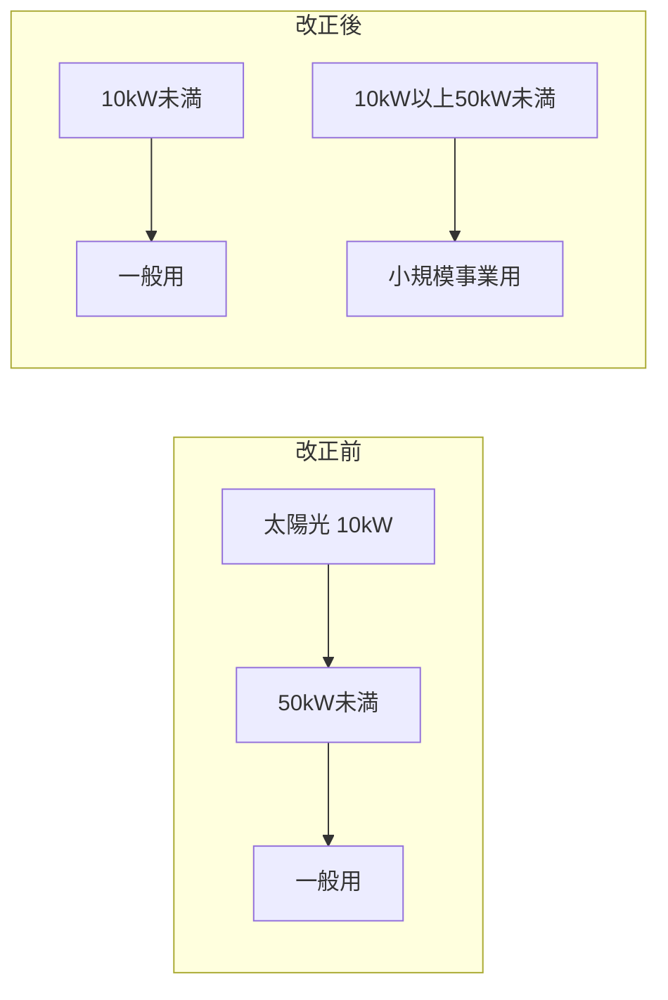

# C07テストフィクスチャ（左右対称形バイアス検出用）

このファイルは wiki_quality_check.py の品質スコアラ cap C07 を発火させるための回帰テスト用。
記事冒頭の警告ブロック＋mermaid 対比図のみを含み、対比図に対する解説は意図的に省略する。

実行：
```bash
python wiki_quality_check.py tests/c07_bias_sample.md --v3
```

期待出力：`C07: max=89` を含む cap 発火行が表示されればロジック正常。

---

!!! warning "法令改正あり — KAISEI-2022-001"
    テスト用ダミー警告


